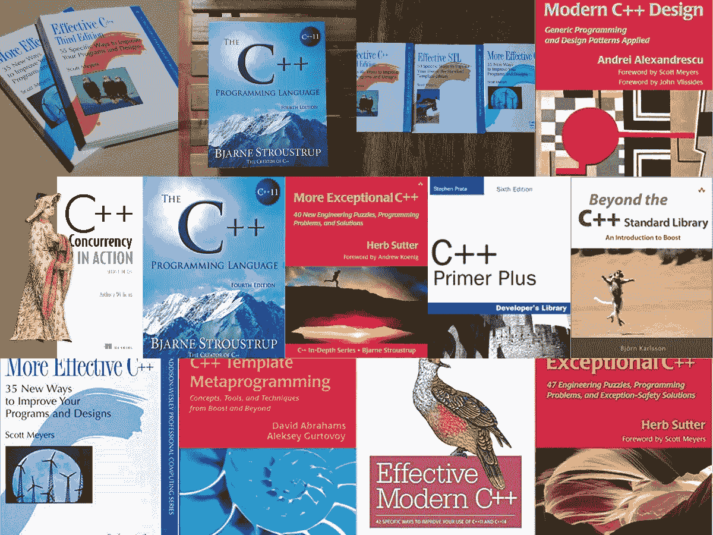
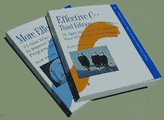
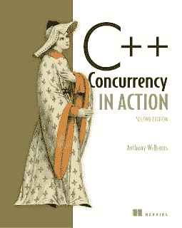
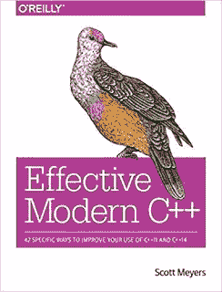
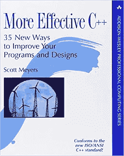
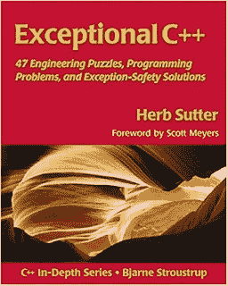
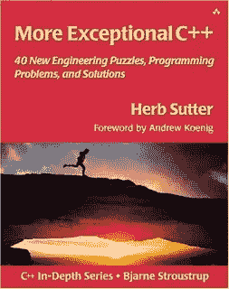
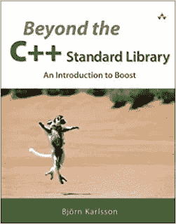
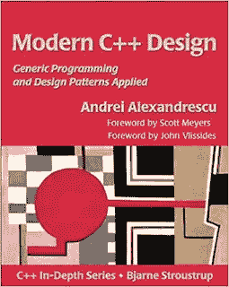
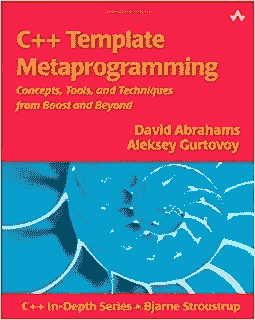

# 为有经验的程序员准备的 10 本高级 C++书籍和课程

> 原文：<https://medium.com/javarevisited/10-advanced-c-books-and-courses-for-experienced-programmers-a90c3942471a?source=collection_archive---------0----------------------->

## 高级 C++书籍精选，适合中级到有经验的程序员深入学习 C++。

大家好，如果你渴望将你的 C++技能提升到一个新的水平，想要深入学习 C++，寻找书籍和在线课程等最佳资源，你来对地方了。

前面我已经分享过 [**我最喜欢的 C++课程**](/javarevisited/top-10-courses-to-learn-c-for-beginners-best-and-free-4afc262a544e) 。在本文中，我将分享几本适合中级和 2 到 5 年经验开发者深入学习 C++的高级 CPP 书籍和在线课程。

一旦你了解了 C++并花了几年时间用 C++编程，你就会开始觉得你知道基本知识并很好地掌握了 C++编程。

此时，程序员走上了两条路，一条选择只做消防和日常工作，从不升级或被迫通过阅读[书籍](/javarevisited/10-best-c-and-c-programming-books-for-beginners-and-experienced-programmers-eb5ee8dbdc5a)，参加论坛和发表演讲来学习新的或更多的东西。

另一组程序员探索[新书以详细学习 C++](https://javarevisited.blogspot.com/2020/03/top-5-cpp-programming-books-must-read.html) ，在阅读了这份清单上的几本书后，他们也意识到他们所知道的 C++有多少是不完整和不正确的。

这也是为什么我推荐有经验的 C++开发者去看书，加入 [Coursera](/javarevisited/10-best-coursera-certifications-and-courses-for-beginners-b13e930f2830) 和 [Udemy](/javarevisited/15-best-udemy-courses-programmers-can-buy-on-black-friday-and-cyber-monday-2020-a803874f41d9) 的高级在线课程，完成从初级开发者到高级开发者的旅程。记住，如果你选择什么都不读，工作多年也不会让你成为一名优秀的 C++程序员。

不幸但真实的是，一份正常的开发工作也不会提供很多学习的机会；忘了如果你在一个大组织，偶尔编码，做的支持和协调比编码多。

顺便说一句，如果你没有编写 C++代码的经验，也刚刚开始学习 C++，那么我建议你先去上一个初级的 C++课程，学习一下基础知识。如果需要推荐，建议你去 Udemy 上查看 [**完整的 C++开发者课程**](https://click.linksynergy.com/deeplink?id=CuIbQrBnhiw&mid=39197&murl=https%3A%2F%2Fwww.udemy.com%2Fcourse%2Fthe-complete-cpp-developer-course%2F) 。从零开始学习 C++基础是一门很棒的在线课程。

# 10 本高级 C++书籍和在线课程，面向 2 到 5 年经验丰富的开发人员

在这篇文章中，我将分享我在过去 10 到 12 年中阅读和参加的一些最好的 C++书籍和在线课程。

我还在阅读和[学习 C++](https://javarevisited.blogspot.com/2020/07/top-10-courses-to-learn-c-in-depth-best.html) ，不能说我已经掌握了它或者对它了解很多。这是一个持续的旅程；阅读和应用知识的程序员会比仅仅阅读的人学到更多。尽管如此，这些书和在线课程会让你提高 20%，即使你只是肤浅地遵循了书中给出的建议。

## 1.[有效的 C++](https://www.amazon.com/Effective-Specific-Improve-Programs-Designs/dp/0321334876?tag=javamysqlanta-20)

这是我读的第一本 Scott Major 的 C++书，只是为了成为他的粉丝，读了他的许多有效的 C++续集。这是有经验的 C++程序员应该读的最好的书，它成功了。

早期版本针对来自 C 的程序员；第三版改变了这一点，面向像 Java 这样的语言的程序员。

它介绍了大约 *50 多种易于记忆的最佳实践和经验法则*，以及它们以一种非常容易理解(并且令人愉快)的方式使用 C++编码器的基本原理。

即使这本书不是最新的，我仍然推荐 C++程序员阅读这本书，因为给出的建议仍然适用。对了，对于 C++11 和 C++14，应该优先选择有效的现代 C++。

而且，如果你愿意，你也可以将本书与 Udemy 上 Dmitri Nestruk 的《现代 C++ 课程中的 [**设计模式结合起来学习模式。这是许多 C++开发人员缺乏的一个领域，本课程弥补了这一差距。**](https://click.linksynergy.com/deeplink?id=JVFxdTr9V80&mid=39197&murl=https%3A%2F%2Fwww.udemy.com%2Fcourse%2Fpatterns-cplusplus%2F)

## 2. [C++并发运行](https://www.amazon.sg/Concurrency-Action-2E-Anthony-Williams/dp/1617294691?tag=javamysqlanta-20)

这是这个列表中的第一本书，作者不是 Scott Meyers，而是安东尼·威廉姆斯，但对于有经验的 C++开发人员或想成为 C++专业程序员的人来说，这仍然是一本很棒的书。对于 Java 开发人员来说，这就像是 Java 并发性在起作用。

并发性在 C++中一直很棘手，这也是 Java 得分较高的主要领域，但是 C++并发性已经有了很大的进步。

第一版是一本很好的书*，涵盖了 C++11 并发支持，包括线程库、*原子库、C++内存模型、锁和互斥，以及多线程和并发应用的设计和调试问题。这是去年发行的第二版。更新后涵盖了 C++ 14 和 C++ 17 的所有最新变化。，这本书将教你 C++开发人员编写健壮、高性能、优雅的并发 C++应用程序所需的一切。

如果你对 C++编程很认真，我强烈推荐你看这本书。如果你愿意，你也可以将这本书与 Udemy 上 Kasun Liyanage 的 [**现代 C++并发深度**](https://click.linksynergy.com/deeplink?id=JVFxdTr9V80&mid=39197&murl=https%3A%2F%2Fwww.udemy.com%2Fcourse%2Fmodern-cpp-concurrency-in-depth%2F) 课程结合起来，以便更快、更主动地学习。它很好地补充了这本书。

## 3.[有效的现代 C++](https://www.amazon.com/Effective-Modern-Specific-Ways-Improve/dp/1491903996?tag=javamysqlanta-20)

这是 Scott Meyers 的又一本巨著，是 Effective C++的续集。如果您正在从 C++03 过渡到 C++11 和 C++14，这实际上是最有帮助的书籍之一。强烈建议你和 Effective C++一起看。

这是 Effective C++的近亲，因为它的目标是像 Effective C++对整个语言所做的那样，对来自 STL 的标准库部分做同样的事情。

它告诉你经验法则，并解释为什么你应该完全理性地遵循它们。

如果你需要一个课程来更好的学习 C++ STL 库，也可以看看 Udemy 上 Packt 的这个 [**C++标准模板库实操**](https://click.linksynergy.com/deeplink?id=JVFxdTr9V80&mid=39197&murl=https%3A%2F%2Fwww.udemy.com%2Fcourse%2Fc-standard-template-library-in-practice%2F) 课程。为了更好地学习 STL，需要 10 个小时的综合课程。

## 4.[更有效的 C++](https://www.amazon.com/Effective-Specific-Improve-Programs-Designs/dp/0321334876?tag=javamysqlanta-20)

我有没有告诉你 Scott Mayers 将占据 10 本最佳 C++书籍排行榜的前四名？

好吧，如果我没有，那么我道歉，但我不能离开他的任何有效的 C++标题；他们太好了，不能离开。这本书介绍的经验法则比有效的 C++还要多。

而且，如果你需要一门课程来配合这本书，没有比 Yashvant Kanttkar 的 [**经验丰富的工程师 C++编程**](https://www.educative.io/courses/cpp-programming-experienced-devs?affiliate_id=5073518643380224) 教育课程更好的课程了。这是一门互动的实践课程，旨在提高您的 C++技能。

课程包括继承、函数、I/O、异常处理等等。在整个课程中，你将学习超过 90 个精心设计的例子来增强你对 C++语言的理解。

## 5.卓越的 C++

更多关于有效 C++的书，但不是来自 Scott Meyers。Herb Sutter 是这本有趣的 C++解谜书的作者。

这本书非常详细地解释了 C++中适当的资源管理和异常处理。它还深入介绍了各种其他主题，包括名称查找、良好的类设计和 C++内存模型。

## 6.更出色的 C++

Herb Sutter 的另一本好书涵盖了异常 C++中没有涵盖的其他异常安全主题，并讨论了 C++中有效的面向对象编程以及标准模板库(STL)的正确使用。这本书可以和 Effective STL 和 Effective C++一起看。

## 7.[超越 C++标准库:Boost 简介](https://www.amazon.com/Beyond-Standard-Library-Introduction-Boost-ebook/dp/B003WOLHUI/?tag=javamysqlanta-20)

毫无疑问，Boost 是现实项目中最好的 C++库之一，每个有经验的 C++开发人员都应该熟悉它。这本书对 base Boost 库进行了精彩的描述，并向您解释了如何使用它们以及为什么应该使用它们。这本书主要面向中级和有经验的 C++程序员，因为它不仅解释了如何使用 boost 库，还解释了为什么应该使用这些库。作为一名专业的 C++开发人员，必须学习并熟悉 Boost 库，没有比这本书更好的书了。

你也可以把这本书和 Udemy 的 John Purcell 的 [**学习高级 C++编程**](https://click.linksynergy.com/deeplink?id=JVFxdTr9V80&mid=39197&murl=https%3A%2F%2Fwww.udemy.com%2Fcourse%2Flearn-advanced-c-programming%2F) 课程结合起来。本课程涵盖了 C++ STL 库，并介绍了 C++ 11 中引入的现代 C++概念，如 Lambda 表达式。

## 8.现代 C++设计

安德烈·亚历山德雷斯库的《现代 C++设计》是关于高级泛型编程技术的最佳书籍之一。像卓越的 C++一样，这本书也是 Bjorne Stroustrup 的 C++深入系列的一部分。这本书将教你基于策略的设计、类型列表和基本的泛型编程习惯用法，然后解释有多少有用的设计模式(包括小对象分配器、仿函数、工厂、访问者和多方法)可以使用泛型编程高效、模块化和干净地实现。

现代 C++编程旨在使 C++编程更简单，并大量使用模板以使代码灵活和可重用。通过统一初始化、类型特征、智能指针和任务等特性，您可以设计出一个安全、高性能的 C++应用程序，同时减少资源并提高代码的可重用性。

您也可以将本书与 [**C++17 详细结合起来:深入了解 C++中引入的新特性，以编写更现代、更高性能的 C++代码。**](https://www.educative.io/courses/cpp-17-in-detail-a-deep-dive?affiliate_id=5073518643380224)

## 9. [C++模板元编程](https://www.amazon.com/Template-Metaprogramming-Concepts-Techniques-Beyond/dp/0321227255?tag=javamysqlanta-20)

这是一本很棒的关于 C++元编程的书，基于 Boost 元编程库。这也是 Bjorne Stroustrup 开始的 C++深度系列书中最好的一本。

在本书中，你将学习如何避免重复代码，这些代码除了类型不同之外都是相同的；这样，您就不必经历编写自己的类的麻烦。

模板也广泛用于开发，尤其是在嵌入式编程中，以创建高性能的代码。

你也可以把这本书和 Udemy 的 [**初级 C++模板课程**](https://click.linksynergy.com/deeplink?id=JVFxdTr9V80&mid=39197&murl=https%3A%2F%2Fwww.udemy.com%2Fcourse%2Fbeg-cpp-temp%2F) 结合起来。这是一个免费的课程，所以你不需要支付任何费用，只需创建一个 Udemy 帐户并加入课程即可。

这就是给有经验的 C++程序员准备的**最佳 C++书籍**。这些书真的很棒，即使你有 2 到 3 年的 C++开发经验，并想成为一名专家 C++程序员。

我说过， ***掌握 C++很难，甚至比 Java*** 还难，但是我们很幸运有这么多关于 C++编程的好素材。

如果你真的想成为一名更好的 C++开发人员，你应该至少阅读这份列表中的几本书，并参加附带的课程以获得更好的学习。

对了，如果你是 C 程序员，想学习 C++，那么我也建议你去看看 Coursera 上的 [**C++ For C 程序员，A 部分**](https://click.linksynergy.com/deeplink?id=JVFxdTr9V80&mid=40328&murl=https%3A%2F%2Fwww.coursera.org%2Flearn%2Fc-plus-plus-a) 课程，这是 C 程序员学习 C++的绝佳资源。

<https://click.linksynergy.com/deeplink?id=JVFxdTr9V80&mid=40328&murl=https%3A%2F%2Fwww.coursera.org%2Flearn%2Fc-plus-plus-a>  

您可能想探索的其他**书籍和编程文章**

*   [成为解决方案架构师的 5 本必读书籍](https://javarevisited.blogspot.com/2018/02/5-must-read-books-to-become-software-architect-solution.html#axzz6LCJoCRf9)
*   [面向有经验开发人员的 10 本高级 Java 书籍](https://javarevisited.blogspot.com/2020/04/top-10-advanced-core-java-courses-for-experienced-developers.html)
*   [深入学习 Java 的十大书籍](https://javarevisited.blogspot.com/2018/07/top-9-java-programming-books-best-must-read.html)
*   [学习 Java 微服务的 7 大课程](/javarevisited/top-5-courses-to-learn-microservices-in-java-and-spring-framework-e9fed1ba804d)
*   每个有经验的程序员都应该读的 10 本书
*   [编程/编码工作面试 10 门课程](http://javarevisited.blogspot.sg/2018/02/10-courses-to-prepare-for-programming-job-interviews.html)
*   [深入学习春天的五大课程](https://javarevisited.blogspot.com/2018/06/top-6-spring-framework-online-courses-Java-programmers.html)
*   [每个程序员都应该读的 10 本算法书](https://www.java67.com/2015/09/top-10-algorithm-books-every-programmer-read-learn.html)
*   [学习 Spring Boot 微服务的 5 大课程](https://javarevisited.blogspot.com/2018/02/top-5-spring-microservices-courses-with-spring-boot-and-spring-cloud.html#axzz6JJFPbsyP)
*   [学习数据结构和算法的前 5 本书](https://javarevisited.blogspot.com/2015/07/5-data-structure-and-algorithm-books-best-must-read.html)
*   [初学者学习 Web 开发的 5 门课程](http://javarevisited.blogspot.sg/2018/02/top-5-online-courses-to-learn-web-development.html#axzz57wed1PWd)
*   [5 门免费学习核心 Java 的在线课程](http://javarevisited.blogspot.sg/2017/11/top-5-free-java-courses-for-beginners.html#axzz4zuIICRs9)
*   [面向有经验的 Java 开发人员的 5 大 Java 设计模式课程](http://javarevisited.blogspot.sg/2018/02/top-5-java-design-pattern-courses-for-developers.html)
*   [面向 Java 开发人员的 10 门高级 Spring Boot 课程](/javarevisited/10-advanced-spring-boot-courses-for-experienced-java-developers-5e57606816bd)
*   [10 个面向 Java 开发人员的免费 Spring Boot 教程和课程](/javarevisited/10-free-spring-boot-tutorials-and-courses-for-java-developers-53dfe084587e)

感谢您阅读本文。如果你喜欢这些高级 C++书籍和课程，那么请分享给你的朋友和同事。如果您有任何问题或反馈，请留言。

**P. S.** —如果你是 C++编程新手，并且想以一种结构化的、更好的方式学习 C++，我强烈推荐 Udemy 上的 Tim Buchalaka 和他的学院开设的[**c++入门和超越**](https://click.linksynergy.com/deeplink?id=JVFxdTr9V80&mid=39197&murl=https%3A%2F%2Fwww.udemy.com%2Fcourse%2Fbeginning-c-plus-plus-programming%2F) 课程。这是你能在网上找到的更好、更有条理的课程之一。

<https://www.java67.com/2020/04/top-5-books-to-learn-c-and-c-plus-plus-for-beginners.html> 