# 2023 年学习 Python 和数据科学的 8 门最佳免费数据营课程

> 原文：<https://medium.com/javarevisited/10-best-and-free-datacamp-courses-to-learn-python-and-data-skills-in-2021-39e42682fd76?source=collection_archive---------0----------------------->

## 我最喜欢的 Datacamp 课程，在线学习 Python、SQL、数据科学和其他数据分析技能。它包括来自 Datacamp 的免费和最好的课程

[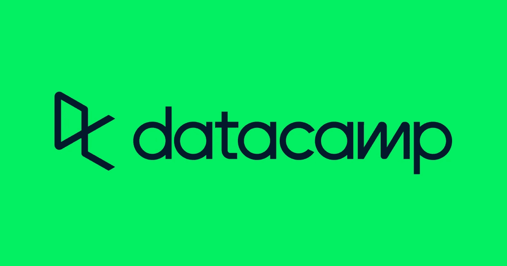](https://datacamp.pxf.io/c/1193463/1012793/13294)

你好伙计们，如果你正在寻找最好的免费 Datacamp 课程来学习 Python 和 SQL，并在 2023 年成为一名数据科学家，那么你来对地方了。以前分享过学习 Python 的 [*最佳 udemy 课程*](/javarevisited/10-best-python-3-courses-on-udemy-ddd4e3ec5dbf) 和数据科学的 [*最佳课程*](/javarevisited/my-favorite-data-science-and-machine-learning-courses-from-coursera-udemy-and-pluralsight-eafc73acc73f) 。

在本文中，我将为 Python 开发人员和数据科学学习者分享免费和最好的 Datacamp 课程。是的，你可以读它，写它，Datacamp 也提供免费的课程，它们是高质量的课程，你可以自己学习技能。

如果你不知道，Datacamp 是一个学习数据技能的伟大平台，它有最好的课程来学习数据技能，如 SQL、数据科学和 Python。

他们就像数据技能的代码学院。他们有互动课程、测验、视频讲座和创造性练习来教授关键的数据技能，这就是为什么它是学习 Python 和 SQL for data science 的最佳地点之一。

数据科学是一个很大的领域，学生需要掌握很多编程语言，比如 python 语言和 r。

此外，他需要学习数学和统计学，他们是数据科学家的必修课，可能需要学习机器学习和深度学习来进行预测，所有这些技能都可以从一个名为 [**DataCamp**](https://datacamp.pxf.io/c/1193463/1012793/13294) 的地方学习。

[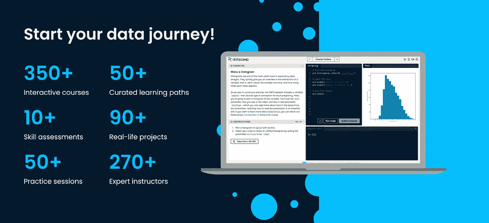](https://datacamp.pxf.io/c/1193463/1012793/13294?u=https%3A%2F%2Fwww.datacamp.com%2Fpricing)

现在的数据是保持公司运行的核心，并基于对这些数据的分析做出决策。这就是数据科学家的角色。DataCamp 平台帮助公司和个人使用许多不同的工具处理和使用数据，并将机器学习算法应用于这些数据。

# 2023 年 8 门免费 Datacamp 课程，学习 Python、SQL、R 和数据科学

以下是我列出的最佳数据营课程，人们可以参加这些课程来学习必要的技术技能，如 Python 和 T2 SQL，并在 2023 年成为数据科学家。对使用 Python 和 SQL 的数据科学家和后端工程师有很多需求，这些 Datacamp 课程将从零开始教你这些。

从我 20 年的技术经验来看，我可以说学习 [Python](https://javarevisited.blogspot.com/2020/02/10-best-coursera-courses--for-python.html) 和 [SQL](https://javarevisited.blogspot.com/2018/05/top-5-sql-and-database-courses-to-learn-online.html) 是你一生中最好的决定；与很多框架和编程语言不同的是， [*Python*](/javarevisited/7-best-python-online-courses-for-beginners-to-learn-programming-abe12cecb1ad) 和 [*SQL*](/javarevisited/5-best-sql-courses-for-beginners-to-learn-in-2021-447daca3f801) 已经存在了超过 25 年，对它们的需求仍然很大。学习它们是对人生的一项好投资。

## 1.[Python 介绍](https://datacamp.pxf.io/c/1193463/1012793/13294?u=https%3A%2F%2Fwww.datacamp.com%2Fcourses%2Fintro-to-python-for-data-science)【免费课程】

Python 编程语言是未来的语言，因为它被用于太多不同的行业，如使用 Flask 和 Django 框架的 web 开发，以及使用 matplotlib 库的数据可视化。

它还涵盖了使用 [Tensorflow](https://javarevisited.blogspot.com/2018/08/top-5-tensorflow-and-machine-learning-courses-online-programmers.html) 和 [Pytorch](https://www.java67.com/2020/06/top-5-courses-to-learn-pytorch-and-keras.html) 框架的人工智能，Datacamp 创建了一个从头学习这种语言的课程，首先理解这种语言的基础知识，如变量和数据类型、python 列表，然后转向函数和导入包，最后使用 NumPy 处理数组。

这个 Datacamp 课程最大的好处是它是免费的，所有章节都是免费的，你可以通过创建一个免费帐户来访问它们。

**这里是加入免费 Python 课程的链接—**[Python 简介](https://datacamp.pxf.io/c/1193463/1012793/13294?u=https%3A%2F%2Fwww.datacamp.com%2Fcourses%2Fintro-to-python-for-data-science)

[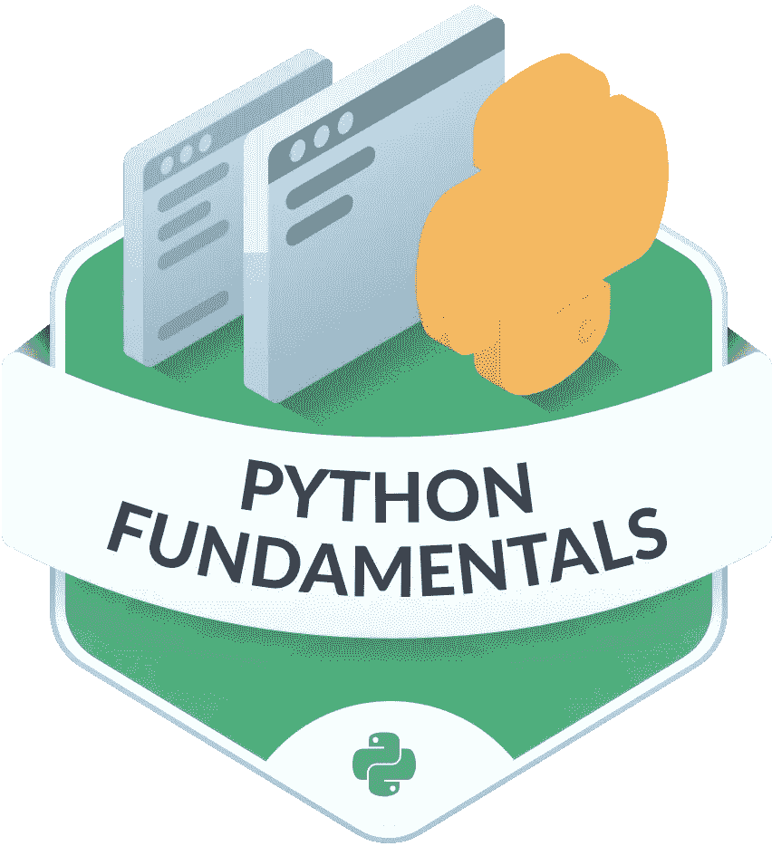](https://datacamp.pxf.io/c/1193463/1012793/13294?u=https%3A%2F%2Fwww.datacamp.com%2Fcourses%2Fintro-to-python-for-data-science)

## 2.[SQL 介绍](https://datacamp.pxf.io/c/1193463/1012793/13294?u=https%3A%2F%2Fwww.datacamp.com%2Fcourses%2Fintroduction-to-sql)【免费课程】

如果你想成为一名数据库管理员或数据科学家，甚至是一名 web 开发人员，那么你需要学习 SQL 语言，这是一种用于与数据库通信并提取和过滤数据以使用它的语言。

Datacamp 创建了一个完整的课程，教你数据库的结构和如何执行简单的 SQL 查询，学习如何使用比较运算符，使用聚合函数，最后对结果进行排序和分组。

这也是 Datacamp 最好的免费课程之一，如果您正在寻找学习 SQL 的免费资源，那么您应该在 Datacamp 上查看这一极具吸引力的 SQL 课程。

**这是参加本课程的链接—** 。[SQL 简介](https://datacamp.pxf.io/c/1193463/1012793/13294?u=https%3A%2F%2Fwww.datacamp.com%2Fcourses%2Fintroduction-to-sql)

[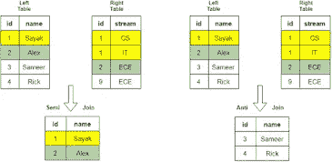](https://datacamp.pxf.io/c/1193463/1012793/13294?u=https%3A%2F%2Fwww.datacamp.com%2Fcourses%2Fintroduction-to-sql)

## 3.[R 介绍](https://datacamp.pxf.io/c/1193463/1012793/13294?u=https%3A%2F%2Fwww.datacamp.com%2Fcourses%2Ffree-introduction-to-r)【免费课程】

这是 Datacamp 为初学者提供的另一个学习 R 编程语言的免费课程。

数据科学家需要学习数学和统计学来处理数据和执行分析，因此除了学习 python，他们还需要学习 R 语言，R 语言被认为像 python 一样容易学习，但在统计领域和分析以及数据可视化中使用很多。

DataCamp 提供了一门 R 语言课程，从学习算术、变量和向量等基础知识开始，然后学习度量标准并使用它们进行计算，等等。

**以下是加入本课程的链接—**[R 简介](https://datacamp.pxf.io/c/1193463/1012793/13294?u=https%3A%2F%2Fwww.datacamp.com%2Fcourses%2Ffree-introduction-to-r)

[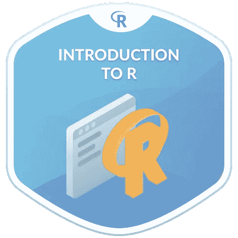](https://datacamp.pxf.io/c/1193463/1012793/13294?u=https%3A%2F%2Fwww.datacamp.com%2Fcourses%2Ffree-introduction-to-r)

## 4.[Tableau 简介【免费数据营课程】](https://datacamp.pxf.io/c/1193463/1012793/13294?u=https%3A%2F%2Fwww.datacamp.com%2Fcourses%2Fintroduction-to-tableau)

Tableau 是亚马逊等公司广泛使用的软件，用于分析他们的数据，获得决策洞察力，并在公司内部的团队之间共享工作簿。您将首先学习在软件及其界面中导入数据。

您将启动可视化过程并对其进行定制，例如使用过滤器对数据进行切片和切块。您还将探索如何可视化地理数据。

最后，了解讲述数据故事和分享见解的最佳实践。

**这里是免费加入本课程的链接—**[*Tableau*简介](https://datacamp.pxf.io/c/1193463/1012793/13294?u=https%3A%2F%2Fwww.datacamp.com%2Fcourses%2Fintroduction-to-tableau)

[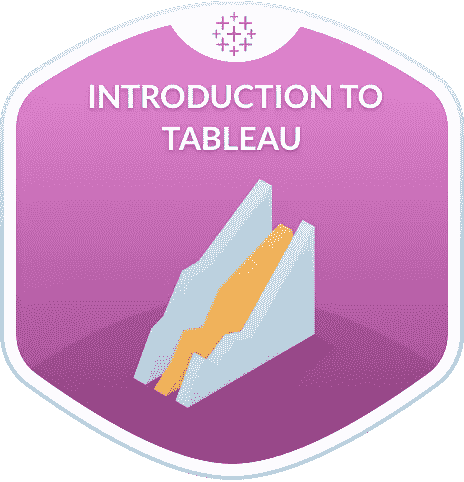](https://datacamp.pxf.io/c/1193463/1012793/13294?u=https%3A%2F%2Fwww.datacamp.com%2Fcourses%2Fintroduction-to-tableau)

## 5.[Excel 中的数据分析](https://datacamp.pxf.io/c/1193463/1012793/13294?u=https%3A%2F%2Fwww.datacamp.com%2Fcourses%2Fdata-analysis-in-excel)【免费课程】

Excel 电子表格是 Microsoft.M. M 开发的软件，大多数人认为它只是用来存储数据和应用一些简单的函数。公司正在使用该软件来分析大数据等。

您将开始学习 [*数据分析流程*](/javarevisited/11-best-coursera-certifications-and-courses-for-data-science-and-analysis-in-2021-65ce1ac810a5) 并探索 Excel 界面。您将学习对表和嵌套函数进行排序，学习如何使用各种函数清理数据，并将所学知识应用于真实数据集。

**这里是免费加入本课程的链接—**[Excel 中的数据分析](https://www.datacamp.com/courses/data-analysis-in-excel)

[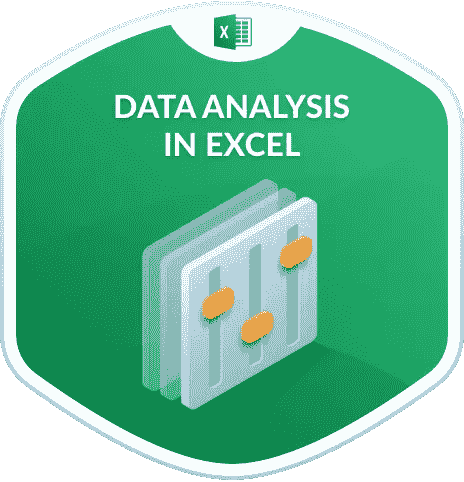](https://datacamp.pxf.io/c/1193463/1012793/13294?u=https%3A%2F%2Fwww.datacamp.com%2Fcourses%2Fdata-analysis-in-excel)

## 6.[神力 BI 简介](https://datacamp.pxf.io/c/1193463/1012793/13294?u=https%3A%2F%2Fwww.datacamp.com%2Fcourses%2Fintroduction-to-power-bi)【免费】

公司使用的 Tableau 软件的另一个替代品是微软开发并拥有的 Power BI，它可以给你提供出色的视觉分析能力。

您将首先发现接口，开始加载数据集，并构建一个数据模型来理解表之间的关系并创建一些图表。

然后，您将创建更复杂的可视化并对其进行定制。最后，使用 DAX 进行定制计算，DAX 是一种微软公式语言。

**这里是免费加入本课程的链接—** [电力 BI 简介](https://datacamp.pxf.io/c/1193463/1012793/13294?u=https%3A%2F%2Fwww.datacamp.com%2Fcourses%2Fintroduction-to-power-bi)

[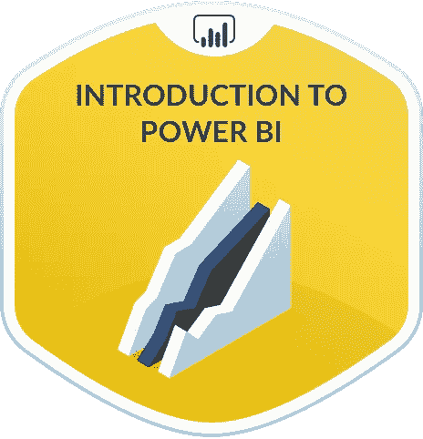](https://datacamp.pxf.io/c/1193463/1012793/13294?u=https%3A%2F%2Fwww.datacamp.com%2Fcourses%2Fintroduction-to-power-bi)

## 7.【Matplotlib 数据可视化简介【免费】

当您想要可视化数据时，Python 是一种很好的学习语言。有十几个库可以实现这个目标，matplotlib 就是其中之一。

本课程将帮助您学习使用 matplotlib pyplot 接口，并创建一个简单的可视化和自定义数据外观。

您将学习如何可视化您的时间序列数据，这有助于您阐明趋势并发现它们之间的关系。最后，学会将量化可视化，并与他人分享你的工作。

**这里是免费加入本课程的链接—**[Matplotlib 数据可视化简介](https://datacamp.pxf.io/c/1193463/1012793/13294?u=https%3A%2F%2Fwww.datacamp.com%2Fcourses%2Fintroduction-to-data-visualization-with-matplotlib)

[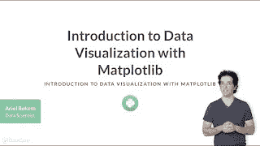](https://datacamp.pxf.io/c/1193463/1012793/13294?u=https%3A%2F%2Fwww.datacamp.com%2Fcourses%2Fintroduction-to-data-visualization-with-matplotlib)

## 8.[Seaborn 数据可视化简介](https://datacamp.pxf.io/c/1193463/1012793/13294?u=https%3A%2F%2Fwww.datacamp.com%2Fcourses%2F)【免费】

python 语言有许多可用的可视化库，另一个大量用于统计可视化和定制的库是 seaborn，它在数据分析师中大量使用。

您将学习使用 [seaborn](https://seaborn.pydata.org/) 的最大功能创建散点图和计数图，该功能为您的图添加了第三个变量。稍后，您将学习可视化两个定量和分类变量，并自定义您的 seaborn 图。

**这里是加入这个免费课程的链接—**[Seaborn 数据可视化简介](https://datacamp.pxf.io/c/1193463/1012793/13294?u=https%3A%2F%2Fwww.datacamp.com%2Fcourses%2F)

[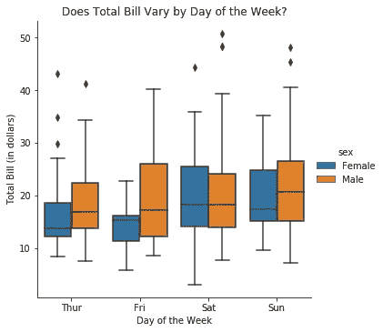](https://datacamp.pxf.io/c/1193463/1012793/13294?u=https%3A%2F%2Fwww.datacamp.com%2Fcourses%2F)

所有这些在线课程都是免费的，你可以使用它们来学习 Python、SQL 和 r。其余的课程都不是免费的，因为它们是非常专业和高质量的课程，你需要订阅 [Datacamp](https://www.datacamp.com/) 才能访问这些课程，但你可以随时通过使用 [**免费 Datacamp 帐户**](https://datacamp.pxf.io/c/1193463/1012793/13294?u=https%3A%2F%2Fwww.datacamp.com%2Fpricing) **免费查看第一章。**

[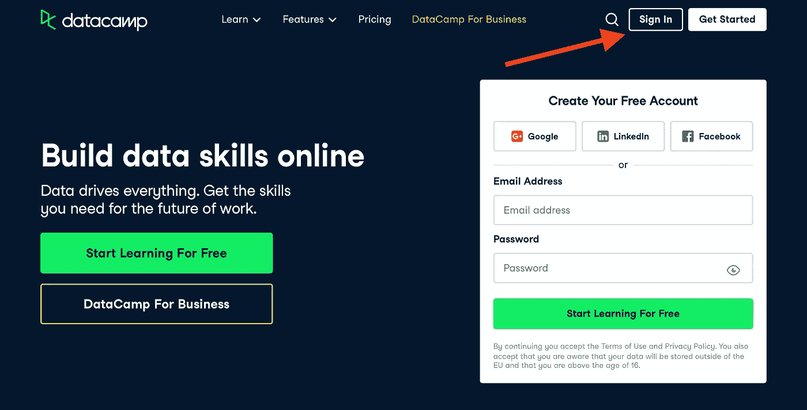](https://datacamp.pxf.io/c/1193463/1012793/13294?u=https%3A%2F%2Fwww.datacamp.com%2Fpricing)

# 2023 年在 Datacamp 学习机器学习和深度学习的 4 门最佳薪酬课程

到目前为止，我们已经查看了免费的 Datacamp 课程，以学习基本的数据技能，如 Python、SQL、R 编程、Excel、Seaborn、数据可视化等，但 Datacamp 也有很好的深入课程，这些课程不是免费的，但绝对值得查看。

以下是 2023 年深入学习机器学习和深度学习的最佳 Datacamp 课程列表:

## 1.[Python 深度学习简介](https://datacamp.pxf.io/c/1193463/1012793/13294?u=https%3A%2F%2Fwww.datacamp.com%2Fcourses%2Fintroduction-to-deep-learning-in-python)

如果你想成为一名 AI 工程师或数据科学家，你肯定要学习机器人、自动驾驶汽车、自然语言处理等许多领域使用的深度学习。

DataCamp 已经创建了一个课程，使用 [Python 语言](https://javarevisited.blogspot.com/2018/12/10-free-python-courses-for-programmers.html#axzz6cRYpiwdu)和 [Keras](/javarevisited/5-best-pytorch-and-keras-courses-for-deep-learning-in-2021-c9ba377b1170) 库来教你这些技能，从神经网络的基础知识和它们的概念开始，比如激活函数。

然后，它会学习如何优化你的模型。稍后使用 Keras 创建一个神经网络，并评估您的模型。

**以下是加入本课程的链接—**[Python 深度学习入门](https://datacamp.pxf.io/c/1193463/1012793/13294?u=https%3A%2F%2Fwww.datacamp.com%2Fcourses%2Fintroduction-to-deep-learning-in-python)

[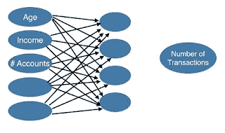](https://datacamp.pxf.io/c/1193463/1012793/13294?u=https%3A%2F%2Fwww.datacamp.com%2Fcourses%2Fintroduction-to-deep-learning-in-python)

## 2.【Matplotlib 数据可视化简介

数据可视化是指将数据转换成图表，以便在一张图片中了解更多数据。如果你想成为一名数据科学家、数据分析师，甚至是一名人工智能工程师，这项技能是强制性的。

DataCamp 已经创建了一个课程，使用 [Python](/javarevisited/10-free-python-tutorials-and-courses-from-google-microsoft-and-coursera-for-beginners-96b9ad20b4e6) 和 [matplotlib](/javarevisited/8-best-data-visualization-tools-and-libraries-data-analysts-and-scientists-can-learn-d2734371df16) 来教你这个技能。首先了解 matplotlib 接口，创建一些图并进行定制，绘制时间序列数据和条形图，以及统计绘图。

**这里是加入本课程**—[Matplotlib 数据可视化简介](https://datacamp.pxf.io/c/1193463/1012793/13294?u=https%3A%2F%2Fwww.datacamp.com%2Fcourses%2Fintroduction-to-data-visualization-with-matplotlib)的链接

[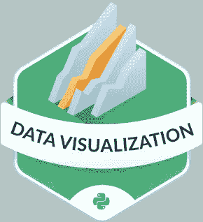](https://datacamp.pxf.io/c/1193463/1012793/13294?u=https%3A%2F%2Fwww.datacamp.com%2Fcourses%2Fintroduction-to-data-visualization-with-matplotlib)

## 3.[使用 scikit-learn 进行监督学习](https://datacamp.pxf.io/c/1193463/1012793/13294?u=https%3A%2F%2Fwww.datacamp.com%2Fcourses%2Fsupervised-learning-with-scikit-learn)

在监督学习中，你使用带标签的数据来训练你的模型并做出预测，所以如果你打算成为一名数据科学家，你必须学习机器学习，本课程将教你如何使用 [sci-kit-learn](https://javarevisited.blogspot.com/2018/10/top-8-python-libraries-for-data-science-machine-learning.html#axzz6mjRPASEY) 来完成这项工作。

您还将学习如何解决分类问题，然后用回归方法解决问题。后来，学习如何评估你的模型，并加以改进。

**这里是免费加入本课程的链接—**[scikit-learn 的监督学习](https://datacamp.pxf.io/c/1193463/1012793/13294?u=https%3A%2F%2Fwww.datacamp.com%2Fcourses%2Fsupervised-learning-with-scikit-learn)

[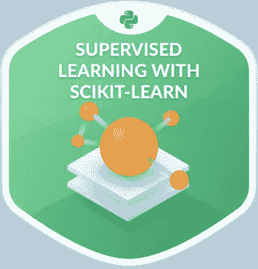](https://datacamp.pxf.io/c/1193463/1012793/13294?u=https%3A%2F%2Fwww.datacamp.com%2Fcourses%2Fsupervised-learning-with-scikit-learn)

## 4.[Python 中的无监督学习](https://datacamp.pxf.io/c/1193463/1012793/13294?u=https%3A%2F%2Fwww.datacamp.com%2Fcourses%2Funsupervised-learning-in-python)

无监督学习是你需要学习的另一种机器学习。在这里，模型将分析和聚类未标记的数据集，并用于客户细分和根据相似性对数据进行分组。

DataCamp 使用 [sci-kit-learn](https://javarevisited.blogspot.com/2021/10/top-5-courses-to-learn-scikit-learn.html) 和 [scipy](https://www.scipy.org/) 创建了一个关于无监督学习的课程，首先学习聚类技术并将其应用于股票市场价格，然后学习如何可视化层次结构并学习更多的降维技术。

**这里是加入本课程的链接**—[Python 中的无监督学习](https://datacamp.pxf.io/c/1193463/1012793/13294?u=https%3A%2F%2Fwww.datacamp.com%2Fcourses%2Funsupervised-learning-in-python)

[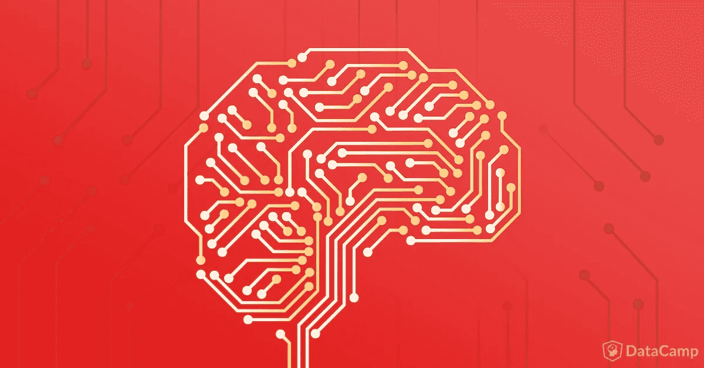](https://datacamp.pxf.io/c/1193463/1012793/13294?u=https%3A%2F%2Fwww.datacamp.com%2Fcourses%2Funsupervised-learning-in-python)

顺便说一句，您需要一个 Datacamp 帐户来访问本课程。 [*创建 Datacamp 帐户对学习者来说是免费的*](https://datacamp.pxf.io/c/1193463/1012793/13294?u=https%3A%2F%2Fwww.datacamp.com%2Fpricing) ，你还可以免费使用他们的所有 350 多门课程的第一章。

它还提供了 7 个项目，但为了获得最佳的学习体验，我推荐他们的 [**个人计划**](https://datacamp.pxf.io/c/1193463/1012793/13294?u=https%3A%2F%2Fwww.datacamp.com%2Fpricing) ，每月只需 25 美元。这样就可以访问他们所有的课程和项目以及证书。

> **注意** —他们现在还提供高达 [**63%的折扣**](https://datacamp.pxf.io/c/1193463/1012793/13294?u=https%3A%2F%2Fwww.datacamp.com%2Fpromo%2Fnovember-flash-sale-2021) ，你可以利用这一点在 2023 年升级并学习所需的数据技能

[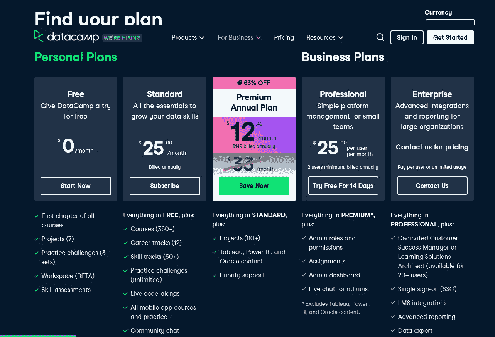](https://datacamp.pxf.io/c/1193463/1012793/13294?u=https%3A%2F%2Fwww.datacamp.com%2Fpricing)

以上就是 2023 年**学习 Python、数据科学**等抢手数据技能的最好的免费 Datacamp 课程。无论你是学习 Python、SQL 和数据科学的大学生，还是只想通过在线课程学习该领域并获得认证的业余爱好者，DataCamp 的证书都是 100%值得的。

如果你在找工作，你可以把它们写进你的简历。他们也非常积极主动地学习这些受欢迎的基本技能。我向所有学习 Python、数据科学或 SQL 的人强烈推荐 Datacamp。

您可能喜欢的其他 **Python 文章和教程**:

*   [5 个免费学习 Python 编码的网站](https://javarevisited.blogspot.com/2019/09/5-websites-to-learn-python-for-free.html)
*   [面向 Python 开发者的十大 Udemy 课程](https://javarevisited.blogspot.com/2020/05/top-10-udemy-courses-to-learn-python-programming.html)
*   [2023 年可以构建的 8 个 Python 项目](/javarevisited/8-projects-you-can-buil-to-learn-python-in-2020-251dd5350d56)
*   [5 Python 中的数据科学与机器学习课程](https://javarevisited.blogspot.com/2018/03/top-5-data-science-and-machine-learning-online-courses-to-learn-online.html)
*   [初学者学习 Python 的 5 大课程](https://hackernoon.com/top-5-courses-to-learn-python-in-2018-best-of-lot-26644a99e7ec)
*   [面向 Java 和 Web 开发人员的十大 Pluralsight 课程](https://javarevisited.blogspot.com/2017/12/top-10-pluralsight-courses-java-and-web-developers.html)
*   [Python 开发者的五大 Web 开发框架](https://javarevisited.blogspot.com/2019/04/top-5-python-web-development-frameworks.html)
*   [Python 和 JavaScript——从哪个开始比较好？](https://javarevisited.blogspot.com/2019/05/python-vs-javascript-which-programming-language-beginners-should-learn.html)
*   [深入学习 Python 的 10 门免费在线课程](https://javarevisited.blogspot.com/2018/12/10-free-python-courses-for-programmers.html)
*   [哈佛和 IBM 的 9 门数据科学课程](https://becominghuman.ai/9-data-science-and-machine-learning-courses-by-harvard-ibm-udemy-and-others-12a0c7c23ec1)
*   [2023 年学习数据科学 Python 的前 5 本书](https://javarevisited.blogspot.com/2019/08/top-5-python-books-for-data-science-and-machine-learning.html)
*   给程序员的 10 本免费 Python 编程书籍
*   [深入学习 Python 的 10 门免费课程](https://hackernoon.com/10-free-python-programming-courses-for-beginners-to-learn-online-38312f3b9912)
*   [为什么 Python 是数据科学的最佳编程语言](https://javarevisited.blogspot.com/2020/05/why-python-is-best-programming-language.html)

感谢您阅读本文。如果你觉得 DataCamp 的这些 ***最好的 Python、SQL、数据科学培训课程有用，请分享给你的朋友和同事。如果您有任何问题或反馈，请留言。***

**P. S. —** 如果你正在寻找一个免费的 Datacamp 课程来学习数据科学，我建议你查看一下[**Data Science for every one**](https://datacamp.pxf.io/c/1193463/1012793/13294?u=https%3A%2F%2Fwww.datacamp.com%2Fcourses%2Fdata-science-for-everyone)，这是一个来自 Datacamp 的免费课程，它提供了关于数据科学的介绍，没有任何令人头痛的编码问题。非常适合 2023 年想要学习数据科学的初学者和有经验的人

</javarevisited/10-free-data-science-online-courses-for-beginners-a5fe78c2cb7b> 