# Java、C/C++和 Python 初学者的 10 本最佳数据结构和算法书籍

> 原文：<https://medium.com/javarevisited/10-best-books-for-data-structure-and-algorithms-for-beginners-in-java-c-c-and-python-5e3d9b478eb1?source=collection_archive---------0----------------------->

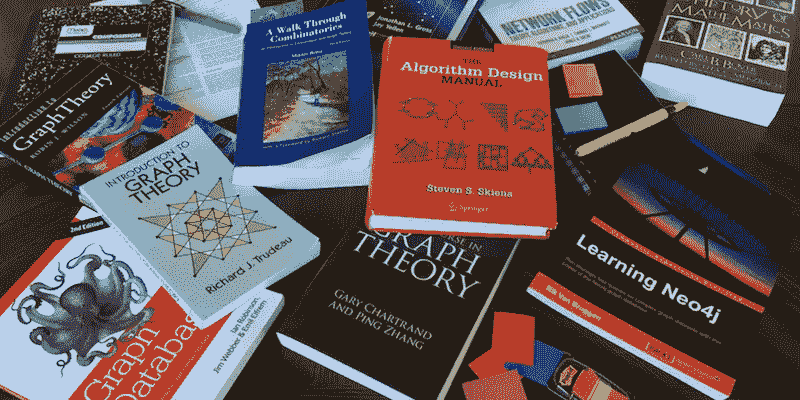

Neo4j 的图像算法

算法是语言不可知的，任何称职的程序员都应该能够将它们转换成自己选择的编程语言的代码。不幸的是，我遇到过几个程序员，他们在编程语言方面*真的*，比如 [Java](http://www.java67.com/2018/08/top-10-free-java-courses-for-beginners-experienced-developers.html) 或者 [Python-](https://javarevisited.blogspot.com/2018/12/10-free-python-courses-for-programmers.html) 懂得 API 的小细节和语言的复杂性，但是在算法和数据结构的基础知识方面却很差。

随便让他们实现什么流行的排序算法像[快速排序](http://java67.blogspot.sg/2014/07/quicksort-algorithm-in-java-in-place-example.html)或者[归并排序](http://www.java67.com/2018/03/mergesort-in-java-algorithm-example-and.html)，都是土崩瓦解。如果你希望他们知道更高级、更复杂的算法，如[字符串算法](https://dev.to/javinpaul/top-20-string-coding-problems-from-programming-job-interviews-493m)、[图算法](http://bit.ly/2NAbaIR)、[树遍历](https://javarevisited.blogspot.com/2016/10/post-order-binary-tree-traversal-in-java-iteration-recursion.html)或贪婪算法，准备好面试检查；否则，你可能会有一些惊喜。

有一次，我遇到了一个优秀的核心 Java 高级开发人员候选人，他在核心 Java、多线程和 T21 方面都很出色，但是他的数据结构和算法技能与他的经验和能力相比实在是太差了。

我什么时候问过他为什么不来面试之前不花时间刷一下自己的算法和解题技巧？他的借口是，*“那些算法只是为了面试，从来没有真正用于实际编码。在我六年的 Java 开发生涯中，我从未使用过它们。*

他有点正确；你不需要用 Java 实现一个散列表，你总是可以在 [Python](https://hackernoon.com/10-free-python-programming-courses-for-beginners-to-learn-online-38312f3b9912) 中使用`[HashMap](http://www.java67.com/2017/08/top-10-java-hashmap-interview-questions.html)` 类或者`Dictionary` ，但是他没有认识到在[中更长期的改进算法和数据结构对提高编程技能](https://javarevisited.blogspot.com/2014/01/10-tips-to-improve-programming-skill-become-better-programmer.html)的作用。

> 算法是开发编程解决技巧和编码意识的工具，这是将用户需求转换成代码行(也称为计算机程序)所必需的。

他们也无处不在，如果你使用脸书设计，你有没有想过他们是如何这么快找到你的朋友的？或者网飞科技博客如何推荐你想看的电影？这些只是 [**机器学习算法**](https://pluralsight.pxf.io/c/1193463/424552/7490?u=https%3A%2F%2Fwww.pluralsight.com%2Fcourses%2Fmachine-learning-algorithms) 的几个例子，它们将算法带到了另一个层次。

# 10 本数据结构和算法书籍——开发者必读

对于那些认为算法是数据结构的人来说，另一个黄金提示是给那些想在亚马逊、T2、谷歌、脸书、英特尔或者微软工作的人的。记住这是唯一永恒的技能，当然，除了 [UNIX](http://www.java67.com/2018/02/5-free-linux-unix-courses-for-programmers-learn-online.html) 、 [SQL](http://www.java67.com/2018/02/5-free-database-and-sql-query-courses-programmers.html) 和 c。

> 编程语言来来去去，但编程的核心，也就是算法和数据结构是不变的。

如果你知道哈希表是如何工作的，那么你可以在任何编程语言中使用它们的实现，比如来自 JDK 的 [HashMap](http://www.java67.com/2013/02/10-examples-of-hashmap-in-java-programming-tutorial.html) ，来自 [Python](https://hackernoon.com/top-5-courses-to-learn-python-in-2018-best-of-lot-26644a99e7ec) 的 Dictionary，或者来自 [C++](https://hackernoon.com/top-5-free-c-courses-to-learn-programming-in-2019-d27352277da0) boost 库的 HashMap。

所以，如果你真的想编程并意识到算法和数据结构不是可选的，这里有一些学习算法的好书。

你们中的一些人可能已经读过了，但是它们值得再读一遍。

## 1.托马斯·h·科尔曼《算法导论》

这是最受欢迎的算法书籍之一，但是请注意它包含了大量的理论。这本书现在的版本是第三版，第四版也快到了。

我强烈建议每个程序员都应该在他们的书架上放上这个，*但只是为了简短阅读和参考。*

[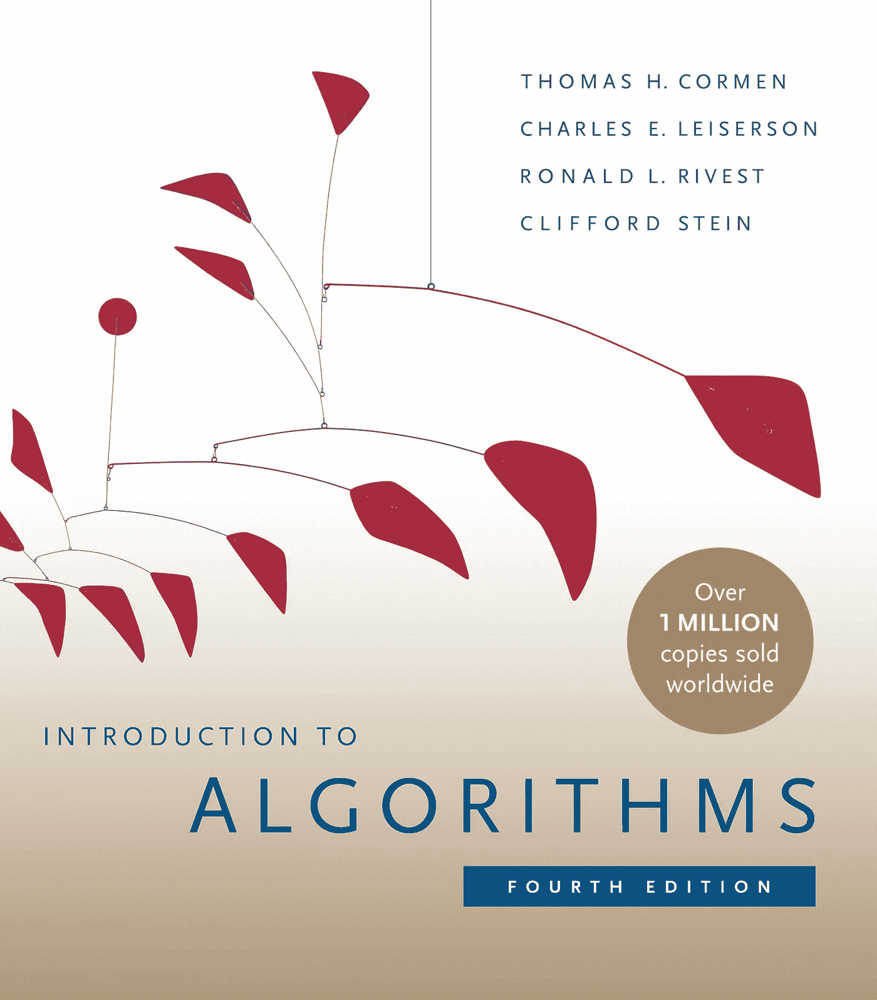](http://www.amazon.com/Introduction-Algorithms-Edition-Thomas-Cormen/dp/0262033844?tag=javamysqlanta-20)

一口气读完这本书是不可能的，你们中的一些人可能会觉得阅读起来很困难，但不要担心，你可以将你的学习与在线课程结合起来，如与这本书一起的 [**数据结构和算法:使用 Java**](https://click.linksynergy.com/fs-bin/click?id=JVFxdTr9V80&subid=0&offerid=323058.1&type=10&tmpid=14538&RD_PARM1=https%3A%2F%2Fwww.udemy.com%2Fdata-structures-and-algorithms-deep-dive-using-java%2F) 的深度学习。

 [## 数据结构和算法:使用 Java 进行深入研究

### 所以你已经掌握了 Java(或另一种面向对象编程语言)中数据结构和算法的基础知识，但是…

click.linksynergy.com](https://click.linksynergy.com/fs-bin/click?id=JVFxdTr9V80&subid=0&offerid=323058.1&type=10&tmpid=14538&RD_PARM1=https%3A%2F%2Fwww.udemy.com%2Fdata-structures-and-algorithms-deep-dive-using-java%2F) 

这就像是两全其美，你可以在在线课程中快速学习基本算法，然后通过阅读这本书来进一步巩固知识，这对于你来说更有意义，因为你已经完成了一门课程。

我推荐这本书作为第一本关于算法的书的另一个原因是因为它的语言不可知论，并附有讲座[在这里](http://ocw.mit.edu/courses/electrical-engineering-and-computer-science/6-046j-introduction-to-algorithms-sma-5503-fall-2005/index.htm)。

非常感谢所有的作者托马斯·H·科尔曼、查尔斯·e·莱瑟森和罗纳德·L·李维斯特，他们创造了这个最全面的资源，也被称为关于算法的 [**CLRS 书**](http://www.amazon.com/Introduction-Algorithms-Edition-Thomas-Cormen/dp/0262033844?tag=javamysqlanta-20)

## 2.罗伯特·塞奇威克和凯文·韦恩的算法

很长一段时间以来，这是我首选的算法资源，现在仍然是，但现在我看到它的次数比以前少了。你会学到很多关于算法的背景知识，现在，甚至这本书的特定版本也可以用于不同的编程语言，如 [Java](https://javarevisited.blogspot.com/2018/05/top-5-java-courses-for-beginners-to-learn-online.html) 和 [C++](http://www.java67.com/2018/02/5-free-cpp-courses-to-learn-programming.html) 。

[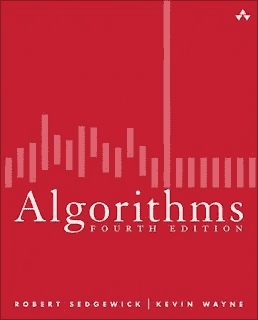](http://www.amazon.com/Algorithms-4th-Edition-Robert-Sedgewick/dp/032157351X?tag=javamysqlanta-20)

这本书也有几个免费的 Coursera 在线课程，[**算法第一部分**](https://coursera.pxf.io/c/3294490/1164545/14726?u=https%3A%2F%2Fwww.coursera.org%2Flearn%2Falgorithms-part1) 和[**算法第二部分**](https://coursera.pxf.io/c/3294490/1164545/14726?u=https%3A%2F%2Fwww.coursera.org%2Flearn%2Falgorithms-part2) ，很好地补充了这本书。太棒了。这也是我向 Java 程序员学习算法的首要推荐。

 [## 算法，第一部分

### 这门课程涵盖了每个严肃的程序员需要知道的关于算法和数据的基本信息…

coursera.pxf.io](https://coursera.pxf.io/c/3294490/1164545/14726?u=https%3A%2F%2Fwww.coursera.org%2Flearn%2Falgorithms-part1)  [## 算法，第二部分

### 这门课程涵盖了每个严肃的程序员需要知道的关于算法和数据的基本信息…

coursera.pxf.io](https://coursera.pxf.io/c/3294490/1164545/14726?u=https%3A%2F%2Fwww.coursera.org%2Flearn%2Falgorithms-part2) 

在 Coursera 上，它也有一些最好的数据结构和算法课程，涵盖了每一个重要的主题。它们被捆绑在一起作为[Coursera Specialization on Algorithms](https://coursera.pxf.io/c/3294490/1164545/14726?u=https%3A%2F%2Fwww.coursera.org%2Fspecializations%2Fdata-structures-algorithms)。如果你热衷于深入学习算法，那是我建议你去的地方。

信不信由你，但是如果你已经知道了一种编程语言，那么看一个关于这种编程语言的算法的例子也可以减少学习曲线。*你也可以在线免费阅读本书第四版* [*这里*](http://algs4.cs.princeton.edu/home/) *。*

如果你发现 Coursera 的课程很有用，因为它们是由世界各地知名的公司和大学创建的，我建议你加入 Coursera Plus 的订阅计划，它可以让你无限制地访问他们最受欢迎的课程、专业知识、专业证书和指导项目。它每年花费大约 399 美元，但它完全值得你的钱，因为你可以获得无限的证书。

## 3.算法设计手册

这是另一本关于计算机算法的极好的书，它用大量的代码讲述了大量的算法。我特别喜欢这本书的地方是，他实际上给出了他在实践中使用算法(或其变体)的例子；它真的可以帮助你看到一个特定的算法(或一系列算法)可以解决的问题类别。

[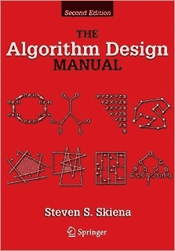](http://www.amazon.com/Algorithm-Design-Manual-Steven-Skiena/dp/1849967202?tag=javamysqlanta-20)

代码在 [C](https://javarevisited.blogspot.com/2019/11/top-5-courses-to-learn-c-programming-in.html#axzz69DWxttaI) 里，但不是很深奥，很容易理解。我离开学校也有一段时间了，这帮助我快速掌握了一些[**图形算法**](http://bit.ly/2NAbaIR) 。这本书我已经买了将近十年了，但我仍然时不时地看看它。非常感谢@SteveSkiena

## 4.面试算法

阿德南·阿齐兹(Adnan Aziz)的《采访算法》(Algorithm for Interview)是一本关于算法的必读书籍，是根据牢记[编程采访](https://hackernoon.com/10-data-structure-algorithms-and-programming-courses-to-crack-any-coding-interview-e1c50b30b927)而写的。

[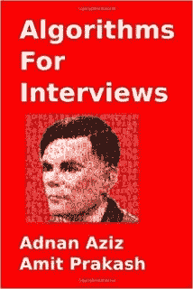](http://www.amazon.com/Algorithms-For-Interviews-Adnan-Aziz/dp/1453792996?tag=javamysqlanta-20)

封面本身表明，如果你仔细观察封面上画有名人缩略图的图像，这本书会有多么不同寻常，这本书解释了如何开发这种算法。很有趣，不是吗？

嗯，我喜欢这本书，因为它的方法和目标，有时用不同的对象学习同样的东西有助于更好地理解它。

## 5.简单来说就是算法

奥赖利的《算法》，简单来说，是一本学习编程算法的优秀书籍，尤其适合 Java 程序员。它描述了算法，重点是实现它们，而不是经典算法书籍中使用的复杂数学。

[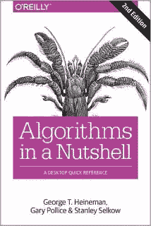](http://www.amazon.com/Algorithms-Nutshell-In-OReilly/dp/059651624X?tag=javamysqlanta-20)

所有算法都以模式的形式呈现，带有使用它们的动机、给出高层次概述的图片和伪代码，以及工作代码(在 [C](https://dzone.com/articles/5-free-courses-to-learn-data-structure-and-algorit) 、 [C++](http://www.java67.com/2018/02/5-free-cpp-courses-to-learn-programming.html) 、 [Java](https://javarevisited.blogspot.com/2018/05/top-5-java-courses-for-beginners-to-learn-online.html) 和 [Ruby](http://www.java67.com/2018/02/5-free-ruby-and-rails-courses-to-learn-online.html) )。

他们也有基准来证明算法的理论性能。总之是程序员学习算法的最佳书籍之一。

## 6.Kleinberg & Tardos 的算法设计

这实际上是继 Thomas Cormon 的[算法介绍](http://www.amazon.com/dp/0072970545/?tag=javamysqlanta-20)之后的第二本算法书籍。它不是真正的算法入门，更适合有经验的程序员。

[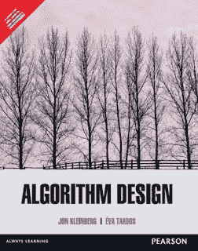](https://www.amazon.com/Algorithm-Design-Jon-Kleinberg/dp/0321295358?tag=javamysqlanta-20)

对于熟悉必要算法的开发者来说，更多的是算法设计。你应该从介绍罗伯特·塞奇威克的算法书或算法开始，然后继续读这本书。

顺便说一句，如果你愿意，你也可以将你的学习与类似 [**算法和数据结构的在线课程结合起来——第一部分和第二部分**](https://pluralsight.pxf.io/c/1193463/424552/7490?u=https%3A%2F%2Fwww.pluralsight.com%2Fcourses%2Fads-part1) 在 [Pluralsight](https://medium.com/u/50a6c7ef7431?source=post_page-----d50487313127----------------------) 上。在进入算法设计主题之前，熟悉基本算法和数据结构是一门很好的课程。

 [## 算法和数据结构-第 1 部分

### 在本课程中，您将学习以下概念:数据结构的类型和算法链表堆栈…

pluralsight.pxf.io](https://pluralsight.pxf.io/c/1193463/424552/7490?u=https%3A%2F%2Fwww.pluralsight.com%2Fcourses%2Fads-part1) 

## 7.算法导论:一种创造性的方法

Udi Manber 的《算法导论:一种创造性的方法》是另一本优秀的自学书籍，因为它充满了数百个问题和例子。

[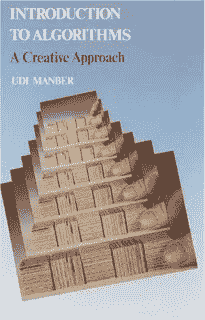](https://www.amazon.com/Introduction-Algorithms-Creative-Udi-Manber/dp/0201120372?tag=javamysqlanta-20)

它旨在增强考生解决问题的能力和对算法设计背后原理的理解，这将帮助你发展你的[问题解决](http://www.java67.com/2018/06/data-structure-and-algorithm-interview-questions-programmers.html)和[编码技能](http://www.java67.com/2016/02/5-books-to-improve-coding-skills-of.html)。

## 8.算法的设计和分析

这是计算机算法方面的又一个伟大的厨师，值得在程序员的书架上占有一席之地。一旦你读完了 Coursera 关于算法的专业课程*和一本入门书籍，你就可以阅读这本书来学习算法中的高级主题。*

*[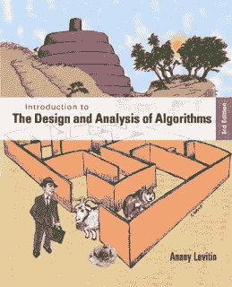](https://www.amazon.com/Introduction-Design-Analysis-Algorithms-3rd/dp/0132316811?tag=javamysqlanta-20)*

## *9.数据结构和算法。阿霍-乌尔曼-霍普克罗夫特公司*

*另一本关于算法和数据结构的好入门书。一本可爱而明亮的书，任何不喜欢在算法上大量使用数学的程序员都会欣赏这本书。*

*[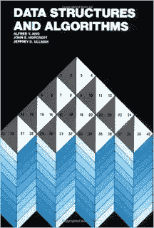](https://www.amazon.com/Data-Structures-Algorithms-Alfred-Aho/dp/0201000237?tag=javamysqlanta-20)*

*顺便说一句，如果你觉得这本书读起来很有挑战性，这也是我的一些读者抱怨的，那么你也可以看看 Aditya Bhargava 的**算法，这是一本对初学者来说最简单和令人兴奋的算法书籍。***

## ***10.Python 算法:掌握 Python 语言中的基本算法***

***这本书是为 Python 程序员设计的。马格努斯·李·赫特兰德也是一本流行的 Python 入门书籍[的作者。](https://www.amazon.com/Beginning-Python-Professional-Magnus-Hetland-ebook/dp/B06XGVVVMG?tag=javamysqlanta-20)***

***[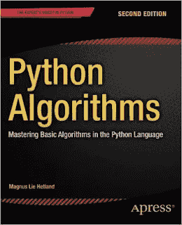](https://www.amazon.com/Python-Algorithms-Mastering-Language-Experts/dp/1430232374?tag=javamysqlanta-20)***

***正如我所说的，算法是独立于语言的；学习 python 算法并不意味着你不能用 [Java](https://javarevisited.blogspot.com/2017/11/top-5-free-java-courses-for-beginners.html) 或者 [C++](http://www.java67.com/2018/02/5-free-cpp-courses-to-learn-programming.html) 实现，但是如果你已经了解了 [Python](https://javarevisited.blogspot.com/2018/12/10-free-python-courses-for-programmers.html) ，那么这就是一本学习计算机算法的绝佳书籍。***

***这本书也给出了很多关于[**图算法**](https://click.linksynergy.com/deeplink?id=JVFxdTr9V80&mid=39197&murl=https%3A%2F%2Fwww.udemy.com%2Falgorithms-and-data-structures-in-python%2F) 的重点，这些算法在解决现实问题时非常有用。***

## ***11.搜索算法***

***当我在我的博客上发表这篇文章时，这本书并不是最初系列的一部分，但读完这本书后，我应该把它包括在列表中，因为它很简单。这是我读过的关于算法的最好的书之一，尤其是从初学者的角度来看。***

***[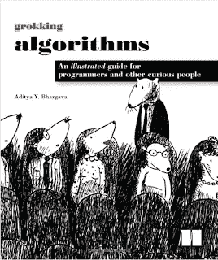](https://www.amazon.com/Grokking-Algorithms-illustrated-programmers-curious/dp/1617292230/?tag=javamysqlanta-20)***

***它使用了现代的例子，如脸书如何存储用户名，以便登录时可以轻松搜索。这些例子能更好地引起初学者的共鸣，帮助他们理解这个概念，比如为什么对于搜索来说，[数组](http://www.java67.com/2012/12/difference-between-arraylist-vs-LinkedList-java.html)比[链表](https://hackernoon.com/top-20-linked-list-coding-problems-from-programming-job-interviews-756d4a2bf652)更好。***

***Aditya 的美术背景也使这本书成为一个视觉学习资源。你会发现这本书里有很多有趣的、中肯的图表，帮助你更好更快地学习这个概念。如果你愿意，你也可以在黑客新闻上阅读 [*我的搜索算法书评*](https://hackernoon.com/grokking-algorithms-book-review-aa4459da93f5)***

***这是一个有用的图表，它将这本书与列表中提到的其他算法书进行了比较***

***[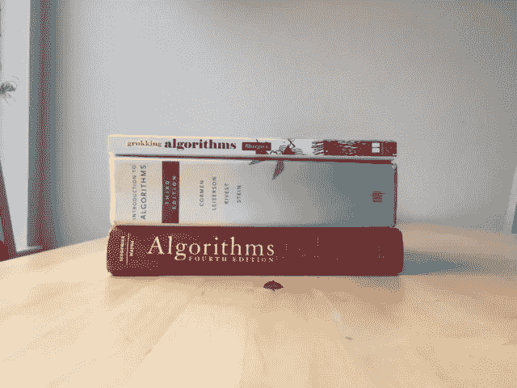](https://www.amazon.com/Grokking-Algorithms-illustrated-programmers-curious/dp/1617292230/?tag=javamysqlanta-20)***

***简而言之，任何初学程序员的最佳算法书籍之一。它没有涵盖所有的数据结构和算法，但无论它涵盖了什么，它都很好地解释了它们。***

***以上就是每个程序员都应该看的 **10 本算法书**。我同意算法是一个复杂的话题，一读就懂不容易；那样的话，我建议同一本书看两遍。***

> ***仅仅阅读是不够的，试着用你喜欢的编程语言来实现它们。编写自己的数组列表、HashMap 或基于树的 Map 实现没有坏处。***

***学习算法的效果不会立即显现，但是随着时间的推移，您会注意到您的思维、解决方案构建和代码质量有了微妙的改善。***

***顺便说一句，如果你对一门关于算法的在线课程感兴趣，我建议你在 Udemy 上查看一下 [**数据结构与算法:使用 Java**](https://click.linksynergy.com/fs-bin/click?id=JVFxdTr9V80&subid=0&offerid=323058.1&type=10&tmpid=14538&RD_PARM1=https%3A%2F%2Fwww.udemy.com%2Fdata-structures-and-algorithms-deep-dive-using-java%2F) 的深度潜水。这不是一个免费的课程，但你可以花不到 10 到 15 美元购买几个 Udemy flash 销售，每隔几天就有一次***

***顺便说一句，如果你使用我在这篇文章上的链接购买任何课程，我会向你支付额外费用，但你应该只在观看预览后购买课程，无论你是否能连接到讲师。***

***购买一门与教师没有联系的课程既浪费时间又浪费金钱。和书一样，选择一本你和作者有联系的书，如果它对你来说容易的话，和一门课程混合在一起。谢谢你的支持。***

***您可能喜欢的其他数据结构和算法文章***

*   ***[学习算法和数据结构的 5 门免费课程](https://javarevisited.blogspot.com/2018/01/top-5-free-data-structure-and-algorithm-courses-java--c-programmers.html)***
*   ***[程序员 50+数据结构和算法问题](https://hackernoon.com/50-data-structure-and-algorithms-interview-questions-for-programmers-b4b1ac61f5b0)***
*   ***[10 门数据结构与算法课程破解面试](https://hackernoon.com/10-data-structure-algorithms-and-programming-courses-to-crack-any-coding-interview-e1c50b30b927)***
*   ***[排名前五的数据结构和算法书籍](https://javarevisited.blogspot.com/2015/07/5-data-structure-and-algorithm-books-best-must-read.html)***
*   ***[Java 程序员应该学习的 10 件事](https://javarevisited.blogspot.com/2017/12/10-things-java-programmers-should-learn.html#axzz5atl0BngO)***
*   ***[理解图论&算法](https://neo4j.com/blog/top-13-resources-graph-theory-algorithms/)的 13 大资源***
*   ***[来自访谈的 30 多个基于数组的编码问题](https://javarevisited.blogspot.com/2015/06/top-20-array-interview-questions-and-answers.html)***
*   ***[来自访谈的 30 多个基于链表的编码问题](https://javarevisited.blogspot.com/2017/07/top-10-linked-list-coding-questions-and.html)***
*   ***[75+实践面试中的编码问题](http://www.java67.com/2018/05/top-75-programming-interview-questions-answers.html)***
*   ***[我最喜欢的深入学习算法的免费课程列表(freeCodeCamp)](https://medium.freecodecamp.org/these-are-the-best-free-courses-to-learn-data-structures-and-algorithms-in-depth-4d52f0d6b35a)***

***感谢您阅读本文，如果您喜欢这份书单，那么您也会喜欢我收集的每个程序员都应该阅读的 10 本书****，**，这是一份关于编程、编码、软件开发技术、最佳实践、计算机、编程职业以及过去 50 年中一些伟大的程序员/编码员/开发人员的经验的书单。*****

> *****最后，有两种程序员，一种懂算法，一种不懂。*****

******顺便说一句，你不需要阅读所有这些书来掌握算法，是的，这不是必需的，你可以从一本你觉得容易的书开始，如*[*Grokking Algorithms*](https://www.amazon.com/Grokking-Algorithms-illustrated-programmers-curious/dp/1617292230/?tag=javamysqlanta-20)，*，然后继续阅读另一本综合性的书，如*[*CLRS*](https://www.amazon.com/Introduction-Algorithms-Edition-Thomas-Cormen/dp/0262033844?tag=javamysqlanta-20)*。******

> ********p . s .——****如果你更喜欢在线课程而不是书本，或者你想同时从书本和在线课程中学习，那么你也可以查看我列出的* [***学习数据结构和算法的前 5 名在线课程***](https://javarevisited.blogspot.com/2018/11/top-5-data-structures-and-algorithm-online-courses.html#axzz5YFaOvjsh) ***。*** *包含 Java、Python、JavaScript 等课程，方便学习。******

***** [## 2023 年学习数据结构和算法的 10 大在线课程-最佳选择

### 大家好，在过去，我已经分享了很多有用的资源，如书籍和教程，以学习数据结构和…

www.java67.com](https://www.java67.com/2019/07/top-10-online-courses-to-learn-data-structure-and-algorithms-in-java.html) 

而且，如果你想学习系统设计，面试的另一个重要话题，那么你也可以查看 Alex Xu 的[**【ByteByteGo】**](https://bytebytego.com?fpr=javarevisited)，学习面试系统设计的最佳地点之一

 [## ByteByteGo | Ace 您的下一次系统设计面试

### 让您的系统设计技能更上一层楼所需的一切

bytebytego.com](https://bytebytego.com?fpr=javarevisited)*****