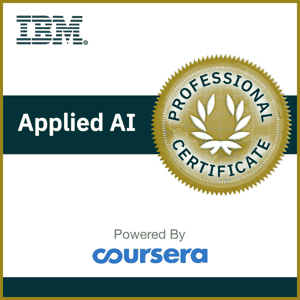
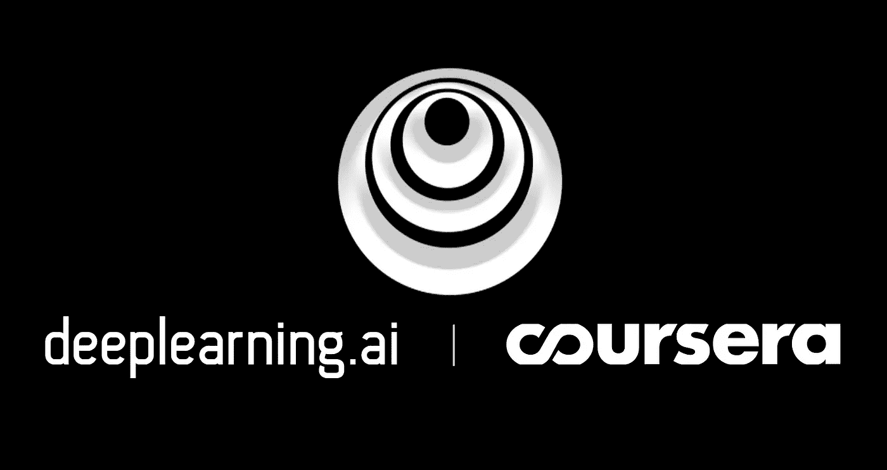
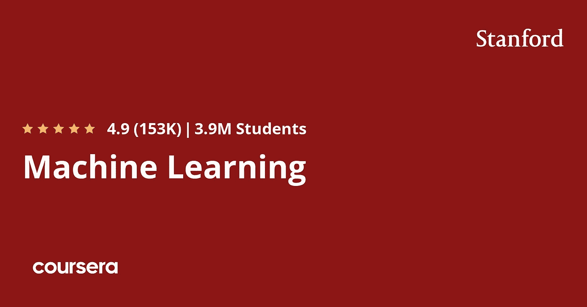
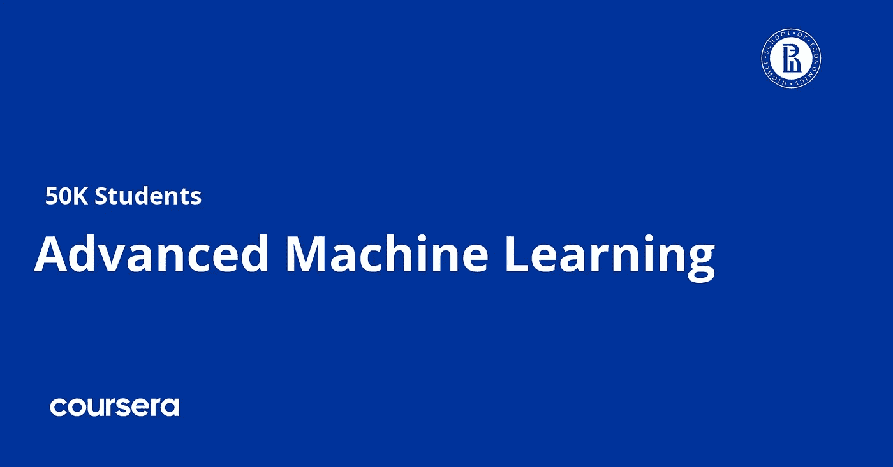
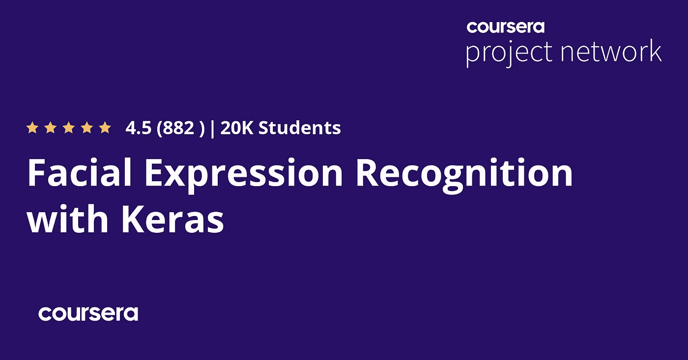
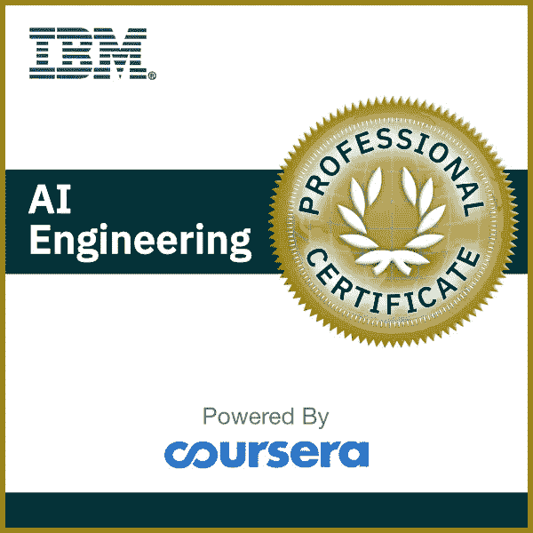
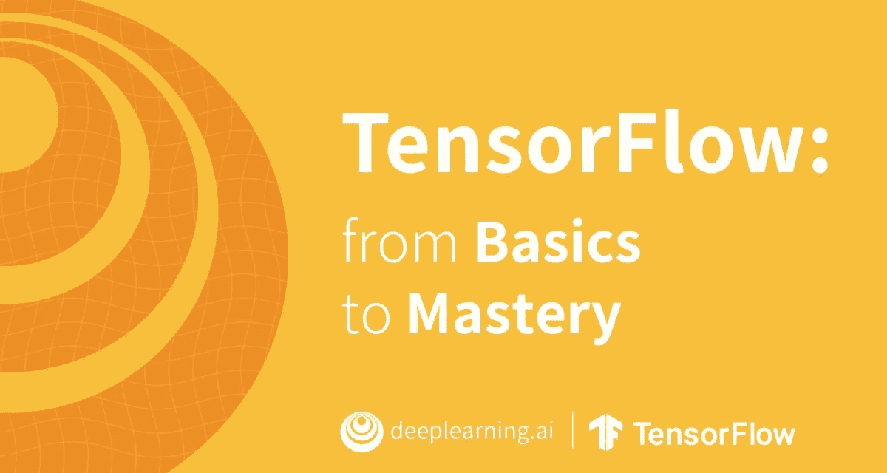
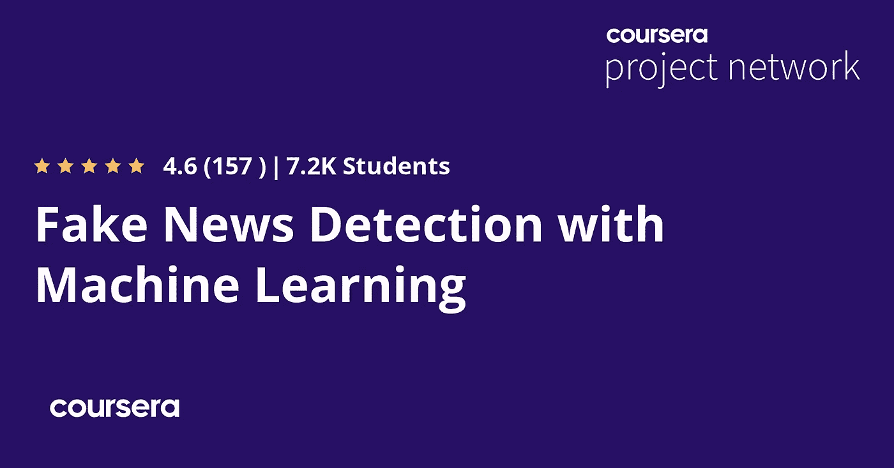
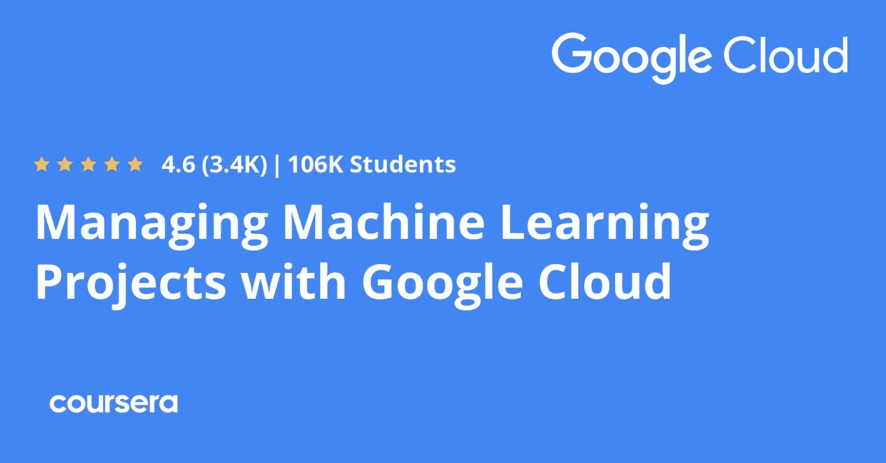
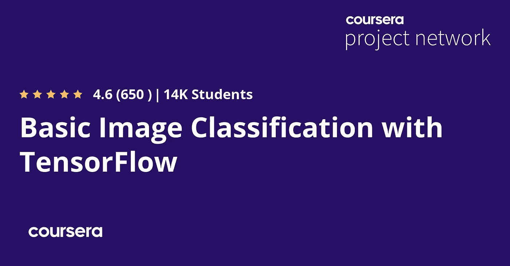

# 2023 年人工智能、机器学习和深度学习的 10 大 Coursera 课程-最好的

> 原文：<https://medium.com/javarevisited/10-best-coursera-certifications-courses-for-machine-learning-and-artificial-intelligence-256d9a125822?source=collection_archive---------0----------------------->

## 这些是 2023 年学习机器学习、深度学习和人工智能的最佳 Coursera 课程和认证

大家好，如果你渴望在 2023 年学习**人工智能、机器学习和深度学习**并寻找最好的 Coursera 课程、认证、专业和项目，那么你来对地方了。

以前我分享过关于[软件开发](/javarevisited/10-best-software-development-courses-certifications-from-coursera-4ccc59aae201)、 [web 开发](/javarevisited/10-best-coursera-courses-for-web-development-and-web-design-9ec54ed92dd9)、[云计算](/javarevisited/10-best-aws-google-cloud-and-azure-courses-and-certification-from-coursera-to-join-in-2021-5c5e2029a8e7)、 [Python](https://javarevisited.blogspot.com/2020/02/10-best-coursera-courses--for-python.html) 的最好的 Coursera 课程，今天我要讲的是 2023 年学习深度学习、**机器学习**、**人工智能**的最好的 Coursera 课程和认证。

成千上万的人已经参加了这些课程，并获得了进入这个令人兴奋的技术领域所需的证书和知识，你也可以这样做。如果你不知道 Coursera 的大多数课程都是免费的，如果你需要认证，你只需要付费，这使得学习变得容易得多。

如今所有的主要网站和博客都在谈论[人工智能](/javarevisited/10-best-udemy-and-coursera-courses-to-learn-artificial-intelligence-in-2020-ec77ad13bdc1)和新的革命，它们将会以不同的方式影响我们未来的生活，以及公司如何投资数十亿美元将这项技术应用到他们的产品中并主导市场。

人工智能是一种让机器像人类一样行动的技术，如使用计算机视觉技术识别物体，或使用[自然语言处理](https://javarevisited.blogspot.com/2020/07/top-5-courses-to-learn-natural-language-processing.html#axzz6cRYpiwdu)技术如 Siri 和谷歌辅助，或制造更复杂的产品，如特斯拉的自动驾驶汽车等。

# 2023 年将加入的 10 个最佳 Coursera 人工智能、机器学习和深度学习课程和认证

今天，你会看到许多 Coursera 课程、认证、专业和指导项目，以了解这种被称为人工智能的新技术，并了解它如何像人一样行事，以及如何开发自己的产品，使用人工智能来说话或识别东西等等。

## 1. [IBM 应用 AI【专业证书】](https://coursera.pxf.io/c/3294490/1164545/14726?u=https%3A%2F%2Fwww.coursera.org%2Fprofessional-certificates%2Fapplied-artifical-intelligence-ibm-watson-ai)

学习人工智能的最佳入门课程，即使对非技术人员来说也是如此，你将从人工智能的定义及其用例开始，然后学习如何使用 IBM Watson 人工智能服务，例如在没有编程技能的情况下创建聊天机器人，然后学习如何使用 [python](/javarevisited/10-best-python-certification-courses-from-coursera-4576890eb6b3) 进行编码，并将其用于数据科学和计算机视觉。

这个 Coursera 认证将让你对人工智能技术，它的应用和它的用例有一个坚定的理解。你将熟悉一些概念和工具，如[机器学习](https://becominghuman.ai/top-10-courses-to-learn-tensorflow-for-machine-learning-in-2020-39a31e7cd84b)、[数据科学](/javarevisited/my-favorite-data-science-and-machine-learning-courses-from-coursera-udemy-and-pluralsight-eafc73acc73f)、自然语言处理、图像分类、图像处理、IBM Watson AI 服务、 [OpenCV](https://www.java67.com/2020/07/top-5-courses-to-learn-computer-vision-opencv-python.html) 和 API。

即使你没有编程背景，通过这个专业证书，你将学习实用的 Python 技能，以在 web 上设计、构建和部署 AI 应用程序。

**这里是加入这个 Coursera 认证的链接**——[IBM 应用人工智能](https://coursera.pxf.io/c/3294490/1164545/14726?u=https%3A%2F%2Fwww.coursera.org%2Fprofessional-certificates%2Fapplied-artifical-intelligence-ibm-watson-ai)

## 2.[深度学习【专业化】](https://coursera.pxf.io/c/3294490/1164545/14726?u=https%3A%2F%2Fwww.coursera.org%2Fspecializations%2Fdeep-learning)

毫无疑问，这是人工智能和深度学习职业生涯的最佳专业化，旨在帮助已经了解 python 的中级人员，并教你神经网络理论以及如何改进你的模型，然后学习创建成功的人工智能产品和卷积神经网络来识别对象等。

由人工智能先驱和 Coursera 创始人之一的吴恩达 创建的 [**这个专业化将帮助你擅长深度学习。**](https://coursera.pxf.io/c/3294490/1164545/14726?u=https%3A%2F%2Fwww.coursera.org%2Finstructor%2Fandrewng)

在五门在线课程中，你将学习[深度学习](/javarevisited/top-5-advanced-deep-learning-and-neural-network-courses-to-learn-in-2020-a273f5eddca5?source=---------16----------------------------)的基础，了解如何构建神经网络，并学习如何领导成功的机器学习项目。

您将了解卷积网络、RNNs、LSTM、Adam、Dropout、BatchNorm、Xavier/He 初始化等等。你将从事医疗保健、自动驾驶、手语阅读、音乐生成和自然语言处理的案例研究。

你不仅会掌握理论，还会看到它是如何应用于工业的。你将在 [Python](/swlh/5-free-python-courses-for-beginners-to-learn-online-e1ca90687caf) 和 [TensorFlow](https://becominghuman.ai/top-10-courses-to-learn-tensorflow-for-machine-learning-in-2020-39a31e7cd84b) 中实践所有这些想法。你还会听到许多深度学习领域的顶级领导者，他们会与你分享他们的个人故事，并为你提供职业建议。

**这里是加入这个 Coursera 认证**——[深度学习](https://coursera.pxf.io/c/3294490/1164545/14726?u=https%3A%2F%2Fwww.coursera.org%2Fspecializations%2Fdeep-learning)的链接

## 3.[机器学习](https://coursera.pxf.io/c/3294490/1164545/14726?u=https%3A%2F%2Fwww.coursera.org%2Flearn%2Fmachine-learning)【免费课程】

是学习机器学习的最受欢迎和最全面的课程之一，超过 400 万学生已经加入了这门课程。

这也是我了解 Coursera 的过程。由吴恩达创建的这门课程提供了机器学习、数据挖掘和统计模式识别的广泛介绍。

以下是本课程涵盖的主题:

1.  监督学习(参数/非参数算法、支持向量机、内核、神经网络)
2.  无监督学习(聚类、降维、推荐系统、深度学习)。
3.  机器学习的最佳实践(偏差/方差理论；机器学习和 AI 中的创新过程)。

该课程还将借鉴大量的案例研究和应用，以便您也将学习如何应用学习算法来构建智能机器人(感知、控制)、文本理解(网络搜索、反垃圾邮件)、计算机视觉、医疗信息学、音频、数据库挖掘和其他领域。

**这里是加入这个免费课程的链接**——[机器学习](https://coursera.pxf.io/c/3294490/1164545/14726?u=https%3A%2F%2Fwww.coursera.org%2Flearn%2Fmachine-learning)

## 4.[高级机器学习](https://coursera.pxf.io/c/3294490/1164545/14726?u=https%3A%2F%2Fwww.coursera.org%2Fspecializations%2Faml)

另一个大规模的课程教你先进的机器学习技术及其背后的数学，并从介绍深度学习开始，而不是一些 ML 方法，如贝叶斯方法和强化学习，使机器学习自己以及计算机视觉和 NLP 等。

在整个课程项目中，您将通过解决各种各样的现实世界问题，如图像字幕和自动游戏，掌握机器学习技能。你将获得应用先进的[机器学习技术](https://www.java67.com/2020/07/top-5-machine-learning-algorithms-for-beginners.html)的实践经验，这些技术为当前人工智能的最新发展水平奠定了基础。

谈到结果，超过 38%的人在完成这一专业后开始了新的职业生涯，而 43%的人获得了加薪或晋升。

**这里是加入这个高级课程**——[高级机器学习](https://coursera.pxf.io/c/3294490/1164545/14726?u=https%3A%2F%2Fwww.coursera.org%2Fspecializations%2Faml)的链接

## 5.[用 Keras 进行面部表情识别](https://coursera.pxf.io/c/3294490/1164545/14726?u=https%3A%2F%2Fwww.coursera.org%2Fprojects%2Ffacial-expression-recognition-keras)【项目】

Coursera 的这一基于项目的课程面向已经了解深度学习并希望尝试新事物的人，因此您将使用 Keras 来创建卷积神经网络，并训练您的模型来识别面部表情，如高兴或悲伤，然后使用 Flask 将其转换为类似 web 应用程序的形式，并将该模型用于视频流。

在这个 2 小时长的基于项目的课程中，您将从头开始在 Keras 中构建和训练一个卷积神经网络(CNN ),以识别面部表情。

您将使用 [OpenCV](https://www.java67.com/2020/07/top-5-courses-to-learn-computer-vision-opencv-python.html) 自动检测图像中的人脸，并在它们周围绘制边界框。一旦您训练、保存并导出了 CNN，您将直接将训练好的模型提供给 web 界面，并对视频和图像数据执行实时面部表情识别。

**这里是加入这个项目的链接**——[用 Keras 进行面部表情识别](https://coursera.pxf.io/c/3294490/1164545/14726?u=https%3A%2F%2Fwww.coursera.org%2Fprojects%2Ffacial-expression-recognition-keras)

## 6. [IBM AI 工程](https://coursera.pxf.io/c/3294490/1164545/14726?u=https%3A%2F%2Fwww.coursera.org%2Fprofessional-certificates%2Fai-engineer)【专业认证】

IBM 的另一个很棒的课程是使用 Keras 和 PyTorch 库学习人工智能，从理解一些机器学习概念开始，然后深入研究大数据，并使用 Keras 和 Pytorch 以及 TensorFlow 开发神经网络模型，在本课程结束时有一个顶点项目。

一路上，你将掌握机器学习和深度学习的基本概念，包括监督和非监督学习，使用 Python 等编程语言。

您还将学习流行的机器学习和深度学习库，如 SciPy、ScikitLearn、 [Keras](https://www.java67.com/2020/06/top-5-courses-to-learn-pytorch-and-keras.html) 、PyTorch 和 Tensorflow，以解决涉及对象识别、计算机视觉、图像和视频处理、文本分析、自然语言处理(NLP)、推荐系统和其他类型的分类器的行业问题。

这个项目令人惊讶的一点是，除了获得 Coursera 的专业证书，你还将获得 IBM 的**数字徽章，认可你在 AI 工程方面的熟练程度。**

**这里是加入这个认证**——[IBM AI 工程](https://coursera.pxf.io/c/3294490/1164545/14726?u=https%3A%2F%2Fwww.coursera.org%2Fprofessional-certificates%2Fai-engineer)的链接

## 7.[深度学习。AI TensorFlow 开发者](https://coursera.pxf.io/c/3294490/1164545/14726?u=https%3A%2F%2Fwww.coursera.org%2Fprofessional-certificates%2Ftensorflow-in-practice)【专精】

这是在实践中学习 Tensorflow 最好的培训课程之一。这是一个由四门课程组成的专业证书课程，你将学习使用 TensorFlow 构建可扩展的人工智能应用程序的必要工具。

本课程从介绍人工智能和人工智能开始，然后学习如何使用 [TensorFlow](https://dev.to/javinpaul/10-of-the-best-tensorflow-courses-to-learn-machine-learning-from-coursera-and-udemy-37bf) 为计算机视觉创建卷积神经网络，然后学习 [NLP](https://www.java67.com/2020/07/top-5-courses-to-learn-natural-language-processing-NLP.html?utm_source=dlvr.it&utm_medium=linkedin) 使机器能够理解人类语言，最后，学习创建预测模型。

你也可以利用这门课程来准备 [Google TensorFlow 证书考试](https://www.tensorflow.org/certificate)，你将学到抢手的技能，离获得 Google TensorFlow 证书又近了一步。完成本课程后，您将能够将新的 TensorFlow 技能应用到广泛的问题和项目中。

**以下是加入本专业** — [TensorFlow 开发者](https://coursera.pxf.io/c/3294490/1164545/14726?u=https%3A%2F%2Fwww.coursera.org%2Fprofessional-certificates%2Ftensorflow-in-practice)的链接

## 8.[用机器学习检测假新闻](https://coursera.pxf.io/c/3294490/1164545/14726?u=https%3A%2F%2Fwww.coursera.org%2Fprojects%2Fnlp-fake-news-detector)

另一个很棒的基于项目的课程，你将学习一个人工智能模型来预测这个消息是真是假。

在这个动手项目中，我们将训练一个双向[神经网络](https://javarevisited.blogspot.com/2019/08/top-5-courses-to-learn-deep-learning.html)和基于 LSTM 的深度学习模型，从给定的新闻语料库中检测假新闻。

这个项目实际上可以被任何媒体公司用来自动预测正在传播的新闻是否是假的。该过程可以自动完成，而无需人工审阅数千篇新闻相关文章

好的一面是，你将使用 LSTM 来完成这项工作，这是一种深度学习，你将获得一些真实的数据，对它们进行清洗，并制作一个 LSTM 深度神经网络来训练它们，然后在真实的新闻数据上测试你的模型。

**这里是加入这个项目的链接**——[用机器学习检测假新闻](https://coursera.pxf.io/c/3294490/1164545/14726?u=https%3A%2F%2Fwww.coursera.org%2Fprojects%2Fnlp-fake-news-detector)

## 9.[用谷歌云管理机器学习项目](https://coursera.pxf.io/c/3294490/1164545/14726?u=https%3A%2F%2Fwww.coursera.org%2Flearn%2Fmachine-learning-business-professionals)

这是一个非常棒的 Coursera 课程，适用于已经有项目并想知道他们的产品是否需要人工智能的企业主和企业家，这样你就可以理解什么是机器学习，并发现这种技术的一些用例，以及如何在这个行业中取得成功，包括收集数据和使用它们的最佳实践。

在本课程中，您将学习如何将业务问题转化为[机器学习](https://www.java67.com/2018/10/top-10-data-science-and-machine-learning-courses.html)用例，并审查它们的可行性和影响。

您将了解如何发现意想不到的用例，识别 ML 项目的阶段和每个阶段中的考虑事项，并获得向您的团队或领导提出定制 ML 用例或将需求转化为技术团队的信心。

谈到结果，超过 50%的人在完成这些课程后开始了新的职业生涯，超过 43%的人从这门课程中获得了切实的职业利益

**这里是加入这个项目的链接** — [用谷歌云管理机器学习项目](https://coursera.pxf.io/c/3294490/1164545/14726?u=https%3A%2F%2Fwww.coursera.org%2Flearn%2Fmachine-learning-business-professionals)

## 10.【TensorFlow 的基本图像分类【项目】

这是另一个很棒的基于项目的课程，学习 Keras 和 TensorFlow 对基本图像进行分类。在此过程中，您还将学习神经网络、张量流和 Keras 的基础知识。

在这个 2 小时长的基于项目的课程中，您将学习使用以 [TensorFlow](https://javarevisited.blogspot.com/2018/08/top-5-tensorflow-and-machine-learning-courses-online-programmers.html) 为后端的 [Keras](/javarevisited/5-best-pytorch-and-keras-courses-for-deep-learning-in-2021-c9ba377b1170) 的基础知识，并使用它解决一个基本的图像分类问题。

到本项目结束时，你将已经创建、训练和评估了一个神经网络模型，该模型将能够以很高的准确度从手写图像中预测数字。

**这里是加入本项目**——[tensor flow 基础影像分类](https://coursera.pxf.io/c/3294490/1164545/14726?u=https%3A%2F%2Fwww.coursera.org%2Fprojects%2Ftensorflow-beginner-basic-image-classification)的链接

以上是关于 2023 年学习人工智能、机器学习和深度学习的**最佳 Coursera 认证和课程。你在这篇文章中看到的那些课程，很可能是作为一个初学者或非技术用户，想要学习这项技术的理论和用例，在互联网上学习人工智能和深度学习的最佳课程。

顺便说一句，如果你计划参加多个 Coursera 课程或专业，那么考虑参加 [**Coursera Plus**](https://coursera.pxf.io/c/3294490/1164545/14726?u=https%3A%2F%2Fwww.coursera.org%2Fcourseraplus) 订阅，它可以让你无限制地访问他们最受欢迎的课程、专业、专业证书和指导项目。它每年花费大约 399 美元，但它完全值得你的钱，因为你可以获得无限的证书。**

<https://coursera.pxf.io/c/3294490/1164545/14726?u=https%3A%2F%2Fwww.coursera.org%2Fcourseraplus>  

你可能喜欢的其他 **Coursera 和编程文章**

*   [2023 年程序员十大课程](https://javarevisited.blogspot.com/2020/08/top-10-coursera-courses-specilizations-and-certifications.html)
*   [学习云计算的 10 门最佳 Coursera 课程](https://javarevisited.blogspot.com/2020/08/top-10-coursera-certifications-to-learn-cloud-computing-aws.html#axzz6WK1yC5WW)
*   [Coursera Plus Review——在 Coursera 上学习的更好方式](https://javarevisited.blogspot.com/2020/08/coursera-plus-better-way-to-take-coursera-courses-specilizations-certification.html)
*   [学习网页开发的十大 Coursera 课程](https://javarevisited.blogspot.com/2020/08/top-10-coursera-certifications-to-learn-web-development.html)
*   [学习数据科学的十大课程](https://javarevisited.blogspot.com/2020/08/top-10-coursera-certifications-to-learn-Data-Science-Visualization-and-Data-Analysis.html)
*   来自谷歌和 IBM 等顶级科技公司的 18 门 Coursera 课程
*   [Youtube 上的最佳 Coursera 认证](https://www.youtube.com/watch?v=6NKULJuitcU)
*   [面向程序员和开发者的 Coursera 十大项目](https://javarevisited.blogspot.com/2020/08/top-10-coursera-projects-to-learn-essential-programming-skills.html)
*   [开始职业生涯的十大 Coursera 认证](/javarevisited/top-10-coursera-certificates-to-start-your-career-in-cloud-data-science-ai-mainframe-and-it-558690c83587)
*   [2023 年学习人工智能的 7 门最佳课程](/javarevisited/7-best-courses-to-learn-artificial-intelligence-in-2020-26d59d62f6fe)
*   [Udemy vs Pluralsight？哪个学习平台比较好？](https://javarevisited.blogspot.com/2019/10/udemy-vs-pluralsight-review-which-is-better-to-learn-code.html)
*   [你可以在 Coursera 上在线申请的前 5 个计算机科学学位](https://javarevisited.blogspot.com/2020/04/is-it-possible-to-get-master-of-computer-science-degree-online-coursera.html)
*   [Udemy vs Coursera？学理工和编程哪个好](https://javarevisited.blogspot.com/2020/01/coursera-vs-udemy-which-is-better-for-programming-tech.html)
*   [Coursera 证书对工作和事业有帮助吗](https://javarevisited.blogspot.com/2020/02/does-udemy-coursera-edx-educative-or.html)？
*   [Udemy vs CodeCademy vs one month？](https://javarevisited.blogspot.com/2019/09/codecademy-vs-udemy-vs-onemonth-which-is-better-for-learning-code.html#axzz6VYKcmyZz)
*   Udemy vs Educative vs Codecademy？新手哪个好
*   [学习 Python 的 10 个 Coursera 专业化和认证](https://javarevisited.blogspot.com/2020/02/10-best-coursera-courses--for-python.html)
*   [5 个最佳 Coursera 程序员职业证书](https://javarevisited.blogspot.com/2019/10/top-5-coursera-professional-certificates-for-programmers-IT-professionals.html)
*   [2023 年学习 Python 可以做的 8 个项目](/javarevisited/8-projects-you-can-buil-to-learn-python-in-2020-251dd5350d56)
*   [你可以在 Coursera Online 上获得 5 个数据科学学位](https://www.java67.com/2020/06/top-5-data-science-degree-you-can-earn-online-coursera-edx.html)
*   【Coursera 的 10 项数据科学和机器学习认证

感谢阅读这篇文章。如果你喜欢这些**人工智能、机器学习和深度学习的最佳 Coursera 课程**，那么请与你的朋友和同事分享它们。如果您有任何问题或反馈，请留言。

**P. S.** —如果你正在寻找学习数据科学、机器学习和人工智能的最佳 Udemy 课程，那么你也可以看看基里尔·叶列缅科的 [**人工智能——A to Z**](https://click.linksynergy.com/deeplink?id=JVFxdTr9V80&mid=39197&murl=https%3A%2F%2Fwww.udemy.com%2Fcourse%2Fartificial-intelligence-az%2F)和他的其他课程。他在 Udemy 上有最好的数据科学、机器学习、AI 课程。

<https://click.linksynergy.com/deeplink?id=JVFxdTr9V80&mid=39197&murl=https%3A%2F%2Fwww.udemy.com%2Fcourse%2Fartificial-intelligence-az%2F> 