# 初学者和有经验的软件开发人员的 10 本最佳编程和编码书籍

> 原文：<https://medium.com/javarevisited/10-best-programming-and-coding-books-for-beginners-and-experienced-software-developers-8e47eed3b2e2?source=collection_archive---------0----------------------->

## 我最喜欢的编程、软件开发和编码书籍，每个初学者和有经验的软件开发人员都应该阅读

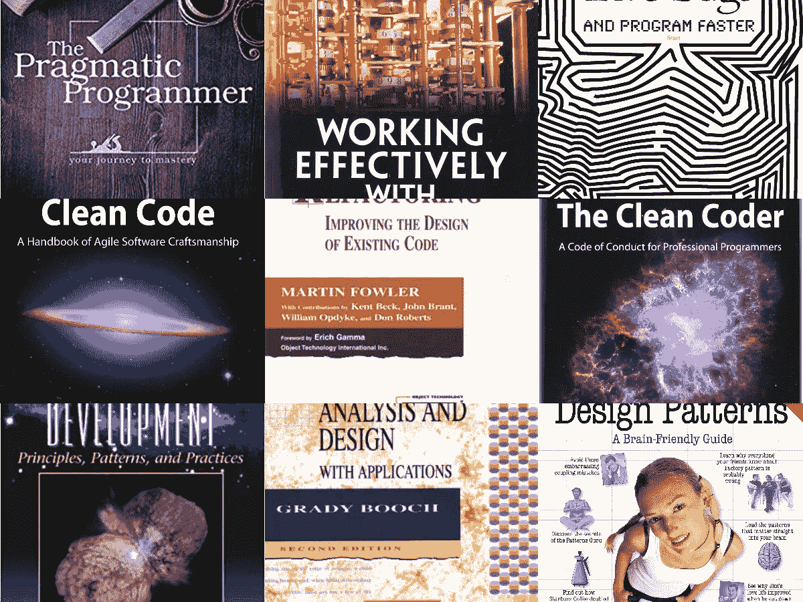

大家好，如果你是一个刚刚开始软件开发的专业程序员，想要提高你的编码和编程技能，并寻找最好的书籍，那么你来对地方了。

早些时候，我已经分享了[**最佳编程和编码课程**](/javarevisited/7-best-courses-to-learn-refactoring-and-clean-coding-in-java-47bea3c67006) ，在这篇文章中，我将分享我认为每个初学者、中级和有经验的程序员都应该阅读的书籍，以发展他们的编码、设计和编程技能。

作为一名经验丰富的软件开发人员，你应该是一名**优秀的编码员**，善于理解需求，设计系统，与同行和利益相关者沟通，确保你的项目有良好的测试覆盖率，遵循良好的[编码最佳实践](https://javarevisited.blogspot.com/2014/10/10-java-best-practices-to-name-variables-methods-classes-packages.html)，以及[编写可维护的代码](https://javarevisited.blogspot.com/2016/12/10-tips-to-make-java-application-more-maintainable-easy-to-support.html)。

这些技能非常有价值，它们不会随着你经验的增加而出现，你需要努力去获得它们。我认识很多编程 7、8 年的程序员，还是不摆这些[技能](https://javarevisited.blogspot.com/2019/01/10-things-every-programmer-and-software-engineer-should-know.html)。

他们中的一些人从不费心去尝试，他们中的一些人只是不知道如何发展这些技能。这就是这些[书](/javarevisited/top-10-books-experienced-java-programmers-should-read-73481356d279)出现的原因。

在编程领域，尤其是在软件开发领域，没有比阅读[书籍](/javarevisited/7-best-books-to-learn-design-patterns-for-java-programmers-5627b93eefdb?source=---------15------------------)和参加[课程](/javarevisited/8-advanced-python-programming-courses-for-intermediate-programmer-cc3bd47a4d19)更好的学习和增加经验的方式了。

如果你很幸运，那么你将会得到一个同事或领导，他不仅仅是一个优秀的程序员，而且还愿意教导和纠正你的错误。在大多数情况下，你通过跟随那些做得正确的人，然后试图破译他们在做什么，来艰难地学习前面提到的技巧。

作为一个程序员，我们很幸运拥有这些由伟大的程序员和开发者写的书。我们应该感谢他们以最好的方式分享他们的知识，让编程世界变得更好。

> 我从事编程和软件开发已经超过 15 年了，但我仍然觉得，对于我刚刚实现的复杂特性，我可以做得更好。

成为一名更好的开发人员需要持续的努力和大量的训练。然而，这些书以各种可能的方式帮助你。即使你设法得到了这些书中的 10%，你也会成为一个更好的程序员和软件开发员。

# 程序员和软件工程师必读的 10 本书

这些是有经验的程序员和软件工程师的最佳书籍。你可以阅读这些书来填补你对有用技能理解的空白，也可以挑选一些在职业生涯中成长的基本技能。

## 1.[零 bug，编程更快](https://www.amazon.com/Zero-Bugs-Program-Kate-Thompson/dp/1530158680?tag=javamysqlanta-20)

不管你有多有经验，如果你是程序员，那么你的编码技能就是你的入门。一个擅长编码的人是一笔宝贵的财富，因为我发现他们很快就能做出一些 [SQL](/javarevisited/5-best-books-to-learn-sql-and-database-design-for-programmers-and-developers-1e7839df2f3e) 来协调事情，编写一些脚本来实现自动化，并在很短的时间内理解复杂的问题。这就是我要求每个程序员在职业生涯的最初几年广泛关注编码的原因。基地就建在那里，但是路途遥远，你需要坚持工作。

我喜欢这本书，它讲述了编码策略，作者 Kate Thompson 在解释如何避免编程中的错误方面做了很好的工作。

[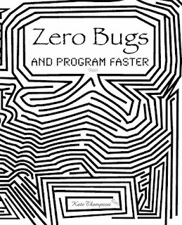](https://www.amazon.com/Zero-Bugs-Program-Kate-Thompson/dp/1530158680?tag=javamysqlanta-20)

作者对错误避免技术做了一些认真的研究，这也反映在本书中。因此，如果你想用更少的书更好地编码，这是一本很好的入门书。

如果你需要一门课程来配合这本书，Udemy 上的 [**用 Java 清理代码:学习简单设计，重构& TDD**](https://click.linksynergy.com/deeplink?id=CuIbQrBnhiw&mid=39197&murl=https%3A%2F%2Fwww.udemy.com%2Fcourse%2Fjava-clean-code-with-refactoring-and-tdd%2F) 课程是一个很好的伴侣。

<https://click.linksynergy.com/deeplink?id=CuIbQrBnhiw&mid=39197&murl=https%3A%2F%2Fwww.udemy.com%2Fcourse%2Fjava-clean-code-with-refactoring-and-tdd%2F>  

## 2.实用程序员:从熟练工到大师(第二版)

这是安德鲁·亨特和戴维·托马斯为初学者和有经验的程序员写的另一本优秀的书。务实的程序员通过最佳实践帮助您构建高度可维护的代码。

它涵盖了从需求分析、[架构](/javarevisited/top-5-courses-to-learn-software-architecture-in-2020-best-of-lot-5d34ebc52e9)的主题，并解释了谁来编写[更好的代码](https://javarevisited.blogspot.com/2019/10/udemy-vs-pluralsight-review-which-is-better-to-learn-code.html)，一个有经验的程序员需要的所有技能。

这也是最值得推荐的编程书籍之一。它是我的学长推荐给我的，第一版，现在我正在向我的学弟学妹和学生推荐第二版。

[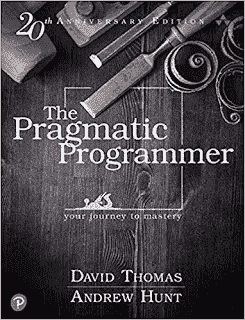](https://www.amazon.com/Pragmatic-Programmer-journey-mastery-Anniversary/dp/0135957052/?tag=javamysqlanta-20)

## 3.[鲍勃大叔清理代码](http://www.amazon.com/Clean-Code-Handbook-Software-Craftsmanship/dp/0132350882?tag=javamysqlanta-20)

如果一个有 1 年经验的程序员让我推荐 10 本书学习有用的编程技术，我会给他推荐 10 遍[干净代码书](/javarevisited/clean-code-a-must-read-coding-book-for-programmers-9dc80494d27c)，没错，就是那么好。我希望在我开始职业生涯的时候就发现了这本书。虽然你可以在工作的任何阶段阅读这本书，它会让你受益，但当你从专业编程开始学习时，它会产生巨大的影响。阅读这本书是成为任何编程语言的优秀程序员的第一步。尽管如此，它对 Java 程序员更有用，因为所有的例子都是用 Java 编写的。

[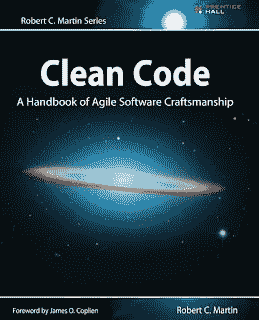](https://javarevisited.blogspot.com/2017/10/clean-code-by-uncle-bob-book-review.html#axzz5jSEI4IYE)

顺便说一下，扎实的原则知识对于编写干净的代码至关重要，这本书会教你，但是如果你需要更多的实践，你也可以加入 Udemy 上的[扎实的原则:介绍软件架构和设计](https://click.linksynergy.com/deeplink?id=JVFxdTr9V80&mid=39197&murl=https%3A%2F%2Fwww.udemy.com%2Fcourse%2Fsolid-design%2F) 课程。它很好地补充了这本书。

<https://click.linksynergy.com/deeplink?id=JVFxdTr9V80&mid=39197&murl=https%3A%2F%2Fwww.udemy.com%2Fcourse%2Fsolid-design%2F>  

## 4.[头部优先设计模式](https://www.java67.com/2016/10/top-5-object-oriented-analysis-and-design-patterns-book-java.html)

这是我读过的最好的头先书之一。它最适合有 2 到 3 年经验的程序员，因为它教你关于模式，如何应用这些模式以有趣的方式编写更好的代码。

初级程序员向有经验的开发人员过渡的必读。

顺便说一句，如果你对设计模式很认真，那么你也可以把这本书和 Udemy 网站上 Dmitri Nestruk 的[**Java 设计模式**](https://click.linksynergy.com/deeplink?id=JVFxdTr9V80&mid=39197&murl=https%3A%2F%2Fwww.udemy.com%2Fcourse%2Fdesign-patterns-java%2F) 课程结合起来。这是一门学习经典设计模式在 Java 中的现代实现的极好课程，它有效地补充了这本书

[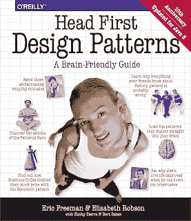](https://medium.com/javarevisited/7-best-books-to-learn-design-patterns-for-java-programmers-5627b93eefdb)

## 5.[干净的编码器](https://www.amazon.com/Clean-Coder-Conduct-Professional-Programmers/dp/0137081073?tag=javamysqlanta-20)

我见过一些优秀的程序员，但没有得到认可或提升，而另一些程序员一般，但沟通能力很强。有些人擅长编码，但是经常不能清楚地表达他们在做什么。因此，除非被要求，否则在重要的时候，比如在会议、电话会议或生产故障排除过程中，他们要么保持沉默，要么说得更少。本书旨在通过向你传授程序员必备的软技能来弥合这一鸿沟。我告诉我所有的朋友和读者，在软技能上投入与编码或学习新技术一样多的努力。记住，技术在几年内就会过时，但是软技能会在你的职业生涯中帮助你。

[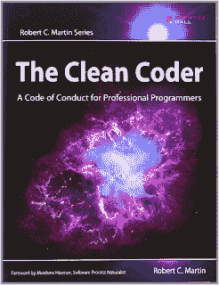](https://www.java67.com/2015/03/10-books-every-programmer-and-software-engineer-read.html)

## 6.[有效使用遗留代码](https://www.java67.com/2018/01/10-must-read-books-for-coders-of-all-level.html)

这是一本由 Michael C. Feathers 写的非常棒的书，也是有经验的程序员的必读书。许多程序员面临的挑战之一是维护遗留代码，这些代码是产品中的生命，没有人知道它是如何工作的。甚至在你加入之前，最初开发团队的最后一名程序员已经离开了组织，现在你必须维护未来的增强和发布。

这实际上是许多有经验的程序员的面包和黄油，但只有当你知道如何处理遗留代码，它可以打破一个较小的增强。

这本书教你所有你应该知道的关于处理遗留代码的事情，不管是什么编程语言，比如 [C++](/javarevisited/10-best-books-for-data-structure-and-algorithms-for-beginners-in-java-c-c-and-python-5e3d9b478eb1) 或者 [Java](/javarevisited/10-free-courses-to-learn-java-in-2019-22d1f33a3915) 。

[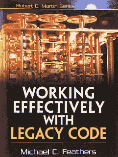](https://www.java67.com/2018/01/10-must-read-books-for-coders-of-all-level.html)

如果你愿意，你也可以把这本书和 Udemy 的这个[干净代码课程](https://click.linksynergy.com/deeplink?id=CuIbQrBnhiw&mid=39197&murl=https%3A%2F%2Fwww.udemy.com%2Fcourse%2Fwriting-clean-code%2F)结合起来。它来自我最喜欢的导师之一，来自 AcadMind 的 Maximilian Schwarzmuller，它教你如何用 Javascript 编写干净的代码。

<https://click.linksynergy.com/deeplink?id=CuIbQrBnhiw&mid=39197&murl=https%3A%2F%2Fwww.udemy.com%2Fcourse%2Fwriting-clean-code%2F>  

## 7.罗伯特·马丁的《敏捷软件开发》

伟大的 Robert C. Martin 也被称为 Bob 叔叔，他写了许多编程和软件开发方面的好书，这是它的另一个瑰宝。

如果你想在今天的软件开发行业生存，你需要敏捷，这本书教你[敏捷软件开发](/javarevisited/7-best-agile-and-scrum-online-training-courses-3b191e9b65eb)的基础知识。作为一名应用程序程序员，这也是一本提高编程技能的好书。

你也可以把这本书和 [*敏捷速成班结合起来:敏捷项目管理；Udemy 的敏捷交付*](https://click.linksynergy.com/deeplink?id=CuIbQrBnhiw&mid=39197&murl=https%3A%2F%2Fwww.udemy.com%2Fcourse%2Fagile-crash-course%2F) 在线课程，从软件开发和项目管理的角度学习敏捷。

[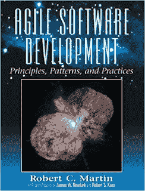](https://medium.com/javarevisited/5-best-agile-and-scrum-books-for-programmers-and-software-developers-2bbff0a1c976)

## 8.[重构:改进现有代码的设计](http://www.amazon.com/Refactoring-Improving-Design-Existing-Code/dp/0201485672?tag=javamysqlanta-20)

这是另一本与编码相关的技术书籍，我强烈推荐给 3 到 4 年经验的程序员。

没有比 [TDD](/javarevisited/5-best-junit-and-test-driven-development-books-for-java-developers-2d3fecb5c9ac) 和[重构](https://javarevisited.blogspot.com/2020/12/top-5-course-to-improve-coding-skills.html)更好的提高代码质量的方法了，而这本书就是重构的圣经。这本书解释了重构的术语和技术，比如提取类、提取方法等等。Java 中给出了例子，但这并不意味着只针对 Java 程序员；如果你是用 [C++](https://javarevisited.blogspot.com/2020/03/top-5-cpp-programming-books-must-read.html) 或者 [Python](https://javarevisited.blogspot.com/2018/12/10-free-python-courses-for-programmers.html) 编程的话，你可以得到大部分。

[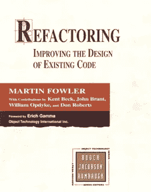](https://javarevisited.blogspot.com/2014/09/top-6-books-to-learn-programming-coding.html)

为了更好更快地学习，你也可以将这本书与 Udemy 上 Woldek Karkowoski 的简单步骤(Java) 课程中解释的 [**重构金字塔结合起来。**](https://click.linksynergy.com/deeplink?id=CuIbQrBnhiw&mid=39197&murl=https%3A%2F%2Fwww.udemy.com%2Fcourse%2Fpyramid-of-refactoring-java-interpreter-factories%2F)

<https://click.linksynergy.com/deeplink?id=CuIbQrBnhiw&mid=39197&murl=https%3A%2F%2Fwww.udemy.com%2Fcourse%2Fpyramid-of-refactoring-java-interpreter-factories%2F>  

这是一个很棒的在线课程，有重构代码使之更好的实例。没有比看着一个人拿着一个可用的遗留代码并把它变得更好更好的学习方法了。

## 9.Grady Booch 的面向对象分析和设计

一个有经验的程序员应该擅长的另一件事是面向对象的分析和设计。一个好的计划对于健壮和可维护的软件来说是必不可少的。

如果你不善于发现你的类和对象以及它们之间的关系，你会引入不必要的依赖，使软件变得复杂。

有经验的程序员和架构师参与设计过程是有原因的。如果你需要一些实践来学习如何在现实世界的场景中应用面向对象的设计技术，那么我强烈推荐你参加关于教育的 [**探索面向对象设计面试**](https://www.educative.io/collection/5668639101419520/5692201761767424?affiliate_id=5073518643380224) 课程。

[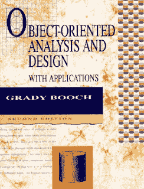](https://www.educative.io/collection/5668639101419520/5692201761767424?affiliate_id=5073518643380224)

这是一门基于文本的交互式课程，允许您直接从浏览器练习编码。本课程将教你如何设计流行的网站，以及如何设计经典的设计问题，如停车场、设计象棋游戏等。

你可以单独参加这门课程，也可以以每月 14.9 美元的价格订阅<https://www.educative.io/subscription?affiliate_id=5073518643380224>**，以获得他们 250 多门基于文本的互动课程。**

## **10.[卓有成效的工程师](https://www.amazon.com/Effective-Engineer-Engineering-Disproportionate-Meaningful/dp/0996128107?tag=javamysqlanta-20)**

**我一直说，一个有经验的程序员要摆出全才。他不仅需要擅长编码，还需要擅长收集需求、与同事和利益相关者交流、创建和遵循流程，以及做所有重要的非技术性事情。这就是为什么我建议你读这本书。这是一本有经验、有动力的书，作者在书中解释了为什么一周工作 70 到 80 个小时没有意义，以及你如何能够对他如何发展心态以变得更有效率和掌控你的职业产生同样的影响。

顺便说一句，如果你的目标是成为一名解决方案架构师，那么我也建议你参加 Udemy 上的这个很棒的课程— [**如何成为一名杰出的解决方案架构师**](https://click.linksynergy.com/deeplink?id=JVFxdTr9V80&mid=39197&murl=https%3A%2F%2Fwww.udemy.com%2Fcourse%2Fhow-to-become-an-outstanding-solution-architect%2F) 。这是一门很棒的课程，可以学习所有你需要的硬技能和软技能，让你的软件架构技能更上一层楼。**

**[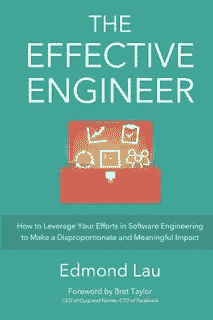](https://click.linksynergy.com/deeplink?id=JVFxdTr9V80&mid=39197&murl=https%3A%2F%2Fwww.udemy.com%2Fcourse%2Fhow-to-become-an-outstanding-solution-architect%2F)**

**以上就是一些**有经验的程序员必读的书**。正如我所说，这些书是为程序员和软件开发人员准备的，适用于所有用 [Java](/javarevisited/top-5-java-online-courses-for-beginners-best-of-lot-1e1e240a758) 、 [C++](/@javinpaul/top-10-courses-to-learn-c-for-beginners-best-and-free-4afc262a544e) 、 [Python](/javarevisited/10-free-python-tutorials-and-courses-from-google-microsoft-and-coursera-for-beginners-96b9ad20b4e6) 、 [Ruby](/@javinpaul/top-5-free-courses-to-learn-ruby-and-rails-for-beginners-best-of-lot-e149fe03c964) 或任何其他语言编程的程序员。

它们不是特定于语言的，而是包含了关于编码、编程、如何构造代码、如何设计软件、如何测试、如何收集需求的所有经典知识，以及一个有经验的程序员应该知道的与软件开发相关的所有重要技能。**

**您可能想探索的其他**书籍和编程文章****

*   **[成为解决方案架构师的 5 本必读书籍](https://javarevisited.blogspot.com/2018/02/5-must-read-books-to-become-software-architect-solution.html#axzz6LCJoCRf9)**
*   **[每个程序员都应该读的 10 本算法书](https://www.java67.com/2015/09/top-10-algorithm-books-every-programmer-read-learn.html)**
*   **[与 Spring Boot 一起学习微服务的 5 大课程](https://javarevisited.blogspot.com/2018/02/top-5-spring-microservices-courses-with-spring-boot-and-spring-cloud.html#axzz6JJFPbsyP)**
*   **[学习数据结构和算法的前 5 本书](https://javarevisited.blogspot.com/2015/07/5-data-structure-and-algorithm-books-best-must-read.html)**
*   **[面向有经验开发人员的 10 本高级 Java 书籍](https://javarevisited.blogspot.com/2020/04/top-10-advanced-core-java-courses-for-experienced-developers.html)**
*   **[面向 Java 开发者的 5 门免费 Spring 框架课程](http://www.java67.com/2017/11/top-5-free-core-spring-mvc-courses-learn-online.html)**
*   **[学习 Java 微服务的 7 大课程](/javarevisited/top-5-courses-to-learn-microservices-in-java-and-spring-framework-e9fed1ba804d)**
*   **[编程/编码工作面试的 10 门课程](http://javarevisited.blogspot.sg/2018/02/10-courses-to-prepare-for-programming-job-interviews.html)**
*   **[深入学习 Java 的十大书籍](https://javarevisited.blogspot.com/2018/07/top-9-java-programming-books-best-must-read.html)**
*   **[面向有经验的 Java、Ruby 和 Python 程序员的前 5 本书](https://www.java67.com/2020/04/top-5-programming-books-for-experienced-developers.html)**
*   **[深入了解春天的五大课程](https://javarevisited.blogspot.com/2018/06/top-6-spring-framework-online-courses-Java-programmers.html)**
*   **[5 门免费学习核心 Java 的在线课程](http://javarevisited.blogspot.sg/2017/11/top-5-free-java-courses-for-beginners.html#axzz4zuIICRs9)**
*   **[面向有经验的 Java 开发人员的 5 大 Java 设计模式课程](http://javarevisited.blogspot.sg/2018/02/top-5-java-design-pattern-courses-for-developers.html)**
*   **[面向 Java 开发人员的 10 门高级 Spring Boot 课程](/javarevisited/10-advanced-spring-boot-courses-for-experienced-java-developers-5e57606816bd)**
*   **[10 个面向 Java 开发人员的免费 Spring Boot 教程和课程](/javarevisited/10-free-spring-boot-tutorials-and-courses-for-java-developers-53dfe084587e)**

**感谢您阅读本文。如果你喜欢这些高级编程和软件书籍和课程，请与你的朋友和同事分享。如果您有任何问题或反馈，请留言。

**P. S.** —如果你是编程世界的新手，那么我建议你从 Python 开始你的旅程，Python 是编程世界最流行的语言之一。如果你需要推荐，我强烈推荐由何塞·波尔蒂利亚在 Udemy 上完成的 Python 3 训练营 课程。**

**<https://click.linksynergy.com/deeplink?id=JVFxdTr9V80&mid=39197&murl=https%3A%2F%2Fwww.udemy.com%2Fcomplete-python-bootcamp%2F> **