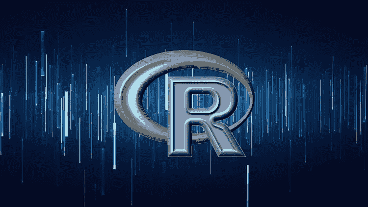
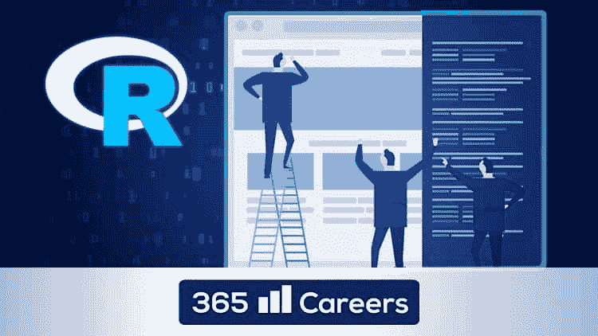
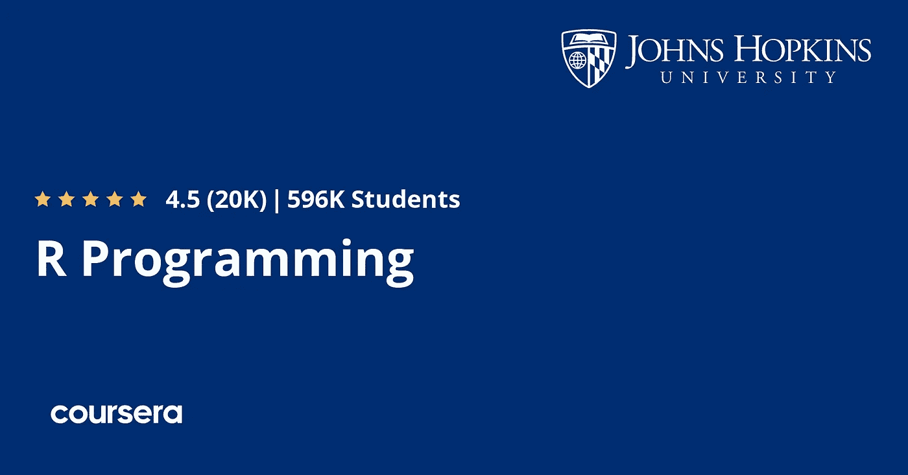
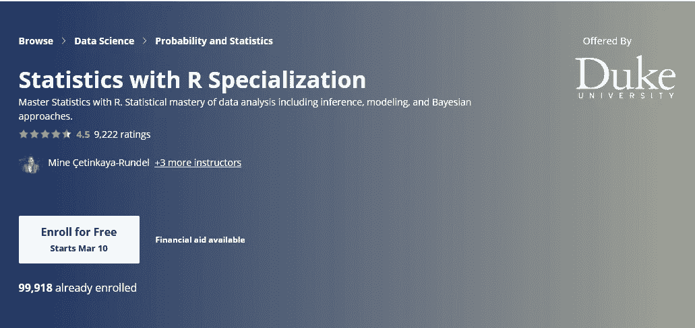
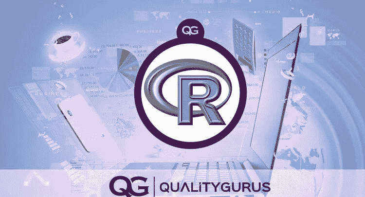
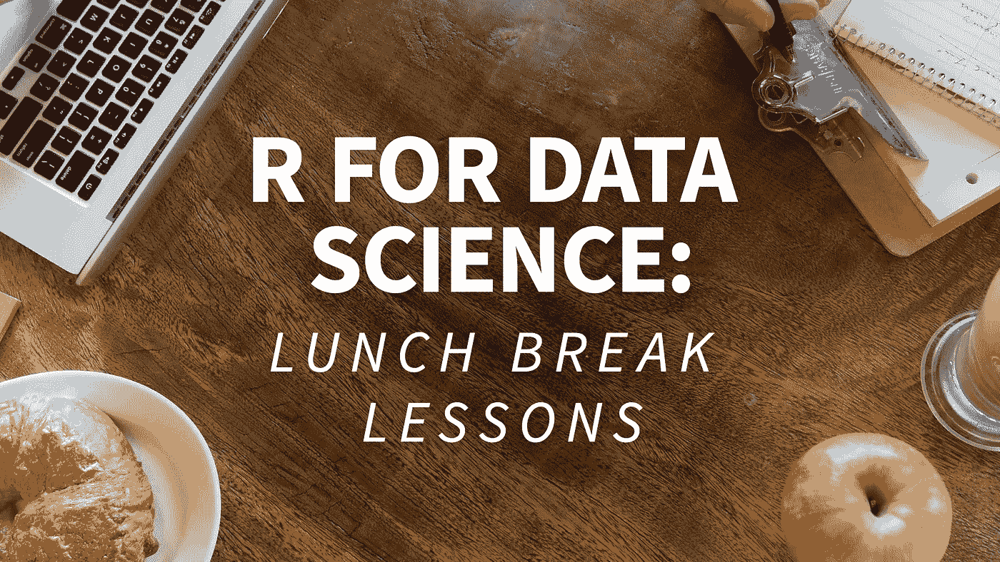

# 2023 年数据科学与统计 10 大最佳 R 编程课程

> 原文：<https://medium.com/javarevisited/10-best-r-programming-courses-for-data-science-and-statistics-8f84ebec4974?source=collection_archive---------0----------------------->

## 我最喜欢从 Udemy、Pluralsight、Coursera 和 LinkedIn Learning 学习数据科学和统计的 R 编程语言的在线课程

image_credit — R 编程:面向数据科学的高级 R 分析

如果你想学习 R 编程并寻找最好的在线培训课程、课程和教程，那么你来对地方了。过去，我曾分享过学习 R 的[免费课程，在本文中，你会发现来自 Udemy、Coursera 和 edX 的**最佳 R 编程课程**。](https://www.java67.com/2018/09/top-5-free-R-programming-courses-for-Data-Science-Machine-Learning-Programmers.html)

*披露——顺便说一句，其中一些链接是附属链接，如果你使用我的链接加入这些课程，我可能会得到报酬。*

这些课程是由专家创建的，强烈推荐给初学者和没有深入知识的 R 编程语言使用者。您可以使用它们来学习 R 编程的基本和高级概念、像 R Studio 这样的工具以及最佳实践。

如果你对[数据科学](https://javarevisited.blogspot.com/2018/03/top-5-data-science-and-machine-learning-online-courses-to-learn-online.html)、[机器学习](https://javarevisited.blogspot.com/2018/08/top-5-tensorflow-and-machine-learning-courses-online-programmers.html)和[统计学](https://javarevisited.blogspot.com/2019/09/top-5-statistics-and-mathematics-course-for-data-science.html)感兴趣，那么你可能会遇到 R 编程语言，这是最适合这些工作的语言之一。r 是一种为处理统计计算和图形而创建的语言和环境。

现在，回到 [R 编程语言](https://www.r-project.org/about.html)本身。它是一个类似于 S 语言的开放 GNU 项目。r 可以被认为是 S 的不同实现。它们之间有一些重要的差异，但为 S 编写的许多代码都在 r 下运行。

这种语言提供了各种各样的统计和图形技术，并且由于其开源社区而具有高度可扩展性，该社区一直在支持和添加功能。S 语言通常是统计方法学研究的首选工具，R 提供了参与该活动的开源途径。R 可以根据自由软件基金会的 GNU 通用公共许可证条款以源代码形式获得。它可以在各种 UNIX 平台和类似系统上编译和运行，包括 Linux、Windows 和 macOS。

它也是一种最终变得非常重要的语言，因为它对处理大数据和 IA 实施非常有用。

# 2023 年初学者和有经验程序员学习 R 编程的 10 个最佳在线课程

以下是学习 R 编程的最佳在线课程列表，这些课程来自于 [Udemy](https://click.linksynergy.com/fs-bin/click?id=JVFxdTr9V80&offerid=323058.9410&type=3&subid=0) 、 [Coursera](https://javarevisited.blogspot.com/2019/10/top-5-coursera-professional-certificates-for-programmers-IT-professionals.html) 、 [Educative](https://www.educative.io/subscription?affiliate_id=5073518643380224) 、 [LinkedIn Learning](http://linkedin-learning.pxf.io/c/1193463/449670/8005?u=https%3A%2F%2Fwww.linkedin.com%2Flearning%2Fsubscription%2Fproducts) 和 [edX](https://www.awin1.com/cread.php?awinmid=6798&awinaffid=631878&clickref=&p=) 以在线学习这一有用的技能。这些课程是由专家创建的，受到了全球成千上万开发人员的信任。

它们也很实惠，尤其是 Udemy 的 R 编程课程，你只需花 10 美元就能在 Udemy 销售网站上买到，这种事情经常发生。

## 1.[R Programming A-Z:R For Data Science With Real practices！](https://click.linksynergy.com/deeplink?id=JVFxdTr9V80&mid=39197&murl=https%3A%2F%2Fwww.udemy.com%2Fcourse%2Fr-programming%2F)

这是 Udemy 上最好的 R 编程课程，由基里尔·叶列缅科和他的 SuperDataScience 团队创建和讲授，他们在 Udemy 上创建了最好的数据科学和机器学习在线课程。要完成这门课程，你只需要具备一些高中数学水平。它面向任何对 R 编程、数据科学和数据分析感兴趣的人，或者任何对编码不太熟悉但对数据科学感兴趣并希望将其轻松应用于数据集的人。

本课程由两位专业的数据科学家设计，他们将以简单的方式教你学习复杂的理论、算法和编码库。

本课程结束时，你将能够:

*   在 R and R 工作室学习编程
*   学习[数据分析](https://javarevisited.blogspot.com/2020/08/top-10-coursera-certifications-to-learn-Data-Science-Visualization-and-Data-Analysis.html)、[数据科学](https://becominghuman.ai/9-data-science-and-machine-learning-courses-by-harvard-ibm-udemy-and-others-12a0c7c23ec1)、[统计分析](/javarevisited/5-best-mathematics-and-statistics-courses-for-data-science-and-machine-learning-programmers-bf4c4f34e288)
*   了解如何在 R 中构建和使用指标
*   练习在 R 中使用统计数据
*   理解正态分布

当你购买它时，你可以立即获得 10.5 小时的视频，6 篇文章和 38 个可下载的资源。

**这里是加入这个最佳 R 课程** — [R 编程 A-Z](https://click.linksynergy.com/deeplink?id=JVFxdTr9V80&mid=39197&murl=https%3A%2F%2Fwww.udemy.com%2Fcourse%2Fr-programming%2F) 的链接

## 2. [R 统计与数据科学编程 2023](https://click.linksynergy.com/deeplink?id=JVFxdTr9V80&mid=39197&murl=https%3A%2F%2Fwww.udemy.com%2Fcourse%2Fr-programming-for-statistics-and-data-science%2F)

这个 Udemy 课程旨在学习 R 语言编程的基础，它为初学者提供了大量的资源和支持。如果你喜欢《星球大战》或《神奇宝贝》,这个教程会很有趣，因为有些例子是基于它们的。

以下是您将在本课程中学到的关键技能:

*   如何使用 R 的条件语句、函数和循环
*   将您的数据导入和导出 R
*   理解并执行 R 中的回归分析
*   学习统计学的基本原理，并在实践中应用它们
*   系统地研究 R 中的数据
*   用 R 构建你的函数

本课程有很多支持文档，总共有 38 篇文章和 34 个资源。在不到 7 小时的视频中全部解释。

**这里是加入本课程的链接**—[2023 年统计与数据科学编程](https://click.linksynergy.com/deeplink?id=JVFxdTr9V80&mid=39197&murl=https%3A%2F%2Fwww.udemy.com%2Fcourse%2Fr-programming-for-statistics-and-data-science%2F)

## 3.约翰霍普金斯大学的 R 编程

这是 Coursera 上又一个从零开始学习 R 编程的牛逼在线课程。这是一门非常受欢迎的课程，有超过 600，000 名学生。

在这个 Coursera 课程中，你将学习如何用 R 编程，以及如何使用 R 进行有效的数据分析。它将教你如何安装和配置统计编程环境所必需的软件，并描述用高级统计语言实现的通用编程语言概念。

本课程还涵盖了统计计算中的实际问题，包括用 R 编程、将数据读入 R、访问 R 包、编写 R 函数、调试、分析 R 代码以及组织和注释 R 代码。统计数据分析的主题将提供工作实例。

这里是加入本课程的链接 — [约翰·霍普金斯大学的 R 编程](https://coursera.pxf.io/c/3294490/1164545/14726?u=https%3A%2F%2Fwww.coursera.org%2Flearn%2Fr-programming)

此外，这门课程可以适用于多个专业或专业证书课程。完成本课程将计入您在以下任何计划中的学习:

*   [数据科学专业](https://coursera.pxf.io/c/3294490/1164545/14726?u=https%3A%2F%2Fwww.coursera.org%2Fspecializations%2Fjhu-data-science)
*   [数据科学:使用 R 专业化的基础](https://coursera.pxf.io/c/3294490/1164545/14726?u=https%3A%2F%2Fwww.coursera.org%2Fspecializations%2Fdata-science-foundations-r)

总的来说，2023 年是从零开始学习 R 编程的大好时机。我向任何想学习数据科学或统计学的 R 的人强烈推荐这门课程。

## 4.[从零开始学习 R](https://www.educative.io/courses/learn-r-from-scratch?affiliate_id=5073518643380224)【教育性】

本课程与之前的 R 编程课程略有不同，因为它是 Educative 的一门基于文本的交互式课程。阅读通常比观看快，这就是为什么我喜欢基于文本的课程。

本交互式 R 编程课程将帮助您快速入门，并假设您没有 R 知识。您将从最基础的开始，逐步学习高级概念，如异常处理。

[教育平台](https://www.educative.io/subscription?affiliate_id=5073518643380224)的好处在于它允许你直接在浏览器中运行代码，这意味着你不需要进行任何初始设置。这是一个很大的推动，因为大多数流行的卡在安装软件，让他们设置直立。

当你完成的时候，你将能够自己用 R 编写详细的、有用的代码。

**这里是加入本课程的链接**——[从头学起](https://www.educative.io/courses/learn-r-from-scratch?affiliate_id=5073518643380224)

而且，如果你找到一个教育平台和他们的搜索课程，如 [**搜索机器学习面试**](https://www.educative.io/courses/grokking-the-machine-learning-interview?affiliate_id=5073518643380224) ，那么考虑获得 [***教育订阅***](https://www.educative.io/subscription?affiliate_id=5073518643380224) ，每月只需 18 美元就可以访问他们的 100 多门课程。非常划算，非常适合准备编码面试。

<https://www.educative.io/courses/grokking-the-machine-learning-interview?affiliate_id=5073518643380224>  

## 5.[数据科学:来自哈佛大学的 R 基础知识](https://www.awin1.com/cread.php?awinmid=6798&awinaffid=631878&clickref=&p=%5B%5Bhttps%3A%2F%2Fwww.edx.org%2Fcourse%2Fdata-science-r-basics)

Rafael Irizarry 教授的这门课程旨在为 R 打下基础，并学习如何争论、分析和可视化数据。它将向你介绍 R 编程的基础。基于一些真实世界的美国犯罪数据集。

你会学到:

*   基本的 R 语法
*   r 编程概念，如数据类型、向量运算和索引
*   在 R 中执行操作，包括排序、使用 dplyr 处理数据以及绘图

你将学习回答不同州之间犯罪差异的基本问题所需的技能。这门课程是免费注册的，最后，如果你想要的话，你可以买哈佛颁发的证书。

**这是加入本课程的链接** — [哈佛大学](https://www.awin1.com/cread.php?awinmid=6798&awinaffid=631878&clickref=&p=%5B%5Bhttps%3A%2F%2Fwww.edx.org%2Fcourse%2Fdata-science-r-basics)的数据科学基础知识

## 6.[用 R 按 Mine etin Kaya-Rundel 统计](https://coursera.pxf.io/c/3294490/1164545/14726?u=https%3A%2F%2Fwww.coursera.org%2Fspecializations%2Fstatistics)【Coursera】

在这个完整的课程中，您将从专业中产生一个数据分析项目组合，展示对统计数据分析的掌握。

会神树你会学:

*   如何在 R 中分析和可视化数据，创建可重复的数据分析报告。
*   展示对统计推断的统一性的概念性理解
*   理解自然现象并做出基于数据的决策执行 frequentist 和贝叶斯统计推断和建模，以正确传达统计结果。
*   评论基于数据的声明和评估基于数据的决策，并使用 R 包讨论和可视化数据以进行数据分析。

这个课程是为了在 7 个月内每周花 3 个小时来学习它，但是你可以根据自己的需要进行调整。该课程由杜克大学提供。

**这里是加入本课程**——[统计与 R](https://coursera.pxf.io/c/3294490/1164545/14726?u=https%3A%2F%2Fwww.coursera.org%2Fspecializations%2Fstatistics) 的链接

而且，如果你发现 Coursera 认证有用，那么你也应该加入 [**Coursera Plus**](https://coursera.pxf.io/c/3294490/1164545/14726?u=https%3A%2F%2Fwww.coursera.org%2Fcourseraplus) ，这是 Coursera 的一个订阅计划，它为你提供**无限制访问**他们最受欢迎的课程、专业、专业证书和指导项目。它每年花费大约 399 美元，但是它完全值得你的钱，因为你得到了无限的证书

<https://coursera.pxf.io/c/3294490/1164545/14726?u=https%3A%2F%2Fwww.coursera.org%2Fcourseraplus>  

## 7.[Sandeep Kumar 使用 R 进行数据分析的统计](https://click.linksynergy.com/deeplink?id=JVFxdTr9V80&mid=39197&murl=https%3A%2F%2Fwww.udemy.com%2Fcourse%2Fstatistics-using-r%2F)【Udemy】

这门课程是为有一些编程经验和高等数学知识(如统计学)的初学者设计的。它首先教授数学和统计学所需的方面，然后将其应用到 R 语言中。这个教程是理论和实践的结合。

在本课程中，您将看到以下几点:

*   学习基本的统计概念
*   使用 R Studio 应用这些概念。
*   掌握一些统计概念和技术。
*   概率分布—正态分布、二项式分布和泊松分布
*   您将从初级水平开始学习 [R 编程](https://hackernoon.com/5-free-r-programming-courses-for-data-scientists-and-ml-programmers-5732cb9e10)。

该课程包括终身访问 12.5 小时的视频，13 篇文章和 36 个可供下载的资源。

**这里是加入本次 R 课程** — [统计使用 R](https://click.linksynergy.com/deeplink?id=JVFxdTr9V80&mid=39197&murl=https%3A%2F%2Fwww.udemy.com%2Fcourse%2Fstatistics-using-r%2F) 进行数据分析的链接

## 8.[数据科学的 R:午休课](http://linkedin-learning.pxf.io/c/1193463/449670/8005?u=https%3A%2F%2Fwww.linkedin.com%2Flearning%2Fr-for-data-science-lunchbreak-lessons)【LinkedIn Learning】

编程是一点一滴学来的。首先，你建立在基本概念上。你把已经掌握的知识转移到下一门语言中。这就是 LinkedIn 学习的这些午休课程真正派上用场的地方。

午餐休息课教授 R——最流行的数据分析和报告编程语言之一——在简短的课程中扩展现有程序员已经知道的东西。

在本系列中，您将回顾语言基础，发现改进现有 R 代码的方法，探索新的有趣特性，并了解有用的开发工具和库，这些工具和库将使您用 R 编程的时间更有效率。

这是加入这个系列的链接—[R for Data Science:lunch break Lessons](http://linkedin-learning.pxf.io/c/1193463/449670/8005?u=https%3A%2F%2Fwww.linkedin.com%2Flearning%2Fr-for-data-science-lunchbreak-lessons)

顺便说一下，你需要一个 [LinkedIn Learning 会员](http://linkedin-learning.pxf.io/c/1193463/449670/8005?u=https%3A%2F%2Fwww.linkedin.com%2Flearning%2Fsubscription%2Fproducts)来观看这个课程，这个课程每月花费大约 29.99 美元，但是你也可以通过参加他们的 [**1 个月免费试用**](http://linkedin-learning.pxf.io/c/1193463/449670/8005?u=https%3A%2F%2Fwww.linkedin.com%2Flearning%2Fsubscription%2Fproducts) 来免费观看这个课程，这是一个探索他们 16000 多门最新技术在线课程的好方法。

## 9. [R 编程:面向数据科学的高级 R 分析](https://click.linksynergy.com/deeplink?id=JVFxdTr9V80&mid=39197&murl=https%3A%2F%2Fwww.udemy.com%2Fcourse%2Fr-analytics%2F)【Udemy】

这是一门针对有经验的程序员和数据科学家的关于 R 编程的中级和高级课程。你可以参加这个课程，让你的 R & R 工作室技能更上一层楼。

这门课程的创始人不是别人，正是 Udemy 最好的讲师和数据科学专家之一基里尔·叶列缅科(Kirill Schmidt)，它非常适合任何想要掌握 r

以下是你将在本课程中学到的关键技能—

*   如何为 R 中的分析准备数据
*   如何在 R 中执行中位数插补方法
*   如何在 R 中处理日期时间
*   什么是列表以及如何使用它们
*   什么是应用功能系列
*   如何用`apply()`、`lapply()`、`sapply()`代替循环
*   如何在应用类型函数中嵌套您自己的函数
*   如何将`apply()`、`lapply()`和`sapply()`函数嵌套在一起

总的来说，这是一个非常专业的 R 培训课程，独特的数据集是根据多年的行业经验设计的，引人入胜的练习既有趣又能让你领略现实世界的分析。

**这是参加本课程** — [R 编程:数据科学 R 中的高级分析](https://click.linksynergy.com/deeplink?id=JVFxdTr9V80&mid=39197&murl=https%3A%2F%2Fwww.udemy.com%2Fcourse%2Fr-analytics%2F)的链接

## 10. [R 编程—绝对初学者的 R 语言](https://click.linksynergy.com/deeplink?id=JVFxdTr9V80&mid=39197&murl=https%3A%2F%2Fwww.udemy.com%2Fcourse%2Fr-for-absolute-beginners%2F)

这个 Udemy 课程对我来说很特别，因为它是专为绝对初学者而设的。这个 R 编程课程适合所有人，不需要有编码经验或者统计学背景。

以下是您将在本课程中学到的内容:

*   安装 R and R 工作室
*   操作 R 向量、数组和矩阵
*   操纵 R 数据帧
*   使用 R 绘制数据
*   使用 R 分析真实数据集
*   用 R 组织你的代码
*   用 R 开发你自己的函数
*   用 R 汇总数据
*   用 R 加载 Excel 文件
*   计算数据集的基本统计数据
*   安装外部库来启动 R
*   对数据和子集数据进行聚合和排序

这是一门实践性很强的课程，侧重于用 R 编写代码的实践方面——它不是教你所有的函数和方法，而是向你展示如何阅读问题和示例，并自己找到答案。我向初学者强烈推荐这门课程。

这里是加入这门课程的链接— [绝对初学者的 R 语言](https://click.linksynergy.com/deeplink?id=JVFxdTr9V80&mid=39197&murl=https%3A%2F%2Fwww.udemy.com%2Fcourse%2Fr-for-absolute-beginners%2F)

以上就是 2023 年**要加入的最佳 R 编程课程**。您可以加入这些在线课程，学习用于数据科学、统计学和数据分析的 R 编程语言。

数据科学每天都变得越来越重要，它将是几乎任何项目中最重要的事情之一，因为它会给你带来比竞争对手更多的优势。

这就是为什么了解它是非常有用的。有了这些最好的在线 R 编程课程，你就可以进入这个世界，成为更好的专业人士。

其他**数据科学和机器学习资源**你可能喜欢:

*   [初学者学习数据科学的 10 门课程](https://hackernoon.com/10-machine-learning-data-science-and-deep-learning-courses-for-programmers-7edc56078cde)
*   [2023 年学习 Python 的 5 大课程](https://hackernoon.com/top-5-courses-to-learn-python-in-2018-best-of-lot-26644a99e7ec)
*   [五大基本机器学习算法](https://www.java67.com/2020/07/top-5-machine-learning-algorithms-for-beginners.html)
*   [你可以在线获得 5 个数据科学学位](https://www.java67.com/2020/06/top-5-data-science-degree-you-can-earn-online-coursera-edx.html)
*   [面向数据科学家的 10 大 TensorFlow 课程](https://dev.to/javinpaul/10-of-the-best-tensorflow-courses-to-learn-machine-learning-from-coursera-and-udemy-37bf)
*   [学习 QlikView 和 QlikSense 的五大课程](https://javarevisited.blogspot.com/2020/07/top-5-courses-to-learn-qlikview-and-qlik-sense.html)
*   [2023 年学习电力 BI 的前 5 门课程](https://www.java67.com/2020/06/top-5-courses-to-learn-microsoft-power-BI.html)
*   [学习机器学习的 5 大免费课程](https://www.java67.com/2019/01/5-free-courses-to-learn-machine-and-deep-learning-in-2019.html)
*   [面向程序员的 10 门机器学习和深度学习课程](https://hackernoon.com/top-5-courses-to-learn-python-in-2018-best-of-lot-26644a99e7ec)
*   [5 门免费 Excel 数据分析课程](https://www.java67.com/2020/07/5-free-microsoft-excel-xls-or-xlsx-courses-for-beginners.html)
*   [2023 年学习 Python 的 10 个理由](https://hackernoon.com/10-reasons-to-learn-python-in-2018-f473dc35e2ee)
*   [初学者学习 Python 的 10 门免费课程](https://hackernoon.com/10-free-python-programming-courses-for-beginners-to-learn-online-38312f3b9912)
*   [学习数据科学 Python 的 5 本书](https://javarevisited.blogspot.com/2019/08/top-5-python-books-for-data-science-and-machine-learning.html)
*   [学习数据科学 Tableau 的前 5 门课程](https://javarevisited.blogspot.com/2019/07/top-5-tableau-online-courses-and-certifications-for-data-science-engineers.html)
*   [面向数据科学和机器学习的 8 大 Python 库](https://javarevisited.blogspot.com/2018/10/top-8-python-libraries-for-data-science-machine-learning.html)
*   [学习高级数据科学的前 5 门课程](https://hackernoon.com/top-5-data-science-and-machine-learning-course-for-programmers-e724cfb9940a)
*   [初学者学习张量流的前 5 门课程](https://hackernoon.com/top-5-tensorflow-and-ml-courses-for-programmers-8b30111cad2c)

感谢您阅读本文。如果你喜欢这些*最佳 R 编程在线培训课程*，那么请与你的朋友和同事分享。如果您有任何问题或反馈，请留言。

**p . s .——**如果你热衷于学习 R 编程，但正在寻找一个免费的在线培训课程，那么你也可以看看这个[**R 课程免费介绍**](https://click.linksynergy.com/deeplink?id=JVFxdTr9V80&mid=39197&murl=https%3A%2F%2Fwww.udemy.com%2Fcourse%2Fintroduction-to-r%2F) 。这个 10 小时的课程将使用 140+练习题以互动的方式教你 R 编程。这个课程最大的好处是它是完全免费的，你只需要一个 Udemy 帐户就可以加入这个课程

<https://click.linksynergy.com/deeplink?id=JVFxdTr9V80&mid=39197&murl=https%3A%2F%2Fwww.udemy.com%2Fcourse%2Fintroduction-to-r%2F> 