# 2023 年 Java 开发的 11 个最佳测试工具和库

> 原文：<https://medium.com/javarevisited/10-test-automation-libraries-for-java-developers-e40cb61dcd49?source=collection_archive---------0----------------------->

## 除了 JUnit 和 Mockito，还有很多工具可以用来测试 Java 应用程序。在本文中，我们讨论了 11 个非常棒的 Java 测试工具、框架和库。

[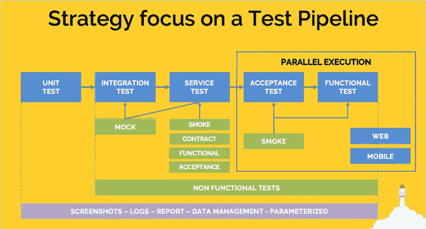](https://click.linksynergy.com/fs-bin/click?id=JVFxdTr9V80&subid=0&offerid=323058.1&type=10&tmpid=14538&RD_PARM1=https%3A%2F%2Fwww.udemy.com%2Fmodern-devops%2F)

最近，我写了一些关于 Java 开发人员今年应该学习什么的文章，像[编程语言](http://www.java67.com/2017/12/10-programming-languages-to-learn-in.html)、[库](http://javarevisited.blogspot.sg/2018/01/top-20-libraries-and-apis-for-java-programmers.html)和[框架](http://javarevisited.blogspot.sg/2018/01/10-frameworks-java-and-web-developers-should-learn.html)，但是如果你只有一件事需要改进或学习，那么那一定是你的*自动化测试技能*。

测试是区分专业开发人员和业余开发人员的学科之一。这不是关于遵循 TDD、BDD 或任何测试方法，但在最起码的水平上，您必须编写代码来自动测试您的代码。

许多 Java 开发人员编写在构建期间自动运行的[单元测试](http://javarevisited.blogspot.sg/2015/02/simple-junit-example-unit-tests-for-linked-list-java.html#axzz569M501zG)和集成测试，主要是通过使用持续集成工具，如 [Jenkins](http://www.java67.com/2018/02/6-free-maven-and-jenkins-online-courses-for-java-developers.html) 或 TeamCity。

如果你们中的一些人想知道为什么程序员应该专注于自动化测试，那么让我告诉你，自动化测试的重要性正在指数增长，这是由于更多的意识和 [DevOps](/javarevisited/13-best-courses-to-learn-devops-for-senior-developers-in-2020-a2997ff7c33c) 的出现。

公司通常更喜欢擅长编写单元测试，并对各种单元测试框架、库和工具有很好了解的程序员，如 [JUnit](http://www.java67.com/2018/02/5-free-eclipse-and-junit-online-courses-java-developers.html) 、 [Selenium](http://javarevisited.blogspot.sg/2018/02/top-5-selenium-webdriver-with-java-courses-for-testers.html) 、[放心](https://javarevisited.blogspot.com/2021/12/top-5-courses-to-learn-rest-assured-for.html)、 [Spock 框架](http://javarevisited.blogspot.sg/2018/01/10-frameworks-java-and-web-developers-should-learn.html)等。

作为一名 Java 开发人员，我们在非常不同的领域工作，从编写核心 Java 代码到创建 JSP 页面，编写[REST API](http://javarevisited.blogspot.sg/2018/01/7-reasons-for-using-spring-to-develop-RESTful-web-service.html#axzz55a8rTeu7)，有时甚至为构建自动化创建 Groovy 脚本。这就是为什么我们还需要知道我们可以用来自动化测试的不同工具。

例如，我只知道 JUnit 很长一段时间，但是当我必须测试我的 JSP 页面时，我一无所知，直到我发现了 Selenium。放心也是一样，因为我通常使用 [curl 命令](http://www.java67.com/2017/10/how-to-test-restful-web-services-using.html)测试我的 REST API，但是放心将 REST API 的单元测试提升到了另一个层次。

# Java 程序员的 10 个最佳单元测试和集成测试工具和库

因为我相信程序员和他们的工具一样优秀，所以我总是在空闲时间尝试学习和探索新的工具和库，这个列表是研究的一部分。

在这篇文章中，我将分享 10 个最好和最基本的[工具](http://javarevisited.blogspot.sg/2017/03/10-tools-used-by-java-programming-Developers.html#axzz55lrMRnNC)、[框架](http://www.java67.com/2018/02/top-10-open-source-frameworks-and-libraries-java-web-developers.html)和库，它们可以帮助 Java 开发人员在他们的各种 Java 项目上编写单元测试和集成测试。

## 1.朱尼特

我不认为 JUnit 需要任何介绍。即使你是一个初学 Java 的程序员，你也可能听说过它。它允许你为你的 Java 代码编写单元测试。

几乎所有主要的 ide，例如 [Eclipse](http://www.java67.com/2018/01/how-to-remote-debug-java-application-in-Eclipse.html) 、 [NetBeans](http://javarevisited.blogspot.sg/2013/03/how-to-write-unit-test-in-java-eclipse-netbeans-example-run.html#axzz569M5kyoZ) 和 [IntelliJIDEA](https://javarevisited.blogspot.com/2018/09/top-5-courses-to-learn-intellij-idea-java-and-android-development.html) ，都提供了 JUnit 集成，这意味着您可以直接从这些 ide 中编写和运行单元测试。

我们大多数人仍在使用 JUnit 4，但 JUnit 5 已经发布，可能是今年的下一个目标。您可以使用 JUnit 进行单元测试和集成测试，它还支持 Java 8 特性。

顺便说一句，如果你是单元测试领域的新手，尤其是 Java 单元测试，那么这个 [**JUnit 和 Mockito 速成班**](https://click.linksynergy.com/fs-bin/click?id=JVFxdTr9V80&subid=0&offerid=323058.1&type=10&tmpid=14538&RD_PARM1=https%3A%2F%2Fwww.udemy.com%2Fjunitandmockitocrashcourse%2F) 是一个很好的起点。

[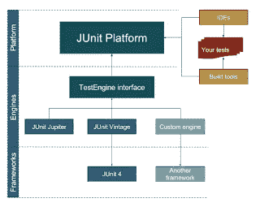](https://click.linksynergy.com/fs-bin/click?id=JVFxdTr9V80&subid=0&offerid=323058.1&type=10&tmpid=14538&RD_PARM1=https%3A%2F%2Fwww.udemy.com%2Fjunitandmockitocrashcourse%2F)

## 2.放心

用 Java 测试和验证 REST 服务比用动态语言更难，比如用 [Groovy](https://javarevisited.blogspot.com/2017/08/top-5-books-to-learn-groovy-for-java.html) 。

放心将使用这些语言的简单性带入 Java 领域。对于 REST API 集成测试来说，这是一个很好的工具。

如果想了解更多，还可以查看[**REST API 测试自动化:via 放心& HTTP 客户端**](https://click.linksynergy.com/fs-bin/click?id=JVFxdTr9V80&subid=0&offerid=562016.1&type=10&tmpid=14538&RD_PARM1=https%3A%2F%2Fwww.udemy.com%2Fapi-testing-rest-api-automation-testing-from-scratch%2F) 课程。

[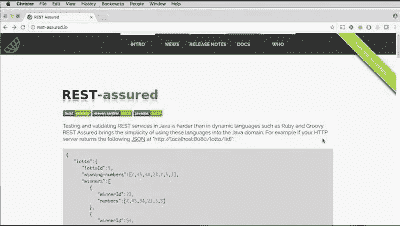](https://click.linksynergy.com/fs-bin/click?id=JVFxdTr9V80&subid=0&offerid=562016.1&type=10&tmpid=14538&RD_PARM1=https%3A%2F%2Fwww.udemy.com%2Fapi-testing-rest-api-automation-testing-from-scratch%2F)

## 3.莫奇托

有许多针对 Java 类的模仿框架，比如 PowerMock 和 JMock，但我个人更喜欢 [Mockito](http://site.mockito.org/) 的简单 API、出色的文档和大量示例。

模仿是现代单元测试的基本技术之一，因为它允许你在没有任何依赖的情况下孤立地测试你的代码，这就是为什么我鼓励每个 Java 开发人员学习模仿框架和 JUnit。

我最喜欢的嘲讽框架是 Mockito，但是如果你愿意，你也可以探索 PowerMock 或者 JMock。

如果你也喜欢 Mockito 并决定学习这个框架，那么 [**Mockito 教程:用 25 个 Junit 例子**](https://click.linksynergy.com/fs-bin/click?id=JVFxdTr9V80&subid=0&offerid=562016.1&type=10&tmpid=14538&RD_PARM1=https%3A%2F%2Fwww.udemy.com%2Fmockito-tutorial-with-junit-examples%2F) 学习 mock 是一个不错的开始。

[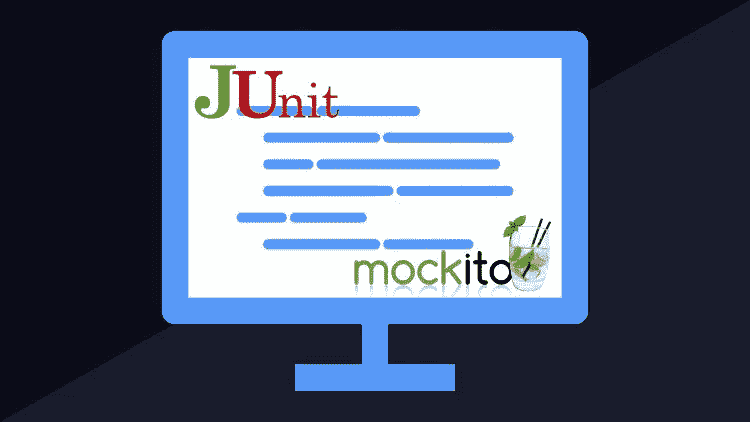](https://click.linksynergy.com/fs-bin/click?id=JVFxdTr9V80&subid=0&offerid=562016.1&type=10&tmpid=14538&RD_PARM1=https%3A%2F%2Fwww.udemy.com%2Fmockito-tutorial-with-junit-examples%2F)

## 4.硒

Selenium 可能是最流行的 Java UI 测试工具，它允许您测试您的 [JSP 页面](http://www.java67.com/2018/02/5-free-servlet-jsp-and-jdbc-online-courses-for-java-developers.html)，而无需在浏览器中启动它们。

您可以使用 JUnit 和 Selenium 测试您的 web 应用程序 UI。它甚至允许您编写 web 应用程序验收测试。

如果你想学习 Selenium，[**Selenium web driver with Java——基础到高级**](https://click.linksynergy.com/fs-bin/click?id=JVFxdTr9V80&subid=0&offerid=323058.1&type=10&tmpid=14538&RD_PARM1=https%3A%2F%2Fwww.udemy.com%2Fselenium-real-time-examplesinterview-questions%2F) 课程是最好的起点。

[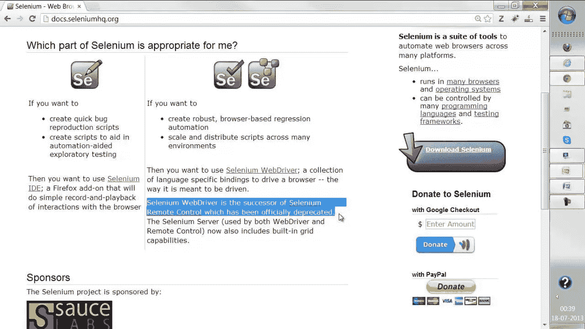](https://click.linksynergy.com/fs-bin/click?id=JVFxdTr9V80&subid=0&offerid=323058.1&type=10&tmpid=14538&RD_PARM1=https%3A%2F%2Fwww.udemy.com%2Fselenium-real-time-examplesinterview-questions%2F)

## 5.测试

TestNG 是一个受 JUnit 和 NUnit 启发的测试框架，但引入了许多新功能，使它更强大、更易于使用，例如[注释](http://javarevisited.blogspot.sg/2012/06/junit4-annotations-test-examples-and.html#axzz56lq0jrxn)，在任意大的线程池中运行测试，有各种可用的策略(所有方法都在自己的线程中，每个测试类一个线程，等等)。

JUnit 和 TestNG 之间的差距已经缩小，因为使用了 JUnit 4 中的注释，并且集成了 Hamcrest 匹配器，但这取决于您。

如果你决定学习 TestNG 来对你的 Java 代码进行单元测试，那么[**TestNG Complete boot camp For 初学者——新手到忍者**](https://click.linksynergy.com/fs-bin/click?id=JVFxdTr9V80&subid=0&offerid=562016.1&type=10&tmpid=14538&RD_PARM1=https%3A%2F%2Fwww.udemy.com%2Ftestng-complete-bootcamp%2F) 是一个很好的开始课程。

[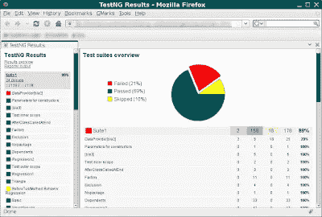](https://click.linksynergy.com/fs-bin/click?id=JVFxdTr9V80&subid=0&offerid=562016.1&type=10&tmpid=14538&RD_PARM1=https%3A%2F%2Fwww.udemy.com%2Ftestng-complete-bootcamp%2F)

## 6.Spock 框架

Spock 是另一个用于 Java 和 Groovy 应用程序的测试和规范框架。它是用 Groovy 编写的，这使它成为一种非常有表现力和切中要点的规范语言。

当您使用 Spock 时，您的测试将变得更具可读性，更易于维护，并且由于它的 JUnit runner，Spock 与大多数 ide、构建工具和持续集成服务器兼容。

不幸的是，我没有找到学习 Spock 框架的有用课程，但是用 Spock 书进行 Java 测试是一个很好的开始资源。

[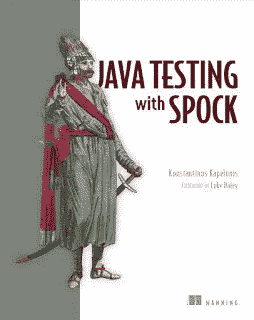](http://aax-us-east.amazon-adsystem.com/x/c/QpymHoLtS5MN0E_yw1nDkSUAAAFhcxOiMwEAAAFKAQPuf98/https://assoc-redirect.amazon.com/g/r/https://www.amazon.com/Java-Testing-Spock-Konstantinos-Kapelonis/dp/1617292532/ref=as_at?creativeASIN=1617292532&linkCode=w61&imprToken=MfCu8SgYHitGBTnYpPUhiw&slotNum=0&tag=javamysqlanta-20)

## 7.黄瓜

Cucumber 是自动化集成测试的另一个很好的工具，但是使它不同于其他同类工具的是它的规范能力。

Cucumber 将规格说明和测试文档合并成一个完整的活文档，因为它们会被 Cucumber 自动测试，所以您的规格说明总是最新的。

如果您想构建一个开始完成 web 自动化测试框架并在 web 应用程序上模拟用户行为，那么[**Selenium web driver with Java&Cucumber BDD**](https://click.linksynergy.com/fs-bin/click?id=JVFxdTr9V80&subid=0&offerid=562016.1&type=10&tmpid=14538&RD_PARM1=https%3A%2F%2Fwww.udemy.com%2Fautomate-tests-using-selenium-webdriver-with-java-cucumber%2F)是在您的项目中学习和实现 Cucumber 的好课程。

[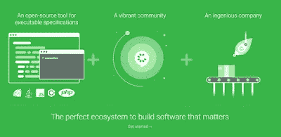](https://click.linksynergy.com/fs-bin/click?id=JVFxdTr9V80&subid=0&offerid=562016.1&type=10&tmpid=14538&RD_PARM1=https%3A%2F%2Fwww.udemy.com%2Fautomate-tests-using-selenium-webdriver-with-java-cucumber%2F)

## 8.弹簧试验

Spring MVC 附带了一个非常有用的测试框架，允许进行深入的测试，甚至不涉及 [web 容器](http://www.java67.com/2016/06/3-difference-between-web-server-vs-application-server-vs-servlet-container.html)。

它是为 Spring 应用程序编写自动化测试的最有用的库之一。它为 Spring 驱动的应用程序编写单元和集成测试提供了一流的支持，包括 [MVC 控制器](http://www.java67.com/2012/08/spring-interview-questions-answers.html)。

还有集成了 Spring 测试框架和 DbUnit 的 Spring 测试 DbUnit 和集成了 Spring 测试 MVC 框架和 HtmlUnit 的 Spring 测试 MVC HtmlUnit。

通过使用这些工具，你可以很容易地以自动化的方式测试你的 Spring MVC 应用程序。

如果你想了解更多关于如何测试 Spring 应用程序的知识，我建议你看一下 Udemy 上易小轩·汤普森的 [**测试 Spring Boot:初学者到大师**](https://click.linksynergy.com/deeplink?id=JVFxdTr9V80&mid=39197&murl=https%3A%2F%2Fwww.udemy.com%2Ftesting-spring-boot-beginner-to-guru%2F) 课程。

## 9.DBUnit

数据库是许多 Java 应用程序不可或缺的一部分，包括核心 Java 和 web 应用程序，并且可能是进行单元测试时最大的障碍。

连接到开发或 UAT 数据库进行集成测试是不可靠的，因为任何人都可以更改数据和模式，例如表和[存储过程](http://javarevisited.blogspot.sg/2013/04/spring-framework-tutorial-call-stored-procedures-from-java.html)，这将导致您的自动化集成测试失败。

DbUnit 是一个 JUnit 扩展，可用于在每次集成测试之前将数据库初始化为已知状态，以确保数据库包含正确的数据。

> *DbUnit 有它自己的问题，但它是一个非常有用的工具，因为它帮助我们将测试数据创建与测试代码分离开来。*

[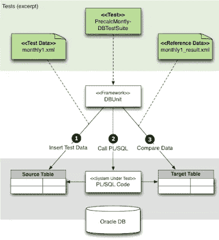](https://javarevisited.blogspot.com/2018/01/10-unit-testing-and-integration-tools-for-java-programmers.html)

## 10.机器人框架

机器人框架是一个基于 [Python](http://javarevisited.blogspot.sg/2013/11/java-vs-python-which-programming-laungage-to-learn-first.html#axzz55UE6mabh) 的通用测试自动化框架，用于验收测试和验收测试驱动的开发。

它是一个关键字驱动的测试框架，使用表格测试数据语法。您可以使用它来测试分布式的、异构的应用程序，在这些应用程序中，验证需要接触多种技术和接口。

如果你决定为集成测试学习这个奇妙的框架，那么 Udemy 的 [**机器人框架测试自动化**](https://click.linksynergy.com/fs-bin/click?id=JVFxdTr9V80&subid=0&offerid=562016.1&type=10&tmpid=14538&RD_PARM1=https%3A%2F%2Fwww.udemy.com%2Frobot-framework-level-1%2F) 是一个很好的资源。

这是一门由两部分组成的课程，涵盖了机器人框架的基本功能和高级功能。

[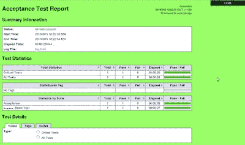](https://click.linksynergy.com/fs-bin/click?id=JVFxdTr9V80&subid=0&offerid=562016.1&type=10&tmpid=14538&RD_PARM1=https%3A%2F%2Fwww.udemy.com%2Frobot-framework-level-1%2F)

## 11.测试容器

Testcontainers 是一个支持 JUnit 测试的 Java 库，提供了通用数据库、Selenium web 浏览器等轻量级的一次性实例。您还可以使用 Testcontainers 为使用 JUnit 4 或 JUnit 5 的 *Spring Boot* 应用程序编写高效的集成测试。

与 Lombok 类似， *Testcontainers* 是一个改变游戏规则的库，用于编写 Java 应用程序的集成和端到端测试。使用 Testcontainers，您可以出于测试目的管理一次性容器的生命周期。

你可以进一步查看 Udemy 上的 [**用 JUnit 和 Mockito 测试 Spring Boot 应用**](https://click.linksynergy.com/deeplink?id=CuIbQrBnhiw&mid=39197&murl=https%3A%2F%2Fwww.udemy.com%2Fcourse%2Ftesting-spring-boot-application-with-junit-and-mockito%2F) 课程，了解更多关于如何使用 Testcontainers 测试 Spring Boot 应用。

[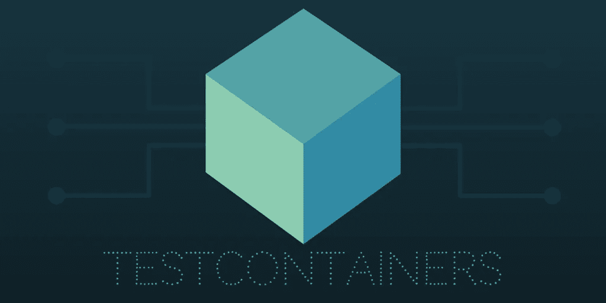](https://click.linksynergy.com/deeplink?id=CuIbQrBnhiw&mid=39197&murl=https%3A%2F%2Fwww.udemy.com%2Fcourse%2Ftesting-spring-boot-application-with-junit-and-mockito%2F)

如果你需要更多的选择，那么 Philp 的 [**Spring Boot 测试大师班**](https://transactions.sendowl.com/stores/13745/197427) 是另一个值得一看的课程，可以让你的 Java 和 Spring Boot 测试技能更上一层楼。还可以使用优惠券 TSBAX_M2LAP 限时九折。

<https://transactions.sendowl.com/stores/13745/197427>  

我真的很喜欢他的课程，还没有复习，但是你可以期待菲利普的 Spring Boot 测试大师课的复习

这就是 Java 开发人员的**最佳单元测试和集成测试工具、框架和库**的全部内容。还有很多库我没有包括在这个列表中，比如 Testcontainers、AssertJ 和 Hamcrest，它们可以帮助你编写漂亮流畅的测试——但是要慢慢来。

首先，学习一个可以在日常工作中使用的工具或库。例如，如果您正在使用 Java UIs，那么您应该首先学习 Selenium，因为这样您就可以更专注于这个工具。

类似地，如果你正在开发 REST APIs，那么就要学会放心(参见[**REST with Spring**](http://www.baeldung.com/rest-with-spring-course?utm_source=javarevisited&utm_medium=web&utm_campaign=rws&affcode=22136_bkwjs9xa)**)**。如果您正在做大量的核心 Java 工作，那么 JUnit 5 可能是您应该考虑的第一个库。

您可能喜欢的其他 **Java 文章和教程**探索
[Java 和 Web 开发人员应该学习的 10 件事](http://javarevisited.blogspot.sg/2017/12/10-things-java-programmers-should-learn.html#axzz53ENLS1RB)
[Java 开发人员应该知道的 10 个测试工具](http://javarevisited.blogspot.sg/2018/01/10-unit-testing-and-integration-tools-for-java-programmers.html)
[5 个框架 Java 开发人员应该学习的 5 门课程](http://javarevisited.blogspot.sg/2018/04/top-5-java-frameworks-to-learn-in-2018_27.html)
[学习 Java 中的大数据和 Apache Spark](http://javarevisited.blogspot.sg/2017/12/top-5-courses-to-learn-big-data-and.html)
[学习 DevOps 的 10 门课程](https://javarevisited.blogspot.com/2018/09/10-devops-courses-for-experienced-java-developers.html)
[每个 Java 程序员都应该阅读的 10 本书](http://www.java67.com/2018/02/10-books-java-developers-should-read-in.html)

## 结束语

谢谢，你坚持到了文章的结尾…祝你测试之旅好运！这当然不容易，但是通过遵循这个指南和框架，你离成为你一直想成为的职业程序员又近了一步。

如果你喜欢这篇文章，那么请分享给你的朋友和同事，别忘了在 Twitter 上关注 [javinpaul](https://twitter.com/javinpaul) ！

**P.S.** —如果你只是想从 JUnit 和 Mockito 开始，我觉得 [**JUnit 和 Mockito 速成班**](https://click.linksynergy.com/fs-bin/click?id=JVFxdTr9V80&subid=0&offerid=323058.1&type=10&tmpid=14538&RD_PARM1=https%3A%2F%2Fwww.udemy.com%2Fjunitandmockitocrashcourse%2F) 是最好的开始。

<https://javarevisited.blogspot.com/2019/04/top-5-junit-and-unit-testing-courses-java-programmers.html#axzz6iYmMFnsA> 