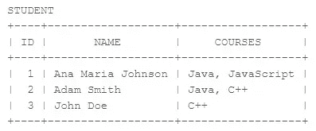
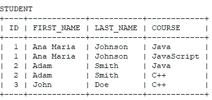
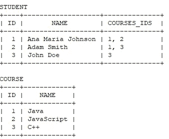

# 1NF

> 原文：<https://medium.com/javarevisited/1nf-984a8fdb6bbf?source=collection_archive---------2----------------------->

学习关系数据库设计的第一范式

简·安东宁·科拉尔在 [Unsplash](https://unsplash.com?utm_source=medium&utm_medium=referral) 上拍摄的照片

在这个故事中，我们将开始谈论关系数据库的设计。整个连载会包括 1NF、2NF、3NF，但这个故事的主角会是所谓的 1NF(第一范式)。

如您所知，基于 SQL 的关系数据库是当今系统中使用最多的。它们之所以强大是因为它们的[酸性。](https://en.wikipedia.org/wiki/ACID)

在我的职业生涯中，我见过许多关系数据库。我必须告诉你一件事，他们经常有一个糟糕的设计。很多程序员教育不够，或者对设计数据库根本不感兴趣。

正因为如此，很多可怜的东西都能看出来。数据库之间有很多冗余，所以数据库之间的不一致是很常见的。然后，人们开始使用 SQL 脚本等对数据库进行手动干预。由于数据库中的不一致性，大量的数据库手动维护，生产中出现了许多错误。

一个设计合理的数据库应该经历一个规范化的过程。通常，如果数据库经历 3 种范式就足够了:1NF、2NF 和 3NF。或者差不多三种范式。通常，1NF 和 2NF 是强制的。3NF 是好的，但是有时我们不是那么严格，在某个地方(在某个表上)因为性能利益而允许违反它。

规范化过程将随着数据库中更多的表而结束，但是，它将降低数据冗余，因此，数据完整性更容易维护。最小化数据冗余是标准化的关键目标之一。

先说一个例子。假设我们有一所 IT 学校，有很多学生、课程和教师(教师将在下面的故事中出现)。假设某个初级程序员已经开始设计了。并创建了学生表。

初始学生表

这张表包含每个学生的课程清单。ID 列是 STUDENT 表的主键。

如果一个表满足以下条件，则它在 1NF 中:

*   表中没有重复的行
*   一列中的条目属于同一种类
*   仅包含原子值
*   没有重复的组

原子值是不能被分割的值。重复组意味着一个表格包含两个或更多密切相关的列。例如，如果学生表包含列 COURSE_1、COURSE_2 和 COURSE_3(而不是列 COURSES ),那么它将违反重复组规则。

如果数据库中的所有表都不是至少 1NF，那么它被认为是一个非常糟糕的设计，我们根本不应该使用关系数据库！不需要 1NF 的数据库通常被称为 [NoSQL](https://en.wikipedia.org/wiki/NoSQL) 数据库。那么你应该使用一些 NoSQL 数据库来代替，你可能会失去关系数据库中最好的:ACID 属性。

现在让我们重新设计学生表，并将其放入 1NF。我们将把 COURSES 列重命名为 COURSE(单数名称),并将每个学生的课程放在单独的行中。此外，列名将分为两列，名和姓。很可能，有时我们需要学生的名和姓分开，反之亦然。然后怎么处理，比如说，安娜·玛丽亚·约翰逊？如何以编程方式决定什么是名，什么是姓？有些人的名字可以是 1 个字，姓氏可以是 2 个字。我们被困住了。此外，拥有全部 3 列也不是解决方案:姓名、名字和姓氏。因为它违反了关于重复组的 1NF 规则。因此，学生表的 1NF 可能是:

1NF 中的学生表

重新设计的表现在在 1NF 中。但是，1NF 是不够的，这里有很多问题。

现在的学生桌设计有什么问题？在这种设计中，我们有所谓的插入、更新和删除异常。

什么是**插入异常**？如果我们要添加一名新学生，那么该学生至少应该有一门注册课程。否则，我们无法插入新学生(假设课程列不可为空)。或者，如果列 COURSE 可为 NULL，那么我们必须将其设置为 NULL。

什么是**更新异常**？让我们假设 ID 为 1 的学生(Ana Maria Johnson)结婚了。她得到了她丈夫的姓。现在我们应该更新 Ana Maria 出现的所有行。因此维护数据完整性更加困难。

什么是**删除异常**？例如，如果我们删除 ID 为 1 的学生(Ana Maria Johnson)，那么我们将不会有任何学生注册 JavaScript 课程。因此，我们将丢失表明 JavaScript 课程存在的数据。

此外，通过这种设计，每次现有学生注册新课程时，我们将重复公共学生数据(ID、名字、姓氏)。因此，我们将有大量的数据冗余，这将增加数据库的大小，数据库的性能将受到影响。

还有一个问题是主键。关系数据库中的每个表都应该有一个主键。我们已经说过 id 列是这里的主键(可以从数据库自动生成 ID)。现在我们有了 id 重复的行。所以我们需要一个新的主键。这里应该有什么？所有 4 列(ID，FIRST_NAME，LAST_NAME，COURSE)都应该是新主键的一部分！不是很理想。

我们的数据库规范化应该继续使用 2NF 和 3NF。为什么 1NF 如此重要？因为它是使用关系数据库的界限！SQL 不是用来高效地查询具有相乘值的列的。如果您的数据库不在 1NF 中，那么您应该使用 NoSQL 数据库！

在我的职业生涯中，我见过不在 1NF 中的关系数据库。甚至这些数据库都是由经验丰富的程序员创建的。这是怎么发生的？答案是——缺乏教育！他们通常不知道如何实现数据库实体之间的多对多关系。什么是多对多关系？嗯，一个学生可以报读很多课程。一门课程可以有很多学生参加。这是一个多对多的关系。因为缺乏教育，他们把这种关系设计成这样:

多对多关系的错误设计

然后他们以某种方式让这个工作。通常由他们使用的编程语言中的大量代码来实现。解析具有相乘值的列的值，用分隔符将它们分开，等等。此外，您将如何创建一个 SQL 查询，例如，获取注册了某个特定课程的所有学生？不容易！更不用说那个查询的性能了。

顺便说一下，在关系数据库中表示多对多关系的正确方法是引入一个新表。所谓的连接表。我们将在后续的故事中看到这一点。我们还将看到数据库规范化的威力，并了解 2NF 和 3NF。

## 结论

1NF 不够。我们应该在数据库规范化的过程中更进一步。但它是基本形式，因为它是 SQL 和 NoSQL 数据库之间的边界！