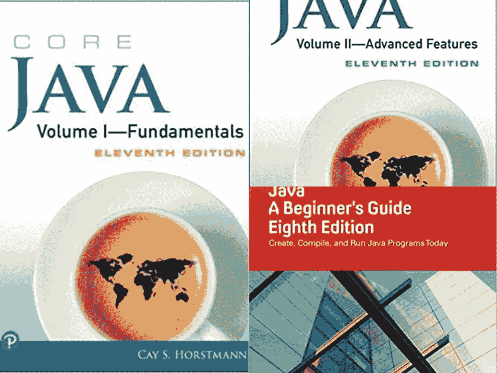
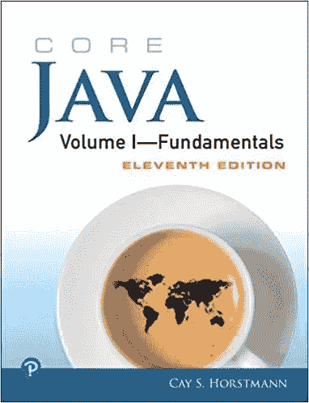
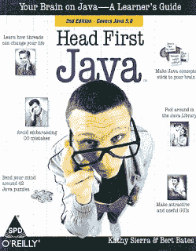
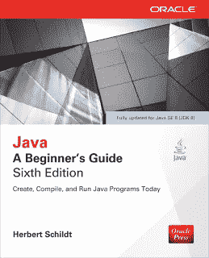
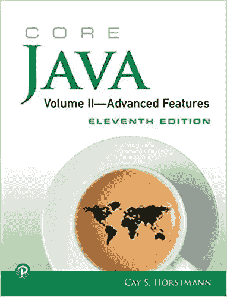

# 2023 年 C 和 C++程序员学习 Java 的两本最佳书籍

> 原文：<https://medium.com/javarevisited/2-best-java-books-for-c-developers-ee4795504498?source=collection_archive---------1----------------------->

## 凯·s·霍斯特曼的《核心 Java 书籍》是 C++程序员学习 Java 的最佳书籍。

大家好，如果你是一名 C/C++开发人员，想要学习 Java，并且正在寻找[最佳 Java 书籍](/javarevisited/5-best-core-java-books-for-beginners-20e3f723e3a)和[课程](/javarevisited/top-5-java-online-courses-for-beginners-best-of-lot-1e1e240a758)，那么你来对地方了。早些时候，我已经分享了对每个人都有好处的最佳 Java 课程和书籍，但是在这篇文章中，我将分享 C++开发人员学习 Java 可以阅读的*最佳书籍*。

在过去的 20 年里，许多 Java 程序员开始用 C 和 C++编程，但现在情况变了，你有更多的选择，比如你可以选择 [Python](https://javarevisited.blogspot.com/2018/12/10-free-python-courses-for-programmers.html) ，或者你甚至可以从 [Java](https://javarevisited.blogspot.com/2018/05/top-5-java-courses-for-beginners-to-learn-online.html) 开始。

好像美国学术界更喜欢 Python，印度更喜欢 Java，但是还是有很多程序员因为这样那样的原因，懂 [C](/javarevisited/top-10-courses-to-learn-c-for-beginners-best-and-free-4afc262a544e) 和 [C++](/javarevisited/top-10-courses-to-learn-c-for-beginners-best-and-free-4afc262a544e) 想学 Java。

我经常收到我的读者发来的关于书籍推荐的邮件，最近，有几个读者让我为 [C](https://javarevisited.blogspot.com/2018/01/top-5-free-data-structure-and-algorithm-courses-java--c-programmers.html#axzz5gasTpUc2) 和 [C++](http://www.java67.com/2018/02/5-free-cpp-courses-to-learn-programming.html) 程序员推荐最好的 Java 书籍。

我可以把那些初学者和我自己联系起来，因为我也经历过同样的阶段，但是那时候，大学课本是我们学习新事物的唯一来源。我们没有宽带，无限制上网和电子书在那个时候也不流行，但事情已经发生了变化。

好消息是现在我知道几本优秀的书籍，可以帮助利用他的大部分 C 和 C++知识来学习 Java，比如凯·s·霍斯特曼的 [**【核心 Java 第一卷——基础知识**](https://www.amazon.com/Core-Java-I--Fundamentals-10th/dp/0134177304?tag=javamysqlanta-20) 】，不时提供与 C++的对比分析。

例如，如果你已经在 C++中工作了几年，那么你已经熟悉了**Template feature**e，你会发现它与 Java 中的 [Generic 非常相似，但又不完全相同。](https://www.java67.com/2019/07/top-50-java-generics-and-collection-interview-questions.html)

如果你读过凯·s·霍斯特曼的《核心 Java 》,你将通过利用你以前在 C++模板特性方面的经验来学习泛型，因为这本书将告诉你泛型的哪些特性与 C++中的模板相似，以及它们的不同之处。

这只是一个例子；Java 中有许多特性起源于 C++，但实现略有不同，比如多重继承在 [C++](https://hackernoon.com/top-5-free-c-courses-to-learn-programming-in-2019-d27352277da0) 和 [Java](/javarevisited/10-free-courses-to-learn-java-in-2019-22d1f33a3915) 中都可用，但并不完全相同。

Java 对多重继承的支持比 C++更细粒度；你有多种类型的继承，在 Java 8 中，有某种程度的行为，但与 c++并不完全相同。

再比如 Java 中的**按值传递**和**按引用传递**的概念，和 C++略有不同。

在 C++中， [Java 中的一切都是通过值](https://javarevisited.blogspot.com/2012/12/does-java-pass-by-value-or-pass-by-reference.html)传递的，因为你没有指针**所以你不能像在 C++中使用运算符&那样传递变量的地址，但是当你将对象传递给一个方法时，引用的副本(对象的句柄)被传递。**

这意味着对同一引用的任何修改在方法之外也是可见的，就像在 C++中通过引用传递一样。

说到学完 C 和 C++再学 Java，有很多这样的例子，这也是我觉得像 Cay S .霍斯特曼 的 [**Core Java 这样的书帮助很大的地方。**](https://www.amazon.com/Core-Java-I--Fundamentals-10th/dp/0134177304?tag=javamysqlanta-20)

# 更多面向有经验的 C++程序员的 Java 书籍

作为一名经验丰富的 C++开发人员，我希望您了解 OOP 概念、设计模式、[坚实的设计原则](http://javarevisited.blogspot.com/2012/03/10-object-oriented-design-principles.html)、多线程，以及如何编写代码来实现任何算法，如何使用不同的数据结构以及使用来自 [BOOST](https://www.boost.org/) 和 [C++ STL](https://www.cplusplus.com/reference/stl/) 库的各种集合类。

当你开始[学习 Java](/javarevisited/10-free-courses-to-learn-java-in-2019-22d1f33a3915?source=collection_home---4------8-----------------------) 时，你会发现所有这些特性都是可用的，并且或多或少以某种形式存在，比如 Java 的 collection 框架包含了许多来自 BOOST 库的集合类。

你还会发现 [OOP 概念](/javarevisited/my-favorite-courses-to-learn-object-oriented-programming-and-design-in-2019-197bab351733)和[设计模式](https://javarevisited.blogspot.com/2018/02/top-5-java-design-pattern-courses-for-developers.html)完全一样，多态性差别不是很大，既可以重载也可以重载方法。你想了解的只是 Java 的独特功能是做什么的，它们与 C++有什么不同，以及如何用 Java 的正确方式做事。

所以基本上 Java 语言中这些基本概念的复习课程会对你有很大帮助，这也是为什么我建议有经验的 C++开发人员学习 Java 工作的以下书籍:

## 1.[凯西·塞拉设计的头像图案](http://www.amazon.com/dp/0596009208/?tag=javamysqlanta-20)

面向对象设计模式的复习课程，其中的实现和例子都是用 Java 编写的。这将很快帮助你开始用 Java 编写中级代码，使用你现有的 C++知识。

而且，如果你想要更主动的学习，可以将这本书与 Udemy 上的 [**《完整 Java 大师班》**](https://click.linksynergy.com/fs-bin/click?id=JVFxdTr9V80&subid=0&offerid=323058.1&type=10&tmpid=14538&RD_PARM1=https%3A%2F%2Fwww.udemy.com%2Fjava-the-complete-java-developer-course%2F) 这样的综合课程结合起来。

 [## 完整的 Java 软件开发人员大师班(针对 Java 10)

### 你刚刚在网上偶然发现了最完整、最深入的 Java 编程课程。拥有超过 480，000 名学生…

udemy.com](https://click.linksynergy.com/fs-bin/click?id=JVFxdTr9V80&subid=0&offerid=323058.1&type=10&tmpid=14538&RD_PARM1=https%3A%2F%2Fwww.udemy.com%2Fjava-the-complete-java-developer-course%2F) 

## 2. [Java:赫伯特·席尔德的初学者指南](https://www.amazon.com/Java-Beginners-Seventh-Herbert-Schildt/dp/1259589315?tag=javamysqlanta-20)

这本书最棒的地方在于它更新了最新的 Java 版本，也就是 Java 8。

如果您是 Java 世界的新手，我建议您从一开始就使用 Java 8，因为它是为现代系统设计的，允许您更好地利用多核 CPU 和现代硬件的能力。

一旦你了解 Java 并开始对语法、API 和它们的用法感到舒适。你可以开始阅读大多推荐给中级 Java 程序员的书籍，像 [Effective Java](http://javarevisited.blogspot.sg/2013/01/top-5-java-programming-books-best-good.html) 、[Java Concurrency in Practice](http://javarevisited.blogspot.sg/2016/06/5-books-to-learn-concurrent-programming-multithreading-java.html)、[Java Generics and Collections](http://www.java67.com/2016/06/12-must-read-advance-java-books-for-intermediate-programmers.html)以及关于 Java NIO 的书籍。结合您的 C++经验和应用程序开发知识，您将很快学到更多东西。

以上是给想学习 Java 编程的 C 和 C++程序员的一些**好的 Java 书籍**。作为一名 C、C++开发人员，您的 Java 之旅可能会很顺利，有些人可能会喜欢缺少指针，因为它使您的代码比在 C++中更具可读性。

尽管如此，许多有经验的 C++开发人员可能会抱怨由于没有指针而导致的能力不足。

简而言之，如果你是从 C 和 C++背景转到 Java 的，并且想快速而详细地学习 Java 语言和 API，那么你可能会从像凯·s·霍斯特曼的《核心 Java 第一卷—基础知识》 》和《核心 Java 第二卷—高级特性(第 11 版)这样的书中受益更多，他们不时提供与 C++的比较分析。

**进一步学习**
[完整的 Java master class](https://click.linksynergy.com/fs-bin/click?id=JVFxdTr9V80&subid=0&offerid=323058.1&type=10&tmpid=14538&RD_PARM1=https%3A%2F%2Fwww.udemy.com%2Fjava-the-complete-java-developer-course%2F)
[Java 基础知识:Java 语言](https://pluralsight.pxf.io/c/1193463/424552/7490?u=https%3A%2F%2Fwww.pluralsight.com%2Fcourses%2Fjava-fundamentals-language)
[Java 深入:成为一名完整的 Java 工程师！](https://click.linksynergy.com/fs-bin/click?id=JVFxdTr9V80&subid=0&offerid=323058.1&type=10&tmpid=14538&RD_PARM1=https%3A%2F%2Fwww.udemy.com%2Fjava-in-depth-become-a-complete-java-engineer%2F)

如果你爱书，你可能也喜欢探究这些文章:

*   学习 Java 中数据结构和算法的 5 本书([列表](http://javarevisited.blogspot.sg/2015/07/5-data-structure-and-algorithm-books-best-must-read.html))
*   7 门学习数据结构和算法的最佳课程([在线课程](/javarevisited/7-best-courses-to-learn-data-structure-and-algorithms-d5379ae2588?source=---------18------------------))
*   掌握 Java 编码的 6 本书([列表](http://javarevisited.blogspot.sg/2014/09/top-6-books-to-learn-programming-coding.html))
*   20 个免费学习编码的网站([网站](/javarevisited/top-20-sites-to-learn-coding-in-2020-f57ff63d9cb3))
*   2023 年学习 Python 的 5 本书([本书](https://javarevisited.blogspot.com/2019/07/top-5-books-to-learn-python-in-2019.html))
*   初学者学习 python 的 10 门最佳课程([最佳 Python 课程](/better-programming/top-5-courses-to-learn-python-in-2018-best-of-lot-26644a99e7ec))
*   学习 Java 性能调优和垃圾收集的 5 本书([列表](http://javarevisited.blogspot.sg/2014/07/top-5-java-performance-tuning-books.html))
*   学习 Java 性能的 7 门最佳课程([在线课程](/javarevisited/7-best-courses-to-learn-jvm-garbage-collection-and-performance-tuning-for-experienced-java-331705180686))
*   准备 Oracle Java 认证的两本优秀书籍([列表](http://javarevisited.blogspot.sg/2013/07/2-books-to-prepare-oracle-java-7-certification-OCA-OCP-OCPJP.html))
*   准备编程/编码面试的 5 本书([列举](http://javarevisited.blogspot.sg/2016/06/top-5-books-for-programming-coding-interviews-best.html))
*   为编码面试做准备的 10 门课程([课程](/hackernoon/10-data-structure-algorithms-and-programming-courses-to-crack-any-coding-interview-e1c50b30b927))
*   每个程序员都应该读的 10 本书([列出](http://www.java67.com/2015/03/10-books-every-programmer-and-software-engineer-read.html))
*   Java 开发人员学习和掌握 Eclipse IDE 的 3 本书([列表](http://javarevisited.blogspot.sg/2016/03/3-books-to-learn-eclipse-ide-for-java-jee-programmers.html))
*   10 本学习数据结构的免费书籍和课程([书籍](https://dev.to/javinpaul/top-10-free-books-and-courses-to-learn-data-structure-and-algorithms-in-2019-30gl))
*   学习数据科学 Python 的前 5 本书([本书](https://javarevisited.blogspot.com/2019/08/top-5-python-books-for-data-science-and-machine-learning.html))
*   5 书籍学 Spring Boot 和春云([书籍](https://javarevisited.blogspot.com/2018/07/top-5-books-to-learn-spring-boot-and-spring-cloud-java.html))
*   Java 开发人员学习 Hibernate 的 3 本书([本书](https://www.java67.com/2017/02/2-best-books-to-learn-hibernate-for-Java-Developers.html))

感谢您阅读本文。如果你喜欢这些 Java 书籍，那么请分享给你的朋友和同事。如果您有任何问题或反馈，请留言。

祝您的 Java 之旅一切顺利，如果您在学习 Java 的过程中遇到任何困难，可以告诉我，我们可以一起解决。

**P. S.** —如果你喜欢在线课程和阅读书籍的互动学习，那么你也可以在 Medium 上查看这份 [**十大 Java 课程**](/javarevisited/top-5-java-online-courses-for-beginners-best-of-lot-1e1e240a758) 的列表，以获得两全其美，更快更好地学习 Java。

 [## 2023 年学习 Java 的 10 大课程

### 如果你是计算机科学专业的毕业生，或者想学习 Java 并且正在寻找一些很棒的资源，比如…

medium.com](/javarevisited/top-5-java-online-courses-for-beginners-best-of-lot-1e1e240a758)