# 2023 年每个程序员都应该学习的前 22 个 Java 库和 API

> 原文：<https://medium.com/javarevisited/20-essential-java-libraries-and-apis-every-programmer-should-learn-5ccd41812fc7?source=collection_archive---------0----------------------->

## 成为更好的 Java 开发人员可以学习的最基本的 Java 库。它包括用于日志、单元测试、模拟、网络、JSON 等的 Java 库，以及学习它们的资源。

[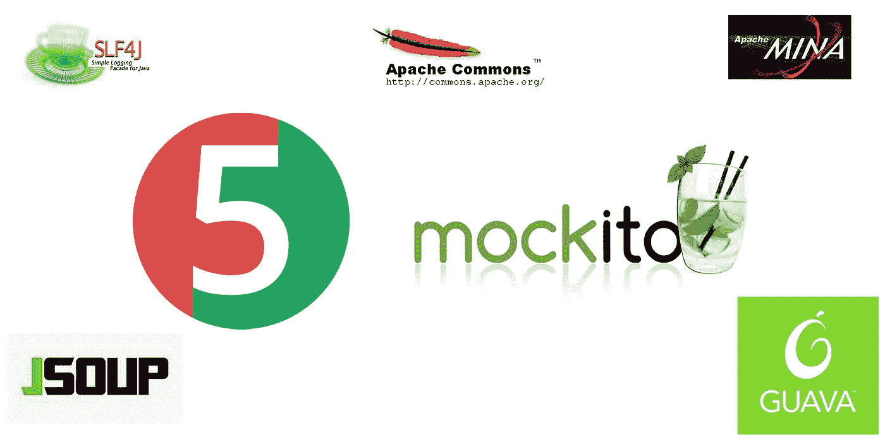](https://click.linksynergy.com/deeplink?id=CuIbQrBnhiw&mid=39197&murl=https%3A%2F%2Fwww.udemy.com%2Fcourse%2Fmockito-tutorial-with-junit-examples%2F)

你好，Java 程序员，如果你正在寻找最基本的 Java 库来学习，并在 2023 年成为一名更有能力的 Java 开发者，那么你来对地方了。

早些时候，我已经分享了 [**基本 Java 框架**](/javarevisited/5-essential-frameworks-every-java-developer-should-learn-6ed83315f1fb) 和 [**学习 Spring Boo**](/javarevisited/top-10-courses-to-learn-spring-boot-in-2020-best-of-lot-6ffce88a1b6e) t 的最佳课程，Spring Boot 是最流行的 Java 框架之一，在本文中，我将分享最流行和最有用的 Java 库，你可以通过学习这些库在 2023 年成为一名更好的 Java 程序员。

一个优秀的、有经验的 Java 开发人员的特征之一是广泛的 API 知识，包括 JDK 和第三方库。我花了很多时间学习 API，尤其是在阅读了 [**Effective Java 第三版**](https://www.amazon.com/Effective-Java-3rd-Joshua-Bloch/dp/0134685997/?tag=javamysqlanta-20) 之后，Joshua Bloch 建议如何使用现有的 API 进行开发，而不是为常见的东西编写新的代码。

这个建议对我来说是有意义的，因为第二方库可以进行测试。在本文中，我将分享一些 Java 开发人员应该熟悉的最有用和最基本的库和 API。

然而，我没有包括框架、 [Spring](/javarevisited/10-best-spring-framework-books-for-java-developers-360284c37036) 和 [Hibernate](/javarevisited/top-5-hibernate-online-training-courses-for-beginners-and-advance-java-programmers-469460596b2b) ，因为它们非常有名，并且具有特定的特性。

总的来说，我包含了对日常项目有用的库，包括 Log4j 之类的日志库，Jackson 之类的 JSON 解析库，以及 JUnit 和 Mockito 之类的单元测试 API。

如果您需要在项目中使用它们，那么您可以在项目的类路径中包含这些库的 jar 来开始使用它们，或者您可以使用 [Maven](/javarevisited/6-best-maven-courses-for-beginners-in-2020-23ea3cba89) 来进行依赖管理。

当你使用 Maven 进行依赖管理时，它会自动下载这些库，包括它们所依赖的库，称为可传递依赖。

比如你下载了 [Spring 框架](/javarevisited/top-10-free-courses-to-learn-spring-framework-for-java-developers-639db9348d25?source=---------6------------------)，它也会下载 Spring 所依赖的所有其他 jar，比如 Log4j。

您可能没有意识到，拥有正确版本的依赖 jar 是一件非常头疼的事情。如果你有错误版本的 JAR，那么，你将得到 Java 中的 [ClassNotFoundException](http://www.java67.com/2012/12/noclassdeffounderror-vs-classnotfoundexception-java.html) 、 [NoClassDefFoundError](http://javarevisited.blogspot.sg/2011/06/noclassdeffounderror-exception-in.html#axzz53N3GQp9l) 或[UnsupportedClassVersionError](http://javarevisited.blogspot.sg/2015/08/how-to-solve-unsupported-majorminor-version-51-java.html)。如果你以前面对过它们，你就会知道解决它们有多痛苦。

# 2023 年 Java 程序员必备的 20 个库和 API

这里是我收集的一些有用的第三方库，Java 开发人员可以在他们的应用程序中使用它们来完成许多有用的任务。为了使用这些库，Java 开发人员应该熟悉它们，这就是本文的全部内容。如果你有一个想法，那么你可以研究这个库并使用它。

## 1.单元测试库[JUnit 和 Mockito]

单元测试是区分普通开发人员和优秀开发人员的唯一最重要的东西。程序员经常被给出不编写单元测试的借口，但是避免单元测试最常见的借口[是缺乏经验和流行单元测试库的知识，包括](http://javarevisited.blogspot.sg/2017/01/Top-10-excuses-programmers-gives-to-avoid-unit-testing.html) [JUnit](/javarevisited/top-10-courses-to-learn-eclipse-junit-and-mockito-for-java-developers-4de1e8d62b96) 、 [Mockito](/javarevisited/5-courses-to-learn-junit-and-mockito-in-2019-best-of-lot-f217d8b93688) 和 PowerMock。

我总是有一个目标来提高我的单元测试和集成测试库的知识，比如 JUnit 5、Cucumber、Robot framework 和其他一些库。

如果你想学习 JUnit 和 Mockito 并且需要资源，我强烈推荐 Udemy 上 Ranga Karnam 的 [**用 Junit & Mockito 学习 Java 单元测试 30 步**](https://click.linksynergy.com/deeplink?id=CuIbQrBnhiw&mid=39197&murl=https%3A%2F%2Fwww.udemy.com%2Fcourse%2Fmockito-tutorial-with-junit-examples%2F) 。学习这些有用的库是一门很棒的实践课程。

[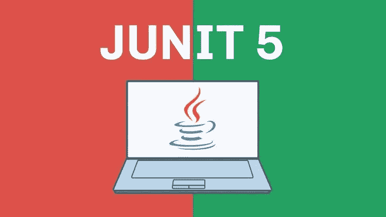](https://click.linksynergy.com/deeplink?id=CuIbQrBnhiw&mid=39197&murl=https%3A%2F%2Fwww.udemy.com%2Fcourse%2Fjunit5-for-beginners%2F)

## 2.JSON 解析库[Jackson 和 Gson]

在当今的 web 服务和物联网世界中，JSON 已经成为将信息从客户端传送到服务器的首选协议。它们已经取代 XML 成为以独立于平台的方式传输信息的首选方式。

不幸的是，JDK 没有 JSON 库。但是，有许多好的第三方库允许您解析和创建 JSON 消息，比如 Jackson 和 Gson。

Java web 开发人员应该至少熟悉其中一个库。如果你想了解更多关于 Jackson 和 JSON 的知识，我建议通过 Udemy 的 Java API 课程来了解一下 [**JSON。**](https://click.linksynergy.com/deeplink?id=CuIbQrBnhiw&mid=39197&murl=https%3A%2F%2Fwww.udemy.com%2Fcourse%2Flearn-json-with-java-apis-jquery-and-rest%2F)

[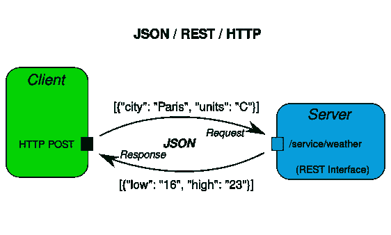](https://click.linksynergy.com/deeplink?id=CuIbQrBnhiw&mid=39197&murl=https%3A%2F%2Fwww.udemy.com%2Fcourse%2Flearn-json-with-java-apis-jquery-and-rest%2F)

## 3.日志库[Log4j2 和 SLF4j]

日志库非常常见，因为每个项目中都需要它们。它们对于服务器端应用程序来说是最重要的，因为日志只放在你可以看到应用程序中发生了什么的地方。

尽管 JDK 附带了自己的日志库，但是还有更好的替代库，比如 Log4j、SLF4j 和 LogBack。

如果你有兴趣学习更多关于登录 Java 的知识，那么我强烈推荐你参加 Pluralsight 上的 [**Java 核心库:Java 日志系统**](https://pluralsight.pxf.io/c/1193463/424552/7490?u=https%3A%2F%2Fwww.pluralsight.com%2Fcourses%2Fjava-core-libraries-log-system) 课程。

这是学习何时使用日志记录、为什么使用日志记录以及如何生成有用的日志消息的难得课程。它还将教您如何使用 Java 日志系统进行日志记录，并为您提供一些在应用程序中进行日志记录的实践。

[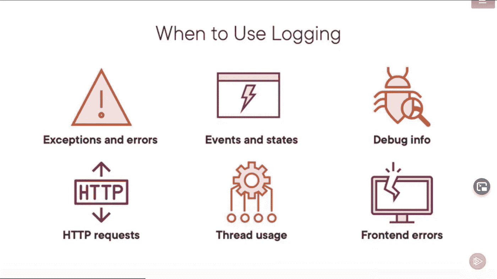](https://pluralsight.pxf.io/c/1193463/424552/7490?u=https%3A%2F%2Fwww.pluralsight.com%2Fcourses%2Fjava-core-libraries-log-system)

Java 开发人员应该熟悉日志库的优缺点，并且知道为什么使用 SLF4j 比普通的 Log4j 更好。如果你不知道为什么，我建议你读一读我之前关于同一主题的文章。我向每一个 Java 开发者强烈推荐这门课程。

顺便说一下，你需要一个 [**Pluralsight 会员**](https://pluralsight.pxf.io/c/1193463/424552/7490?u=https%3A%2F%2Fwww.pluralsight.com%2Flearn) 才能加入这个课程，费用大约是每月 29 美元或每年 299 美元(14%的折扣)。我向所有程序员强烈推荐这个订阅，因为它提供了超过 7000 个在线课程的即时访问，以学习任何技术技能。或者，你也可以使用他们的 [**10 天免费通行证**](https://pluralsight.pxf.io/c/1193463/424552/7490?u=https%3A%2F%2Fwww.pluralsight.com%2Flearn) 免费观看这门课程。

 [## 对个人来说

### Pluralsight 的使命一直是公平的技术竞争环境。不管你想学什么，或者…

pluralsight.pxf.io](https://pluralsight.pxf.io/c/1193463/424552/7490?u=https%3A%2F%2Fwww.pluralsight.com%2Flearn) 

## 4.通用库[Apache Commons 和 Guava]

Java 开发人员可以使用一些好的、通用的第三方库，比如 Apache Commons 和 Google Guava。我总是在我的项目中包含这些库，因为它们简化了许多任务。

正如约书亚·布洛赫在《有效的 Java》中所说的，没有必要重新发明轮子。我们应该更喜欢使用经过测试的库，而不是不时地编写自己的例程。

熟悉 Google Guava 和 Apache Commons 库对 Java 开发人员来说很有好处。

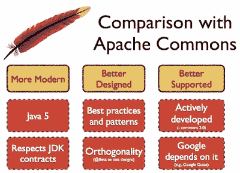

## 5.HTTP 库[HttpClient]

我不喜欢 JDK 的一点是它缺乏对 HTTP 的支持。虽然您可以使用`java.net`包中的类建立 HTTP 连接，但是使用开源的第三方库，如 Apache HttpClient 和 HttpCore，就不那么容易或无缝了。

尽管 JDK 9 带来了对 HTTP 2.0 的支持和更好的 HTTP 支持，我强烈建议所有 Java 开发人员熟悉流行的 HTTP 客户端库，包括 HTTP client 和 HttpCore。

你也可以看看这篇文章[**Java 9 的新特性——模块和更多**](https://click.linksynergy.com/deeplink?id=CuIbQrBnhiw&mid=39197&murl=https%3A%2F%2Fwww.udemy.com%2Fcourse%2Fwhats-new-in-java-9%2F) 来了解更多关于 JDK 9 的 HTTP 2 支持，作者是 Tim Buchalaka 和他的团队。

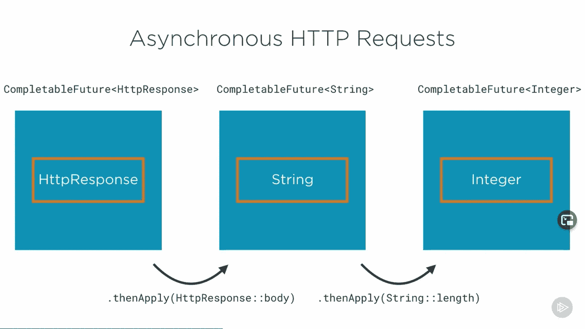

并且，如果你想深入了解 HttpClient，那么我也推荐你加入 Sander Mak 的 [**Java 基础:http client**](https://pluralsight.pxf.io/c/1193463/424552/7490?u=https%3A%2F%2Fwww.pluralsight.com%2Fcourses%2Fjava-fundamentals-httpclient)t 课程。学习这个强大的 API 是很棒的课程。

 [## Java 基础:HttpClient

### 使用 Java 的 HttpClient API，您可以轻松地执行 HTTP 调用。这是一个支持 HTTP/1.1、HTTP/2 和…

pluralsight.pxf.io](https://pluralsight.pxf.io/c/1193463/424552/7490?u=https%3A%2F%2Fwww.pluralsight.com%2Fcourses%2Fjava-fundamentals-httpclient) 

## 6.XML 解析库[Xerces 和 JAXB]

有很多 XML 解析库，包括 Xerces、JAXB、JAXP、Dom4j 和 Xstream。Xerces2 是 Apache Xerces 家族中下一代高性能、完全兼容的 XML 解析器。

Xerces 的这个新版本引入了 Xerces 本地接口(XNI)，这是一个用于构建解析器组件和配置的完整框架，非常模块化，易于编程。

Apache Xerces2 解析器是 XNI 的参考实现，但是其他解析器组件、配置和解析器可以使用 Xerces 本地接口编写。

Dom4j 是 Java 应用程序的另一个灵活的 XML 框架。如果你想了解更多关于 Java 中 XML 解析的知识，建议你看看 Udemy 上的 [**Java Web Services 和 XML**](https://click.linksynergy.com/deeplink?id=CuIbQrBnhiw&mid=39197&murl=https%3A%2F%2Fwww.udemy.com%2Fcourse%2Fjava-web-services%2F) 在线课程。

[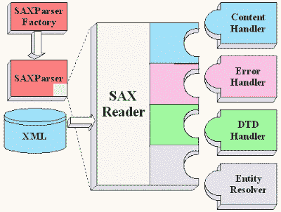](https://click.linksynergy.com/deeplink?id=CuIbQrBnhiw&mid=39197&murl=https%3A%2F%2Fwww.udemy.com%2Fcourse%2Fjava-web-services%2F)

## 7.Excel 阅读库[Apache POI]

信不信由你，所有现实世界的应用程序都必须以某种形式与 Microsoft Office 交互。

许多应用程序需要提供在 Excel 中导出数据的功能，如果您必须从 Java 应用程序中完成同样的工作，您需要 Apache POI API。

这是一个非常丰富的库，允许你从 Java 程序中读写 XLS 文件。您可以看到在核心 Java 应用程序中读取 Excel 文件的工作示例的链接。

如果你需要一门课程或教程，你也可以看看这个 [**使用 Java**](https://click.linksynergy.com/deeplink?id=CuIbQrBnhiw&mid=39197&murl=https%3A%2F%2Fwww.udemy.com%2Fcourse%2Fcreate-advanced-excel-files-using-java-apache-poi%2F) 创建高级 Excel 文件，这是 Udemy 上的一门 Apache POI 课程

[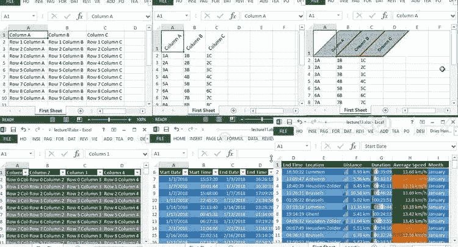](https://click.linksynergy.com/deeplink?id=CuIbQrBnhiw&mid=39197&murl=https%3A%2F%2Fwww.udemy.com%2Fcourse%2Fcreate-advanced-excel-files-using-java-apache-poi%2F)

## 8.字节码库[Javassist 和 CgLib]

如果你正在编写一个框架或库来生成代码或与字节码交互，那么，你需要一个字节码库。

它们允许您读取和修改应用程序生成的字节码。Java 世界中一些流行的字节码库是 javassist 和 Cglib Nodep。

Javassist (JAVA 编程助手)使得 JAVA 字节码操作非常简单。这是一个在 Java 中编辑字节码的类库。ASM 是另一个有用的字节码编辑库。

如果你对字节码不熟悉，建议你去查一下 [**面向软件开发者的 Java 编程大师班**](https://click.linksynergy.com/deeplink?id=CuIbQrBnhiw&mid=39197&murl=https%3A%2F%2Fwww.udemy.com%2Fcourse%2Fjava-the-complete-java-developer-course%2F) 了解更多。

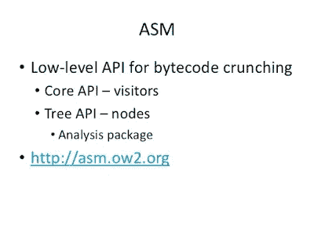

## 9.数据库连接池库[DBCP 和 C3P0]

如果您正在从 Java 应用程序与数据库交互，但没有使用[数据库连接](http://javarevisited.blogspot.sg/2012/06/jdbc-database-connection-pool-in-spring.html)池库，那么您就错过了一些东西。

由于在运行时创建数据库连接需要时间，并且会降低请求处理的速度，所以总是建议使用 DB 连接库。一些受欢迎的是公地池和 DBCP。

在 web 应用程序中，它的 web 服务器通常提供这些功能，但是在核心 Java 应用程序中，您需要将这些连接池库包含到您的类路径中，以便使用数据库连接池。

如果你想了解更多关于 web 应用程序中的 JDBC 和连接池的知识，我建议你看看 Udemy 上 Chad Darby 的 [**JSP、Servlets 和 JDBC:构建数据库应用**](https://click.linksynergy.com/deeplink?id=CuIbQrBnhiw&mid=39197&murl=https%3A%2F%2Fwww.udemy.com%2Fcourse%2Fjsp-tutorial%2F) 课程。

[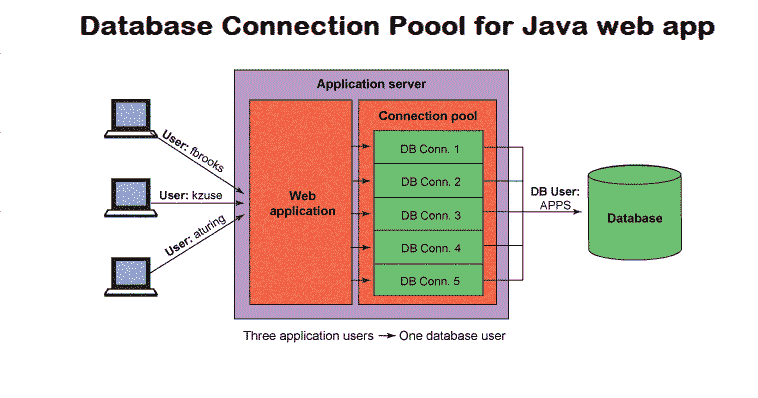](https://click.linksynergy.com/deeplink?id=CuIbQrBnhiw&mid=39197&murl=https%3A%2F%2Fwww.udemy.com%2Fcourse%2Fjsp-tutorial%2F)

## 10.消息传递库[JMS 和 MQ]

与日志记录和数据库连接类似，消息传递也是许多现实世界的 Java 应用程序的一个常见特性。

Java 提供 JMS 或 Java 消息服务，这不是 JDK 的一部分。对于这个组件，您需要包含一个单独的`jms.jar`。

类似地，如果您使用第三方消息传递协议，比如 Tibco RV，那么您需要在应用程序类路径中使用第三方 JAR — `tibrv.jar` 。

如果你想学习更多关于 JMS 的知识并需要资源，那么我强烈推荐你参加由 Bharat Thippireddy 教授的 [**Java 消息服务— JMS 基础知识**](https://click.linksynergy.com/deeplink?id=CuIbQrBnhiw&mid=39197&murl=https%3A%2F%2Fwww.udemy.com%2Fcourse%2Fjava-message-service-jms-fundamentals%2F) 课程，他是我在 Udemy 上最喜欢的 Java 讲师之一。

[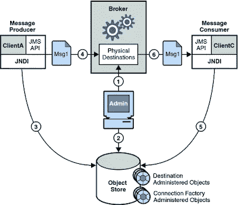](https://click.linksynergy.com/deeplink?id=CuIbQrBnhiw&mid=39197&murl=https%3A%2F%2Fwww.udemy.com%2Fcourse%2Fjava-message-service-jms-fundamentals%2F)

## 11.PDF 库[iText]

与 Microsoft Excel 类似，PDF 库是另一种普遍存在的格式。如果您需要在应用程序中支持 PDF 功能，比如[在 PDF 文件中导出数据](http://javarevisited.blogspot.sg/2014/05/open-source-java-PDF-File-libraries-Apache-FOP-vs-iText.html)，您可以使用 iText 和 Apache FOP 库。

两者都提供有用的 PDF 相关功能，但是 iText 更丰富更好。可以进一步查看**[**iText in Action**](https://www.amazon.com/iText-Action-Covers-5/dp/1935182617?tag=javamysqlanta-20)一书了解 iText 更多信息。**

**[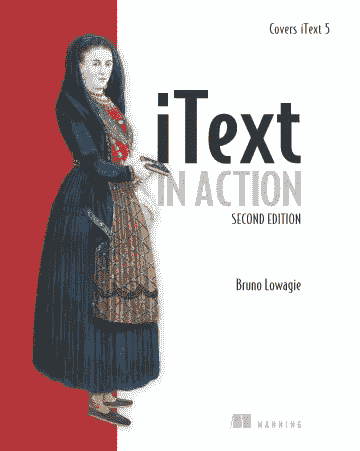](https://www.amazon.com/iText-Action-Covers-5/dp/1935182617?tag=javamysqlanta-20)**

## **12.日期和时间库[Joda 时间]**

**在 Java 8 之前，JDK 的数据和时间库有这么多缺陷，因为它们不是[线程安全的](http://javarevisited.blogspot.sg/2017/04/5-reasons-why-javas-old-date-and-Calendar-API-bad.html#axzz5BxtJPSi9)、[不可变的](http://javarevisited.blogspot.sg/2018/02/java-9-example-factory-methods-for-collections-immutable-list-set-map.html)，并且容易出错。许多 Java 开发人员依赖 JodaTime 来实现他们的日期和时间需求。**

**从 JDK 8，没有理由使用 Joda，因为你在 JDK 8 的[新的日期和时间 API](http://javarevisited.blogspot.sg/2015/03/20-examples-of-date-and-time-api-from-Java8.html) 中获得了所有的功能，但是如果你在一个旧的 Java 版本中工作，那么 JodaTime 是一个值得学习的库。**

**如果你想进一步了解新的日期和时间 API，建议你查看 Udemy 上的 [**Java 8 新特性简单明了**](https://click.linksynergy.com/deeplink?id=CuIbQrBnhiw&mid=39197&murl=https%3A%2F%2Fwww.udemy.com%2Fcourse%2Fjava-8-new-features-in-simple-way%2F) 课程。它很好地概述了 Java 8 的所有重要特性，包括日期和时间 API。**

**[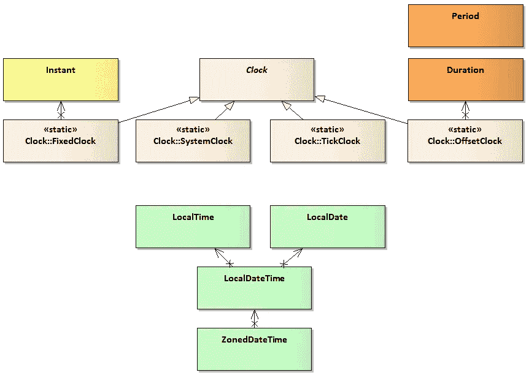](https://click.linksynergy.com/deeplink?id=CuIbQrBnhiw&mid=39197&murl=https%3A%2F%2Fwww.udemy.com%2Fcourse%2Fjava-8-new-features-in-simple-way%2F)**

## **13.集合库[Eclipse 集合]**

**尽管 JDK 有丰富的馆藏，但也有一些第三方图书馆提供更多的选择，如 Apache Commons collections、Goldman Sachs collections、Google collections、Eclipse Collections 和 Trove。**

**Trove 库特别有用，因为它为 Java 提供了高速的常规和原始集合。**

**FastUtil 是另一个类似的 API。它扩展了 Java 集合框架，提供了特定类型的映射、集合、列表和优先级队列，占用内存少，访问和插入速度快；它还提供了大(64 位)[数组](http://www.java67.com/2015/07/array-concepts-interview-questions-answers-java.html)、[集合](http://javarevisited.blogspot.sg/2012/04/difference-between-list-and-set-in-java.html#axzz53n9YK0Mb)和[列表](http://javarevisited.blogspot.sg/2015/07/java-arraylist-tutorial.html)，为二进制和文本文件提供了快速、实用的 I/O 类。**

**Eclipse Collections 是另一个值得学习的有用的开放课程集合库。对了，如果你想了解更多的 Java 集合，还可以去 Udemy 上查看 [**Java 集合从基础到高级**](https://click.linksynergy.com/deeplink?id=CuIbQrBnhiw&mid=39197&murl=https%3A%2F%2Fwww.udemy.com%2Fcourse%2Fcollections-and-concurrent-collection-video-lectures-and-tutorials%2F) 课程。**

**[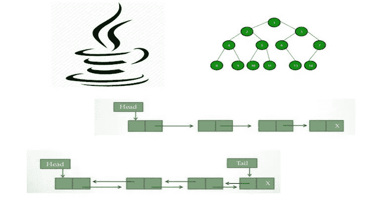](https://click.linksynergy.com/deeplink?id=CuIbQrBnhiw&mid=39197&murl=https%3A%2F%2Fwww.udemy.com%2Fcourse%2Fcollections-and-concurrent-collection-video-lectures-and-tutorials%2F)**

## **14.电子邮件 API[Java 邮件 API]**

**javax.mail 和 Apache Commons Email 都提供了从 Java 发送电子邮件的 API。它构建在 JavaMail API 之上，旨在简化该 API。**

**如果你需要一个项目，你可以使用 Java FX 构建一个邮件客户端，并在那里使用 mail API 发送邮件。**

**如果需要帮助，还可以在 Udemy 上查看[**Java FX 高级 Java 编程:编写邮件客户端**](https://click.linksynergy.com/deeplink?id=CuIbQrBnhiw&mid=39197&murl=https%3A%2F%2Fwww.udemy.com%2Fcourse%2Fadvanced-programming-with-javafx-build-an-email-client%2F) 课程**

**[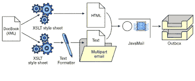](https://click.linksynergy.com/deeplink?id=CuIbQrBnhiw&mid=39197&murl=https%3A%2F%2Fwww.udemy.com%2Fcourse%2Fadvanced-programming-with-javafx-build-an-email-client%2F)**

## **15.HTML 解析库[Jsoup]**

**与 [JSON](http://javarevisited.blogspot.sg/2017/02/how-to-consume-json-from-restful-web-services-Spring-RESTTemplate-Example.html#axzz5BxtJPSi9) 和 [XML](http://www.java67.com/2012/09/dom-vs-sax-parser-in-java-xml-parsing.html) 类似，HMTL 是我们许多人不得不处理的另一种常见格式。幸运的是，我们有 JSoup，它极大地简化了 Java 应用程序中的 HTML 工作。**

**您不仅可以使用 [JSoup](http://javarevisited.blogspot.sg/2014/09/how-to-parse-html-file-in-java-jsoup-example.html) 解析 HTML，还可以创建 HTML 文档**

**它为提取和操作数据提供了一个非常方便的 API，使用了最好的 DOM、CSS 和类似 jquery 的方法。JSoup 实现了 WHATWG HTML5 规范，并像现代浏览器一样将 [HTML](http://www.java67.com/2018/02/5-free-html-and-css-courses-to-learn-web-development.html) 解析为相同的 DOM。**

**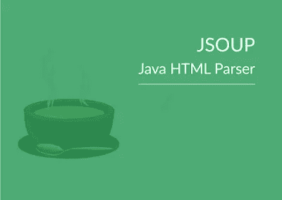**

## **16.密码库**

**Apache Commons 编解码器包包含各种格式的简单编码器和解码器，例如 [Base64](http://javarevisited.blogspot.sg/2016/10/base64-encoding-example-in-java-8.html) 和十六进制。**

**除了这些广泛使用的编码器和解码器，codec 包还维护了一个语音编码实用程序的集合。**

**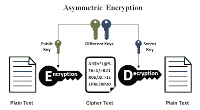**

## **17.嵌入式 SQL 数据库库[H2、HSQL 和 Derby]**

**我非常喜欢像 H2 这样的内存数据库，您可以将它嵌入到 Java 应用程序中。它们对于测试您的 SQL 脚本和运行需要数据库的单元测试非常有用。**

**然而，H2 不是唯一的 DB，您还有 Apache Derby 和 HSQL 可供选择。**

**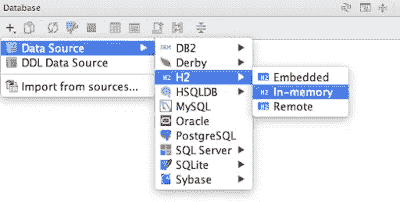**

## **18.JDBC 故障排除库**

**有一些很好的 JDBC 扩展库，可以使调试更容易，比如 P6spy。**

**这是一个库，它使得数据库数据能够被无缝地截取和记录，而无需改变应用程序的代码。您可以使用这些来记录 SQL 查询及其计时。**

**例如，如果您在代码中使用[prepared statement](http://javarevisited.blogspot.sg/2012/03/why-use-preparedstatement-in-java-jdbc.html#axzz53n9YK0Mb)和 [CallableStatement](http://javarevisited.blogspot.sg/2013/01/jdbc-batch-insert-and-update-example-java-prepared-statement.html) ，这些库可以记录一个带有参数的精确调用以及执行该调用所用的时间。**

**如果你想了解更多关于 JDBC 的知识，可以查看 Udemy 上的 [**完整 JDBC 编程 Part-1**](https://click.linksynergy.com/deeplink?id=CuIbQrBnhiw&mid=39197&murl=https%3A%2F%2Fwww.udemy.com%2Fcourse%2Fcomplete-jdbc-programming-part-1%2F) 课程。**

**[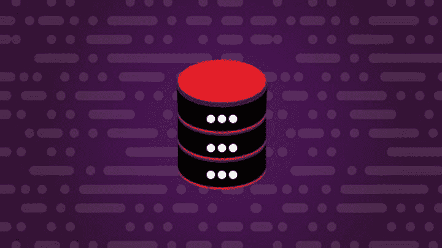](https://click.linksynergy.com/deeplink?id=CuIbQrBnhiw&mid=39197&murl=https%3A%2F%2Fwww.udemy.com%2Fcourse%2Fcomplete-jdbc-programming-part-1%2F)**

## **19.网络库[Apache MINA]**

**一些有用的网络库是 Netty 和 Apache MINA。如果您正在编写一个需要执行低级网络任务的应用程序，请考虑使用这些库。**

**如果你想了解更多关于 Java 网络编程的知识，可以查看 Udemy 上的这个 [**用 Java 编程网络应用**](https://click.linksynergy.com/deeplink?id=CuIbQrBnhiw&mid=39197&murl=https%3A%2F%2Fwww.udemy.com%2Fcourse%2Fprogramming-network-applications-in-java%2F) 课程。从 Java 编程的角度来看，这是一门学习 TCP、UDP 和其他网络基础知识的非常好的课程。**

**[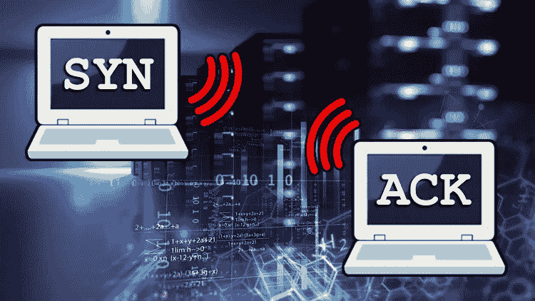](https://click.linksynergy.com/deeplink?id=CuIbQrBnhiw&mid=39197&murl=https%3A%2F%2Fwww.udemy.com%2Fcourse%2Fprogramming-network-applications-in-java%2F)**

## **20.[龙目岛【龙目岛项目】](https://projectlombok.org/)**

**这是你应该在 2023 年学习的另一个很棒的 Java 库，因为它通过去除样板代码使使用 Java 变得非常有趣。例如，你可以用 getter 和 setter 来声明你的 Java 类，它看起来非常干净，如这个 [Lombok 示例](https://javarevisited.blogspot.com/2021/08/how-to-use-lombok-library-in-java.html)所示。**

**您可以指示 Lombok 创建常见的方法，如 equals 和 hashcode、toString、getter 和 setters，也可以放置断言，如 NonNull，以实现健壮的编码。所有这些都可以通过添加一些注释来完成，比如@ToString、@EQualsAndHashCode、@NonNull 等。**

**你也可以通过使用@Builder 注释，使用 Lombok 创建构建器和构造器，还有@Data 注释，它自动应用公共注释，使你的代码更加整洁。**

**这里有一个使用 Lombok 声明的类，你可以看到它比传统的 POJO(普通的旧 Java 对象)干净得多**

**[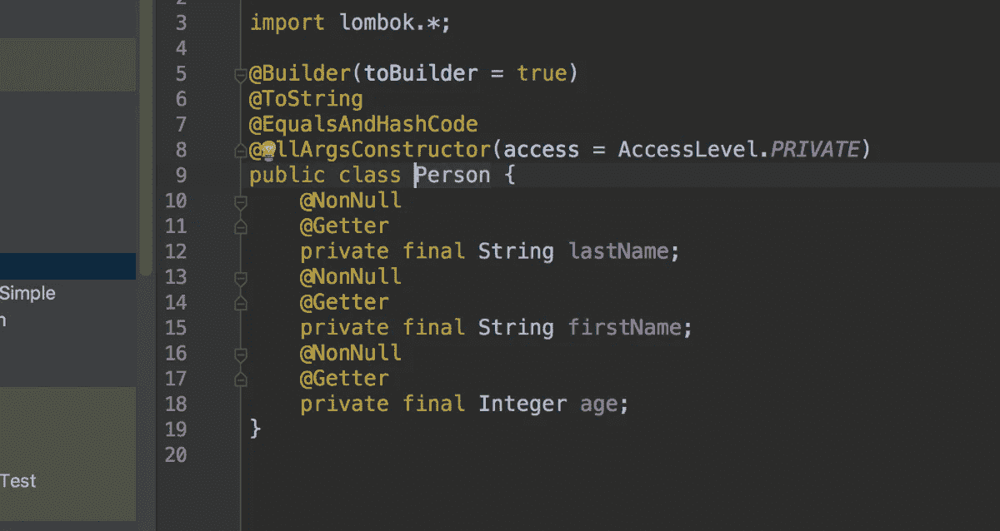](https://javarevisited.blogspot.com/2021/08/how-to-use-lombok-library-in-java.html)**

## **21.[测试容器](https://www.testcontainers.org/)**

**这是 2023 年每个 Java 开发者都应该学习的又一个牛逼 Java 库。如果你不知道，Tescontainer 是一个支持 JUnit 测试的 Java 库，它提供了轻量级的、一次性的通用数据库、Selenium web 浏览器或其他任何可以在 Docker 容器中运行的实例。**

**如果你想知道我们为什么使用 Testcontainers 或者我们为什么需要它，那么让我告诉你 Testcontainers 将允许我们利用容器化的数据库、消息队列、网络浏览器等编写集成测试。不依赖于本地安装**

**它确实使测试设置比以前更容易，尤其是测试 spring boot 应用程序。如果你想了解更多关于使用 test contains 测试 spring boot 应用程序的信息，我建议你参加由 RieckPil 举办的[**【Spring Boot 测试大师班】**](http://TSBAX_M2LAP) **，**我最喜欢的课程之一，为 Java 开发人员学习高级测试知识。**

**这个课程会教你测试 spring boot 应用需要知道的一切，包括测试容器。也可以用我的代码 TSBAX_M2LAP 打九折。**

**以下是加入本课程的链接: [**Spring Boot 测试大师班**](http://TSBAX_M2LAP)**

**[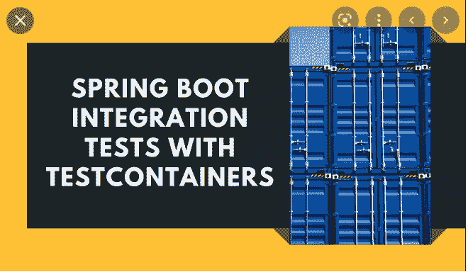](http://TSBAX_M2LAP)**

## **22.序列化库[Google 协议缓冲区]**

**Google 协议缓冲区是一种以高效且可扩展的格式对结构化数据进行编码的方式。它是 Java 序列化更丰富、更好的替代方案。**

**我强烈推荐有经验的 Java 开发者学习 Google Protobuf。你可以看这篇文章来了解更多关于 Google 协议缓冲区的知识。**

**如果你需要学习 Google 协议缓冲区的资源，那么我强烈推荐你参加 Udemy 网站上由 STéphane Maarek 开设的 [**协议缓冲区完整指南 3【Java、Golang、Python】**](https://click.linksynergy.com/deeplink?id=CuIbQrBnhiw&mid=39197&murl=https%3A%2F%2Fwww.udemy.com%2Fcourse%2Fprotocol-buffers%2F)课程。这是一个非常好的学习 Google 协议缓冲区的最新资源。**

**[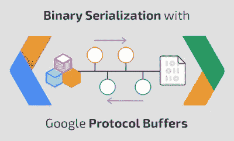](https://click.linksynergy.com/deeplink?id=CuIbQrBnhiw&mid=39197&murl=https%3A%2F%2Fwww.udemy.com%2Fcourse%2Fprotocol-buffers%2F)**

**这就是目前所有关于每个 Java 开发人员都应该使用的一些**有用的库**。Java 领域非常庞大，您会发现大量的库可以做不同的事情。**

**如果你想用 Java 做任何事情，你很可能会找到一个库来教你怎么做。和往常一样，Google 是你寻找有用的 Java 库的最好朋友，但是你也可以看看 Maven central repository，为你手头的任务寻找一些有用的库。**

**如果你喜欢这篇文章，你可能会发现我的其他文章也很有用:**

*   **[Java 开发者路线图](https://javarevisited.blogspot.com/2019/10/the-java-developer-roadmap.html#axzz6N3akNoox)**
*   **【Java 和 Web 开发人员应该学习的 10 个框架**
*   **[学习春天和冬眠的 10 门最佳课程](/javarevisited/8-best-spring-and-hibernate-training-courses-for-java-developers-acf09aa0e244)**
*   **[数据结构与算法课程破解编码面试](/hackernoon/10-data-structure-algorithms-and-programming-courses-to-crack-any-coding-interview-e1c50b30b927)**
*   **[2023 年你可以读的 21 本 Java 书](/javarevisited/10-books-java-developers-should-read-in-2020-e6222f25cc72)**
*   **[2023 年 Java 开发人员应该学会的 15 件事](/swlh/10-things-java-developer-should-learn-in-2019-5e0cf388e07f)**
*   **[我最喜欢的学习软件架构的课程](/javarevisited/top-5-courses-to-learn-software-architecture-in-2020-best-of-lot-5d34ebc52e9)**
*   **[2023 年探索 10 种编程语言](http://www.java67.com/2017/12/10-programming-languages-to-learn-in.html)**
*   **[2023 年 Java 开发人员应该阅读的 21 本书](/javarevisited/10-books-java-developers-should-read-in-2020-e6222f25cc72)**
*   **[面向 Java 和 Web 开发人员的 10 门 Pluralsight 课程](http://javarevisited.blogspot.sg/2017/12/top-10-pluralsight-courses-java-and-web-developers.html)**
*   **[更好地学习 Java 8 的 10 个教程](http://www.java67.com/2014/09/top-10-java-8-tutorials-best-of-lot.html)**
*   **成为更好的 Java 程序员的 10 个技巧**
*   **[2023 年 Java 开发人员应该学习的 10 个工具](http://www.java67.com/2018/04/10-tools-java-developers-should-learn.html)**

**感谢您阅读本文。如果你喜欢这篇文章，请与你的朋友和同事分享。如果您有任何反馈或问题，请留言。

**P.S** 。—而且，如果你想让你的 Java 编程技能更上一层楼，想深入学习 Java，那么我建议你看看这个 [**高级 Java 编程课程**](https://javarevisited.blogspot.com/2020/04/top-10-advanced-core-java-courses-for-experienced-developers.html#axzz6KyOHbmCo) 的列表，它包含了最高级课程的列表。它已经更新，涵盖了最新的 Java 特性。**

** [## 2023 年将加入 11 门高级核心 Java 在线课程

### 这些是核心 java 开发人员学习多线程、集合、JVM 等技能的最佳在线课程

medium.com](/javarevisited/11-advanced-core-java-online-courses-to-join-in-2021-46011661257a)**