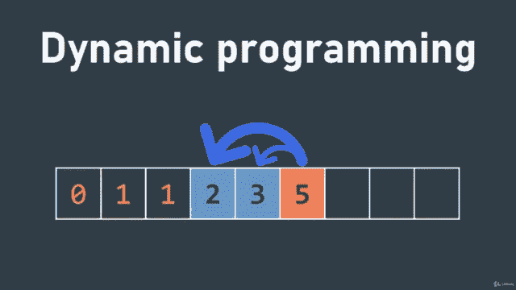
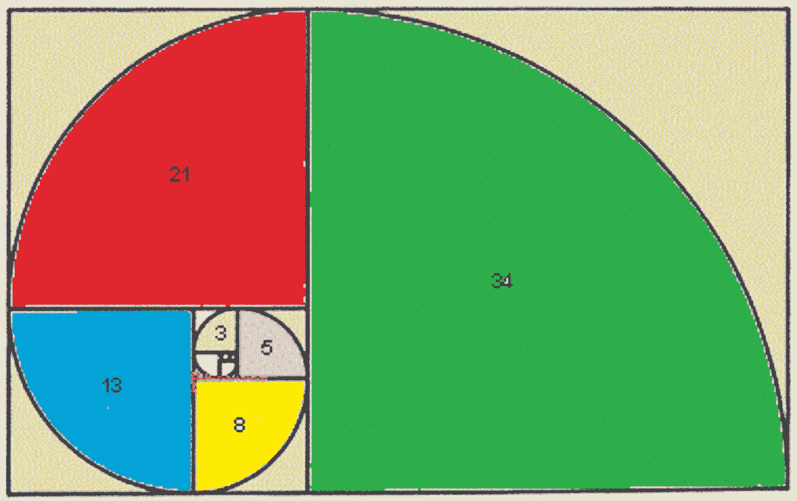
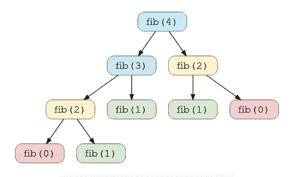
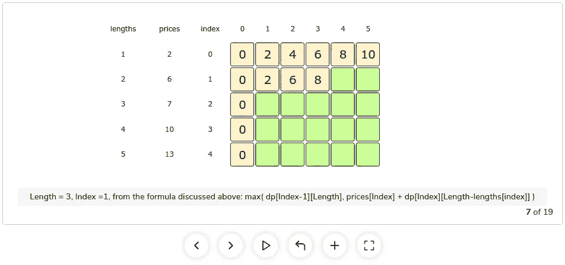
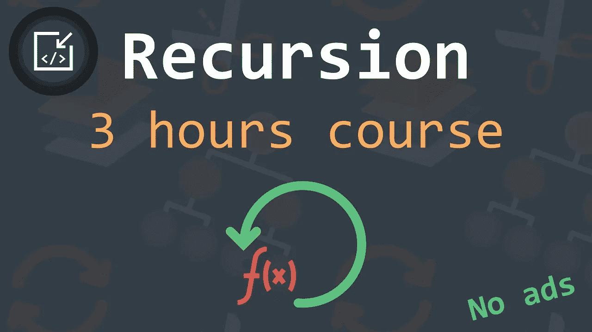

# 30 个递归面试问题和编程面试的编码练习

> 原文：<https://medium.com/javarevisited/30-recursion-interview-questions-and-coding-exercises-for-programming-interviews-2816302e9ab?source=collection_archive---------0----------------------->

## 这是 30 个常见的基于递归的编码问题，你可以在编码和编程面试中练习

伙计们，如果你在努力用递归解决动态编程问题，或者在理解递归上有困难，那么你并不孤单。许多程序员努力理解递归和动态编程，且在编码面试中表现不佳

克服这个问题的唯一方法是**解决尽可能多的递归编码问题**。这将训练你的大脑理解递归，基本情况，以及递归算法一般是如何工作的。这就像游泳，最初你挣扎着在水中呼吸，然后突然有一天你找到了节奏。

如果你想知道**什么是递归？**然后就是**除了一个自称为**的函数之外什么都没有。当一个函数调用它自己时，它可以无限期地调用，直到它不调用自己，这是基本情况。一半的递归问题可以通过找到基本情况来解决。

比如 [**阶乘()函数**](/@somasharma_81597/factorial-in-java-using-recursion-and-loop-iterative-solved-e2f6903d5b14) 就是**递归**的好例子。为了计算阶乘(3)，你可以将函数调用写成`3 * factorial(2)`然后`3 * 2 * factorial(1)`，对于阶乘 2，你知道值总是 1，所以你不需要调用函数或者使用[递归](https://www.java67.com/2021/07/recursion-programming-exercises-in-java.html)你可以返回答案 1，递归将开始展开并产生你需要的输出。

如果你正在准备编码面试，或者试图学习递归，但很难找到递归练习题、递归编码题或简单的面试递归练习，那么你来对地方了。

过去，我曾分享过 [**最佳递归课程**](/javarevisited/7-best-courses-to-learn-recursion-for-programming-and-coding-interviews-1f8b0bcfd44) 和 [**动态编程课程**](/javarevisited/6-best-dynamic-programming-courses-for-coding-interviews-14744060923c) 在这篇文章中，我将教你什么是递归，如何识别一个问题是否可以用递归解决，为你正在解决的问题创建递归算法的确切步骤，并分享 25 到 30 个你可以练习的常见递归面试问题。

递归对于许多程序员来说是一个简单而又困难的话题，因为不是每个人都能很容易地理解递归，但它也非常重要，你不能放弃它，因为它被用来解决许多动态编程问题，如背包问题、T2、斐波那契、T3 等。

扎实的递归知识是在编码面试中取得好成绩的关键，这也是本文将帮助你的地方。之前，我已经分享了常见的[编程面试问题](https://www.java67.com/2018/05/top-75-programming-interview-questions-answers.html?ref=faun)、[书籍](http://www.java67.com/2017/06/10-books-to-prepare-technical-coding-job-interviews.html?ref=faun)和[课程](https://www.java67.com/2019/07/top-10-online-courses-to-learn-data-structure-and-algorithms-in-java.html?ref=faun)，在这里，我将分享 25 到 30 个递归练习题和练习，你可以从零开始学习递归。

这些是可以用递归解决的常见编程问题和练习问题，它们不仅有助于学习递归，也有助于你的编码面试准备。我个人发现在 Java 或任何编程语言中学习递归的最好方法是通过做一些例子。

每个程序员都知道什么是递归函数或 Java 中的递归，但是当涉及到将递归应用于一个问题时，许多人会感到困惑。根据我的经验，*递归是一个棘手的编程概念*，很少有人能很快理解它，但是对于一些程序员来说，理解递归并开发应用它的能力需要花费很长时间。

如果你属于第二类程序员，对他们来说递归总是很棘手，那么我能建议的最好的办法就是做大量基于递归的编程练习**。**

**我知道，对于一些人来说递归是很难掌握的，我也是其中之一，但是当你继续解决这样的问题时，从容易到困难，你会慢慢理解递归解决方案是如何工作的，并为任何新的编码问题提出递归解决方案。**

**递归也将帮助你解决基于动态编程的编码问题，这从编码面试的角度来看是非常重要的。递归也是解决[链表](/javarevisited/top-20-linked-list-coding-problems-from-technical-interviews-90b64d2df093?ref=faun)和[二叉树问题](/javarevisited/20-binary-tree-algorithms-problems-from-coding-interviews-c5e5a384df30?ref=faun)的最强大的技术之一，因为链表和二叉树都是递归数据结构。**

**因为我是一名 Java 程序员，你将会练习用 Java 编程语言解决的基于递归的问题，但你可以自由地解决任何编程语言，如 [C](https://javarevisited.blogspot.com/2019/11/top-5-courses-to-learn-c-programming-in.html?ref=faun) 或 [Python](https://javarevisited.blogspot.com/2020/02/10-best-coursera-courses--for-python.html?ref=faun) 甚至 [JavaScript](https://javarevisited.blogspot.com/2018/06/top-10-courses-to-learn-javascript-in.html?ref=faun) 。**

**顺便说一句，如果你很难理解递归模式和一般的递归，我强烈推荐你浏览一下 Java 中的[**递归、回溯和动态编程**](https://click.linksynergy.com/deeplink?id=JVFxdTr9V80&mid=39197&murl=https%3A%2F%2Fwww.udemy.com%2Fcourse%2Falgorithmic-problems-in-java%2F) 来学习如何识别递归问题，以及如何使用递归分解它们来解决。**

****

# **什么是递归编程技术？**

**只是回顾一下我们在之前的文章中讨论过的关于 Java 中的 [*递归的内容，递归意味着调用自己。如果一个函数或方法称自己为，我们称之为递归。要写一个递归函数，任何人需要做的第一件事就是找到基本情况。*](https://javarevisited.blogspot.com/2012/12/recursion-in-java-with-example-programming.html)**

****基本情况**是一个不需要调用递归函数就可以解决的特殊情况。基本情况是递归函数的端点，它是堆栈开始结束的点。如果没有任何基本情况，递归函数将导致 StackOverFlowError。**

**所以每当你需要写一个递归函数的时候，首先要写一个基础用例。现在让我们来看几个递归函数中基本情况的例子。**

**如果你在计算[阶乘](https://javarevisited.blogspot.com/2015/08/how-to-calculate-large-factorials-using-BigInteger-Java-Example.html?ref=faun)比阶乘(1) = 1 是一个基本情况，对于[斐波那契数](https://www.java67.com/2019/03/nth-fibonacci-number-in-java-coding.html?ref=faun)它的 f(1)和 f(2)，对于幂(int 数)它的幂(0)等于 1。看，所有这些基本情况都是不需要调用递归函数就能解决的条件。**

**顺便说一句，如果你喜欢从互动课程中学习，那么你也可以参加 [**递归 Java 编码面试**](https://www.educative.io/courses/recursion-for-coding-interviews-in-java?affiliate_id=5073518643380224?ref=faun) 这是 Educative 的一个很好的互动课程，可以更好地学习递归，我真的很喜欢它，因为它也是动态编程的基础，他们在他们的 [**探索动态编程模式**](https://www.educative.io/collection/5668639101419520/5633779737559040?affiliate_id=5073518643380224?ref=faun) 编码面试课程中解释了这一点。**

****

# **如何检查一个编码问题是否可以用递归来解决？**

**发现一个编程问题是否可以用递归来解决是一项技能，并不是每个人都从递归的角度来看问题。**

**最好的办法是将问题分解成一个更小的集合，看看这个更小的问题与原问题是否相同为了[计算 5 的阶乘](https://javarevisited.blogspot.com/2015/08/how-to-calculate-large-factorials-using-BigInteger-Java-Example.html?ref=faun)，计算 4 的阶乘有帮助吗？这可能是一个指南，看看是否可以使用递归。**

**同样，[字符串问题](https://www.java67.com/2018/04/21-string-programming-and-coding-interview-questions-answers.html?ref=faun)、[基于数组的问题](https://javarevisited.blogspot.com/2015/06/top-20-array-interview-questions-and-answers.html#axzz5dCg1cNYo?ref=faun)、[链表算法](https://javarevisited.blogspot.com/2017/07/top-10-linked-list-coding-questions-and.html?ref=faun)、[二叉树算法](https://www.java67.com/2020/02/top-40-binary-tree-interview-questions.html?ref=faun)和[基于动态编程的编码问题](https://javarevisited.blogspot.com/2021/03/top-dynamic-programming-problems-for-coding-interviews.html?ref=faun)都是 Java 中递归的很好候选。**

**由于较小的链表是链表，较小的树本身就是树，像链表反转，遍历树等问题。可以使用 Java 中的递归来解决，如果您想了解更多，您可以随时加入这些 [**初学者最佳递归课程之一**](https://javarevisited.blogspot.com/2021/11/top-5-courses-to-learn-recursion-for.html) ，我在这里分享了初级和高级递归课程，用于编码面试和从头开始学习递归。**

****

# **使用递归解决编码问题的两个步骤**

**一旦你认识到一个编码问题可以用递归来解决，你就离编写递归函数只有两步之遥了。**

**1.找到基础案例
2。寻找如何调用该方法以及如何处理返回值。**

**如上所述，找到任何递归解决方案的基本情况是用 Java 或任何其他编程语言编写递归函数的第一步。这通常是不使用递归解决问题的最简单方法。**

**例如，当您[计算阶乘](https://www.java67.com/2015/09/factorial-in-java-using-recursion-and-loop.html)时，基本情况是阶乘(0)为 1，这意味着您知道答案，因此您可以直接返回它，从那里开始递归将展开并计算给定数字的阶乘。**

**一旦你这样做了，你需要找到一种方法来调用递归方法，以及如何处理该方法返回的结果，有时你可能需要根据你的问题进行加法、乘法和除法运算。这在你用 Java 解[递归练习题的时候会更清楚。](https://javarevisited.blogspot.com/2012/12/recursion-in-java-with-example-programming.html?ref=faun)**

**如果你想从头开始学习递归，那么关于教育的 Java 课程中的 [**递归编码面试是一个很好的开始资源，我真的很喜欢它，因为它也是动态编程的基础，他们在他们的**](https://www.educative.io/courses/recursion-for-coding-interviews-in-java?affiliate_id=5073518643380224?ref=faun) **[**探索动态编程模式**](https://www.educative.io/collection/5668639101419520/5633779737559040?affiliate_id=5073518643380224?ref=faun) 编码面试课程中解释了这一点。****

****

# **程序员的 30 个最佳递归编码问题和练习**

**正如我说过的，学习 Java 中递归的最好方法是做例子，这里有一些编程练习可以用 Java 中的递归来解决。这些递归练习并不太难，也不太好玩，所以在看答案和解法之前，先试着自己解一下。**

1.  ****如何在 Java 中使用递归计算阶乘？** ( [解](http://www.java67.com/2015/09/factorial-in-java-using-recursion-and-loop.html?ref=faun))**
2.  **如何用递归在 Java 中打印斐波那契数列？([解决方案](https://www.java67.com/2016/05/fibonacci-series-in-java-using-recursion.html?ref=faun))**
3.  ****如何在 Java 中使用递归反转字符串？** ( [解](https://www.java67.com/2012/12/how-to-reverse-string-in-java-stringbuffer-stringbuilder.html?ref=faun))**
4.  **使用递归在 Java 中编写一个倒数(int number)方法，它将倒数到零输出到控制台，比如 count(3)应该输出 3 2 1 0**
5.  ****如何使用递归反转链表**。([解](https://javarevisited.blogspot.com/2017/03/how-to-reverse-linked-list-in-java-using-iteration-and-recursion.html#axzz6e8hmwujv?ref=faun))**
6.  **如何打印 digitsToWords(int number)例如 digitToWords(321)应该打印三个或两个一？(解决方案)**
7.  ****如何在 Java 中使用递归来反转一个数？** ( [解](https://javarevisited.blogspot.com/2012/04/java-program-to-reverse-number-example.html?ref=faun))**
8.  **如何计算从 1 到 N 的等差数列的和？(解决方案)**
9.  ****如何计算一个数的幂像幂(int number，int power)像幂(2，3)应该返回 8？** ( [解](https://www.java67.com/2018/05/how-to-implement-power-function-in-java.html?ref=faun))**
10.  **如何使用欧几里德算法计算最大公约数 GCD([解](http://www.java67.com/2012/08/java-program-to-find-gcd-of-two-numbers.html?ref=faun))**
11.  ****如何使用递归打印前序遍历中树的节点？** ( [解](https://javarevisited.blogspot.com/2016/07/binary-tree-preorder-traversal-in-java-using-recursion-iteration-example.html#axzz6dXsEfLvJ?ref=faun))**
12.  **编写一个 Java 程序，使用递归将十进制转换为二进制。([解决方案](http://www.java67.com/2014/03/decimal-to-binary-conversion-in-java.html?ref=faun))**
13.  ****如何使用递归编写后序遍历算法？** ( [解](https://javarevisited.blogspot.com/2016/10/post-order-binary-tree-traversal-in-java-iteration-recursion.html#axzz5ghwj3kuU?ref=faun))**
14.  **如何用递归实现二叉树的有序遍历？([解](https://javarevisited.blogspot.com/2016/08/inorder-traversal-of-binary-tree-in-java-recursion-iteration-example.html?ref=faun))**
15.  ****如何统计给定二叉树的叶节点数？** ( [解](https://javarevisited.blogspot.com/2016/12/how-to-count-number-of-leaf-nodes-in-java-recursive-iterative-algorithm.html#axzz6e8hmwujv?ref=faun))**
16.  **如何使用递归实现二分搜索法算法？([解](http://www.java67.com/2016/05/java-program-to-perform-binary-search-without-recursion.html?ref=faun))**
17.  ****如何在 Java 中找到给定字符串的所有排列？** ( [解](https://javarevisited.blogspot.com/2015/08/how-to-find-all-permutations-of-string-java-example.html#axzz5N6yGHupv?ref=faun))**
18.  **Java 中如何用递归计算位数之和？([解](http://www.java67.com/2014/06/write-program-to-find-sum-of-digits-in-java.html?ref=faun))**
19.  ****如何用递归解决汉诺塔问题？**(解决方案)**
20.  **如何使用递归实现冒泡排序算法？([解决方案](https://www.java67.com/2012/12/bubble-sort-in-java-program-to-sort-integer-array-example.html?ref=faun))**
21.  ****如何用递归实现快速排序算法？(** [**)解**](https://www.java67.com/2014/07/quicksort-algorithm-in-java-in-place-example.html) **)****
22.  **如何用递归实现归并排序算法([解](https://javarevisited.blogspot.com/2022/01/how-to-merge-sorted-array-in-java.html))**
23.  ****用递归(解法)解决象棋中的九皇后问题****
24.  **在给定输入字符串`s`和模式`p`的情况下，使用递归解决正则表达式匹配问题，实现支持`'.'`和`'*'`的正则表达式匹配，其中:**

*   **`'.'`匹配任何单个字符。​​​​**
*   **`'*'`匹配零个或多个前面的元素。**

**匹配应该覆盖整个输入字符串(不是部分)。**

****25。如何使用递归合并两个排序链表(求解)****

**26.如何用递归计算 3 的幂(解)**

**27.如何使用递归从链表中移除给定的元素**

**这些是一些基于递归的编码问题，你可以通过练习来提高你对递归和动态编程的理解。虽然如果你是递归的初学者，需要指导，你也可以检查。 [**递归**](https://click.linksynergy.com/deeplink?id=JVFxdTr9V80&mid=39197&murl=https%3A%2F%2Fwww.udemy.com%2Fcourse%2Flearn-recursion%2F)Udemy 上的课程，初学者最好的课程之一**

****

**这就是给初学者的**终极递归教程。在本教程中，你已经学习了什么是递归，如何识别一个问题是否可以使用递归来解决，以及如何使用递归编程技术来解决问题。****

**我们还看到了 20 道递归练习题和练习，你可以通过这些练习来学习和提高你的递归技能。一旦你熟悉了这些简单的递归练习，你就可以进入更复杂的递归练习，比如著名的汉诺塔问题和其他几个需要递归解决的基于动态编程的问题。**

**我强烈建议你尝试自己解决这个问题，不要求助于互联网，因为这是学习递归的唯一途径，你的大脑需要被训练以理解递归解。只有自己解决不了的，才看到解决的办法。**

**您可能喜欢的其他编码和编程面试资源:**

*   **[前 5 名免费数据结构与算法课程](https://javarevisited.blogspot.com/2018/01/top-5-free-data-structure-and-algorithm-courses-java--c-programmers.html?ref=faun)**
*   **[准备编程工作面试的 10 门课程](http://javarevisited.blogspot.sg/2018/02/10-courses-to-prepare-for-programming-job-interviews.html?ref=faun)**
*   **[20+字符串算法面试题](https://hackernoon.com/20-string-coding-interview-questions-for-programmers-6b6735b6d31c?ref=faun)**
*   **[复习这些面向程序员的 Java 面试问题](https://www.freecodecamp.org/news/review-these-50-questions-to-crack-your-java-programming-interview-69d03d746b7f/?ref=faun)**
*   **[面向 Java 开发人员的五大数据结构和算法书籍](http://javarevisited.blogspot.sg/2016/05/5-free-data-structure-and-algorithm-books-in-java.html#axzz4uXETWjmV?ref=faun)**
*   **[20 多个基于数组的面试问题](/javarevisited/20-array-coding-problems-and-questions-from-programming-interviews-869b475b9121?ref=faun)**
*   **[程序员 25 个软件设计面试问题](/javarevisited/25-software-design-interview-questions-to-crack-any-programming-and-technical-interviews-4b8237942db0?ref=faun)**
*   **[30 大面向对象编程问题](http://www.java67.com/2015/12/top-30-oops-concept-interview-questions-answers-java.html?ref=faun)**
*   **[初级开发人员应参加的 10 门算法课程](http://www.java67.com/2019/02/top-10-free-algorithms-and-data.html?ref=faun)**
*   **每个程序员都应该读的 10 本算法书**
*   **[学习数据结构和算法的 7 门最佳课程](/javarevisited/7-best-courses-to-learn-data-structure-and-algorithms-d5379ae2588?ref=faun)**
*   **[学习面试动态编程的前 5 门课程](https://javarevisited.blogspot.com/2019/12/top-5-courses-to-learn-dynamic-programming-for-interivews.html?ref=faun)**

**非常感谢您阅读这篇文章。如果您喜欢这些基于递归的编码问题，并且发现本文对学习递归和递归解决方案很有用，那么请与您的朋友和同事分享它们。如果您有任何问题或反馈，请留言。**

****P. S. —** 如果你需要一个资源来理解递归模式，我强烈推荐你学习 Coursera 上的这个[**Python 对象基础:函数、递归和对象**](https://coursera.pxf.io/c/3294490/1164545/14726?u=https%3A%2F%2Fwww.coursera.org%2Flearn%2Fpython-object-basics) 课程，学习如何识别递归问题，以及如何使用递归来分解它们。**

** [## Python 对象基础:函数、递归和对象

### 无需安装任何东西，在几分钟内编写并运行您的第一个 python 程序！本课程是为学习者设计的…

coursera.pxf.io](https://coursera.pxf.io/c/3294490/1164545/14726?u=https%3A%2F%2Fwww.coursera.org%2Flearn%2Fpython-object-basics)**