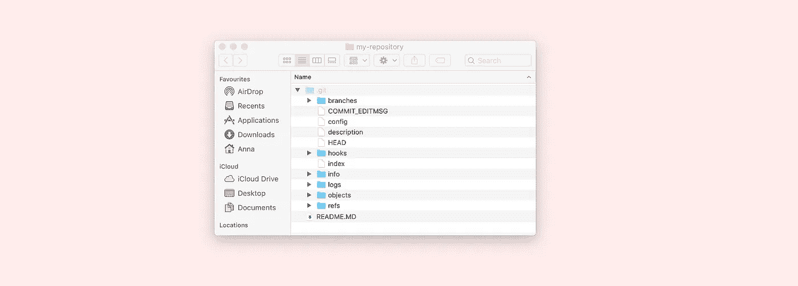
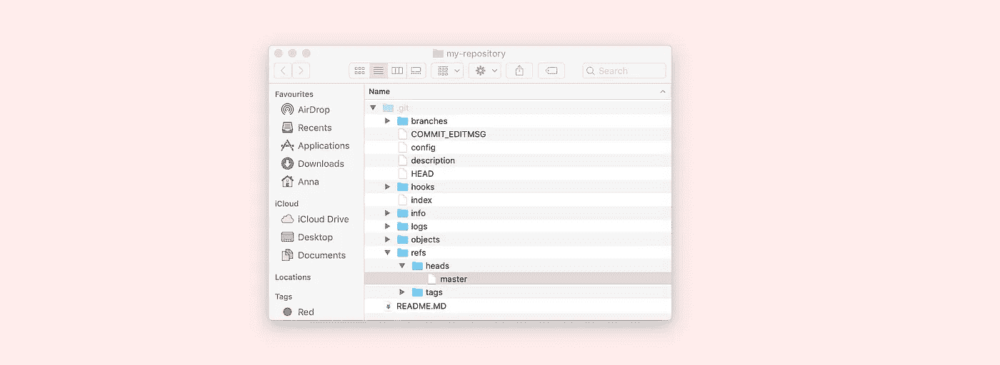
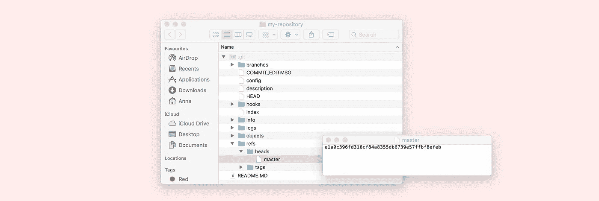
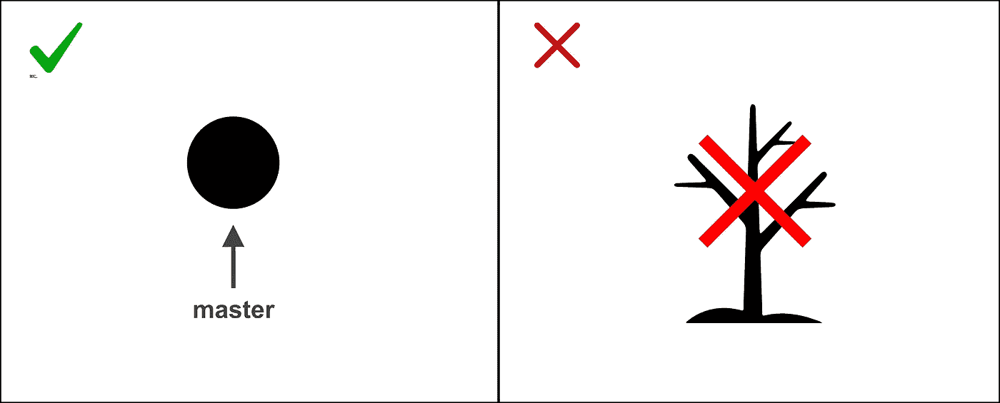
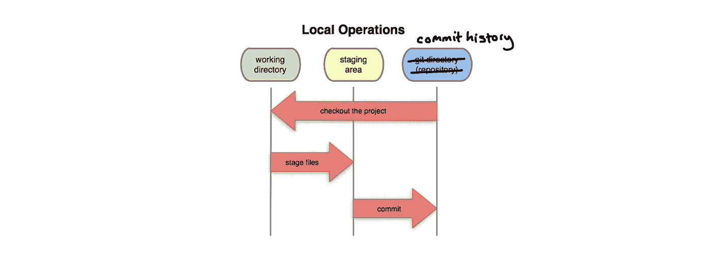
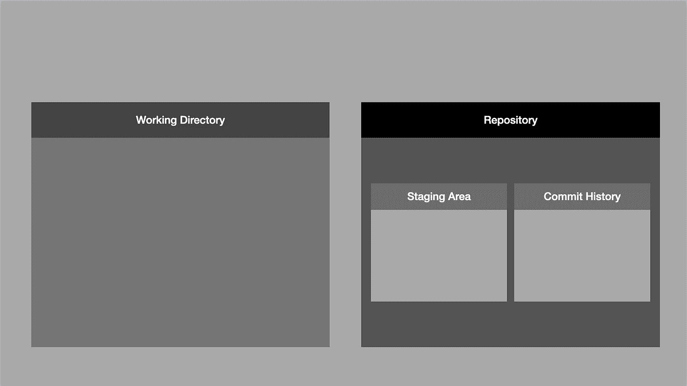

# 从评价最高的老师那里更好地学习 Git(版本控制)的 4 个技巧

> 原文：<https://medium.com/javarevisited/4-tips-to-learn-git-version-control-from-a-highest-rated-teacher-6c73fe013b7c?source=collection_archive---------2----------------------->

那么我是谁？

我叫安娜，我在 www.techjourneywithanna.com 的**和我自己的平台[**上教 Git(版本控制)！**](http://www.techjourneywithanna.com!)**

********

****这里是我给学习 Git 的人的一些建议。****

# ******1。建立 Git 如何工作的心智模型******

****学习 Git 时要做的最重要的事情之一是建立一个关于它如何工作的准确的心智模型。****

****我说准确是因为很多时候当我们第一次学习 Git 时，我们对它的理解是不准确的。****

****我举个例子解释一下。****

****许多新的 Git 学习者在某个时候开始学习分支。从名字和网上众多的彩色图表中，很容易理解 Git 中的分支就像树枝。****

****但是，事实并非如此！****

> ****Git 中的分支只是指向提交的指针。****

****要清楚地看到这一点，请尝试这个练习。****

******第一步:转到您计算机上的任何本地存储库******

********

****第二步:显示所有隐藏的文件，这样你就可以看到你的。git 文件夹(这是管理您的存储库的文件夹)。在 mac 上，你必须按住 Cmd + Shift +。(点)。在 windows 电脑上，你必须进入设置才能显示隐藏文件。然后，查看。git 文件夹。****

********

****第三步:在。git 文件夹查看一个名为“refs”的文件夹的内容。然后看一个名为‘heads’的文件夹的内容。在这里，您应该为存储库中的每个分支准备一个文件。****

********

******第四步:点击其中一个代表你的存储库中的一个分支的文件。******

****你看到了什么？****

****一个提交散列！****

********

****因为就像我们说的，**分支只是指向提交的指针。这就是为什么每个分支文件只存储该分支指向的提交散列。******

********

****因此，为 Git 机器如何运行建立正确的心理模型对于顺利使用它至关重要。当我设计我的课程时，这是我的主要关注点。****

# ****2.掌握基础知识****

****当我们第一次学习 Git 时，大多数人都被告知 Git 初学者的口头禅:****

****🎶git 添加 git 提交 git 推送 git 添加 git 提交 git 推送🎶****

****但是我们真的深入了解发生了什么吗？****

****重新学习 Git 对我来说是一次非常谦卑的经历，因为我不得不多次回到基础。****

****当我不得不承认自己并不真正了解或理解一些事情时(即使是在编码了几个月之后)，我经常感到尴尬。****

****但是！当我允许自己再次成为一个完全的初学者，并谦虚地尝试从一张空白的画布上学习一些东西时，神奇的事情发生了！(我经常发现我不是唯一一个误解或不真正理解某事的人。)****

****例如，当我们第一次学习 Git 时，我们中的许多人认为提交存储了我们项目的一个版本和另一个版本之间的差异。****

****但事实并非如此。这是一个错误的心理模型。****

****提交就像是项目的独立版本(通常称为快照)。****

****每个提交基本上都在其中存储了作为项目版本一部分的每个文件。****

****这就是为什么当您签出一个提交时，您只是在查看项目的一个不同版本。****

****

节选自斯科特·沙孔和本·施特劳布的 Git 圣经——Pro Git**** 

# ****3.使用 Git 并自己进行测试****

****熟悉 Git 并真正确保理解它的最好方法之一就是使用它。并测试你认为事情是如何工作的是否是它们真正的工作方式。****

****我来分享一个故事。我在网上看到过这个非常普通的图表:****

********

****但是当我开始摆弄 Git 时，我意识到这个图有点误导。****

****例如，您可能知道(或者现在您将了解)Git 中 staging area 的另一个术语是“index”。它们是一回事。****

****如果你仔细观察。git 目录(您可以使用与第一个练习中相同的目录)您会发现一个名为 index 的文件。****

****这是您的暂存区(不需要查看文件内部，它是乱码，超出了本文的范围)。****

********

****所以实际上集结地在。git 目录。所以对上图做个注解会更准确。****

********

****为了对正在发生的事情建立一个更清晰的心理模型，我甚至绘制了一个新的图表来帮助我更好地理解事情。这是我在[我的课程](https://www.udemy.com/course/git-learning-journey/?referralCode=3FA102A7FD43300B5BC2)中使用的图表，为了解释 Git 的所有不同部分！****

********

****如果你想了解这个图表的不同部分，请查看[这个视频](https://www.youtube.com/watch?v=8Reyz6JKtJs)和[这个视频](https://www.youtube.com/watch?v=UYtUFKn1hXw)。****

****所以，花些时间在 Git 中尝试一些东西，测试你认为你知道的东西，这将帮助你获得更多的 Git 信心。****

# ****4.花时间从你的奋斗中学习****

****你在工作中遇到了一个 Git 问题。或者你一个人在家工作，发现自己陷入了困境。****

****所以你向那些更有经验的 Git 大师(高级开发人员等)寻求帮助。).****

****他们来了。****

****他们救了你。****

****你回到了安全的水域。****

****这就是我最初几个月作为开发人员的工作。我希望我做得更多的是，请我的救世主向我深入解释我不明白的事情。或者花时间独立研究情况。这将使 Git 学习之旅更加顺畅和简洁！****

********

****就是这样！希望以上四个小技巧对你的 Git 学习之旅有所帮助！****

****如果你正在寻找一门以简单易懂的方式教授 Git 的**在线课程**，那么请随时在 [**Udemy**](https://www.udemy.com/course/git-learning-journey/?referralCode=3FA102A7FD43300B5BC2) 或我的 [**自有平台 www.techjourneywithanna.com**](https://www.techjourneywithanna.com/courses/git-learning-journey)上查看我的课程！****

********

****您还可以:****

*   ****查看我的 [**YouTube 频道**](https://www.youtube.com/channel/UCa6kP6qEgN6VL1lraEiybmw) ，我在上面有[我的课程](https://www.udemy.com/course/git-learning-journey/?referralCode=3FA102A7FD43300B5BC2)的前 8 课！📹****
*   ****在 insta gram[**上关注我** @techjourney_with_anna](https://www.instagram.com/techjourney_with_anna/?hl=en) 😊****
*   ****加入我的**邮件列表** ✉️****
*   ****跟着我上 [**Eventbrite**](https://www.eventbrite.co.uk/o/tech-journey-with-anna-30644673564) 🗓****
*   ****在 [**LinkedIn**](https://www.linkedin.com/in/annaskoulikari/) 上与我联系💼****
*   ****或者直接给我发邮件:**annaskoulikari@gmail.com******
*   ****额外收获:对于任何说法语的🇫🇷人来说，[我的课程也有法语版](https://www.udemy.com/course/apprentissage-de-git/?referralCode=F9939C7F0EE0952189E4)**！******

******这里是安娜课程中的一个例子——[git 和 Github 的区别](https://www.youtube.com/watch?v=p1elfqWXCrc)在[Java 访问了 Youtube 频道](https://www.youtube.com/channel/UC-SMdnyK2MBhLzw8zJXIWmQ)******