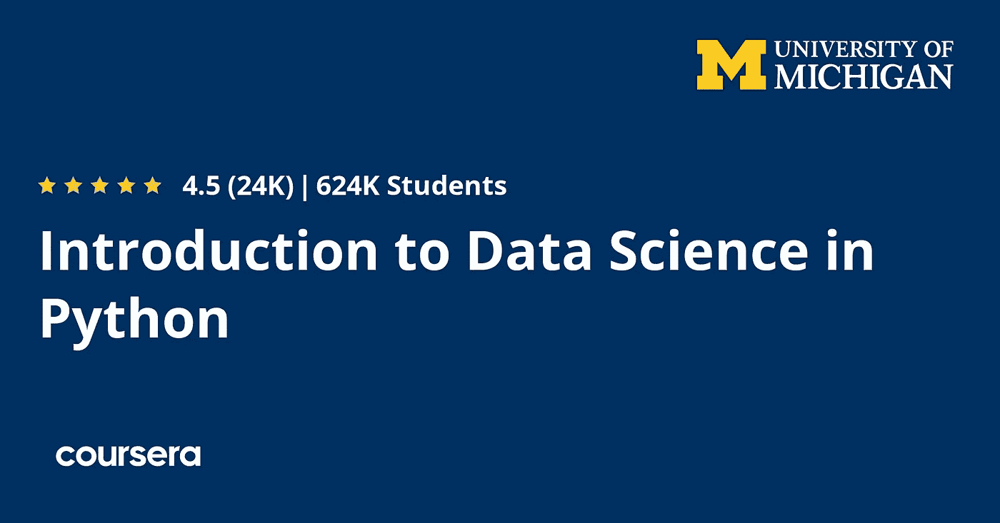
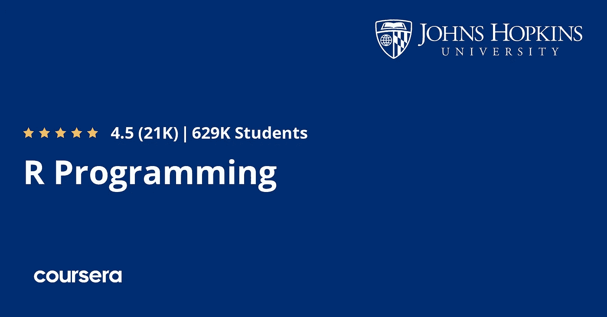
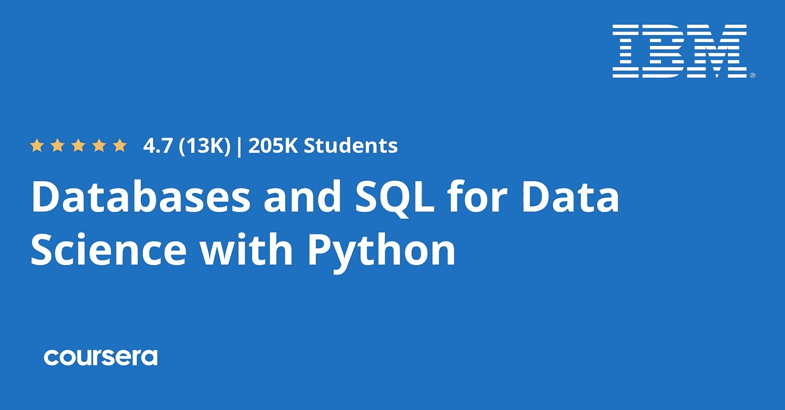
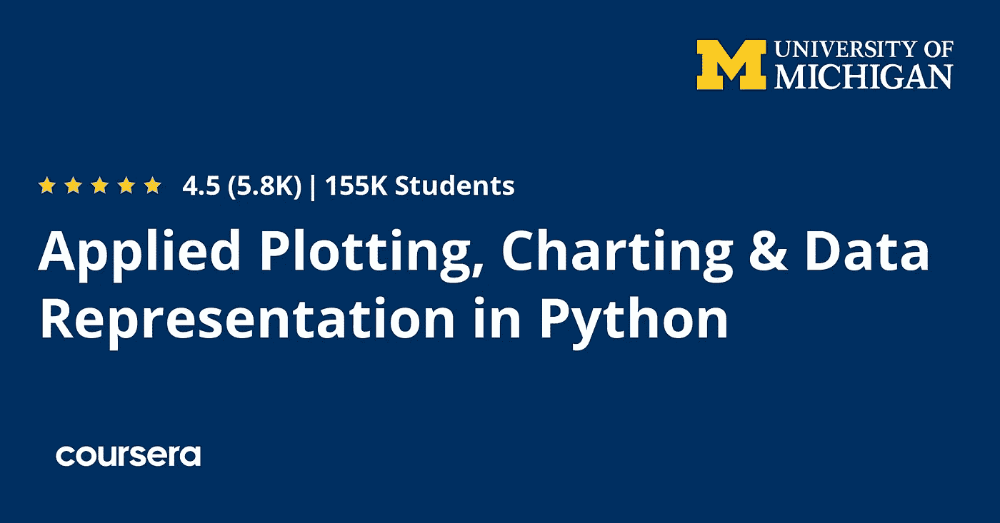
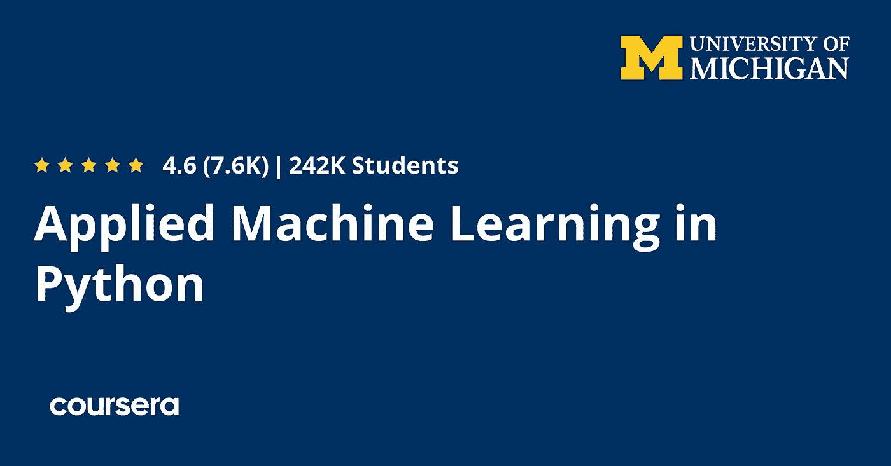

# Coursera 上 2022 年初学者学习数据科学和机器学习的 5 门最佳免费课程

> 原文：<https://medium.com/javarevisited/5-best-free-coursera-courses-for-data-scientists-and-machine-learning-engineers-74017e148d22?source=collection_archive---------2----------------------->

## 这些是学习基本数据科学技能的最佳免费 Coursera 课程，如数据分析、SQL、数据可视化和重要的 Python 库，如 matplotlib

大家好，如果你想在 2022 年成为一名数据科学家或机器学习工程师，并想在 Coursera 上学习数据科学，但正在寻找免费的 Coursera 数据科学课程，那么你来对地方了。

早些时候，我分享了数据科学的 [**最佳 Coursera 课程**](/javarevisited/11-best-coursera-certifications-and-courses-for-data-science-and-analysis-in-2021-65ce1ac810a5) 以及 [**15 个免费 Coursera 课程**](/javarevisited/top-15-free-coursera-courses-and-certifications-for-it-professionals-384207d56f45) 我分享了几个免费的数据科学课程，但你们中的许多人问得更多，

因此，我写了这篇文章，分享了 *5 个最好的数据科学免费课程*。这些课程是从顶尖大学如约翰霍普金斯大学、密歇根大学以及著名的科技公司如 IBM 中挑选出来的。

你可以免费旁听这些课程，学习 2021 年的关键数据科学概念。

大多数人认为他们需要一大笔钱去大学学习，并获得数据科学的学位来获得工作所需的技能，但实际上，他们并不需要这样做。

对合格数据科学家的需求已经上升，许多公司更关心你的技能以及你将从你那里获得的价值，而不是你在大学获得的学位。

不过，如果你有大学的数据科学学位，在实践中学习这个领域会更好。

许多[在线课程](/javarevisited/my-favorite-data-science-and-machine-learning-courses-from-coursera-udemy-and-pluralsight-eafc73acc73f)将帮助你实现这一目标，其中一个最好的平台被称为 [**Coursera**](https://coursera.pxf.io/c/3294490/1164545/14726?u=https%3A%2F%2Fwww.coursera.org%2F) ，课程几乎无所不包，不仅仅是数据科学，而且是免费的。但是要有证书就必须交钱。

<https://coursera.pxf.io/c/3294490/1164545/14726?u=https%3A%2F%2Fwww.coursera.org%2F>  

在这篇文章中，我整理了一份学习数据科学的最佳课程列表，即使你已经在这个领域工作，也可以提高你的技能。

他们的目标是初学者和中级数据科学从业者，但即使你知道[数据科学](/javarevisited/10-free-data-science-online-courses-for-beginners-a5fe78c2cb7b)，你也可以使用这些免费的在线课程来填补你的学习空白。他们由专家教授，总有东西可以学。

# 2022 年 Coursera 上的 5 个最佳数据科学和机器学习课程及认证

这里是我的免费 Coursera 课程列表，你可以加入学习数据科学。这个列表包括学习数据科学基础知识的免费课程，像 [Python](/javarevisited/10-best-python-certification-courses-from-coursera-4576890eb6b3) 和 [R Programming](/javarevisited/10-best-r-programming-courses-for-data-science-and-statistics-8f84ebec4974) 、 [SQL](/javarevisited/8-free-oracle-database-and-sql-courses-for-beginners-f4e9b25b33c4) 、[数据科学工具](/javarevisited/10-essential-tools-data-scientists-should-learn-in-2022-acbae6558643)，以及像 [NumPy](/javarevisited/6-best-online-courses-to-learn-numpy-for-beginners-60120f611e06) 、 [Sci-kit Learn](/javarevisited/5-best-scikit-learn-online-courses-for-machine-learning-and-data-science-6beb02e9cca0) 、matplotlib 等库。

## 1.[Python 中的数据科学介绍](https://coursera.pxf.io/c/3294490/1164545/14726?u=https%3A%2F%2Fwww.coursera.org%2Flearn%2Fpython-data-analysis)【免费】

这是 Coursera 上最受欢迎的用 Python 学习数据科学的免费课程之一。超过 614，000 人加入了这个学习数据科学的免费课程。这是初学者的理想课程，如果你打算同时学习 python 和数据科学，应该首先学习这门课程。

您将开始学习 python 的基础知识，如数据类型和函数，并使用 [NumPy](https://numpy.org/) 库从 CSV 文件和数值计算中读取数据。

接下来，您将看到如何使用 pandas 的简单命令，如索引和处理缺失值。你将学习 panda 库中更复杂的命令，比如合并数据框，生成汇总表。

最后，获取统计数据，比如分布和其他形式的结构化数据。谈到社会证明，已经有超过 62.4 万人加入了这个免费课程。

这里是加入这个免费课程的链接—[Python 中的数据科学简介](https://coursera.pxf.io/c/3294490/1164545/14726?u=https%3A%2F%2Fwww.coursera.org%2Flearn%2Fpython-data-analysis)

该课程由美国密歇根大学提供，也是 Python 专业 [**应用数据科学**](https://coursera.pxf.io/c/3294490/1164545/14726?u=https%3A%2F%2Fwww.coursera.org%2Fspecializations%2Fdata-science-python) 的一部分，如果你想获得 Coursera 的数据科学认证，可以加入该课程。

<https://coursera.pxf.io/c/3294490/1164545/14726?u=https%3A%2F%2Fwww.coursera.org%2Fspecializations%2Fdata-science-python>  

## 2.[约翰·霍普金斯大学 R 编程](https://coursera.pxf.io/c/3294490/1164545/14726?u=https%3A%2F%2Fwww.coursera.org%2Flearn%2Fr-programming)

数据科学家使用的一种流行编程语言是 R 编程语言。这是另一个面向数据科学家的流行的免费 Coursera 课程，它将教你如何使用 R 编程进行数据科学。

在本课程中，您将在不同的环境(如 macOS 和 Windows)上安装和配置 R studio IDE，然后开始学习 R 数据类型，如向量&列表、矩阵、因子、数据帧。

接下来，您将看到像 if 语句、for 循环、while 循环和 scooping 规则这样的控制结构。稍后，您将讨论循环函数，比如对列表应用循环、应用、分割，以及调试工具，比如诊断问题等等。

最后，学习如何用 R 语言模拟数据，学习如何生成随机数，模拟线性模型。简而言之，约翰霍普金斯大学学习数据科学 R 编程的最佳课程之一。

谈到社会证明，已经有超过 629，000 人加入了这个 Coursera 课程，这充分说明了这个课程的受欢迎程度。

**这里是加入这个课程**——[约翰·霍普金斯大学 R 编程](https://coursera.pxf.io/c/3294490/1164545/14726?u=https%3A%2F%2Fwww.coursera.org%2Flearn%2Fr-programming)的链接

本课程也是 Coursera 和约翰霍普金大学广受欢迎的 [**数据科学专业**](https://coursera.pxf.io/c/3294490/1164545/14726?u=https%3A%2F%2Fwww.coursera.org%2Fspecializations%2Fjhu-data-science) 的一部分，这是一个开启你数据科学职业生涯的伟大计划。由顶尖教授开发和教授的数据科学十门课程简介。

<https://coursera.pxf.io/c/3294490/1164545/14726?u=https%3A%2F%2Fwww.coursera.org%2Fspecializations%2Fjhu-data-science>  

## 3.[使用 Python 开发用于数据科学的数据库和 SQL](https://coursera.pxf.io/c/3294490/1164545/14726?u=https%3A%2F%2Fwww.coursera.org%2Flearn%2Fsql-data-science)

这是另一个面向数据科学家的受欢迎的免费 Coursera 课程。这个由 IBM 提供的免费课程由 Ravi Ahuja 教授，将教你 SQL，一个数据科学的基本工具。 [SQL 语言](https://javarevisited.blogspot.com/2018/05/top-5-sql-and-database-courses-to-learn-online.html)也在数据科学家中广泛使用，用于从数据库中提取数据进行分析。

在这门免费课程中，您将学习基本的 SQL 语句，并在实时数据库上练习它们，如 [SELECT](https://javarevisited.blogspot.com/2011/10/selct-command-sql-query-example.html#axzz6pRY6p3if) & INSERT 语句。然后，您将理解数据库关系及其背后的概念，以及如何创建表。

接下来，您将学习如何使用字符串模式和游侠，以及对结果集进行排序和分组。您还将发现内置的数据库功能。稍后，您将学习如何使用 [python 语言](/swlh/5-free-python-courses-for-beginners-to-learn-online-e1ca90687caf)访问数据库，比如创建表格和加载数据。

最后，您将看到一些针对数据工程师的 SQL 高级命令。超过 205000 人加入了这个课程，在 Coursera 上学习数据科学的 SQL。

**这是参加本课程的链接**——[数据库和 SQL for Data Science with Python](https://coursera.pxf.io/c/3294490/1164545/14726?u=https%3A%2F%2Fwww.coursera.org%2Flearn%2Fsql-data-science)

本课程也是 IBM 著名的 [**数据科学基础与 Python 和 SQL 专业**](https://coursera.pxf.io/c/3294490/1164545/14726?u=https%3A%2F%2Fwww.coursera.org%2Fspecializations%2Fdata-science-fundamentals-python-sql) 的一部分，这是一个为您的数据科学职业生涯奠定基础并开发 Jupyter、Python 和 SQL 实践经验的伟大计划。对真实数据集进行统计分析。

<https://coursera.pxf.io/c/3294490/1164545/14726?u=https%3A%2F%2Fwww.coursera.org%2Fspecializations%2Fdata-science-fundamentals-python-sql>  

## 4.[应用 Python 进行绘图、制图&数据表示](https://coursera.pxf.io/c/3294490/1164545/14726?u=https%3A%2F%2Fwww.coursera.org%2Flearn%2Fpython-plotting)

数据可视化和从数据中提取有意义的见解是数据科学家的主要目的和工作。你会明白信息可视化的原理。

然后，您将使用真实数据深入图表，并使用 matplotlib 创建散点图、折线图、条形图等图形。

本课程也是 Python 专业 应用数据科学 [**的一部分，是 Coursera 上数据科学的热门认证之一。**](https://coursera.pxf.io/c/3294490/1164545/14726?u=https%3A%2F%2Fwww.coursera.org%2Fspecializations%2Fdata-science-python)

您还将探索图表的基本原理，并实现新的可视化图表，如支线图、直方图、箱线图和热图。

最后，您还将了解如何使用 [pandas](https://becominghuman.ai/5-best-courses-to-learn-pythons-pandas-libary-for-data-analysis-and-data-science-34b62abb0e96) 库和 matplotlib 等数据可视化库以及其他数据可视化工具 seaborn 来实现统计可视化。

**这里是加入本课程** — [应用绘图，用 Python 制作&数据表示](https://coursera.pxf.io/c/3294490/1164545/14726?u=https%3A%2F%2Fwww.coursera.org%2Flearn%2Fpython-plotting)的链接

## 5.[在 Python 中应用机器学习](https://coursera.pxf.io/c/3294490/1164545/14726?u=https%3A%2F%2Fwww.coursera.org%2Flearn%2Fpython-machine-learning)

预测数据科学家是使用机器学习算法和模型创建的。本课程将从机器学习和 sci-kit-learn 库的基础开始，并了解如何使用[K-最近邻](/javarevisited/5-machine-learning-algorithms-every-data-scientists-should-learn-de467fd2e444)应用分类。

您还将了解监督学习以及如何应用分类和回归、过拟合和欠拟合、逻辑回归、支持向量机。

然后你将评估和优化模型的性能。最后，你将深入高级监督学习，如随机森林和神经网络。

该课程也是由美国顶级大学之一密歇根大学提供的 Python 专业 应用数据科学 [***的一部分。***](https://coursera.pxf.io/c/3294490/1164545/14726?u=https%3A%2F%2Fwww.coursera.org%2Fspecializations%2Fdata-science-python)

总之，用 Python 学习机器学习最好的免费 Coursera 课程之一。超过 237，000 名学生已经加入了这个课程，你也可以加入。

**这里是加入本课程**—[Python 中的应用机器学习](https://coursera.pxf.io/c/3294490/1164545/14726?u=https%3A%2F%2Fwww.coursera.org%2Flearn%2Fpython-machine-learning)的链接

以上是 Coursera 为初学者提供的**最佳免费数据科学课程**。对了，数据科学不仅仅是上一些课，自称数据科学家。

不过，你必须[学习统计学](/javarevisited/5-best-mathematics-and-statistics-courses-for-data-science-and-machine-learning-programmers-bf4c4f34e288?source=---------23----------------------------)并在真实世界的数据集上进行越来越多的练习，才能有资格在一家公司获得一个通过数据为他们做出决策的职位。

虽然参加这些[免费的 Coursera 课程](https://javarevisited.blogspot.com/2021/05/15-free-coursera-courses-to-learn-online.html)不会让你成为数据科学家，但它们会指导你并教会你在数据科学领域开始职业生涯所需的关键技能，你需要努力工作来应用你所学的知识。

顺便说一句，如果你喜欢 Coursera 课程和认证，那么我也建议你加入 [**Coursera Plus**](https://coursera.pxf.io/c/3294490/1164545/14726?u=https%3A%2F%2Fwww.coursera.org%2Fcourseraplus) ，这是 Coursera 的一个订阅项目，让你可以访问 7000 多门顶级 Coursera 课程和无限制的认证，每月仅需 59 美元。

<https://coursera.pxf.io/c/3294490/1164545/14726?u=https%3A%2F%2Fwww.coursera.org%2Fcourseraplus>  

你可能喜欢的其他 **Coursera 和编程文章**

*   [开始职业生涯的十大 Coursera 认证](/javarevisited/top-10-coursera-certificates-to-start-your-career-in-cloud-data-science-ai-mainframe-and-it-558690c83587)
*   [谷歌和 IBM 的 18 门 Coursera 课程](/javarevisited/18-coursera-courses-you-can-join-in-2020-to-learn-from-the-worlds-top-tech-companies-google-74af46967d1e?source=collection_home---4------0-----------------------)
*   [面向程序员和开发人员的 Coursera 十大项目](https://javarevisited.blogspot.com/2020/08/top-10-coursera-projects-to-learn-essential-programming-skills.html)
*   [2022 年学习 Python 可以做的 8 个项目](/javarevisited/8-projects-you-can-buil-to-learn-python-in-2020-251dd5350d56)
*   [你可以在 Coursera 上在线申请的前 5 个计算机科学学位](https://javarevisited.blogspot.com/2020/04/is-it-possible-to-get-master-of-computer-science-degree-online-coursera.html)
*   [2022 年程序员十大课程课程](https://javarevisited.blogspot.com/2020/08/top-10-coursera-courses-specilizations-and-certifications.html)
*   [Udemy vs Coursera？学理工和编程哪个好](https://javarevisited.blogspot.com/2020/01/coursera-vs-udemy-which-is-better-for-programming-tech.html)
*   Coursera 证书对工作和事业有帮助吗？
*   [2022 年学习人工智能的 7 门最佳课程](/javarevisited/7-best-courses-to-learn-artificial-intelligence-in-2020-26d59d62f6fe)
*   [学习 Python 的 10 个教程和证书](https://javarevisited.blogspot.com/2020/02/10-best-coursera-courses--for-python.html)
*   [5 个最佳 Coursera 程序员职业证书](https://javarevisited.blogspot.com/2019/10/top-5-coursera-professional-certificates-for-programmers-IT-professionals.html)
*   [Coursera Plus Review——在 Coursera 上学习的更好方式](https://javarevisited.blogspot.com/2020/08/coursera-plus-better-way-to-take-coursera-courses-specilizations-certification.html)
*   [Udemy vs CodeCademy vs OneMonth？](https://javarevisited.blogspot.com/2019/09/codecademy-vs-udemy-vs-onemonth-which-is-better-for-learning-code.html#axzz6VYKcmyZz)
*   Udemy vs Educative vs Codecademy？新手用哪个比较好
*   [Udemy vs Pluralsight？哪个学习平台比较好？](https://javarevisited.blogspot.com/2019/10/udemy-vs-pluralsight-review-which-is-better-to-learn-code.html)
*   [你可以在 Coursera Online 上获得 5 个数据科学学位](https://www.java67.com/2020/06/top-5-data-science-degree-you-can-earn-online-coursera-edx.html)
*   [Coursera 的 10 项数据科学和机器学习认证](/javarevisited/top-10-machine-learning-and-data-science-certifications-and-training-courses-for-beginners-and-a6308497b764)

感谢您阅读本文。如果你喜欢这些 2022 年数据科学和机器学习的最佳免费 Coursera 课程，请与你的朋友和同事分享。如果您有任何问题或反馈，请留言。

**附言——**如果你喜欢学习 Udemy 课程，并且正在寻找 Udemy 上最好的数据科学课程，那么我强烈推荐你参加 Udemy 上的这个 [**数据科学训练营 2022**](https://click.linksynergy.com/deeplink?id=CuIbQrBnhiw&mid=39197&murl=https%3A%2F%2Fwww.udemy.com%2Fcourse%2Fthe-data-science-course-complete-data-science-bootcamp%2F) 课程。这是最全面的课程之一，学习时间为 28.5 小时，已经有超过 40 万名学生参加了该课程。

<https://click.linksynergy.com/deeplink?id=CuIbQrBnhiw&mid=39197&murl=https%3A%2F%2Fwww.udemy.com%2Fcourse%2Fthe-data-science-course-complete-data-science-bootcamp%2F> 