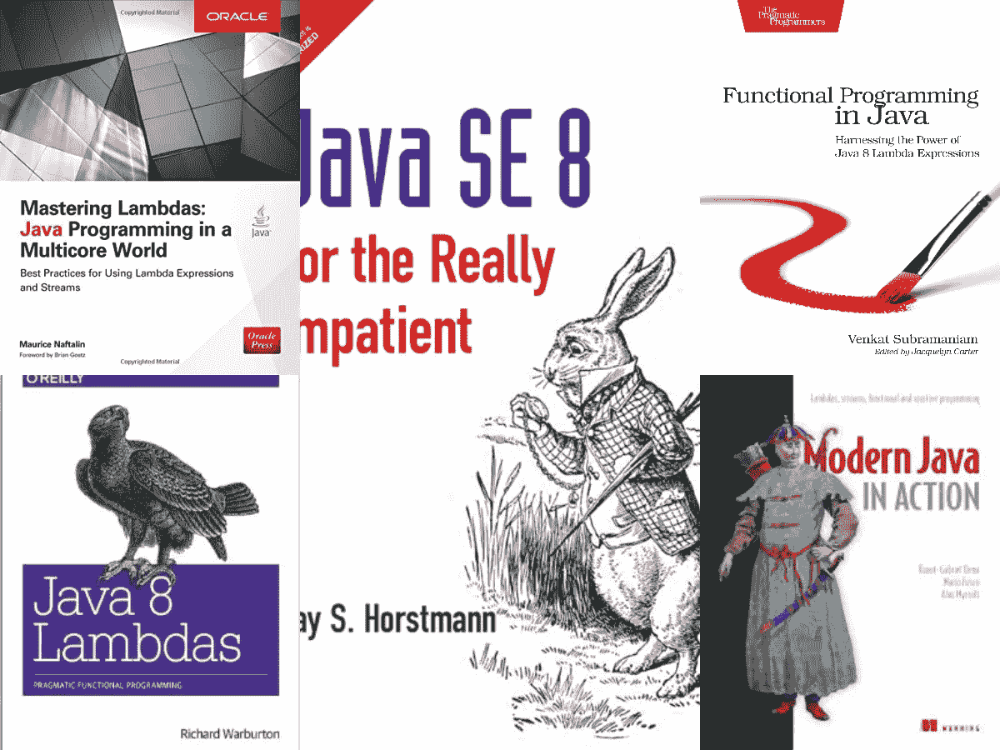
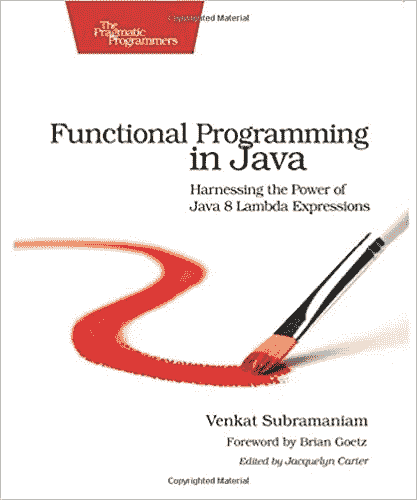
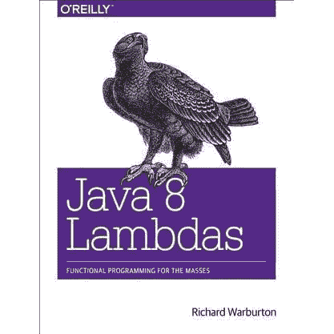
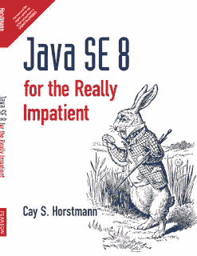
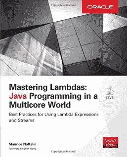

# 2023 年 Java 程序员的 5 本最佳函数式编程书籍

> 原文：<https://medium.com/javarevisited/5-best-java-functional-programming-books-for-beginners-and-experienced-programmers-4daecd159756?source=collection_archive---------0----------------------->

## 想学习 Java 中的函数式编程？以下是你可以从阅读开始的最佳书籍

如果你想学习 Java 中的函数式编程并寻找最好的书籍和资源，那么你来对地方了。早些时候，我已经分享了[最佳 Java 函数式编程课程](/javarevisited/8-best-lambdas-stream-and-functional-programming-courses-for-java-developers-3d1836a97a1d)，今天，我将分享你可以阅读的学习 Java 函数式编程的最佳书籍。

如果你关注 Java 更新，你可能知道 Java 15 已经发布，Java 16 也在路上，但是我经常收到电子邮件和询问，询问一些关于学习函数式编程和 Java 8 特性的伟大的**书籍，特别是 lambdas 和 stream，它们使函数式编程在 Java 中成为可能。**

由于 Java 8 在语言和 API 增强方面与任何其他 JDK 版本都非常不同，所以你真的需要一本优秀的书来学习基础知识。简而言之，根据我 2 年来学习和阅读 Java 8 书籍的经验，我可以说 [**Java SE 8 对于实在没有耐心的人来说**](http://www.amazon.com/Java-SE8-Really-Impatient-Course/dp/0321927761?tag=javamysqlanta-20) 无疑是学习 Java 8 的最佳书籍。

它涵盖了 JDK 8 中发布的所有基本内容，不仅仅是 lambda 表达式和流，还包括新的日期和时间 API 以及其他几个较小的增强但却很重要的功能，这些功能经常被忽视。

它不会用完整的细节吓到你，也不会告诉你作为一个应用程序开发人员需要知道什么。它不会教你函数式编程的基础，但会向你展示如何使用 map 和 flatMap 操作。

好吧，这是简短的回答，更长的回答是你不能通过阅读一本书来了解关于 Java SE 8 的一切。你必须读几本书来掌握 Java 8 的新特性，比如[λ表达式](http://javarevisited.blogspot.com/2014/02/10-example-of-lambda-expressions-in-java8.html)和[流](http://javarevisited.blogspot.sg/2014/03/2-examples-of-streams-with-Java8-collections.html)。关于这些特性，除了写几行代码之外，还有很多东西需要学习。事实上，认识到所有可以使用 Java 本身的函数式风格的地方需要时间，但是听取多位作者的意见确实有所帮助。

在这篇文章中，我准备分享几本这样的书来学习和掌握 Java 8，顺便说一句，如果你喜欢网络课程的话， [**完整的 Java MasterClass**](https://click.linksynergy.com/fs-bin/click?id=JVFxdTr9V80&subid=0&offerid=323058.1&type=10&tmpid=14538&RD_PARM1=https%3A%2F%2Fwww.udemy.com%2Fjava-the-complete-java-developer-course%2F) 是我推荐学习 Java 的课程。这是最新的课程，不仅涵盖了 Java 8，还涵盖了最新 Java 版本的其他变化。

<https://click.linksynergy.com/fs-bin/click?id=JVFxdTr9V80&subid=0&offerid=323058.1&type=10&tmpid=14538&RD_PARM1=https%3A%2F%2Fwww.udemy.com%2Fjava-the-complete-java-developer-course%2F>  

# 2023 年我最喜欢的 Java 函数式编程初学者和体验者书籍

2014 年 3 月 18 日，距离 Java SE 8 GA 的问世已经过去了 5 年多，现在已经是 2019 年，我可以看到 Java SE 8 的使用量在不断增长。许多公司正在迁移到 Java 8 运行时，其他公司已经指导开发人员以 Java SE 8 的方式编码，我的意思是通过使用 lambdas、stream 和方法引用。

如果你是一名拥有 4 到 5 年 Java 经验的高级 Java 开发人员，那么是时候学习和拥抱 Java 8 了。我确信，在接下来的日子里，Java 面试会期待一个对 Java 8 特性有很好了解的候选人。无论如何，这里是我为初学者和有经验的 Java 程序员列出的一些最好的 Java 8 和函数式编程书籍。

## 1.[文卡特·苏布拉马年的 Java 函数式编程](http://www.amazon.com/Functional-Programming-Java-Harnessing-Expressions/dp/1937785467?tag=javamysqlanta-20)

如果你正在寻找一本引人入胜且易于阅读的书来学习 Java 函数式编程，那么这是最适合你的书。由文卡特·苏布拉马年撰写，这本书解释了 Java 中函数式编程的内容、方式和原因。

我是文卡特·苏布拉马年的忠实粉丝，我看过他几次关于 Java 8 和 Scala 的演讲，我喜欢他解释事情的方式。Venkat 具有清晰、简洁和专注的教学方式，很少幽默，这对于教授像 [Java 或 Scala](http://javarevisited.blogspot.sg/2013/11/scala-vs-java-differences-similarities-books.html) 这样的编程语言非常重要。

我特别向想学习 Java 8 的 Java 初学者推荐这本书。Venkat 在从旧的 [Java 编码](/javarevisited/7-best-courses-to-learn-refactoring-and-clean-coding-in-java-47bea3c67006)的命令式方式过渡到新的、更少出错、更具表现力的 Java 编码函数式方式方面做得非常好。读起来也很有趣，真的很过瘾。

而且，如果你想把这本书和在线课程结合起来，我推荐你加入 Ranga Karnam 的《用 Lambdas & Streams 学习 Java 函数式编程》来进行主动学习。

## 2.Java 8 Lambdas:实用函数式编程，理查德·沃伯顿著

这是另一本学习 Lambda expression 函数式编程的好书。这本书的作者是理查德·沃伯顿(Richard Warburton)，他是一位 Java 冠军、作家和多视角讲师。

作为一个已经对[函数式编程](https://www.java67.com/2018/10/java-8-stream-and-functional-programming-interview-questions-answers.html)和 Java 8 的新特性有所了解的人，我也很喜欢阅读这本 OReilly Java 8 Lambdas 和函数式编程书籍，但我发现它确实很好地涵盖了新的 Java 8 APIs。这本书很好地展示了 Java 8 lambda 表达式和流 API 如何自然地融入现有的 Java 生态系统。我向想要深入学习 lambda 表达式的初学者和有经验的 Java 开发人员强烈推荐这本书。

而且，如果你需要一个关于 lambda expression 的在线课程，你可以看看我和 Lemuel 一起创建的相同主题的 Udemy 课程 。

## 3.[现代 Java 在行动](http://www.amazon.com/Java-Action-Lambdas-functional-style-programming/dp/1617291994?tag=javamysqlanta-20)

这是另一本学习 Java，尤其是 lambda 表达式和流 API 的优秀书籍。对于真正没有耐心的书来说，它比 Java SE 8 更加详细和全面。Raoul-Gabriel Urma 和他的团队在解释这些新语言特性背后的动机以及如何在 Java 8 中有效地使用它们方面做了出色的工作。

和上一本书一样，它也涵盖了 Java 8 的其他增强特性，比如日期和时间 API 以及并发性增强，比如 [CompletableFuture](https://www.java67.com/2022/02/completablefuture-in-java-with-example.html) 等。

它的旧版本甚至被命名为 Java 8 in Action，而新版本被命名为 Modern Java in action，以合并来自 Java 9、Java 10 等较新的 Java 版本的更改。

不过，如果你想深入学习 Stream API，我建议你看一下 Udemy 网站上纳尔逊·德加洛的 [**Java Stream API 开发者指南**](https://click.linksynergy.com/deeplink?id=JVFxdTr9V80&mid=39197&murl=https%3A%2F%2Fwww.udemy.com%2Fcourse%2Fjava-streams%2F) 课程。

## 4. [Java SE 8 给真正没有耐心的人](http://www.amazon.com/Java-SE8-Really-Impatient-Course/dp/0321927761?tag=javamysqlanta-20)

我说过，这是学习 Java 8 最好的书。也是我通用的 Java 8 书籍。如果你时间不多，并且想学习 Java 8 的所有重要知识，这本书是值得参考的。

我没必要提醒你关于凯的事。霍斯特曼的写作技巧，他是 Java 最好的作者之一，与约书亚·布洛赫齐名。我发现这两本书可读性都很强。你不会觉得无聊，通常程序员看技术书都会觉得无聊。它解释了 [lambda 表达式](https://javarevisited.blogspot.com/2020/04/top-5-courses-to-learn-java-collections-and-streams.html)、[流](/javarevisited/7-best-java-tutorials-and-books-to-learn-lambda-expression-and-stream-api-and-other-features-3083e6038e14?source=---------14------------------)、[函数接口](https://javarevisited.blogspot.com/2018/01/what-is-functional-interface-in-java-8.html#ixzz6YkAnyRbL)、方法引用、新的 Java 日期和时间 API，以及其他几个小的增强，如连接字符串、可重复注释等。

总之，学习 Java 最好的书。如果你愿意，你可以通过参加 Pluralsight 的[**Java 8 新特性**](https://pluralsight.pxf.io/c/1193463/424552/7490?u=https%3A%2F%2Fwww.pluralsight.com%2Fcourses%2Fjava-8-whats-new) 这样的课程来使它变得更好，它通过提供一些实际的学习经验来补充这本书。

顺便说一句，你需要一个 Pluralsight 会员才能参加这个课程，费用大约是每月 29 美元或每年 299 美元。尽管它提供了 5000 多门关于最新技术的高质量在线课程，包括测验、评估和项目。由于作为一名程序员，我们需要不断地学习，我强烈建议你加入像 Pluralsight 这样的学习门户网站。他们还有 10 天的免费试用期，你可以观看 200 分钟的任何课程，这样你就可以免费获得这门课程。

<http://pluralsight.pxf.io/c/1193463/424552/7490?u=https%3A%2F%2Fwww.pluralsight.com%2Flearn>  

## 5.掌握 Lambdas:多核世界中的 Java 编程

这是关于 lambda 表达式和流 API 的专业书籍。它没有涵盖 Java 8 的所有特性，像日期和时间 API 没有包括在本书中，但如果你真的想了解 lambdas 和 stream 背后的动机，这是值得一读的书。

第一次看 Maurice Naftalin 的 [Java 泛型和集合](https://www.freecodecamp.org/news/must-read-books-to-learn-java-programming-327a3768ea2f/#f2fc)时，我很喜欢他的风格，这是另一本关于泛型和集合的专家书。他也是 Java 8 的先驱之一，他的 [lambda faq](http://www.lambdafaq.org/) 网站。简而言之，如果你想详细了解 lambda a 流，这是可以参考的书。

以上是关于学习 Java 8 的最佳书籍。我认为这三本书足以让你很好地理解 Java 8 以及随之而来的所有新的语言特性。每个人都有不同的方法，但是，我喜欢从头到尾只读一本书，只有在他们读的时候才参考另一本书。
这样，我不用花太多时间就能得到这三本书的精华。

让我知道你对这些 Java 8 书籍的反馈，并随意推荐你认为真正值得一读的其他书籍。

顺便说一下，如果你正在准备 Java SE 8 认证，那么你也可以使用这些 [Java 8 认证书籍](http://javarevisited.blogspot.sg/2016/10/best-books-for-ocajp8-exam-1z0-808-java8.html)和[课程](https://javarevisited.blogspot.com/2018/01/top-5-java-8-certifications-courses-training-online-OCAJP.html)，它们也是关于 Java 8 特性的重要信息来源，但是是根据 OCAJP8 或 1z 0–808 考试的大纲编写的。

其他 **Java 8 教程**你可能喜欢

*   从 JDK 8 到 JDK 13，学习 Java 新特性的五大课程([课程](/javarevisited/top-5-courses-to-learn-new-features-of-java-8-to-java-13-107eb51d2a13))
*   10 Java 8 中连接字符串的示例([见此处](http://javarevisited.blogspot.sg/2016/06/10-examples-of-joining-string-in-java-8.html))
*   这些是学习 Java 8 和 Java 9 的免费课程([课程](https://www.freecodecamp.org/news/these-are-the-best-free-courses-to-help-you-learn-java-8-and-java-9-a7615c8644ab)
*   10 Java 8 中把列表转换成映射的例子([教程](http://www.java67.com/2018/01/how-to-convert-list-into-map-in-java-8.html)
*   学习 Java 8 编程的前 5 门课程(课程)
*   10 Java 8 中 forEach()方法示例([示例](http://java67.blogspot.com/2016/01/how-to-use-foreach-method-in-java-8-examples.html))
*   我最喜欢的免费课程深入学习 Java([课程](https://hackernoon.com/top-5-java-8-courses-to-learn-online-2db57d9dfb8d))
*   20 Java 8 中 LocalDate 和 LocalTime 的例子(见[此处](http://javarevisited.blogspot.com/2015/03/20-examples-of-date-and-time-api-from-Java8.html))
*   10 Java 8 中流 API 示例([见此处](http://java67.blogspot.com/2014/04/java-8-stream-examples-and-tutorial.html))
*   学习 Java 8 和函数式编程的 5 本书([列举](http://java67.blogspot.com/2015/07/5-books-learn-java-8-functional-programming.html))
*   Java 8 中如何使用 stream . map()([示例](http://java67.blogspot.com/2015/01/java-8-map-function-examples.html))
*   如何在 Java 8 中使用 stream . flat map([示例](http://java67.blogspot.com/2016/03/how-to-use-flatmap-in-java-8-stream.html))
*   Java 8 中 map()和 flatMap()的区别([答](http://javarevisited.blogspot.com/2016/03/difference-between-map-and-flatmap-in-java8.html))
*   如何在带有谓词和流的集合中使用 filter()
*   如何在 Java 8 中将 java.util.Date 转换成 java.time.LocalDate？([教程](http://javarevisited.blogspot.sg/2016/10/how-to-convert-javautildate-to-LocalDate-java8.html))

感谢您阅读本文。如果你觉得这些*最好的 Java 8 和函数式编程书籍有用*，那么请分享给你的朋友和同事。如果你有任何疑问或反馈，请留言，我会尽力回答你的问题。

**P. S.** —如果你正在寻找一门只学习 lambda 表达式和流 API 等 Java 8 特性的在线课程，那么你也可以看看 Udemy 上的 [**Java 8 函数式编程:Lambda 表达式快速**](http://bit.ly/2H2kNNt) 课程。这是完全免费的，你需要做的就是创建一个 Udemy 帐户并加入这个课程。

<http://bit.ly/2H2kNNt> 