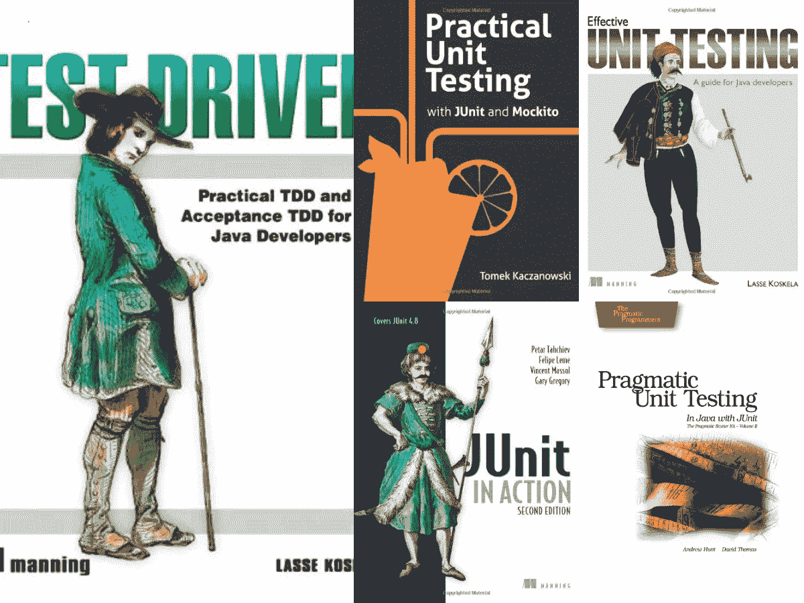
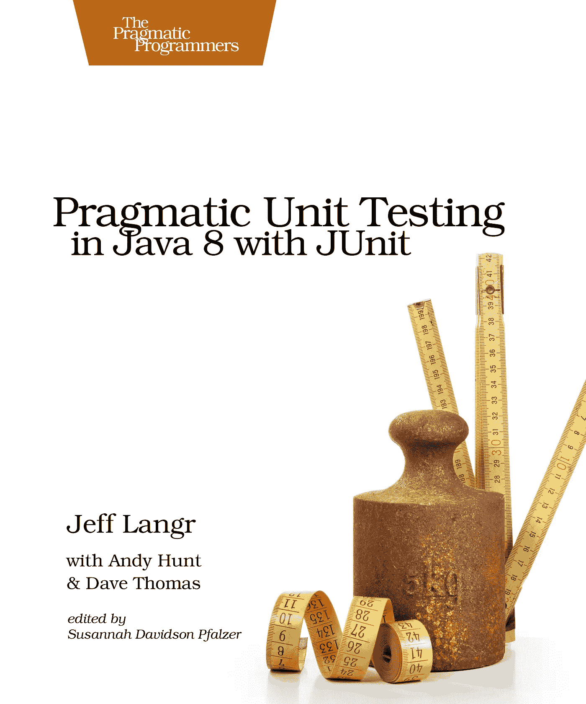
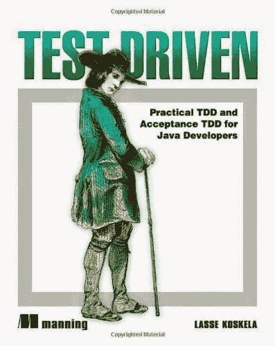
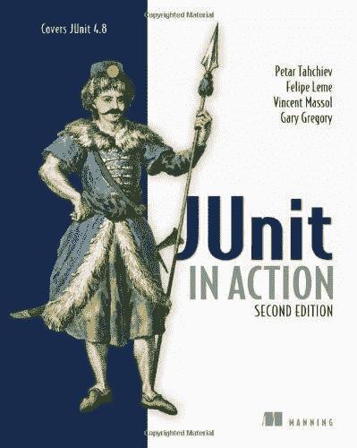
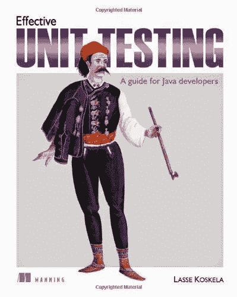
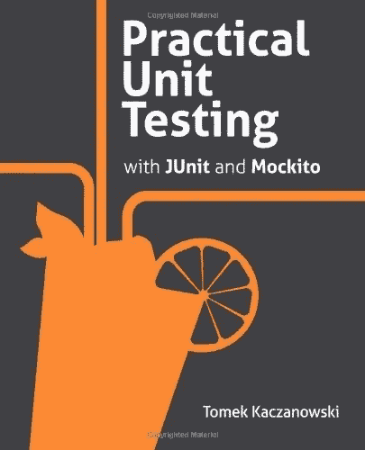

# 面向 Java 开发人员的 5 本最佳 JUnit 和测试驱动开发书籍

> 原文：<https://medium.com/javarevisited/5-best-junit-and-test-driven-development-books-for-java-developers-2d3fecb5c9ac?source=collection_archive---------0----------------------->

## 我最喜欢学习的书是《测试驱动开发》(TDD)、《JUnit》、《Mockito》和《Java 深度单元测试》。

你好，Java 程序员，如果你想学习 JUnit 和 Java 测试驱动开发，或者想提高你的 TDD 技能，并寻找最好的资源，如书籍和在线课程，那么你来对地方了。

早些时候，我已经分享了 Java 开发人员的最佳 JUnit 课程*，在这篇文章中，我将分享你可以阅读的学习 Java 测试驱动开发的最佳书籍，以及 JUnit 和 Mockito 等基本测试工具。*

*如果你做过一些专业的 Java 开发，你就会知道单元测试是一件必须学会适应的事情。在我看来，这是专业开发人员最应该学习的一项实践。这也是区别优秀程序员和专业程序员的一项技能。*

> *这是你可以看到一个程序员有多自律的一种方式？*

*也是写[干净代码](/javarevisited/7-best-courses-to-learn-refactoring-and-clean-coding-in-java-47bea3c67006)的最好方法；一个经得起时间考验的代码，一个适应未来变化的灵活代码，一个在变化中不害怕的代码。*

*尽管编程社区做出了一些努力来促进单元测试，许多著名的程序员也强调单元测试，但它仍然是缺乏实践的*之一*。

为了鼓励开发者去做单元测试，我尽量让它自然而不是一件特别的事情。我发现并不是程序员不想测试，或者他们没有时间，*而是因为他们并不真正知道如何对一个非平凡的代码进行单元测试。**

*对于某些人来说，为回文或[质因数程序](http://javarevisited.blogspot.sg/2014/05/how-to-find-prime-factors-of-integer-number-java.html)编写单元测试是很容易的，但是当涉及到为你正在开发的功能编写单元测试时，这些功能包括数据库连接、线程、对其他模块的依赖性以及没有明确的入口点，*程序员失去了热情和热情。既然用户或管理者不关心单元测试，程序员就不会把自己逼到他们通常会做的水平来使功能代码工作。我们如何解决这个问题？你如何开发这种代码意识来[编写单元测试](http://javarevisited.blogspot.sg/2013/03/how-to-write-unit-test-in-java-eclipse-netbeans-example-run.html#axzz569M5kyoZ)？如何将一个大的特性分解成可以独立测试的小单元？**

*听起来我是在谈论*测试驱动开发(TDD)* 吗？嗯，是的。即使你没有遵循真正意义上的 TDD，它也会帮助你学会很多对你的代码进行单元测试的技巧和技术。

另一方面，这是一个高级开发人员必须大放异彩的领域；他们的工作是在下一代 Java 开发人员中推广[最佳实践](http://javarevisited.blogspot.sg/2012/08/best-practices-to-write-junit-test.html)、[代码审查](http://javarevisited.blogspot.sg/2011/09/code-review-checklist-best-practice.html)和[单元测试](http://javarevisited.blogspot.sg/2013/03/how-to-write-unit-test-in-java-eclipse-netbeans-example-run.html)。

这篇文章将分享你喜欢阅读的学习单元测试、TDD 和 JUnit 的 5 本最佳书籍，这将帮助你学习单元测试并掌握编写好测试的艺术。在 Java 世界中，单元测试和 JUnit 是同义的，所以本书的大部分内容将教你使用 JUnit 进行单元测试。这很好，因为对 JUnit 如何工作以及如何使用不同的 JUnit 注释的全面了解将鼓励您编写更多的测试。如果你还需要在线课程来配合这本书，我强烈推荐你查看 Udemy 上的 [**JUnit 和 Mockito 速成班**](https://click.linksynergy.com/fs-bin/click?id=JVFxdTr9V80&subid=0&offerid=323058.1&type=10&tmpid=14538&RD_PARM1=https%3A%2F%2Fwww.udemy.com%2Fjunitandmockitocrashcourse%2F) 。*

* [## JUnit 和 Mockito 速成班:学习 JUnit 和 Mockito 单元测试

### Bharath Thippireddy 是一名企业家、软件架构师和公共演说家，他已经培养了超过 400000 名学生…

udemy.com](https://click.linksynergy.com/fs-bin/click?id=JVFxdTr9V80&subid=0&offerid=323058.1&type=10&tmpid=14538&RD_PARM1=https%3A%2F%2Fwww.udemy.com%2Fjunitandmockitocrashcourse%2F) 

我发现当我们把在线课程和书本结合起来时，我们学得更好。本课程提供了快速入门和帮助设置，而本书提供了深入的知识。

# 面向初学者和有经验的 Java 程序员的前 5 本 JUnit 和测试驱动开发书籍

这里是我为 Java 专业人士列出的掌握单元测试、JUnit 和测试驱动开发(TDD)的好书清单。尽管像单元测试这样的概念是语言不可知的，但是用你最了解的语言来学习技巧是有意义的。

由于每种语言的工具和技术都不同，核心概念保持不变，而且一些技术足够通用，可以在其他面向对象语言中使用，如 [C++](/@javinpaul/top-10-courses-to-learn-c-for-beginners-best-and-free-4afc262a544e) 或 [C#](https://javarevisited.blogspot.com/2019/11/top-5-courses-to-learn-c-sharp-in.html) 。

## 1.用 JUnit 在 Java 中进行实用单元测试

这是我读的第一本关于单元测试和 JUnit 的书，我仍然喜欢在有空的时候读它。这是一本很短的书，但不管写的是什么，都绝对是金玉良言。杰夫·朗格、安迪·亨特和迪夫·托马斯都做了出色的工作，在[介绍 JUnit](http://javarevisited.blogspot.sg/2012/06/junit4-annotations-test-examples-and.html) 之前，他们首先介绍了单元测试的概念和过程。解释流过，你觉得通过跟随本书中给出的少量例子，你正在学习一些东西。是的，这本书的例子有点少，但好的方面是每个例子都解释得很好。

我还记得我从这本书上学到的**正确缩写**，它帮助你思考边界条件测试。正确代表

1.  *一致性* —值是否符合预期的格式？
2.  *排序* —值是否按预期顺序排列？
3.  *范围* —数值是否在预期范围内？
4.  *引用* —代码是否引用了不受代码本身直接控制的任何外部事物？
5.  *存在* —价值存在吗？(null、非 null、集合中存在或不存在)
6.  基数(Cardinality)——有足够多的值吗？
7.  *时间*(绝对和相对)——一切都是按顺序发生的吗？在正确的时间？及时？

这个缩写将帮助你写一个完整的边界条件测试。这本书里我喜欢的另一个缩写叫做 A-TRIP，它展示了一个好的单元测试的特性。 **A-TRIP** 代表:

1.  *自动*
2.  *彻底*
3.  *可重复*
4.  *独立*
5.  *专业*

通过阅读这本书，你将学习[如何对你的 Java 应用](http://javarevisited.blogspot.sg/2013/03/how-to-write-unit-test-in-java-eclipse-netbeans-example-run.html)进行单元测试，如何编写一个好的测试，测试什么，边界条件，处理设计问题以使你的代码更易测试，以及测试陷阱，比如随机失败/通过测试，测试在一台机器上工作但在其他机器上不工作，测试运行时间太长等等。

这里是获得这本书的链接——[用 JUnit 在 Java 中进行实用单元测试](http://www.amazon.com/Pragmatic-Unit-Testing-Java-JUnit/dp/0974514012?tag=javamysqlanta-20)

简而言之，这是喜欢对程序进行单元测试的 Java 开发人员的必读单元测试书。如果你喜欢在线课程，你也可以把这个和 Udemy 的 [**Java 单元测试初学者**](https://click.linksynergy.com/deeplink?id=JVFxdTr9V80&mid=39197&murl=https%3A%2F%2Fwww.udemy.com%2Fjunit5-for-beginners%2F) 课程结合起来，两全其美。

 [## 用 JUnit 5 进行实用的 Java 单元测试

### 你好！我叫 Adrian，是一名专业的 Java 开发人员。您刚刚找到了关于 JUnit 的评分最高的课程…

udemy.com](https://click.linksynergy.com/deeplink?id=JVFxdTr9V80&mid=39197&murl=https%3A%2F%2Fwww.udemy.com%2Fjunit5-for-beginners%2F) 

## 2.测试驱动:面向 Java 开发人员的 TDD 和验收 TDD

我认为自己很幸运，我很快就知道了这本书。如果你让我推荐一本关于测试 Java 应用程序、JUnit 和测试驱动开发的书，这本书将会是最好的。

这是 Java 开发人员的最佳书籍，他们希望学习 JUnit，并学习如何测试 Java 程序和测试特定的类、方法或模块。Lasse Koskela 在解释 TDD 和编写[单元测试](http://java67.blogspot.sg/2013/04/example-of-overriding-equals-hashcode-compareTo-java-method.html)的简单技术方面做得非常出色。正如我之前所说，许多 Java 程序员不写单元测试，不是因为他们不想或者他们不知道 JUnit，而是因为他们缺乏为他们代码的特定单元进行测试的技能。

一旦他们知道如何将一段代码视为一个单元，并编写一个独立的测试，关注单元，并测试简单的东西，事实上，他们喜欢编写单元测试。

在阅读这本书之前，我不知道*为什么 Singleton 是一个反模式*以及一个接口对于编写可测试的、灵活的、健壮的代码有多大帮助。

毫无疑问，这是任何 Java 开发人员的必读书籍，我应该把这本书列入[我的必读 Java 书籍清单](http://javarevisited.blogspot.sg/2013/01/top-5-java-programming-books-best-good.html)。回到内容，您将学习如何为核心 Java 应用程序编写测试，这是比较容易的部分，并编写关于 Servlet、JSP、Spring MVC 控制器、JDBC 类、Apache Velocity 模板的测试等等。

**这里是获取本书的链接** — [面向 Java 开发人员的测试驱动](http://www.amazon.com/Test-Driven-Acceptance-Java-Developers/dp/1932394850?tag=javamysqlanta-20)

如果你更喜欢在线课程，也可以把这本书和[**Java 程序员实用测试驱动开发**](https://click.linksynergy.com/deeplink?id=JVFxdTr9V80&mid=39197&murl=https%3A%2F%2Fwww.udemy.com%2Fpractical-test-driven-development-for-java-programmers%2F) 结合起来，两全其美。

 [## 面向 Java 程序员的实用测试驱动开发

### 作为一名职业程序员，主要在银行业工作了 20 多年，Matt 现在为 Virtual Pair…

udemy.com](https://click.linksynergy.com/deeplink?id=JVFxdTr9V80&mid=39197&murl=https%3A%2F%2Fwww.udemy.com%2Fpractical-test-driven-development-for-java-programmers%2F) 

与我最喜欢的书 [Effective Java](/javarevisited/effective-java-by-joshua-bloch-a-must-read-book-for-java-developers-5292197a279e) 类似，这本书也有很好的简单解释，以及不平凡的例子，即使是有经验的 Java 程序员也会对此感兴趣。

## 3. [JUnit 在行动，第二版](http://www.amazon.com/JUnit-Action-Second-Edition-Tahchiev/dp/1935182021?tag=javamysqlanta-20)

像许多类似的书籍一样，如 Hibernate in Action 或 Spring in action，这是对作为库的 JUnit 和测试 Java 应用程序的全面介绍。

除了介绍 JUnit 之外，这本书还提供了有用的测试建议，包括如何使用存根和模拟来测试 Java 应用程序，编写 Java web 应用程序的 HtmlUnit 和 Selenium 测试，使用 Cactus 测试服务器端 Java 代码，将 JUnit 测试与构建工具如 [ANT](https://javarevisited.blogspot.com/2015/01/difference-between-maven-ant-jenkins-and-hudson.html#axzz5YVj9VvGE) 和 [Maven](https://javarevisited.blogspot.com/2019/03/top-5-course-to-learn-apache-maven-for.html) 集成，使用 [Jenkins](https://javarevisited.blogspot.com/2018/09/top-5-jenkins-courses-for-java-and-DevOps-Programmers.html) 和其他 CI 工具自动运行它们，等等。

这本书对初学者和高级 Java 开发人员同样有用；您可以学习许多工具、技术和过程来测试您的 Java 应用程序。我甚至在读这本书之前就知道 [JUnit](http://javarevisited.blogspot.sg/2013/04/JUnit-tutorial-example-test-exception-thrown-by-java-method.html) ，但是我学到了很多，现在把它作为参考书。Petar Tahchiev、Felipe Leme、Vincent Massol 和 Gary Gregory 在本书中做了大量的工作，汇编了所有关于单元测试原则和工具的有用细节。

总之，用这本书作为参考书，检查如何使用特定的测试工具，如 [Selenium](https://www.java67.com/2018/02/7-free-selenium-web-deriver-courses-for-java-C-developer.html) 、 [HtmlUnit、](https://www.java67.com/2018/04/10-tools-java-developers-should-learn.html)或 Cactus，以及一般来说，如何测试不同类型的 Java 应用程序

但是如果你想要一个配套课程，那么你也可以查看 Ranga Karnam 的《用 Junit & Mockito 学习 Java 单元测试的 30 个步骤 课程》。这是一个很好的在线学习 JUnit 和 Mockito 的实践课程。

 [## 学习 Mockito 和 JUnit 教程(单元测试)

### Ranga 是经认证的谷歌云助理云工程师、AWS 认证解决方案架构师助理、AWS 认证…

udemy.com](https://click.linksynergy.com/deeplink?id=CuIbQrBnhiw&mid=39197&murl=https%3A%2F%2Fwww.udemy.com%2Fcourse%2Fmockito-tutorial-with-junit-examples%2F) 

## 4.有效的 JUnit 测试:Java 开发人员指南

这是 Lasse Koskela 的另一颗宝石。到现在为止，你们应该已经知道了他的杰作 *Test Driven* ，我说过这是一个想要学习[单元测试](https://hackernoon.com/5-courses-java-programmers-can-join-to-learn-junit-and-mockito-in-2019-h74t38r4)、 [JUnit](/javarevisited/top-10-courses-to-learn-eclipse-junit-and-mockito-for-java-developers-4de1e8d62b96) 和 TDD，但更重要的是，想要提高自己以创建灵活和健壮的软件的 Java 开发人员的必读之书。有效的单元测试是教你如何写好的测试，简明扼要，有表现力，有用，可维护。

受 Roy Osherove 的空前经典 [*单元测试的艺术*](http://www.amazon.com/The-Art-Unit-Testing-Examples/dp/1933988274?tag=javamysqlanta-20) 的启发，有效的单元测试书聚焦于 Java 世界特有的工具和实践。

它通过重要的例子向您介绍了行为驱动开发(BDD)和规范等新兴技术，并演示了如何将高级和健壮的实践添加到您的工具包中。

**这里是获得这本书的链接** — [有效的 JUnit 测试:Java 开发人员指南](https://www.amazon.com/Effective-Unit-Testing-guide-developers/dp/1935182579?tag=javamysqlanta-20)

与之前的书籍不同，如《JUnit in Action 》,这是一本关于单元测试的一般书籍，教你编写更好的测试，创建可测试的设计，有效地使用测试模拟、存根和替身，提高测试套件的速度，提高测试的可读性和可维护性。

看完《试驾》，我居然买了这本书，因为我对作者和这本书都印象深刻。我不会说这是一本必读的书，因为我还没有完成它，但我仍然是你书架上的一个很好的补充。

而且，如果你需要一个在线课程来配合这本 JUnit 书，我推荐 Udemy 上 Andreli 的 [**JUnit 5、Mockito、PowerMock、TDD、BDD & ATTD**](https://click.linksynergy.com/deeplink?id=CuIbQrBnhiw&mid=39197&murl=https%3A%2F%2Fwww.udemy.com%2Fcourse%2Ftesting-for-developers%2F) 课程。

 [## JUnit 5、Mockito、PowerMock、TDD、BDD 和 ATTD

### 从本课程中，您可以学习面向软件工程师的测试，包括 JUnit 5、Mockito、PowerMock 和…

udemy.com](https://click.linksynergy.com/deeplink?id=CuIbQrBnhiw&mid=39197&murl=https%3A%2F%2Fwww.udemy.com%2Fcourse%2Ftesting-for-developers%2F) 

## 5.使用 JUnit 和 Mockito 进行实用的 Java 单元测试

Tomek Kaczanowski 出色地解释了两个最有用的开源测试框架 JUnit 和 Mockito。这本书不仅仅是关于编写单元测试，而是关于创建好的测试。您将学习如何编写可读和可维护的测试，以及如何编写高质量的产品代码。

这本书解释了单元测试的关键概念，如模拟、存根、参数化测试，并配有一些易于理解但并非无关紧要的例子。

Tomek 还包含了一章关于使用测试驱动开发(TDD)开发优秀代码的内容，帮助您立即理解核心概念。

这本书还为有经验的高级 Java 开发人员提供了许多高级内容，如如何改进现有的单元测试，如何使用代码覆盖工具测量测试的代码质量，如何避免用 Java 编写单元测试时的常见错误，以及巧妙地使用 mock、stubs 和 test doubles。

**这里是获得这本书的链接** — [使用 JUnit 和 Mockito](https://www.amazon.com/Practical-Unit-Testing-JUnit-Mockito/dp/8393489393?tag=javamysqlanta-20) 进行实用的 Java 单元测试

它不负众望，通过解释工具、实践和技术，在标题中使用“实用”一词是完全合理的，这对任何专业的 Java 开发人员来说都是非常重要的。

你也可以把这本书和 Udemy 的 [*即时测试驱动的 Java、JUnit 和 Mockito*](https://click.linksynergy.com/deeplink?id=JVFxdTr9V80&mid=39197&murl=https%3A%2F%2Fwww.udemy.com%2Fcourse%2Finstant-test-driven-development-with-junit%2F) 课程结合起来，以便更好的学习。

 [## 使用 Java、JUnit 和 Mockito 进行即时测试驱动开发

### Ashley 是一名软件工程顾问、技术作者和导师。作为一个 TDD 爱好者，他…

click.linksynergy.com](https://click.linksynergy.com/deeplink?id=JVFxdTr9V80&mid=39197&murl=https%3A%2F%2Fwww.udemy.com%2Fcourse%2Finstant-test-driven-development-with-junit%2F) 

这就是我列出的使用 JUnit、Mockito、TDD、和其他测试库进行 Java 单元测试的前五本书。正如我所说的，如果你想成为一名更好的开发人员，并且远远领先于其他人，提高你的单元测试技能。10 个 Java 开发人员中有 5 个不知道单元测试，在这 5 个人中，只有 2 个能写出高质量、可读和可维护的代码。

其他**编程** **你可能喜欢的书籍和文章**来探讨

*   每个程序员都应该阅读的十大算法书籍
*   【Java 和 Web 开发人员应该学习的 10 件事
*   [学习 Python 编程语言的 10 个理由](https://javarevisited.blogspot.sg/2018/05/10-reasons-to-learn-python-programming.html)
*   [初学 Python 的前 5 本书](https://javarevisited.blogspot.com/2019/07/top-5-books-to-learn-python-in-2019.html)
*   每个 Java 开发人员都应该学习的 20 个库
*   [初学者学习数据结构的前 5 门课程](https://javarevisited.blogspot.com/2018/11/top-5-data-structures-and-algorithm-online-courses.html)
*   [Java 开发人员应该知道的 10 个测试工具](http://javarevisited.blogspot.sg/2018/01/10-unit-testing-and-integration-tools-for-java-programmers.html)
*   [Java 开发者应该学习的 5 个框架](http://javarevisited.blogspot.sg/2018/04/top-5-java-frameworks-to-learn-in-2018_27.html)
*   [Java 开发人员在日常工作中使用的 10 种工具](http://javarevisited.blogspot.sg/2017/03/10-tools-used-by-java-programming-Developers.html#axzz55lrMRnNC)
*   [10 门深入学习数据结构和算法的免费课程](http://www.java67.com/2019/02/top-10-free-algorithms-and-data.html)
*   [十大编程语言开始学习编码](http://www.java67.com/2017/12/10-programming-languages-to-learn-in.html)
*   每个 Java 程序员都应该读的 10 本书

**P. S. —** 如果你与培训课程的联系比书本更好，这里列出了一些可以从 Udemy 和 Pluralsight 学习的好课程: [**学习 JUnit 和 Java 测试驱动开发的 5 门课程**](https://javarevisited.blogspot.com/2019/04/top-5-junit-and-unit-testing-courses-java-programmers.html) ，看看吧。

 [## 学习 Mockito 和 JUnit 教程(单元测试)

### Ranga 是经认证的谷歌云助理云工程师、AWS 认证解决方案架构师助理、AWS 认证…

udemy.com](https://click.linksynergy.com/deeplink?id=CuIbQrBnhiw&mid=39197&murl=https%3A%2F%2Fwww.udemy.com%2Fcourse%2Fmockito-tutorial-with-junit-examples%2F)*