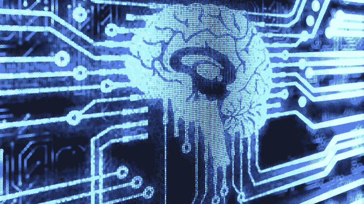
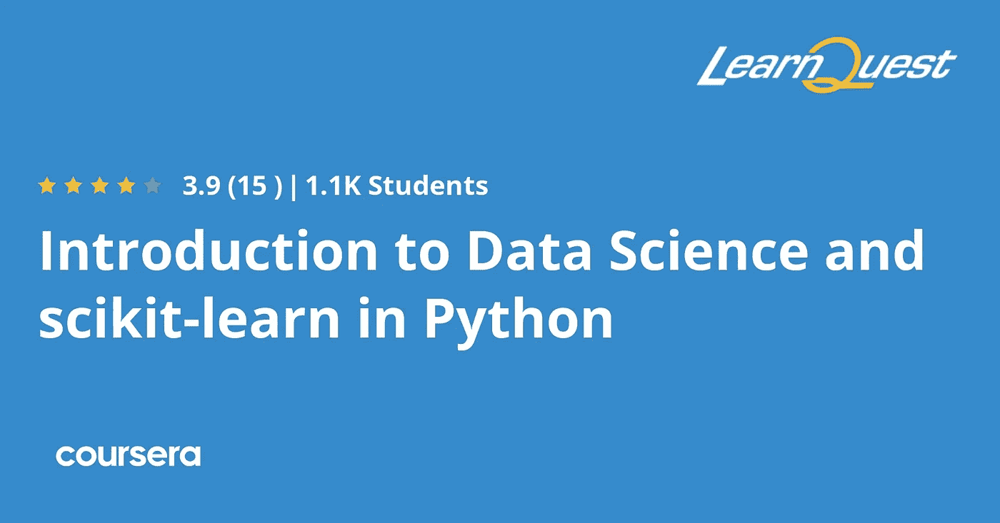
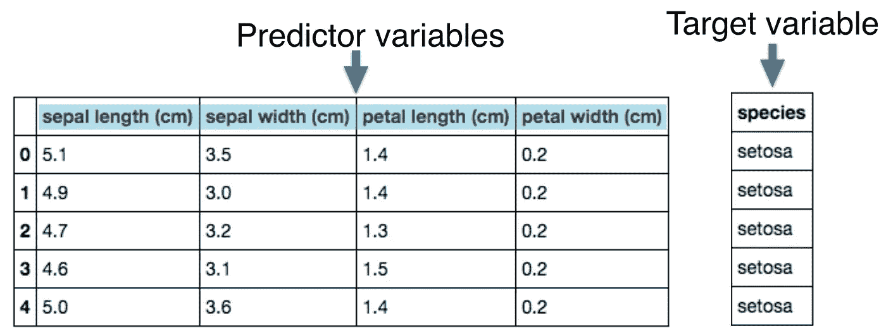
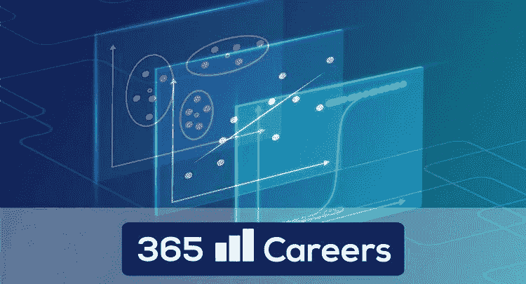
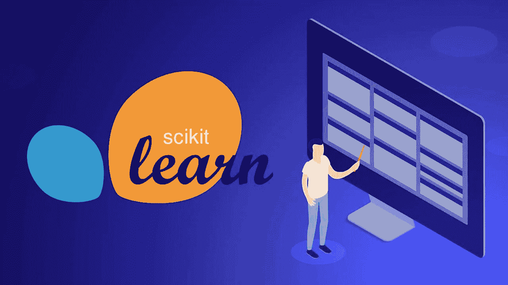

# 2022 年 5 个最佳 Scikit-Learn 机器学习和数据科学在线课程

> 原文：<https://medium.com/javarevisited/5-best-scikit-learn-online-courses-for-machine-learning-and-data-science-6beb02e9cca0?source=collection_archive---------0----------------------->

这些是 2022 年学习机器学习和数据科学 Scikit learn library 的最佳在线课程。

大家好，如果你想学习 Scikit-Learn 库并寻找最好的资源，如在线课程和课程，那么你来对地方了。

早些时候，我已经分享了 [**最佳 Python 课程**](https://javarevisited.blogspot.com/2018/03/top-5-courses-to-learn-python-in-2018.html) 以及 [**学习数据科学的最佳课程**](https://javarevisited.blogspot.com/2018/10/data-science-and-machine-learning-courses-using-python-and-R-programming.html) **e** ，在本文中，我将分享学习 Scikit 的最佳课程——Learn library，它是最受欢迎的机器学习 Python 库之一，与 [TensorFlow](https://becominghuman.ai/top-10-courses-to-learn-tensorflow-for-machine-learning-in-2020-39a31e7cd84b) 、 [Keras](/javarevisited/5-best-pytorch-and-keras-courses-for-deep-learning-in-2021-c9ba377b1170) 和 Pytorch 并列。

[Scikit-learn](https://scikit-learn.org/) 通过 Python 中的一致接口，为机器学习和统计建模提供了一系列有效的工具，包括分类、回归、聚类和降维，它是专业数据科学家和机器学习工程师的基本技能之一。

机器学习使用数据来学习和改进其功能，而无需通过编程来执行该操作。这些数据可以是多种形式，如文本、数字、图片。

它被用于许多应用，从识别图像中的对象到语音识别和医疗行业识别癌症等疾病。

大多数开发人员使用 python 编程语言来构建机器学习模型，因为这种语言支持许多用于创建这类应用程序的包，其中一个最好的包被称为 [**Scikit-Learn**](https://javarevisited.blogspot.com/2021/10/top-5-courses-to-learn-scikit-learn.html) ，这是一个在 BSD 许可证下许可的开源库，可以免费用于商业用途。它包含了很多用于解决监督和非监督机器学习问题的算法等等。

# 5 个最佳 sci kit-2022 年面向数据科学家的在线学习课程

不要再浪费你的时间了，这里列出了 2022 年要参加的*最佳科学知识在线课程。这是一个精选的课程列表，这些课程来自像 [Udemy](https://click.linksynergy.com/fs-bin/click?id=JVFxdTr9V80&offerid=323058.9410&type=3&subid=0) 、 [Pluralsight](https://pluralsight.pxf.io/c/1193463/424552/7490?u=https%3A%2F%2Fwww.pluralsight.com%2Flearn) 、 [Educative](https://www.educative.io/subscription?affiliate_id=5073518643380224) 、 [CodeCademy](https://bit.ly/codecademypro) 、 [DataCamp](https://datacamp.pxf.io/c/1193463/1012793/13294?u=https%3A%2F%2Fwww.datacamp.com%2Fpricing) 和 [Coursera](https://coursera.pxf.io/c/3294490/1164545/14726?u=https%3A%2F%2Fwww.coursera.org%2F) 这样的网站，由专家创建，受到全世界成千上万开发人员和数据科学家的信任。它们也很便宜，可以让你在家里了解这个有用的图书馆。*

## 1.[数据科学:Python 中的监督机器学习](https://www.udemy.com/course/data-science-supervised-machine-learning-in-python/)

该中级课程包含超过 6 小时的视频内容，使用 Scikit-Learn 应用机器学习算法。尽管如此，它要求您理解 Python 编程语言，并使用 NumPy & pandas 库进行数学计算、数据操作分析和统计背景。

从了解 K-最近邻开始学习很多用来解决监督学习，解决分类和回归问题，然后学习朴素贝叶斯，你可以用它来预测基于很多属性的不同类的概率。

稍后，您将了解决策树和感知的概念。最后，构建一个使用机器学习来执行一些任务的 web 服务。

**这里是加入本课程的链接** — [数据科学:Python 中的监督机器学习](https://www.udemy.com/course/data-science-supervised-machine-learning-in-python/)

## 2.[数据科学和 scikit 简介——用 Python 学习](https://coursera.pxf.io/c/3294490/1164545/14726?u=https%3A%2F%2Fwww.coursera.org%2Flearn%2Fdata-science-and-scikit-learn-in-python)【Coursera】

本课程也是数据科学家和机器学习工程师学习 Scikit-Learn 库以将其算法应用于真实数据集并进行预测的很好参考。这门课不需要任何经验，甚至你也不需要 Python。

本课程是科学研究专业化 的 [**的一部分，在本课程中，您将首先了解 python 编程语言和假设检验，并对 sci-kit-learn 库进行概述，并了解如何使用该库解决分类问题。**](https://coursera.pxf.io/c/3294490/1164545/14726?u=https%3A%2F%2Fwww.coursera.org%2Fspecializations%2Fartificial-intelligence-scientific-research)

<https://coursera.pxf.io/c/3294490/1164545/14726?u=https%3A%2F%2Fwww.coursera.org%2Fspecializations%2Fartificial-intelligence-scientific-research>  

之后，您将了解更多关于假设的知识，并了解如何为数据科学家使用其他库，如 NumPy 和 pandas。

稍后，学习线性回归和机器学习背后的数学。最后，应用分类算法来预测心脏病的存在。总之，2022 年学习数据科学和 Scikit learn 最好的 Coursera 课程之一。

**以下是参加本课程的链接** — [数据科学和 scikit 简介——学习 Python](https://coursera.pxf.io/c/3294490/1164545/14726?u=https%3A%2F%2Fwww.coursera.org%2Flearn%2Fdata-science-and-scikit-learn-in-python)

顺便说一下，如果你觉得 Coursera 的课程很有用，因为它们是由世界各地知名的公司和大学创建的，我建议你加入 Coursera Plus 的订阅计划，它可以让你无限制地访问他们最受欢迎的课程、专业知识、专业证书和指导项目。它每年花费大约 399 美元，但它完全值得你的钱，因为你可以获得无限的证书。

<https://coursera.pxf.io/c/3294490/1164545/14726?u=https%3A%2F%2Fwww.coursera.org%2Fcourseraplus>  

## 4.[sci kit-learn 的监督学习](https://datacamp.pxf.io/c/1193463/1012793/13294?u=https%3A%2F%2Fwww.datacamp.com%2Fcourses%2Fsupervised-learning-with-scikit-learn)【最佳数据营课程】

Scikit-Learn 是一个机器学习库，可以执行很多事情，包含不同的算法。尽管如此，本课程将只关注监督学习，这是一种使用标记数据进行预测的机器学习，也是最常用的机器学习类型之一。

您将开始学习分类问题，并使用监督学习来解决它们。您还将了解回归，这是解决连续数据并将其应用于真实数据集的最佳方法。

您还将看到如何使用 scikit 中提供的许多指标来评估您的模型——了解并优化它，等等。

以下是加入本课程的链接— [**使用 scikit 的监督学习—学习**](https://datacamp.pxf.io/c/1193463/1012793/13294?u=https%3A%2F%2Fwww.datacamp.com%2Fcourses%2Fsupervised-learning-with-scikit-learn)

顺便说一下，你需要一个[数据营计划](https://datacamp.pxf.io/c/1193463/1012793/13294?u=https%3A%2F%2Fwww.datacamp.com%2Fpricing)才能进入这个课程。他们有不同的计划，如标准计划、专业计划和允许访问所有项目的高级计划。

我通常推荐 [**标准计划**](https://datacamp.pxf.io/c/1193463/1012793/13294?u=https%3A%2F%2Fwww.datacamp.com%2Fpricing) ，因为它价格合理，并且您可以获得所有增长数据技能的要素，如 350 多门课程、14 个职业轨道、50 多个技能轨道、无限实践挑战和实时代码。按年度计划，每月花费大约 25 美元，完全值得。

## 4.[具有 Scikit-learn 和 StatsModels 的机器学习 101](https://click.linksynergy.com/deeplink?id=CuIbQrBnhiw&mid=39197&murl=https%3A%2F%2Fwww.udemy.com%2Fcourse%2Fmachine-learning-101-with-scikit-learn-and-stats-models%2F)

Udemy 上的这个大型课程是为那些甚至不知道 python 语言编程的初学者设计的。在开始学习 Scikit-Learn library machine learning 之前，您将学习如何使用它和一些最常用的库，如[Numpy](/javarevisited/6-best-online-courses-to-learn-numpy-for-beginners-60120f611e06)&[pandas](/javarevisited/5-best-free-pandas-courses-for-beginners-in-2022-d7dbe017b90c)。

本课程从学习 python 编程语言开始，例如在屏幕上打印语句，在一个变量中存储多个值以及不同的数据类型。你也会看到如何使用一些库，比如 NumPy，pandas。

后面你会明白无监督学习等很多 ML 概念。最后，您将创建线性回归、逻辑回归、k 均值算法等机器学习模型，并将其应用于真实数据集。

**这是加入本课程的链接**——[Scikit-learn 和 StatsModels 的机器学习 101](https://click.linksynergy.com/deeplink?id=CuIbQrBnhiw&mid=39197&murl=https%3A%2F%2Fwww.udemy.com%2Fcourse%2Fmachine-learning-101-with-scikit-learn-and-stats-models%2F)

## 5. [100+练习— Python —数据科学—scikit—learn](https://click.linksynergy.com/deeplink?id=CuIbQrBnhiw&mid=39197&murl=https%3A%2F%2Fwww.udemy.com%2Fcourse%2F100-exercises-python-data-science-scikit-learn%2F)

本课程也面向希望简单了解 Scikit 的初学者——学习并创建回归等简单的机器学习模型。它只需要你了解 Python 编程语言和学习新技能的愿望。

有大量的练习供您解决和学习 Scikit、[学习熊猫](https://becominghuman.ai/5-best-courses-to-learn-pythons-pandas-libary-for-data-analysis-and-data-science-34b62abb0e96)和 [NumPy](https://javarevisited.blogspot.com/2021/10/top-5-courses-to-learn-numpy-for-python.html) 。您将获得关于 Scikit-Learn 及其理论工作方式的介绍，然后创建代码并对简单数据应用机器学习算法。

您将了解回归模型，该模型将预测 Y 值并尝试找出两个变量之间的关系。然后，您将了解分类，即根据一些属性等将数据集分类到不同的类中。

**以下是加入本课程的链接** — [100+练习— Python —数据科学—scikit—learn](https://click.linksynergy.com/deeplink?id=CuIbQrBnhiw&mid=39197&murl=https%3A%2F%2Fwww.udemy.com%2Fcourse%2F100-exercises-python-data-science-scikit-learn%2F)

以上是 2022 年面向初学者和有经验的数据科学家和机器学习工程师的**最佳 Sckikit-Learn 在线课程。我们已经看到了来自 [Udemy](https://click.linksynergy.com/fs-bin/click?id=JVFxdTr9V80&offerid=323058.9410&type=3&subid=0) 、 [DataCamp](https://datacamp.pxf.io/c/1193463/1012793/13294?u=https%3A%2F%2Fwww.datacamp.com%2Fpricing) 和 [Coursera](https://coursera.pxf.io/c/3294490/1164545/14726?u=https%3A%2F%2Fwww.coursera.org%2F) 的最好的课程来学习这个有用的库。**

如果你打算学习数据科学或几乎任何与预测相关的东西，如机器学习和深度学习工程，Scikit-Learn 是一个必须学习的库，甚至一些 web 开发人员正在使用这个库来允许他们的 web 应用程序执行一些 ML 任务。

您可能喜欢的其他**数据科学和机器学习**文章

*   [2022 年学习 Python 的 5 大课程](https://hackernoon.com/top-5-courses-to-learn-python-in-2018-best-of-lot-26644a99e7ec)
*   [2022 年约翰霍普金斯大学学习数据科学的最佳课程](https://javarevisited.blogspot.com/2021/05/best-johns-hopkins-courses-for-data-science-coursera.html)
*   [学习高级数据科学的前 5 门课程](https://hackernoon.com/top-5-data-science-and-machine-learning-course-for-programmers-e724cfb9940a)
*   [初学者学习 TensorFlow 的 5 大课程](https://hackernoon.com/top-5-tensorflow-and-ml-courses-for-programmers-8b30111cad2c)
*   [初学者学习 Python 的 10 门免费课程](https://hackernoon.com/10-free-python-programming-courses-for-beginners-to-learn-online-38312f3b9912)
*   [2022 年学习电力 BI 的前 5 门课程](https://www.java67.com/2020/06/top-5-courses-to-learn-microsoft-power-BI.html)
*   [学习机器学习的 5 大免费课程](https://www.java67.com/2019/01/5-free-courses-to-learn-machine-and-deep-learning-in-2019.html)
*   [5 门最适合初学者的计算机视觉课程](https://javarevisited.blogspot.com/2020/09/top-5-computer-vision-and-open-cv-courses-projects.html)
*   [五大基本机器学习算法](https://www.java67.com/2020/07/top-5-machine-learning-algorithms-for-beginners.html)
*   [十大 Coursera 数据科学课程和认证](https://javarevisited.blogspot.com/2020/08/top-10-coursera-certifications-to-learn-Data-Science-Visualization-and-Data-Analysis.html)
*   [你可以在线获得 5 个数据科学学位](https://www.java67.com/2020/06/top-5-data-science-degree-you-can-earn-online-coursera-edx.html)
*   [面向数据科学家的 10 大 TensorFlow 课程](https://dev.to/javinpaul/10-of-the-best-tensorflow-courses-to-learn-machine-learning-from-coursera-and-udemy-37bf)
*   [学习 QlikView 和 QlikSense 的五大课程](https://javarevisited.blogspot.com/2020/07/top-5-courses-to-learn-qlikview-and-qlik-sense.html)
*   [2022 年学习 Python 的 10 个理由](https://hackernoon.com/10-reasons-to-learn-python-in-2018-f473dc35e2ee)
*   [学习数据科学 Python 的 5 本书](https://javarevisited.blogspot.com/2019/08/top-5-python-books-for-data-science-and-machine-learning.html)
*   [学习数据科学表格的前 5 门课程](https://javarevisited.blogspot.com/2019/07/top-5-tableau-online-courses-and-certifications-for-data-science-engineers.html)
*   [面向数据科学和机器学习的 8 大 Python 库](https://javarevisited.blogspot.com/2018/10/top-8-python-libraries-for-data-science-machine-learning.html)

感谢您阅读本文。如果你喜欢这些*针对初学者的最佳 Scikit-Learn 在线培训课程*，那么请与你的朋友和同事分享它们。如果您有任何问题或反馈，请留言。

**p . s .**——如果你热衷于学习 NumPy 并寻找免费的 NumPy 在线课程，那么你也可以在 Udemy 上通过 360 careers 查看这个 [**实用的机器学习 Scikit-Learn**](https://click.linksynergy.com/deeplink?id=CuIbQrBnhiw&mid=39197&murl=https%3A%2F%2Fwww.udemy.com%2Fcourse%2Fmachine-learning-one-hour%2F)课程。这个 2 小时长的课程是完全免费的，由 Udemy 上一位著名的讲师创建。我强烈推荐你加入这个课程，你所需要的只是一个免费的 Udemy 账户。

<https://www.java67.com/2021/11/top-5-free-scikit-learn-courses-to.html>  <https://www.java67.com/2019/01/5-free-courses-to-learn-machine-and-deep-learning-in-2019.html> 