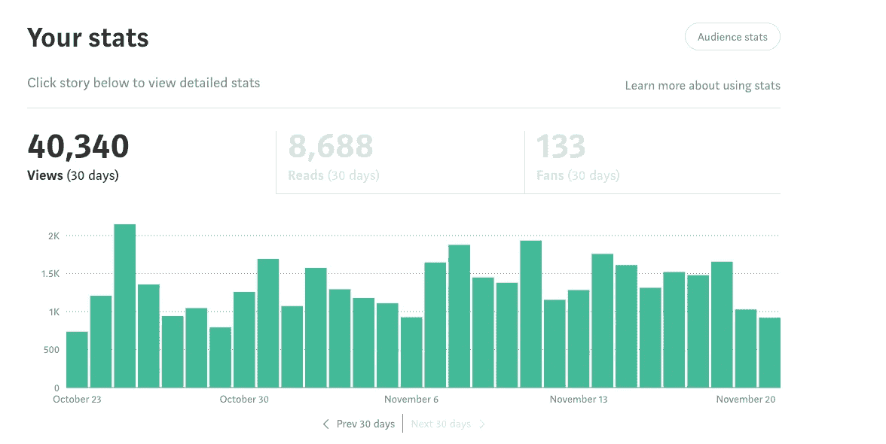
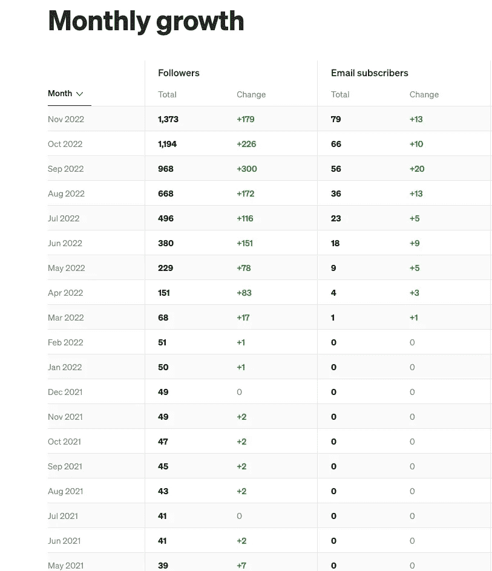
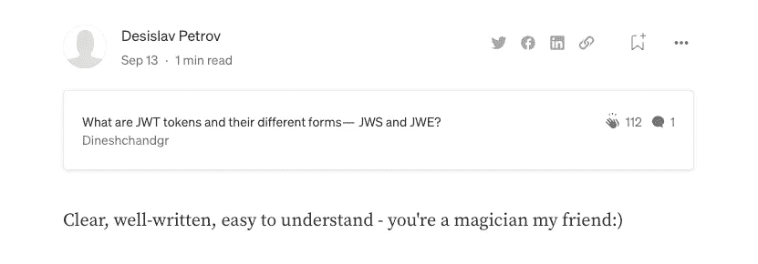
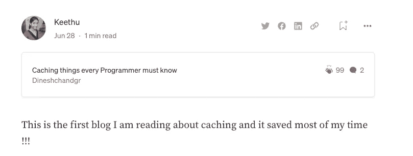

# 我的媒体技术博客中有 50 篇文章，有 1373 名粉丝——这是我博客旅程中的一个里程碑

> 原文：<https://medium.com/javarevisited/50-articles-in-my-medium-tech-blog-with-1317-followers-a-milestone-in-my-blogging-journey-a29cf0163b4b?source=collection_archive---------0----------------------->



大家好。在这篇文章中，我将分享我的博客之旅。

首先，我很兴奋能在这篇文章中打出每一个字。这是我过去几个月一直想达到的一个里程碑，在跨过障碍后，我终于来到了这里。有时候事情不会像预期的那样发生，我希望每件事情都有不确定性，让我们猜测未来会发生什么。

我要衷心感谢每一位关注者和读者。没有你们，我不可能达到这个里程碑，我无法感谢你们所有人。我能做的最好的贡献就是为你们所有人继续写作并证明高质量的内容。

写作一直是我的爱好，我在谷歌/猫途鹰之类的网站上写评论，有时也在 Linkedin 和脸书等网站上写评论。几年前，我了解了媒体博客，我想尝试在那里写博客，看看怎么样。令人惊讶的是，对于一个初学者来说，建立一个博客是非常容易的，我想发布 1 或 2 篇文章来看看。

写了 2 篇文章后，我甚至有一年左右的时间没有去过一个中型网站。然后我收到电子邮件通知，人们回复我的文章并关注我。看到这一点，我有动力写更多，这就是一切的开始。我写得越多，我的文章受到观众的好评，然后我就继续前进。任何事情都需要耐心和时间来发展，写博客也是如此。

我总是探索趋势和重要的话题，并写下它们有两个原因。第一个原因是我想了解这一点，然后一个原因是我想与社区分享，以获得更好的影响。

我发现大多数文章没有提供关于这个主题的完整背景，而且结尾很突然。这是我想跳到的地方，填补我的追随者的空白，到目前为止效果很好。

我的风格总是从基础开始阅读，然后深入，我在写作中也遵循同样的方式。我总是从基本的外行术语开始，然后在一篇文章中解释关于一个主题的一切。如果太大，我会做第二部分或第三部分。

有些文章需要几个小时，有些需要几天，有些甚至需要几周。 我会查阅多方资料，收集知识，并确保在向观众展示之前，我彻底理解了这些知识。有时这个过程需要时间，但当我花时间提供一篇高质量的文章时，它会给我一种成就感。

作为一名作家，我总是乐于接受你诚实的反馈和批评。这将有助于我提高写作技巧，使我成为一名优秀的作家。赞赏让我有动力继续前进，但批评让我不断进步。所以我想在我的文章中同时拥有这两者。

我们都知道，在软件开发人员的生活中，留给我们个人兴趣的时间并不多。由于工作压力，我们大多数人都无法调整自己的爱好。我们不再做朝九晚六的工作，尤其是有了两个孩子，我总是很忙。我的速度慢了一点，但我打算每周至少写 1-2 篇关于热门话题的文章。

我总是鼓励我的朋友和同事在 medium.com 或任何网站上写博客，如果他们对写作感兴趣的话。如果你有其他兴趣，我会建议你加强和追求你的爱好或第二技能。否则生活将会单调乏味。

在[写博客](https://savingsfunda.blogspot.com/2022/12/top-4-blogging-courses-to-start-blog-in.html)之前，我也不知道我的第二项技能或爱好是什么，我正在寻找它。但现在我很清楚，这才是我在工作时间之外想追求的。写博客让我学到新东西，并与社区和人们分享。这也提高了我的沟通技巧，我也开始更多地与人交流。我在各种平台上发布了一些我的读者的评论。我很抱歉，我不能理解所有的评论，无论我能得到什么，我都贴在下面

# 我的读者的一些评论



我写过各种主题的文章，可能会引起不同背景或不同角色的人的兴趣。我名单上的每个人都有适合的东西

我已经根据下面的主题对我的文章进行了分类

# 路线图文章

  </javarevisited/how-to-become-a-senior-backend-developer-and-beyond-846e8a8ae4a0>  

# 与安全相关的文章

</javarevisited/single-sign-on-sso-saml-oauth2-oidc-simplified-cf54b749ef39>  </javarevisited/what-are-jwt-tokens-and-their-different-forms-jws-and-jwe-bea92e61a6c2>  </javarevisited/what-is-http-http-s-ssl-passthrough-and-ssl-termination-fc729fe87fed>  

# 分布式系统

</javarevisited/distributed-transaction-management-in-microservices-part-1-bb7dc1fbee9f>  </javarevisited/distributed-transaction-management-in-microservices-part-2-saga-pattern-53808a55e641>  <https://dineshchandgr.medium.com/what-are-message-queues-and-why-they-are-widely-used-in-distributed-systems-cf9735e9afd7>  

# 微服务

</javarevisited/distributed-tracing-in-microservices-spring-boot-125272b58ad8>  </javarevisited/what-is-service-discovery-in-microservices-15a2333bc1db>  </javarevisited/do-you-know-about-the-12-factor-app-in-microservices-architecture-50bd34551bd8>  

# gRPC 协议相关

</javarevisited/everything-you-need-to-know-about-http-2-protocol-e64bfffafe47>  </javarevisited/what-are-protocol-buffers-and-why-they-are-widely-used-cbcb04d378b6>  </javarevisited/microservices-communication-using-grpc-protocol-dc3a2f8b648d>  

## GraphQL

<https://dineshchandgr.medium.com/do-you-know-about-graphql-the-query-language-for-api-s-4038660865be>  <https://dineshchandgr.medium.com/how-to-use-graphql-with-spring-boot-7a4d66ed84d7>  

## 贮藏

</javarevisited/caching-things-every-programmer-must-know-28d4a7e8b9b1>  </javarevisited/what-is-redis-cache-and-how-to-use-it-in-spring-boot-using-spring-data-redis-d5ef9967f9e>  

# 反应式编程

</javarevisited/what-is-reactive-programming-9cb913eea519>  </javarevisited/reactive-programming-in-java-rxjava-part-2-c1f37ac3282>  </javarevisited/reactive-programming-in-spring-boot-using-spring-webflux-framework-276bafd384f6>  

# 基于 Java 的

</javarevisited/servlet-things-every-java-developer-must-know-servlet-container-filter-and-listener-374a460169bd>  </javarevisited/logging-in-java-log4j-vs-logback-vs-slf4j-88c533088d2a>  

# Spring Boot

</javarevisited/hibernate-vs-jpa-vs-spring-data-jpa-ff4485aaa780>  </javarevisited/transaction-management-in-spring-boot-eb01e20b21fe>  <https://dineshchandgr.medium.com/how-to-learn-spring-boot-and-microservices-road-map-series-32c2e246f1a4>  </javarevisited/spring-framework-filter-vs-dispatcher-servlet-vs-interceptor-vs-controller-745aa34b08d8>  </javarevisited/what-is-spring-cloud-gateway-34dfdc9548bc>  </javarevisited/what-is-spring-cloud-and-how-it-is-different-from-spring-and-spring-boot-128d276a1432>  </javarevisited/what-is-project-lombok-and-how-to-use-it-with-spring-boot-d6034f865541>  <https://dineshchandgr.medium.com/database-migration-in-spring-boot-using-flyway-ee791db8aea0>  </javarevisited/what-is-database-migration-in-spring-boot-and-how-it-is-done-using-liquibase-bd5cad981862>  </javarevisited/hibernate-methods-save-persist-update-merge-and-saveorupdate-19d21511dea2>  

# 基于绩效的文章

</javarevisited/top-performance-issues-every-developer-architect-must-know-part-1-fc1ad6e1644b>  </javarevisited/top-performance-issues-every-developer-architect-must-know-part-2-concurrency-a15bd0b2b3b6>  </javarevisited/top-performance-issues-every-java-developer-architect-must-know-part-3-memory-351144590489>  

# 数据结构和算法

</javarevisited/time-and-space-complexity-of-an-algorithm-simplified-with-examples-9e0809c4b3be>  <https://dineshchandgr.medium.com/linear-data-structures-with-time-complexity-every-programmer-must-know-c58a446e06ac>  <https://dineshchandgr.medium.com/linear-data-structures-continued-stack-queue-and-hash-table-81366ff51d52>  

# 基于云的

</javarevisited/do-you-know-everything-about-serverless-architecture-f0cd06c81329>    </javarevisited/scalability-in-the-cloud-vertical-vs-horizontal-scaling-ba38ca29d1b7>  

# 集装箱化——Docker 和 Kubernetes

<https://dineshchandgr.medium.com/what-are-docker-containers-virtual-machines-and-containerization-e68bf076edf4>  </javarevisited/container-orchestration-and-kubernetes-part-2-8bf0ff2637e0>  <https://dineshchandgr.medium.com/kubernetes-certification-paths-and-how-to-prepare-for-kubernetes-developer-exam-ckad-6d2d5c5aab19>  

# 物联网

<https://dineshchandgr.medium.com/everything-you-need-to-know-about-iot-internet-of-things-1b481e917edc>  

# 数据库ˌ资料库

<https://dineshchandgr.medium.com/sql-vs-no-sql-databases-everything-you-need-to-know-b723457446a5>  

再次感谢你们阅读这篇文章，感谢你们给我的支持。在我的下一篇文章中再见

希望你喜欢这篇文章，感谢阅读

```
If you like to get more updates from me, 
please follow me on Medium and subscribe to email alert. 
If you are considering to buy a medium membership, 
please buy through my referral link
```

<https://dineshchandgr.medium.com/membership> 