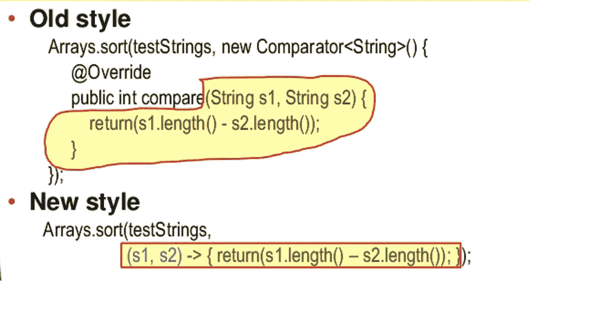
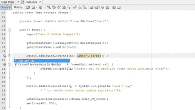
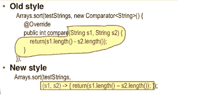
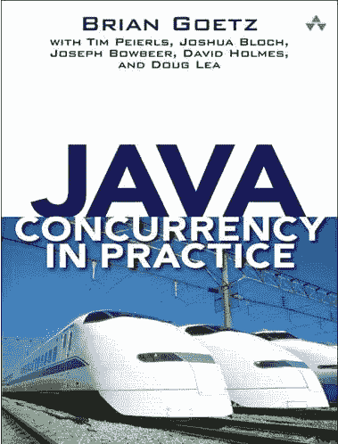
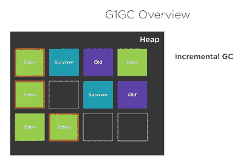
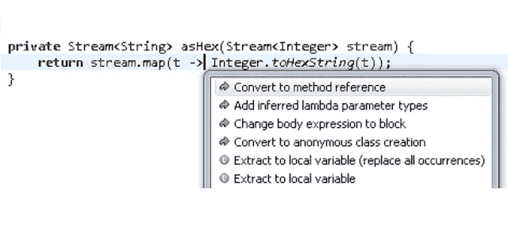
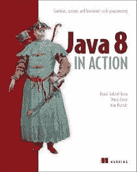
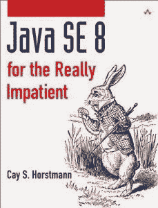

# 学习 Lambda 表达式和流 API 以及函数式编程的 10 个最佳 Java 教程、课程和书籍

> 原文：<https://medium.com/javarevisited/7-best-java-tutorials-and-books-to-learn-lambda-expression-and-stream-api-and-other-features-3083e6038e14?source=collection_archive---------0----------------------->

虽然术语**“lambda expression”**听起来可能很抽象和学术化，但是 Java 8 Lambdas 可以对你每天的编程方式产生很大的影响。Java 8 不仅引入了[λ表达式](http://javarevisited.blogspot.com/2014/02/10-example-of-lambda-expressions-in-java8.html)，还引入了流 API、函数接口、新的日期和时间 API 以及[默认方法](http://javarevisited.blogspot.com/2014/07/default-defender-or-extension-method-of-Java8-example-tutorial.html)，这完全改变了你编写 Java 代码的方式。

作为一个专业的 [Java 开发者](http://hackernoon.com/tagged/java)，总有一天要学习 Java 8，早做总比晚做好。

即使你没有使用 Java 8 的很多特性，有一件事是肯定的，那就是改变了你在 Java 程序中使用集合框架类的方式，比如 ArrayList 或者 HashMap，特别是对于高性能的应用程序。

毫不奇怪，我也学到了 [**Java 8 的新特性**](https://click.linksynergy.com/deeplink?id=JVFxdTr9V80&mid=39197&murl=https%3A%2F%2Fwww.udemy.com%2Fjava-se-8-new-features%2F) 我很感谢所有这些人，他们分享了关于 lambdas 和其他 Java 8 概念的精彩教程。

这些人大多下载了每夜构建，通过规范和最初的草稿来创建易于理解的 Java 8 教程和示例。因为我个人一直在关注他们，所以与你们这些我的读者分享这些资源对我来说很有意义。

早些时候，当我分享 Java 和 Scala 之间的一些[差异时，我提到了 Scala 的一些很酷的特性，这些特性使代码简洁、清晰、可读性更好，但 Java 8 在这一点上也不逊色。](http://javarevisited.blogspot.sg/2013/11/scala-vs-java-differences-similarities-books.html)

所以请继续关注这些 Java 8 Lambdas、Stream API 和 functional interfaces 教程，感受一下 Java 编程语言自首次发布以来最大的变化是什么；可能比 Java 1.5 中的泛型还要大。

# Java 中的 Lambda 表达式是什么？

最简单地说，lambda 表达式是一个函数——一段代码——可以作为参数传递给另一个方法。因此，您可以通过使用由 lambda 表示的行为作为参数来应对不断变化的需求。

如果你做过一些 JavaScript 编程，你就会知道你可以将匿名函数传递给任何函数，直到 Java 1.7，这在 Java 中是不可能的，你只能将原语或对象传递给你的方法。

Java API 的一个部分将会有实质性的改变，那就是著名的，可能也是最常用的 **Java 集合框架**，它正在被修改以使用 Stream API。Java 8 的函数式编程特性，比如 lambdas 和新的 Stream API，将提供一种更简洁的方法来遍历集合。

它们还将帮助您编写简洁、可维护的代码，这些代码易于扩展，并且在多核架构上运行良好。如果你有兴趣学习更多关于 lambda expression 的知识，那么[**Java 8 的新特性:Lambdas**](https://click.linksynergy.com/deeplink?id=JVFxdTr9V80&mid=39197&murl=https%3A%2F%2Fwww.udemy.com%2Fwhats-new-in-java-8%2F) 是一门很棒的课程，它深入介绍了 Java 8 的新特性。

# 学习 Lambda、Stream API 和其他特性的 10 个最佳 Java 8 教程

正如我所说的，我已经开始学习 Java 8 的新特性，为尽快采用 Java 8 做准备。我有一种直觉，工业界可能也会这样做，一旦 Java 8 正式发布，几乎不会有新的项目转向 Java 1.6 或 7。

很像在[泛型](http://javarevisited.blogspot.com/2011/09/generics-java-example-tutorial.html)被引入后发生的事情，现在你不会看到任何没有泛型的集合框架代码。网上已经有很多好的 Java 8 教程，我将充分利用它们。

我选择了一些[最好的 Java 8 教程](http://www.java67.com/2014/09/top-10-java-8-tutorials-best-of-lot.html)开始。这个列表并不完整，当我在学习中发现一些有趣的东西和进步时，我会继续添加内容。

## [1。莫里斯·纳夫塔林的 Lambda 常见问题解答](http://www.lambdafaq.org/)

每当我谈到 Java 8 的 lambda expression 时，这是第一个资源，这是我想到的。我已经访问过他的 lambda FAQ 网站很多次了，这真是太棒了。如果你不记得 Maurice Naftalin 是一本伟大的书 [Java 泛型和集合](http://www.amazon.com/dp/0596527756/?tag=javamysqlanta-20)的作者之一。

他做了大量的工作来解决 lambda 表达式的常见问题，在去其他地方之前，我强烈建议你访问这个网站，浏览一下那些关于 Lambda 表达式的基本问题。

为了让你先睹为快，下面是他的 Lambda FAQ 中的一些问题:

*   什么是 lambda 表达式？
*   为什么 lambda 表达式被添加到 Java 中？
*   什么是功能界面？([回答](https://javarevisited.blogspot.sg/2018/01/what-is-functional-interface-in-java-8.html))
*   lambda 表达式是对象吗？
*   lambda 表达式可以用在哪里？
*   lambda 表达式的作用域规则是什么？
*   lambda 表达式的类型是什么？(回答)
*   lambda 表达式可以用来定义递归函数吗？
*   lambda 表达式可以使用环境中的变量吗？
*   方法引用有哪些？([回答](https://javarevisited.blogspot.com/2017/03/what-is-method-references-in-java-8-example.html))
*   语法是什么，例如，方法引用？([回答](http://javarevisited.blogspot.sg/2017/08/how-to-convert-lambda-expression-to-method-reference-in-java8-example.html))
*   什么是构造函数引用？

我认为 Maurice 还在开发新版本的 Java 集合和泛型，以包含 Java 8 的变化，这将是一个非常好的资源。急切地等待那一版。

## 2.[用 Lambdas &流](https://click.linksynergy.com/deeplink?id=JVFxdTr9V80&mid=39197&murl=https%3A%2F%2Fwww.udemy.com%2Fcourse%2Ffunctional-programming-with-java%2F)学习 Java 函数式编程

要不要开始**玩 Java 的函数式编程，学习 Streams 和 Lambdas** ？想要**使用**流、Lambda 表达式、函数接口和方法引用**用函数式编程写出牛逼的 Java 代码**？想要使用函数式编程使您的 Java 程序**更具性能和并行性**？

那么这可能是 28 分钟官方和我的朋友 Ranga Rao Karnam 开始的最好的课程

 [## 用 Lambdas & Streams 学习 Java 函数式编程

### 想开始用 Java 进行函数式编程并学习 Streams 和 Lambdas 吗？想写出牛逼的 Java 代码…

udemy.com](https://click.linksynergy.com/deeplink?id=JVFxdTr9V80&mid=39197&murl=https%3A%2F%2Fwww.udemy.com%2Fcourse%2Ffunctional-programming-with-java%2F) 

## 3.[甲骨文官方 Lambda 表达式教程](http://docs.oracle.com/javase/tutorial/java/javaOO/lambdaexpressions.html)

这是另一个关于 lambda 表达式的很棒的教程。像所有其他官方 Java 教程一样，本教程也符合 mark 标准。它从使用传统 Java 编码风格的简单方法开始，用本地和匿名类改进了它的方法，然后以使用 lambda 表达式的高效而简洁的方法结束。

它还解释了什么是 Java 8 中的方法引用以及如何使用它们。既然你使用 lambda 表达式来创建匿名方法，记住不要使用[匿名类](http://javarevisited.blogspot.sg/2012/12/inner-class-and-nested-static-class-in-java-difference.html)。然而，有时 lambda 表达式除了调用现有方法之外什么也不做。在这些情况下，通过名称来引用现有方法通常更清楚。

方法引用使您能够做到这一点；对于已经有名字的方法，它们是简洁易读的 lambda 表达式。[双冒号运算符](http://www.java67.com/2018/06/what-is-double-colon-operator-in-java-8.html)(::)用于表示方法引用。

对于所有初学者来说，一旦你读完了莫里斯的 lambda 表达式常见问题解答，你就可以从这个开始。你将通过实例提供的比较分析机会来学习。

例如，要打印列表的内容，您可以简单地写

`List.forEach(System.out::println),`

可以进一步查看 [**完整 Java Masterclass**](https://click.linksynergy.com/fs-bin/click?id=JVFxdTr9V80&subid=0&offerid=323058.1&type=10&tmpid=14538&RD_PARM1=https%3A%2F%2Fwww.udemy.com%2Fjava-the-complete-java-developer-course%2F) 了解更多关于 Java 8 中的方法引用和 lambda 表达式。

[**完整的 Java MasterClass**](https://click.linksynergy.com/fs-bin/click?id=JVFxdTr9V80&subid=0&offerid=323058.1&type=10&tmpid=14538&RD_PARM1=https%3A%2F%2Fwww.udemy.com%2Fjava-the-complete-java-developer-course%2F)

## 4.Java 8 Lambda 表达式演示和视频教程

有很多关于 Java 8 新特性、lambda 表达式、流 API、函数接口、[默认方法](http://www.java67.com/2017/08/java-8-default-methods-faq-frequently-questions-answers.html)、lambda 表达式如何工作、使用 lambda 表达式的利弊以及一系列 Java 8 主题的演示。

我收集了一些最好的，由权威人士发表的，如 Brian Goetz，Oracle 的 Java 语言架构师，并发经典的主要作者， [**实践中的 Java 并发**](http://www.amazon.com/dp/0321349601/?tag=javamysqlanta-20) 。

他的演讲 Lambda:the Hood 下的一瞥提供了大量关于用 Java 实现 Lambda 表达式的技术细节。通往 Lambda 之路是 Brian Goetz 的另一个演示，它提供了 Lambda 项目的深入和全面的视图。

这里有一些学习 Java 8 的最佳演示和在线课程

*   [Java 8 的新特性](https://pluralsight.pxf.io/c/1193463/424552/7490?u=https%3A%2F%2Fwww.pluralsight.com%2Fcourses%2Fjava-8-whats-new)
*   [通往拉姆达之路(布莱恩·戈茨)](https://oracleus.activeevents.com/connect/sessionDetail.ww?SESSION_ID=4862)
*   [Java 8 中的 JavaZone、Lambdas，作者 Angelika Langer](http://vimeo.com/49385450)
*   [完整的 Java SE 8 开发者训练营](https://click.linksynergy.com/fs-bin/click?id=JVFxdTr9V80&subid=0&offerid=323058.1&type=10&tmpid=14538&RD_PARM1=https%3A%2F%2Fwww.udemy.com%2Flearn-java-se-8-and-prepare-for-the-java-associate-exam%2F)

另一个很好的演示来自 JavaZone，2012 年 9 月:Angelika Langer 的《Java 8 中的 Lambdas 》,他谈到了 lambda 表达式、函数类型、扩展方法和方法引用

## 5.采用 OpenJDK Lambda 教程

这是另一组练习，教授 Java 8 lambda 语法和新的 Streams API 的使用。它包含了在 [Github](http://javarevisited.blogspot.sg/2018/01/5-free-git-courses-for-programmers-to-learn-online.html) 上做这个练习的正确指导，以及一些在 Ubuntu、Mac OS 和 Windows 上设置 ide(如 Eclipse 和 IntelliJ for Java 8 lambda expression)的便利教程。

它还包含一些关于内部和外部迭代(forEach 方法)、过滤和收集、映射和方法引用的很好的练习。

您可以下载并安装 Java 8 来运行这些教程和示例。它们也将运行在更高的 Java 版本上，如 Java 9、Java 17 和 Java 11 版本。

## [6。来自 Dreamsys 软件的 Java 8 Lambda 教程](http://www.dreamsyssoft.com/java-8-lambda-tutorial/index.php)

这是另一个关于 lambda 表达式的简单 Java 8 教程集合。我喜欢在日常话题中轻松地跟随例子。

他们的 Java 8 教程分为以下几个主题:

1.  简介——基础知识。
2.  比较器—使用比较器。([例](http://www.java67.com/2014/11/java-8-comparator-example-using-lambda-expression.html)
3.  集合过滤—过滤集合。([举例](https://javarevisited.blogspot.com/2018/05/java-8-filter-map-collect-stream-example.html))
4.  函数作为参数—将函数作为参数传递(例如。
5.  侦听器—使用 lambdas 作为侦听器。(示例)
6.  Map/Reduce —在 Java 8 中使用 map/Reduce([示例](http://www.java67.com/2016/09/map-reduce-example-java8.html))。
7.  干—干(不要重复自己)。([例](https://javarevisited.blogspot.com/2018/07/10-object-oriented-design-principles.html))

对于喜欢尝试新事物的忙碌 Java 开发人员来说，这是一个非常方便的教程。

## 7.IDE 支持 Java 8 Lambda 表达式

所有三个主要的 Java IDEs(例如 Eclipse、IntelliJ 和 Netbeans)都支持新的 Java 8 特性，包括 lambda expression，这对于开发和学习来说是非常好的。

您可以使用这些 ide 快速了解 Java 8 的新特性。它们中的大多数都提供了上下文建议，并尽可能将匿名类自动转换为 lambda 表达式和方法引用。

NetBeans IDE 也支持 Java 8，您可以查看[http://wiki.netbeans.org/JDK8](http://wiki.netbeans.org/JDK8)了解更多关于 NetBeans 支持 Java 8 的信息。

## [8。Java Streams API 开发人员指南](https://click.linksynergy.com/deeplink?id=JVFxdTr9V80&mid=39197&murl=https%3A%2F%2Fwww.udemy.com%2Fcourse%2Fjava-streams%2F)

这是我向希望掌握函数式编程和流 API 的 Java 开发人员推荐的另一门精彩课程。

本课程充满了精彩的部分，将带你踏上从零到英雄的旅程。你将学会并理解我所说的

**具体>抽象>具体阶段**

一旦你掌握了这个概念，我们将进入抽象阶段，学习一些很棒的特性，比如

*   地图
*   过滤器
*   平面地图
*   减少
*   平均的
*   总和
*   福建话
*   中间和终端操作的区别
*   还有更多

最后，在本课程结束时，我将介绍流的内部工作方式、执行顺序以及它们所带来的性能优势。

 [## Java Streams API 开发者指南

### Java 8 带来了很多很棒的新特性。很多人说，社区没有及时带来这些…

click.linksynergy.com](https://click.linksynergy.com/deeplink?id=JVFxdTr9V80&mid=39197&murl=https%3A%2F%2Fwww.udemy.com%2Fcourse%2Fjava-streams%2F) 

# Java 8 书籍

这里有几本学习 Java 8 的好书。所有这些书都关注 Java 中引入的新特性是什么、为什么以及如何引入的。前两个是我最喜欢的，我强烈建议 Java 开发人员阅读它们。

## 9.[**Java 8 Lambdas in Action**](http://www.amazon.com/Java-Action-Lambdas-functional-style-programming/dp/1617291994?tag=javamysqlanta-20)
*Java 8 Lambdas in Action*大概是学习 Java 8 特性最好的书了。这是 Java 8 lambdas 和 Java 函数式编程的简明指南之一。

它从实际介绍实际 Java 代码中 lambda 表达式的结构和好处开始。

[书](http://www.amazon.com/Java-Action-Lambdas-functional-style-programming/dp/1617291994?tag=javamysqlanta-20)然后介绍了[流 API](http://javarevisited.blogspot.com/2014/03/2-examples-of-streams-with-Java8-collections.html) ，并展示了它如何使与集合相关的代码更加易于理解和维护。

在这个过程中，您会发现 Java 8 在代码重用、代码可读性、异常处理、数据操作和并发性方面新的面向函数式编程的设计模式。

对于还在 JVM 上探索其他函数式语言的开发人员来说，本书以对 Scala 和 Clojure 中有用的函数式特性的快速调查作为结束。好的一面是 Java 8 Lambdas 的第一章是免费的，你可以下载来先睹为快。

[**10。凯·霍斯特曼**](http://www.amazon.com/Java-SE8-Really-Impatient-Course/dp/0321927761?tag=javamysqlanta-20)
这是另一本学习 Java 8 新特性的好书。它清晰，简洁，充满了不平凡的例子，这使得学习真的很有趣。

就这些了，学习 Java 8 的关键特性已经绰绰有余了，主要是 lambda 表达式，Stream API 和函数接口。

谷歌是你最好的朋友，所以当你感到困惑时，你可以快速搜索，我相信你会找到解决你问题的东西，这是成为这个精彩的 Java 社区的一部分的最大优势。

祝你好运，享受学习 Java 8 lambda 表达式的乐趣。

**相关 Java 8 教程**
如果你有兴趣了解更多关于 Java 8 的新特性，这里是我早期的文章，涵盖了 Java 8 的一些重要概念:

*   Java 8 中日期和时间的 20 个例子([教程](https://javarevisited.blogspot.com/2015/03/20-examples-of-date-and-time-api-from-Java8.html))
*   如何在 Java 8 中使用 Stream 类([教程](http://www.java67.com/2014/04/java-8-stream-examples-and-tutorial.html))
*   如何在 Java 8 中使用 filter()方法([教程](http://www.java67.com/2016/08/java-8-stream-filter-method-example.html))
*   如何在 Java 8 中使用 forEach()方法([示例](http://www.java67.com/2016/01/how-to-use-foreach-method-in-java-8-examples.html))
*   如何在 Java 8 中连接字符串([示例](http://www.java67.com/2016/08/java-8-stringjoin-example.html))
*   Java 8 中如何将列表转换为映射([解](http://javarevisited.blogspot.com/2016/04/10-examples-of-converting-list-to-map.html))
*   如何在 Java 8 中使用 peek()方法([例](http://www.java67.com/2016/08/java-8-stream-filter-method-example.html))
*   Java 8 中如何将流转换成数组([教程](http://javarevisited.blogspot.sg/2017/01/3-ways-to-convert-java-8-stream-to-array.html))
*   Java 8 认证常见问题([指南](http://javarevisited.blogspot.sg/2017/07/ocajp-8-faq-oracle-certified-associate-certification-1z0-808-exam.html))
*   Java 8 模拟考试和实践测试([测试](http://www.java67.com/2017/05/10-free-java-8-certification-sample-questions-OCAJP8-OCPJP8-Mock-Exams.html))

感谢您阅读本文。如果你喜欢这些 Java 8 资源，请与你的朋友和同事分享。如果您有任何问题或反馈，请留言。

 [## 面向初学者的 10 大 Java 在线课程

### 如果你是计算机科学专业的毕业生，或者想学习 Java 并且正在寻找一些很棒的资源，比如…

medium.com](/javarevisited/top-5-java-online-courses-for-beginners-best-of-lot-1e1e240a758)  [## Java 程序员应该学什么？

### Java 程序员可以学习的有用工具、技术、框架和库

medium.com](/javarevisited/what-java-programmers-should-learn-in-2020-648050533c83)