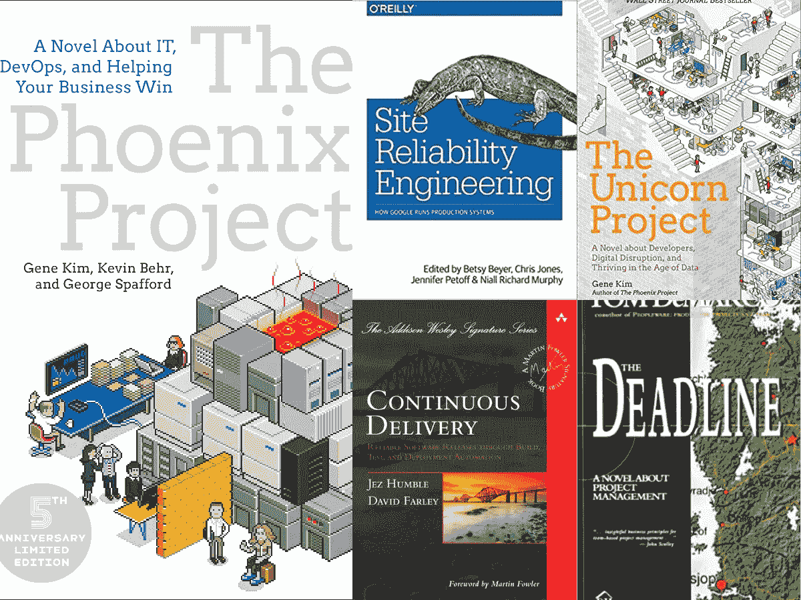
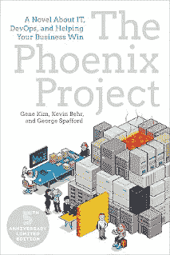
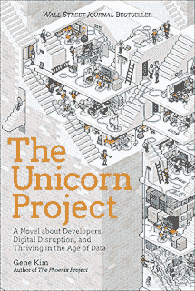
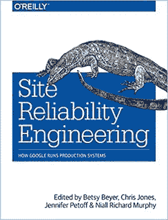
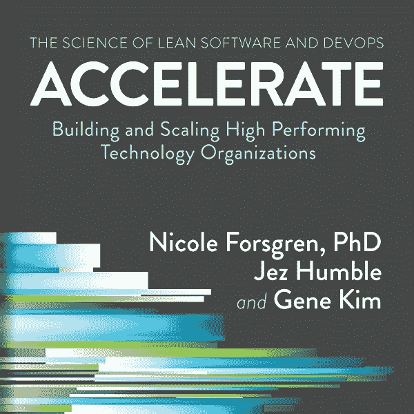
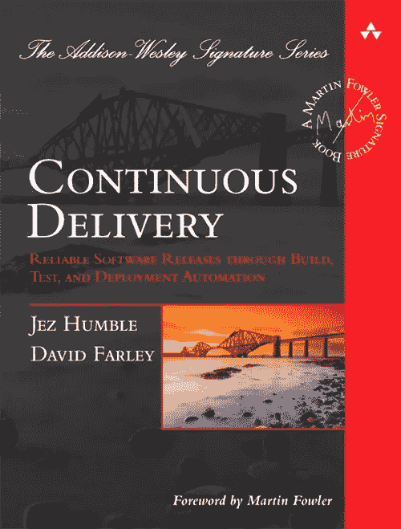
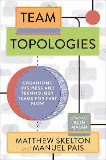

# 2023 年有经验的 IT 专业人士最好读的 7 本书

> 原文：<https://medium.com/javarevisited/7-best-tech-books-for-experienced-it-professionals-e7be535d54ff?source=collection_archive---------0----------------------->

## 我最喜欢的技术书籍，供有经验的 IT 专业人员、开发人员、DevOps 工程师和项目经理学习软件开发、交付和项目

你好，伙计们，如果你正在寻找一些有趣的小说风格的科技书籍来阅读，那么你来对地方了。早些时候，我已经分享了 [**最好的软件架构书籍**](/javarevisited/5-best-software-architecture-books-for-experienced-java-developers-1267d05a6b1d) ，在这篇文章中，我将分享最好的技术书籍，让有经验的开发人员不仅可以学习*的技术技能*，还可以以一种有趣而简单的方式学习*的操作和管理技能*。

*免责声明——如果你使用本文中的链接购买任何一本书，我可能会得到一点补偿。*

我总是喜欢先看有趣的书，然后再看内容丰富的书，因为很难读完一本内容丰富但不有趣的书，这就是为什么当我发现一本充满生活经验的有趣的科技书籍时，我会买下它，一遍又一遍地阅读，这个书单就是这些书的集合。

很久以前有人告诉我

> 如果我们从自己的错误中学习，那么我们只能学到一些东西，但如果我们从别人的错误中学习，那么就没有限制，还有什么比读书更好的从别人的错误中学习的方法呢？

我一生都是一个狂热的读者，当我还是个孩子的时候，我经常阅读漫画和儿童故事，当我长大后，我开始阅读杂志和小说，当我开始阅读[编程](https://javarevisited.blogspot.com/2018/05/top-5-java-courses-for-beginners-to-learn-online.html)和[软件开发](https://javarevisited.blogspot.com/2019/08/top-10-udemy-courses-and-certifications-for-programmers.html)时，我开始探索技术书籍。

即使在这么多年的技术和编程以及繁忙的日程安排之后，我还是努力读书，尤其是在旅行的时候。

去年我还读了几本有趣的科技书籍，我真的很喜欢，想和你们分享。这些是向高级开发人员、项目经理、技术领导、团队领导、解决方案架构师和程序员强烈推荐的书籍。

我不会说你会发现我找到的每本书都一样好，但它们都值得一读，如果你喜欢，继续读这本书，从中学到一些东西，让你的生活变得更好。

这也是为了我的许多读者，他们反复询问有趣的技术书籍，这些书籍不是关于[编程语言](/javarevisited/python-or-java-which-programming-language-beginners-should-learn-in-2020-de992b2650ec)、[框架](/javarevisited/10-best-online-courses-to-learn-spring-framework-in-2020-f7f73599c2fd)或[工具](/javarevisited/7-best-courses-to-learn-postman-tool-for-web-service-and-api-testing-f225c138fa5a)，而是关于思维模式、技能和日常程序员生活。

# 经验丰富的程序员的 7 本最佳技术书籍，2023 年的线索

不浪费你更多的时间，这里是我为有经验的开发者列出的最好的技术、编程、软件开发、交付和 DevOps 书籍。

它们将增强你的软件开发和过程的知识，并且它们也非常容易阅读，其中许多是以新颖的风格写成的，所以你不仅会学习，而且会喜欢阅读它们。

## 1.[凤凰计划](https://www.amazon.com/Phoenix-Project-DevOps-Helping-Business/dp/1942788290/?tag=javamysqlanta-20)

这是一本很棒的书，已经有一段时间了，但我是去年才找到的，是的，这是常有的事。上一次发生在我身上是在我花了几年时间编程后，发现了经典的[干净代码](https://javarevisited.blogspot.com/2017/10/clean-code-by-uncle-bob-book-review.html#axzz5jSEI4IYE)书。

这是任何高级开发人员和技术领导者的必读之作，因为它总结了自动化和 [DevOps](/hackernoon/the-2018-devops-roadmap-31588d8670cb) 如何帮助以及为什么每个开发人员都应该有这种心态。

这就像一本小说，读起来很有趣。你不会觉得无聊，我其实是在一次漫长的火车旅行中读完了整本书。如果你今年只能读一本书，我会推荐这本书。它将改变你的心态，把你塑造成一个更好的程序员、开发者和个人。

而且，如果你想学习 DevOps 并成为一名 DevOps 工程师，那么我也推荐你参加 Udemy 的 [**Azure DevOps 初学者基础**](https://click.linksynergy.com/deeplink?id=CuIbQrBnhiw&mid=39197&murl=https%3A%2F%2Fwww.udemy.com%2Fcourse%2Fazure-devops-for-beginners%2F) 课程。学习 DevOps 和 Azure Cloud 是很棒的课程。

## 2.[独角兽项目](https://www.amazon.com/Unicorn-Project-Developers-Disruption-Thriving-ebook/dp/B07QT9QR41/?tag=javamysqlanta-20)

这是凤凰计划的后续书籍。这本书的全名是“独角兽项目——一部关于开发者、数字颠覆和数据时代繁荣的小说”。如果你没有，这又是一本以小说形式呈现的科技书籍，这意味着看完它并不难。

这本书追踪了凤凰计划中一位高级首席开发人员和架构师的生活。金是一个伟大的讲故事的人，如果你喜欢凤凰计划，你也会喜欢这本书。

它不仅读起来有趣，同时也很有启发性，并提供了一些有用的见解来改善你的技术业务。

而且，如果你渴望成为一名软件架构师，我也建议你去看看 Udemy 上的 [**开发者到架构师:掌握软件架构**](https://click.linksynergy.com/deeplink?id=CuIbQrBnhiw&mid=39197&murl=https%3A%2F%2Fwww.udemy.com%2Fcourse%2Fdeveloper-to-architect%2F) 课程。对于有抱负的软件架构师来说，这是一个很好的资源。

## 3.[现场可靠性工程](https://www.amazon.com/Site-Reliability-Engineering-Production-Systems-ebook/dp/B01DCPXKZ6?tag=javamysqlanta-20)

《网站可靠性工程:谷歌的高可用性和快乐运营秘笈》是另一本适合有经验的程序员、支持人员、运营和技术领导的好书。我最近读了这本书，对我来说，这是一次奇妙的经历。

我学到了在大规模下，或者我应该说在谷歌规模下，事情是如何真正完成的，以及没有人是完美的这一事实，但通过适当的组织、技能和培训，他们可以处理任何事情。

这本书的 Kindle 版本也被称为《网站可靠性工程:谷歌如何运行生产系统》,售价仅为 27.99 美元

对了，如果你有兴趣学习 DevOps，我也推荐你准备 [**Google Cloud 认证:Coursera 上 Google Cloud 的 Cloud DevOps 工程师职业证书专精**](https://coursera.pxf.io/c/3294490/1164545/14726?u=https%3A%2F%2Fwww.coursera.org%2Fprofessional-certificates%2Fsre-devops-engineer-google-cloud) 。对于任何想以 DevOps 工程师或 SRE 开始职业生涯的人来说，这是一个很好的资源。

<https://coursera.pxf.io/c/3294490/1164545/14726?u=https%3A%2F%2Fwww.coursera.org%2Fprofessional-certificates%2Fsre-devops-engineer-google-cloud>  

## 4.[加速:建立和扩展高绩效的技术组织](https://javarevisited.blogspot.com/2020/04/top-5-books-to-learn-devops-for-developers.html#axzz6toWVHFSH)

对于希望为其组织构建高性能解决方案的高级开发人员和技术领导者来说，这是另一个非常棒的课程。加速建立和扩展高绩效的技术组织。

通过四年的突破性研究，Nicole Forsgren 博士、Jez Humble 和 Gene Kim 开始寻找一种使用严格的统计方法来测量软件交付性能以及驱动它的因素的方法。

这本书既展示了发现，也展示了研究背后的科学。您将发现如何衡量他们团队的绩效，以及他们应该投资哪些能力来提高绩效。

简而言之，这是技术领导者和首席信息官想要建立和扩展高性能技术组织的最佳书籍之一。而且，如果您热衷于提高 Java 应用程序的性能， [**Java 多线程、并发性&性能优化**](https://click.linksynergy.com/deeplink?id=CuIbQrBnhiw&mid=39197&murl=https%3A%2F%2Fwww.udemy.com%2Fcourse%2Fjava-multithreading-concurrency-performance-optimization%2F) 是另一个很好的资源。

## 5.[连续交货](https://www.amazon.com/Continuous-Delivery-Deployment-Automation-Addison-Wesley/dp/0321601912?tag=javamysqlanta-20)

如果你想在你的项目中设置 CI 和 CD，或者只是从 DevOps 开始，那么这是你的必读之书。将软件发布给用户通常是一个痛苦、有风险且耗时的过程。

这本书阐述了一些原则和技术实践，这些原则和技术实践能够快速、渐进地向用户交付高质量、有价值的新功能。通过构建、部署和测试过程的自动化，以及开发人员、测试人员和操作人员之间改进的协作，交付团队可以在几个小时内——有时甚至几分钟内——发布变更，无论项目的规模或代码库的复杂性如何。本课程的作者 Jez Humble 和 David Farley 首先介绍了快速、可靠、低风险交付流程的基础。

之后，他们引入了“部署管道”，这是一个管理所有变更的自动化过程，从签入到发布。最后，他们讨论了支持持续交付所需的“生态系统”，从基础设施、数据和配置管理到治理。

如果你需要 CI/CD 的课程推荐，那么 Udemy 上的 [**DevOps，CI/CD(初学者持续集成/交付**](https://click.linksynergy.com/deeplink?id=JVFxdTr9V80&mid=39197&murl=https%3A%2F%2Fwww.udemy.com%2Fcourse%2Fci-cd-devops%2F) 课程是另一个很好的资源。

简而言之，这是了解[持续交付和集成](/javarevisited/7-best-courses-to-learn-jenkins-and-ci-cd-for-devops-engineers-and-software-developers-df2de8fe38f3)的最佳书籍之一，也是高级开发人员、技术领导者和 DevOps 拥护者的必读书籍。

## 6.[构建微服务:设计细粒度系统](https://www.amazon.com/Building-Microservices-Designing-Fine-Grained-Systems/dp/1491950358/?tag=javamysqlanta-20)

随着云计算的发展，微服务架构的采用也在增长，因为它与云计算是齐头并进的。与整体应用相比，微服务的部署和可扩展性都更容易，这就是为什么许多公司，无论大小，都在使用微服务。

但是开发微服务会带来一系列的挑战和问题，这也是本书帮助你的地方。

这本书提供了大量的例子和实用的建议，全面介绍了系统架构师和管理员在构建、管理和发展微服务架构时必须考虑的主题。

这是学习微服务的最佳书籍之一，我向负责制定技术相关决策的高级 Java 开发人员、程序员、技术主管和解决方案架构师强烈推荐这本书。

并且，如果你需要 Java 和 Spring 框架的微服务开发的课程，我推荐 Udemy 上 Ranga Karnam 的[**Spring Boot 主微服务和 Spring Cloud**](https://click.linksynergy.com/deeplink?id=CuIbQrBnhiw&mid=39197&murl=https%3A%2F%2Fwww.udemy.com%2Fcourse%2Fmicroservices-with-spring-boot-and-spring-cloud%2F) 。用 Java 构建微服务是一门很棒的课程。

## 7.[团队拓扑](https://www.amazon.com/Team-Topologies-Organizing-Business-Technology/dp/1942788819?tag=javamysqlanta-20)

这本书与列表中的前几本书有些不同，因为它并不关注技术，而是教会你更重要的东西，管理团队。

如果你管理一个软件开发团队，这是一本非常好的书。即使你没有管理团队，通过阅读本书中的案例研究和综合方法，你也会学到很多关于提高团队合作的知识。

它为组织高性能的开发团队提供了许多深刻的见解。我强烈推荐这本书给每一个团队领导和项目经理阅读，特别是如果你正在管理一个远程开发或支持团队。

如果你需要更多关于团队建设的资源，那么 [**建立你的团队:如何在 Udemy 上建立完美的团队**](https://click.linksynergy.com/deeplink?id=CuIbQrBnhiw&mid=39197&murl=https%3A%2F%2Fwww.udemy.com%2Fcourse%2Fbuilding-your-team-how-to-put-together-the-perfect-team%2F) 课程是另一个很棒的资源。

以上是高级开发人员、技术主管和软件程序员可以阅读的一些最好的书籍。你很有可能已经读过很多这样的书，这很好。你也许可以向我和我的读者多推荐几本书。

其他**程序员和软件开发人员推荐书籍**

*   [开发者学习 DevOps 的 5 本最佳书籍](https://javarevisited.blogspot.com/2020/04/top-5-books-to-learn-devops-for-developers.html#axzz6cRYpiwdu)
*   [程序员 10 本算法书](http://www.java67.com/2015/09/top-10-algorithm-books-every-programmer-read-learn.html)
*   [每个程序员都应该读的 10 本书](http://www.java67.com/2015/07/5-books-learn-java-8-functional-programming.html)
*   [学习 Java 8 和函数式编程的 5 本书](http://www.java67.com/2015/07/5-books-learn-java-8-functional-programming.html)
*   [每个程序员都应该读的 5 本书](http://www.java67.com/2016/02/5-books-to-improve-coding-skills-of.html)
*   [我最喜欢的学习反应堆的书](https://www.java67.com/2020/03/top-5-books-to-learn-reactjs-for-beginners.html)
*   [5 本书学习 Spring 框架](http://www.java67.com/2016/12/5-spring-framework-books-for-java-programmers.html)
*   [学习数据结构和算法的 10 门课程](https://www.java67.com/2019/07/top-10-online-courses-to-learn-data-structure-and-algorithms-in-java.html)
*   [10 本免费的 Java 编程书籍](http://www.java67.com/2013/11/10-free-java-programing-books-download-PDF-HTML.html)
*   [初学者学习 Java 编程的最佳书籍](http://www.java67.com/2015/05/best-book-to-learn-java-for-beginners.html)
*   [每个程序员都应该阅读的 5 本 SQL 书籍](http://www.java67.com/2016/09/sql-5-best-books-to-learn-and-master.html)
*   [学习 OOP 设计模式的 5 本书](http://www.java67.com/2016/10/top-5-object-oriented-analysis-and-design-patterns-book-java.html)
*   [面向 Java JEE 程序员的 3 本免费 Struts 书籍](http://www.java67.com/2015/12/4-FREE-struts-books-for-java-ee-developers.html)
*   Java 程序员的 5 门最佳 Spring Boot 课程

感谢您阅读本文。如果你喜欢这些类似科技小说的书，请在推特、脸书和 LinkedIn 上与你的朋友和同事分享。

如果您有任何问题或反馈，请留言，如果您愿意，您也可以建议一些像我们这样的程序员和开发人员喜欢阅读并且应该在此列表中的书籍。

**P. S. —** 如果你这时想的只是一件事，我会建议，就去读读“[**《Phoneix Project》**。你肯定不仅会学到而且会喜欢这个故事。](https://www.amazon.com/Phoenix-Project-DevOps-Helping-Business/dp/1942788290/?tag=javamysqlanta-20)

<https://www.amazon.com/Phoenix-Project-DevOps-Helping-Business/dp/1942788290/?tag=javamysqlanta-20> 