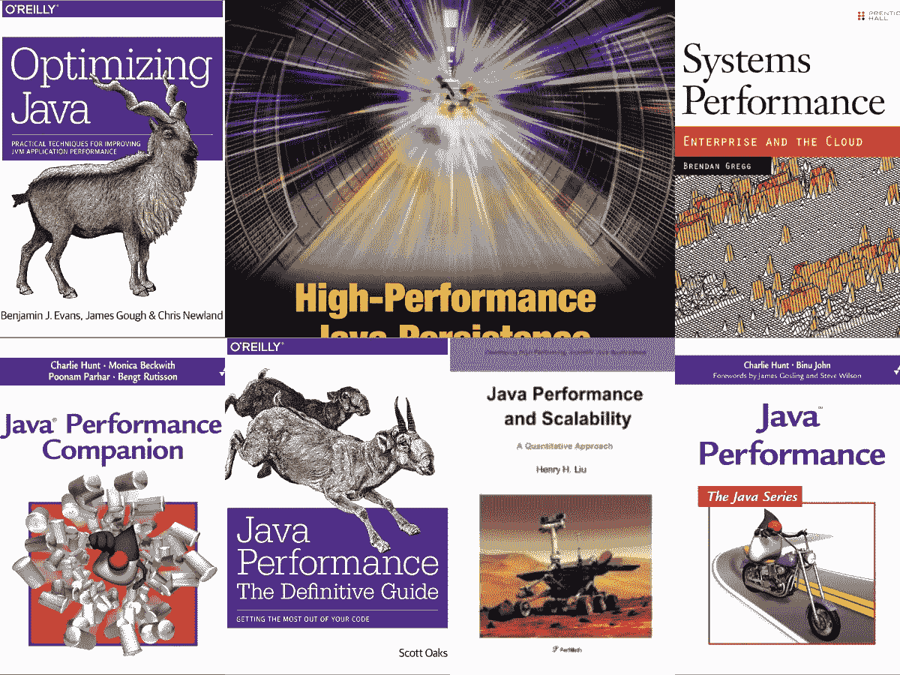
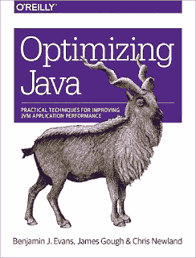
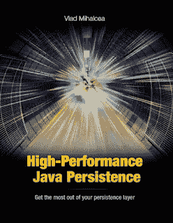
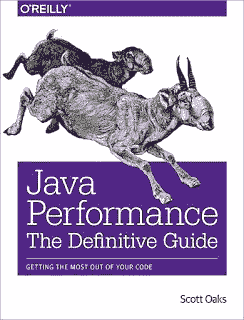
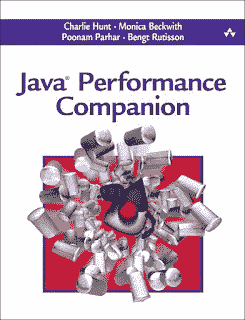
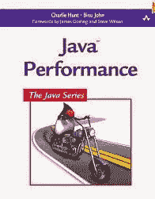
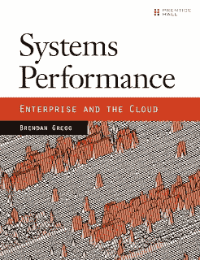
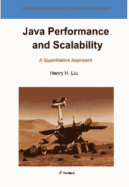
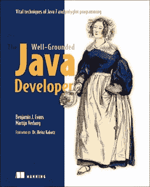

# 2023 年有经验开发人员的 8 本最佳 Java 书籍

> 原文：<https://medium.com/javarevisited/8-best-java-performance-books-for-experienced-developers-566e44f618c3?source=collection_archive---------1----------------------->

## 我最喜欢的 Java 书籍和课程，学习编写高性能 Java 应用程序、JVM 内部机制、垃圾收集和性能调优

大家好，您可能会想，*为什么 Java 开发人员应该读一本关于性能调优的书？很久以前，当我第一次面对这个问题时，我想我以后会这样做，但我很久都没有回到那个问题上。*

我意识到了自己的错误:缺乏关于[内存测量](https://click.linksynergy.com/fs-bin/click?id=JVFxdTr9V80&subid=0&offerid=323058.1&type=10&tmpid=14538&RD_PARM1=https%3A%2F%2Fwww.udemy.com%2Fjava-memory-management%2F)、 [JVM 调优](http://www.java67.com/2016/08/10-jvm-options-for-java-production-application.html)的知识，并且只有在我们用 Java 编写的任务关键型服务器端财务应用程序面临严重的性能和可伸缩性问题时才发现瓶颈。

诚然，当你真正需要的时候，你学得最多，但那些时候并不是学习基本面的最佳时机，其实那些时候是为了应用和纠正你的误解。

这就是为什么我与所有 Java 程序员分享这些 *Java 性能书籍*，并建议他们花些时间通读至少一本书。

顺便说一下，这些书是除了我的 [5 本 Java 程序员必读的书](http://javarevisited.blogspot.com/2013/01/top-5-java-programming-books-best-good.html)之外的，这些书涉及 Java 中的所有其他主题。如果你还没有阅读它们，一定要检查它们。

请记住，性能调优知识也是有经验的 Java 开发人员的重要方面之一，它可以让您脱颖而出。

自从大约 25 年前 **Java 问世以来，**它就一直面临着速度慢、性能差的批评。今天，我不认为 Java 在性能上落后于本土语言，如 [C](/javarevisited/10-best-c-programming-courses-for-beginners-2c2c1f6bcb12) 或 [C++](/javarevisited/top-10-courses-to-learn-c-for-beginners-best-and-free-4afc262a544e) 。

鉴于 Java 能够使用 [JIT(实时编译器)](http://java67.blogspot.com/2013/02/difference-between-jit-and-jvm-in-java.html)本机编译热代码，它几乎与用 [C](/javarevisited/10-best-c-programming-courses-for-beginners-2c2c1f6bcb12) 和 [C++](/javarevisited/10-advanced-c-books-and-courses-for-experienced-programmers-a90c3942471a) 编写的本机应用程序不相上下，但是通过遵循最佳实践、避免常见的性能陷阱以及使用最新的[工具](https://www.java67.com/2018/04/10-tools-java-developers-should-learn.html)和技术，可以做很多事情。

在本文中，我将介绍关于 Java 性能的五+一(奖金)书籍，它们不仅会教你测量什么、如何测量，还会解释这些问题背后的基本原理和概念。

您不仅将了解运行 Java 应用程序的[操作系统](/javarevisited/6-best-operating-system-courses-for-beginners-to-learn-7d727882d267)和 [JVM](http://javarevisited.blogspot.com/2013/01/difference-between-sun-oracle-jvm-ibm.html) ，还将了解如何使用 Java API 编写更快的代码。那么，我们还在等什么，让我们开始我们的旅程，去阅读大量关于 Java 性能调优的书籍吧。

顺便说一句，如果你赶时间，需要一门课程，也可以查看 Udemy 上的 [**Java 多线程、并发&性能优化**](https://click.linksynergy.com/deeplink?id=JVFxdTr9V80&mid=39197&murl=https%3A%2F%2Fwww.udemy.com%2Fcourse%2Fjava-multithreading-concurrency-performance-optimization%2F) 课程，学习一些编写高性能并发 Java 应用的实用技巧。

# 2023 年必读的 8 本 Java 性能调优书籍

这里是我列出的一些学习 Java 和 JVM 性能调优艺术的最佳书籍，以了解 JVM 内部机制、垃圾收集调优、JVM 参数、分析、监视 Java 应用程序并调试它来查找讨厌的 bug。

## 1.Benjamin J Evans 的《优化 Java》

Benjamin J Evans、James Gough 和 Chris Newland 所著的《优化 Java:提高 JVM 应用程序性能的实用技术》第一版
是理解垃圾收集和 JVM 内部工作方式的最佳书籍之一。

我原本没有看到这本书，因为直到本在评论中建议我读这本书时，我才读了这本书，但仅仅读了几页，我就确信这本书值得在这份名单中提及。

许多书主要关注 g . c,[JVM 内部](/javarevisited/7-best-courses-to-learn-jvm-garbage-collection-and-performance-tuning-for-experienced-java-331705180686)的更多方面，如线程、JVM 内存表示、字节码、JIT 编译器等。此外，这本书还概述了许多有用的工具，可以帮助您在日常工作中使用 JVM。

如果你需要一些帮助，想看东西，在现实中，我也建议你去看看 Matt Greecroft 和虚拟程序员的 [**Java 应用性能和内存管理**](https://click.linksynergy.com/deeplink?id=JVFxdTr9V80&mid=39197&murl=https%3A%2F%2Fwww.udemy.com%2Fcourse%2Fjava-application-performance-and-memory-management%2F) 课程。学习如何分析堆转储、提高 Java 性能、理解 GC 日志以及解决内存泄漏，这是一门很棒的课程。我强烈推荐。

## 2.[Vlad Mihalcea 的高性能 Java 持久性](https://www.amazon.com/High-Performance-Java-Persistence-Vlad-Mihalcea/dp/973022823X?tag=javamysqlanta-20)

这是一本关于 Hibernate 的极好的书，并且深入研究了性能。如果您想了解如何从数据访问层中挤出最后的性能下降，您必须阅读《高性能 Java 持久性》一书。本书的作者 Vlad Mihalcea 是为 Red Hat 工作的 Hibernate 开发人员，同时也是 T2 Hibernate T3、T4 Java T5 和 T6 JPA T7 技术的权威。

这本书从解释 JDBC 和数据库要领开始。结果集缓存、语句缓存、创建和维护数据库连接池、事务和隔离级别，以及在迁移到 ORM、Hibernate 和 [JPA](/javarevisited/top-5-books-to-learn-hibernate-for-java-developers-b2cb4b16ccd6) 之前它们的性能含义。

它涵盖了许多高级 Hibernate 主题，如继承、关系、缓存、刷新、批处理和并发控制，这使得书籍有时很难阅读，但不用担心。

【Vlad 还创建了一个在线课程， [**用 Hibernate 实现高性能 Java 持久化**](https://vladmihalcea.teachable.com/p/high-performance-java-persistence-mach-1?utm_source=javarevisited&utm_medium=web&utm_campaign=hpjpmach1&affcode=172599_kuoszt8s) **，**，其中用更多的例子解释了这些概念。对于任何想提高 Hibernate 应用程序性能的人来说，这个课程是这本书的完美伴侣。

简而言之，这本书很好地总结了直接或通过 JPA 和 Hibernate 使用 [JDBC](http://www.java67.com/2018/03/top-5-free-jdbc-courses-for-java.html) 的挑战和性能影响。如果您正在开发一个使用 JDBC 或 Hibernate 的 Java 应用程序，并且正在处理性能问题，那么这是您的必读书籍之一。

弗拉德还为他的电子书提供 10%的折扣，使用优惠券代码 **JAVINPAULDISCOUNT 可以在他的** [**教学网站上获得这本书的 10%折扣。**](http://bit.ly/2LbIgy5)

<https://vladmihalcea.teachable.com/p/high-performance-java-persistence-ebook?coupon_code=JAVINPAULDISCOUNT&affcode=172599_kuoszt8s>  

## 3.斯科特·奥克斯的《Java 性能权威指南》

为了学习性能调优，您应该了解工具、过程、选项，最重要的是避免常见的性能陷阱。这本书在这一点上得分很高，它有一章介绍了 Java 性能工程师应该知道的所有工具，包括像飞行记录器和 Java Mission Control 这样的高级工具。

它也有精彩的章节解释各种垃圾收集算法，如并发标记清除(CMS)和 G1 垃圾收集器。

您将了解它们在不同条件下如何工作，如何监控它们，以及如何调整它们。它还包括一整章关于堆分析和优化的内容。

简而言之，这是关于 Java 性能调优的*最佳书籍*之一，但是，如果你喜欢在线课程，那么你可以将这本书与 Pluralsight 的 [**了解 Java 虚拟机:内存管理**](https://pluralsight.pxf.io/c/1193463/424552/7490?u=https%3A%2F%2Fwww.pluralsight.com%2Fcourses%2Funderstanding-java-vm-memory-management) 课程结合起来，以获得两全其美。

这将教会你日常的事情，比如如何在 Java 中获取堆转储和直方图，然后介绍许多减少堆内存占用的方法。

上面还有一章关于 JDBC 和 JPA 的表演。临界点它告诉你如何选择合适的 [JDBC](/javarevisited/top-5-courses-to-learn-jdbc-and-database-connectivity-for-java-developers-free-and-best-of-lot-7945156fcc3?source=extreme_sidebar---------0-2----------------------) / [JPA](/javarevisited/top-5-hibernate-online-training-courses-for-beginners-and-advance-java-programmers-469460596b2b?source=---------9------------------) 方法可能远远超过 SQL 查询调优的收益。

同样，它有一个完整的章节解释多线程问题、缺陷以及对性能的影响。它包括像 [ForkJoinPool](http://javarevisited.blogspot.sg/2016/12/difference-between-executor-framework-and-ForkJoinPool-in-Java.html) 和 [Java 8 Streams](https://javarevisited.blogspot.com/2014/03/2-examples-of-streams-with-Java8-collections.html) 这样的高级主题。

它还涉及基于同步和错误共享的成本，调整 JVM 线程，例如，线程堆栈大小，配置偏向锁定，线程优先级和线程旋转。

对了，最精彩的还在后面介绍，这本书我最喜欢的是第 12 章。本章介绍了一些优秀的核心 Java 调优技巧及其影响。

这包括缓冲 I/O、类加载、随机数生成、JNI、异常、字符串性能、日志记录、Java 集合 API、 [Java 8 lambdas vs .匿名类](https://javarevisited.blogspot.com/2015/01/how-to-use-lambda-expression-in-place-anonymous-class-java8.html)，最后是 [Java 8 stream](/javarevisited/8-best-lambdas-stream-and-functional-programming-courses-for-java-developers-3d1836a97a1d) 和多过滤器性能。这实际上是我读的第一章，我爱上了它的内容和风格。如果你喜欢自己快速阅读这本书，我建议从这一章开始。它还讨论了 Java EE 性能，解释了 XML 和 JSON 解析以及对象序列化可能出现的问题。

并且，如果你需要更多资源，还可以查看 Udemy 上的 [**Java 多线程、并发&性能优化**](https://click.linksynergy.com/deeplink?id=JVFxdTr9V80&mid=39197&murl=https%3A%2F%2Fwww.udemy.com%2Fcourse%2Fjava-multithreading-concurrency-performance-optimization%2F) 课程，学习一些编写高性能并发 Java 应用的实用技巧。

## 4.[查理·亨特的 Java 性能伴侣](https://www.amazon.com/Java-Performance-Companion-Charlie-Hunt/dp/0133796825?tag=javamysqlanta-20)

这是关于 Java 性能调优和编写在 Java 中执行速度更快的代码的最新书籍之一。

这本书告诉我，Java 应用程序的性能将受到三个主要因素的限制 CPU、内存和 IO(磁盘和网络)，令人惊讶的是，许多知道如何使用 profiler 的开发人员并不知道这个基本事实。虽然这本书也介绍了许多分析工具，但我推荐最新的书籍，如 Scott Oaks 的《Java Performance 权威指南》和 Binu John 的《Java Performance 》, Charlie Hunt 有更全面的列表。

还有，如果你需要一门课程，也可以把这本书和 Udemy 上的 [**Java 内存管理**](https://click.linksynergy.com/fs-bin/click?id=JVFxdTr9V80&subid=0&offerid=323058.1&type=10&tmpid=14538&RD_PARM1=https%3A%2F%2Fwww.udemy.com%2Fjava-memory-management%2F) 课程结合起来。

## 5.[Java Performance By Binu John](http://www.amazon.com/dp/0137142528/?tag=javamysqlanta-20)

这是我很久以来最喜欢的一本 Java 性能书，直到最近我读了 Scott Oaks 的《Java 性能权威指南》。这本书非常类似于从顶部取代它的那本书。

本章解释了如何测量性能，演示了测量 CPU、内存和 IO 所需的工具。解释[垃圾收集如何工作的章节](http://javarevisited.blogspot.sg/2011/04/garbage-collection-in-java.html)，不同的 GC 算法，如串行与并行垃圾收集器、并发标记清除收集器等。

Binu John 和 Charlie Hunt 在如何构建实验以识别优化机会、解释结果并采取有效行动方面都做得非常出色。

为了给你一些可信度，并暗示你在这本书里可以期待什么，Charlie Hunt 是 Oracle 的 JVM 性能首席工程师。他负责提高 [HotSpot JVM](http://javarevisited.blogspot.sg/2011/11/hotspot-jvm-options-java-examples.html) 和 [Java SE 类库](https://javarevisited.blogspot.com/2018/01/top-20-libraries-and-apis-for-java-programmers.html)的性能。他还参与了 Oracle GlassFish 和 Oracle WebLogic Server 的性能改进工作。

Binu John 是 Ning，Inc .的高级性能工程师，他主要致力于提高 Ning 平台的性能和可伸缩性，以支持每月数百万的页面访问量。

在此之前，他在 Sun Microsystems 研究了十多年与 Java 相关的性能问题，并在 Sun 的 Enterprise Java Performance 团队中任职。

如果你还没有读过任何关于 Java 性能调优的书，想要为处理性能问题打下良好的基础，这本书是值得购买的。花的每一分钱都值得。

## 6.[系统性能:企业和云，作者 Brendan Gregg](http://www.amazon.com/Systems-Performance-Enterprise-Brendan-Gregg/dp/0133390098?tag=javamysqlanta-20)

系统性能分析是所有计算机用户的一项基本技能，无论您是想了解您的笔记本电脑速度缓慢的原因，还是想优化大规模生产环境的性能。

它是对操作系统(内核)和应用程序性能的研究，这本书将告诉你所有你需要知道的关于 Linux 性能监控和调优的知识。

程序员从优化算法、数据结构、JVM、[垃圾收集器](http://javarevisited.blogspot.com/2011/04/garbage-collection-in-java.html)开始，但它们最终会达到系统性能发挥作用的程度。

在我看来，这是每一个程序员的书，而不仅仅是 Java 程序员的书。了解您的系统如何工作，分页、交换和虚拟内存如何工作，CPU 如何从磁盘获取数据，不同类型的磁盘如何对 IO 绑定的 Java 应用程序产生深远的影响，对于任何真正对性能调优感兴趣的开发人员来说都是非常重要的。

我曾经常说，[学习 JVM](http://java67.blogspot.sg/2013/02/difference-between-jit-and-jvm-in-java.html) ，但是我现在可以告诉你必须很好地了解你的系统。了解操作系统基础知识、系统调用、内存、CPU、网络和磁盘 IO，缓存无疑将大有帮助，帮助您用任何编程语言编写高性能的应用程序，[包括 Java。](/javarevisited/10-free-courses-to-learn-java-in-2019-22d1f33a3915)

## 7.Java 性能和可伸缩性:一种量化的方法

在介绍这本书之前，我先介绍一下作者，他是一名博士，在 Vmware 工作，专门编写高性能和可伸缩的企业 Java 应用程序，但我认为他更为人所知的是他在软件性能和可伸缩性方面的工作:一种量化的方法。你可以看到这本书是他早期畅销书的更专业版本。顾名思义，这本书主要关注 Java 应用程序的性能和可伸缩性。

这本书适合 [Java 开发者](https://www.java67.com/2018/08/top-10-free-java-courses-for-beginners-experienced-developers.html)，架构师，甚至管理者。它分为两个主要部分，第一部分处理 Java 性能和可伸缩性的基础知识，第二部分介绍提高性能和可伸缩性的实践。

基础部分包括四章；它们分别探讨了软件程序、计算机硬件和 Java 虚拟机的可伸缩性。

第二部分包括探索从 32 位到 64 位如何影响 Java 应用程序的性能和可伸缩性的章节。

第 6 章可能是最重要的一章，它解释了如何调优 Java 以获得最佳的性能和可伸缩性。它介绍了方法、实践、工具，并在考虑可伸缩性的情况下对 Java 应用程序进行了调优。

第 7 章是另一个重要章节，解释了设计、算法和实现如何影响任何 Java 应用程序的性能和可伸缩性。它还介绍了如何执行瓶颈分析。好在他用示例程序解释了这一切，所以你可以在阅读时遵循指导方针。

总的来说，对于 Java 性能工程师来说，这是一本优秀而独特的书，如果你喜欢阅读多本书来获得见解，这本书可以与 *Java 性能权威指南*和*系统性能:企业和云*一起阅读。

## 8.[基础扎实的 Java 开发人员](http://www.amazon.com/dp/1617290068/?tag=javamysqlanta-20)

这是给我的读者的奖励书，我不会说这本书只关注 Java 性能调优，但我会说这是每个现代 Java 开发人员都应该放在书架上的书。本·埃文斯和马丁·韦尔伯格不需要任何介绍。

他们是知名的 Java 专家，也是 [jClarity](http://www.jclarity.com/) 的创始人，jClarity 承诺解决云环境下的性能问题。他们在 Java 方面有多年的经验，这反映在他们的书《扎实的 Java 开发人员:Java 7 和多语言编程的关键技术》中。

这是现代 Java 开发人员的必备书籍。它解释了 Java 中的新变化，包括 JDK 7 中的那些变化，如 try-with-resources、NIO2.0 和并发性变化，但最重要的是，它解释了为什么向 JVM 添加新特性如此昂贵。

添加新的库扩展比如 fork/join 或者像 switch-on-string 这样的语法糖相对容易，但是添加像 invokedynamic 这样的 JVM 指令是非常昂贵的。

这本书最好的一点可能是它没有停留在 Java 上，而是更进一步介绍了现代的 JVM 语言，比如 Scala、Clojure 和 T2 Groovy。

它涉及到了[函数式编程](/javarevisited/6-best-online-courses-to-learn-functional-programming-in-java-for-beginners-1dab627b63ca)，使用新的 JVM 语言和现代方法来测试、构建和有争议地集成 Java 应用程序。

这些都在这个最佳 Java 性能调优书籍列表中。我曾多次推荐《有效的 Java 》,这是 Java 开发人员的必备书籍，但同时我也发现您应该有一本专门介绍 Java 性能调优的出版物。

所以，如果你还没有读过任何 Java 性能方面的书，现在是时候读一本了。

其他 **Java 和** **编程文章**你可能喜欢

*   [2023 年 Java 开发者路线图](https://javarevisited.blogspot.com/2019/10/the-java-developer-roadmap.html)
*   2023 年每个 Java 开发人员都要学习的 10 种工具
*   [2023 年学习 Spring Boot 的 5 大课程](https://www.java67.com/2018/06/5-best-courses-to-learn-spring-boot-in.html)
*   [2023 年 Java 和 Web 开发人员的 10 个框架](http://javarevisited.blogspot.sg/2018/01/10-frameworks-java-and-web-developers-should-learn.html)
*   每个 Java 开发人员都应该学习的 21 项技术技能
*   [Java 开发者应该知道的 20 个库](http://javarevisited.blogspot.sg/2018/01/top-20-libraries-and-apis-for-java-programmers.html)
*   [我最喜欢的深入学习 Java 的免费课程](/javarevisited/10-free-courses-to-learn-java-in-2019-22d1f33a3915)
*   [深入学习 Spring 框架的前 5 门课程](https://javarevisited.blogspot.com/2018/06/top-6-spring-framework-online-courses-Java-programmers.html)
*   [2023 年要学的 10 种编程语言](http://www.java67.com/2017/12/10-programming-languages-to-learn-in.html)
*   [学习 Maven、Jenkins 和 Docker 的 10 门免费课程](/javarevisited/top-10-free-courses-to-learn-maven-jenkins-and-docker-for-java-developers-51fa7a1e66f6)
*   [2023 年 Java 开发人员应该阅读的 10 本书](http://www.java67.com/2018/02/10-books-java-developers-should-read-in.html)
*   [每位软件开发人员必备的 11 项技能](https://dev.to/javinpaul/11-essential-skills-software-developers-should-learn-in-2020-1bio)
*   [成为更好的 Java 开发人员的 10 个技巧](https://javarevisited.blogspot.com/2018/05/10-tips-to-become-better-java-developer.html)
*   [2023 年将获得 10 项 AWS 和云认证](https://www.java67.com/2020/09/top-10-cloud-certification-you-can-aim.html)

感谢您阅读这篇文章。如果您喜欢这些*最佳 Java 性能书籍和课程，那么*请与您的朋友和同事分享。如果您有任何问题或反馈，请留言。

**P. S. —** 如果你是 Java 编程世界的新手，并且想以一种有指导和更结构化的方式学习 Java，那么你也可以在 Udemy 上查看由 Tim Buchalaka 和他的团队开设的 [**完整的 Java 大师班**](https://click.linksynergy.com/deeplink?id=JVFxdTr9V80&mid=39197&murl=https%3A%2F%2Fwww.udemy.com%2Fcourse%2Fjava-the-complete-java-developer-course%2F) 课程。这是一门很棒的课程，最近针对 Java SE 17 进行了更新，以便在线学习 Java。

</javarevisited/top-5-java-online-courses-for-beginners-best-of-lot-1e1e240a758> 