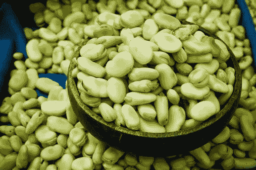

# 春豆和 IoC 初学者指南

> 原文：<https://medium.com/javarevisited/a-beginners-guide-to-spring-beans-a88e33f4badc?source=collection_archive---------2----------------------->



豆子是弹簧框架的支柱。所有的对象和资源都以 beans 的形式进行管理。

根据 spring.io 的官方文档，

> 在 Spring 中，构成应用程序主干并由 Spring IoC 容器管理的对象称为 beans。bean 是由 [Spring IoC 容器](https://javarevisited.blogspot.com/2011/09/spring-interview-questions-answers-j2ee.html)实例化、组装和管理的对象。否则，bean 只是应用程序中许多对象中的一个。Beans 以及它们之间的依赖关系反映在容器使用的配置元数据中。

spring beans 指的是由 Spring IOC 容器创建和管理的 java 对象。为了理解 spring beans 的用法，我们必须首先了解 IOC — [控制反转](https://javarevisited.blogspot.com/2012/12/inversion-of-control-dependency-injection-design-pattern-spring-example-tutorial.html)。

# **什么是控制反转？**

控制反转构成了 Spring 框架的核心。它指的是将对象和部分代码的控制移交给框架或容器的机制，最常用于[面向对象编程](/javarevisited/6-best-object-oriented-programming-books-and-courses-for-beginners-d46235cbda49)。spring 容器跟踪所有的对象和它们的依赖关系，并在程序需要的时候让它们可用。它负责维护所有对象的生命周期。

## 依赖注入

这种控制反转是由 Spring 中的 IOC 容器通过使用一个叫做依赖注入的过程来实现的。它是一种机制，用于通过创建和注入运行时创建对象所需的必要的[依赖关系](https://javarevisited.blogspot.com/2022/02/how-to-fix-autowired-no-qualifying-bean.html)来实现对象之间的松散耦合。这不是手工注入依赖项，而是在 spring 中使用 IoC 容器实现的。

IOC 容器是使用[***application context***](https://javarevisited.blogspot.com/2012/11/difference-between-beanfactory-vs-applicationcontext-spring-framework.html#axzz7BnOZ1wuB)和 ***BeanFactory*** 接口实现的，包含应用程序的所有必要细节，如 bean 定义、关于实例化、管理和销毁对象的信息等。

那么，Spring 中的依赖是如何注入到对象中的呢？

依赖关系可以在运行时以三种不同的方式注入到对象中:

*   [**构造函数注入**](https://javarevisited.blogspot.com/2012/11/difference-between-setter-injection-vs-constructor-injection-spring-framework.html#axzz6qnblZnVj) :这是通过为对象定义一个构造函数来实现的，该构造函数将所有必需依赖项的值作为输入。

```
**@Autowired**
public **OutputService**(**TimerService** timeService, **GreetingService** greetingService, **String** name) {
   this.timeService=timeService;
   this.greetingService=greetingService;
   this.name=name;
}
```

*   **Setter 注入**:这是通过为对象中所有必要的依赖关系定义一个 Setter 来实现的。

```
**@Autowired**
public **void** setTimeService(**TimerService** timeService) {
   this.timeService = timeService;
}

**@Autowired**
public **void** setGreetingService(**GreetingService** greetingService) {
   this.greetingService = greetingService;
}
```

*   **字段注入**:在这种方法中，我们可以在 spring 中的必填字段上使用 [**@Autowired** 注释](https://javarevisited.blogspot.com/2021/10/difference-between-autowired-and.html)来注入字段级的依赖关系。(仅适用于基于注释的配置)

```
**@Autowired**
private **TimerService** timeService;**@Autowired**
private **GreetingService** greetingService;
```

在基于 xml 的配置的情况下，可以通过为 bean 指定 **autowire** 属性并为其指定类型来启用自动连接。

一般来说，这三种方法都可以用于依赖注入。但是，为了保持一致性，最好选择其中任何一个并在项目中使用。

# **配置弹簧豆**

## 基于 XML 的配置

传统上，它们在包含 spring 应用程序上下文的 XML 文件中配置。

```
<bean name=”processor” class=”com.example.com.MainProcessor”></bean>
```

带有 bean 定义的示例 XML 文件:

可以使用应用程序上下文的***classpathmlaplicationcontext***实现来加载 bean 定义或应用程序上下文。

## 基于 Java 的配置

然而，它们也可以在 Spring 框架的新版本中使用 [**@Bean** 注释](https://www.java67.com/2021/10/pring-bean-example-what-does-bean-annotation-does.html)来创建

```
**@Bean**
**public** MainProcessor processor() {
  **return** **new** MainProcessor();
}
```

在这两种情况下，我们都为类 MainProcessor 声明了一个新的 bean。在基于注释的配置中，由于我们没有为 bean 提供任何特定的名称，因此在为这个类创建新 bean 时， [spring](/javarevisited/10-free-spring-boot-tutorials-and-courses-for-java-developers-53dfe084587e) 将自动使用 bean 的方法名称(方法名称的第一个字母将总是被转换为小写)。但是，我们可以显式地提供 bean 名称，同时将其声明为 **@Bean(name="customName")** 。

```
**@Bean**(**name**=”customName”**)**
**public** MainProcessor processor() {
  **return** **new** MainProcessor();
}
```

这是一个基于 java 的配置的例子，相当于上面的基于 XML 的例子。

在这种情况下，可以通过指定配置类，使用应用程序上下文的***AnnotationConfigApplicationContext***实现来加载上下文。

## 基于注释的配置

Spring 2.5 引入了新的配置 beans 的方法，从而不再需要基于 XML 文件的配置。它引入了几个新的注释，例如:

*   [**@Component**](https://javarevisited.blogspot.com/2017/11/difference-between-component-service.html#axzz6ngd8ND25) :组件注释用于在组件扫描时标记要扫描的类，然后由 Spring IOC 容器管理，而不是手动为类创建 Beans。
*   **@Service** 、 **@Repository** 、 **@Controller** 和 **@RestController** :这些是 **@Component** 注释的特殊形式，在应用程序的不同层之间提供了更好的可读性和模块化。

> **@Service** —用于表示服务层，
> **@Repository** —用于表示[数据访问层](https://javarevisited.blogspot.com/2013/01/data-access-object-dao-design-pattern-java-tutorial-example.html#axzz7CANam4JD) (DAO)，
> **@Controller** —用于表示表示层(用于处理来自 UI 和 MVC 设计中的请求)，
> [**@ Rest Controller**](https://javarevisited.blogspot.com/2017/08/difference-between-restcontroller-and-controller-annotations-spring-mvc-rest.html#axzz6grO2U4Lp)—用于表示具有 Rest 端点的表示层。

组件本身可以用来代替其他注释，应用程序可以正常工作，但可能会有一些意外的行为。例如，***PersistenceExceptionTranslationPostProcessor***用于捕捉特定于持久性的异常，并将其作为 spring 的统一运行时异常抛出，它充当了使用 **@Repository** 注释进行注释的类的顾问。它们还提供了在 AOP 中实现切入点的机会。

现在，为了让 spring 自动扫描一个包，并通过启用**组件扫描**属性来配置 beans。这是可以做到的

*   通过添加一个附加属性直接从 XML 文件中获取:

> <component-scan base-package="com.infotrends.in.sports"></component-scan>

在使用这种方法时，我们可以使用

*   或者使用@ComponentScan 注释。

```
@ComponentScan(“com.infotrends.in.sports.annotations”)
public class ConfigurationClassName {
}
```

通过使用@ComponentScan 和@Configuration 注释以及应用程序上下文的***AnnotationConfigApplicationContext***实现，可以直接从 java 文件加载应用程序上下文。

在这种情况下，我们可以使用***AnnotationConfigApplicationContext***实现来创建应用上下文。

# 自动连接 Beans 的不同方式

如前所述，通过使用自动连接，我们不必显式地将引用传递给创建 bean 时所需的不同的依赖关系。它将由 Spring IOC 容器自动管理。如果没有找到合适的 bean 用于自动连接，那么抛出[***nosuchbeandidefinitionexception***](https://javarevisited.blogspot.com/2016/09/2-reasons-of-orgspringframeworkbeansfactory-beanCreationException-Error-creating-bean-with-name.html)*异常*

*配置自动布线的不同方式有:*

*   ***否:**用于禁用 bean 中的自动连接，我们必须显式地提供对依赖 bean 的引用。这是 XML 的默认行为。*
*   ***byName** :在这种情况下，spring 将搜索一个与要设置的属性同名的 bean。*
*   ***byType** :在这种情况下，spring 将搜索与需要设置的属性类型相同的 bean。如果需要的类型有多个 bean，那么 spring 将抛出一个***nouniquebeandidefinitionexception***异常。如果没有提供特定类型，这是在 **@Autowired** 注释中使用的默认配置。*
*   ***构造函数**:在这种情况下，spring 将根据构造函数参数寻找所需的 bean 类型。*

*举个例子，*

*   *没有自动连接时，xml 文件中的 bean 定义如下所示:*

```
*<bean id="is24hrFormat" class="java.lang.Boolean">
    <constructor-arg type="java.lang.Boolean" value="#{new Boolean(environment['spring.profiles.active']!='dev')}"/>
</bean><bean id="timerService" class="com.infotrends.in.Springbasics.service.TimerService;">
    <constructor-arg ref="is24hrFormat"/>
</bean><bean id="greetingService" class="com.infotrends.in.Springbasics.service.GreetingService">
    <constructor-arg index="0" value="${app.greeting}"/>
</bean>
**<bean id="outputService" class="com.infotrends.in.Springbasics.service.OutputService">
    <constructor-arg index="0" ref="timerService"/>
    <constructor-arg index="1" ref="greetingService"/>
    <constructor-arg index="2" value="${app.name}"/>
</bean>***
```

*   *但是，使用自动连接，我们可以直接跳过对 **timerService** 和**greeting service**bean 的引用，如下所示()*

```
*<bean id="is24hrFormat" class="java.lang.Boolean">
    <constructor-arg type="java.lang.Boolean" value="#{new Boolean(environment['spring.profiles.active']!='dev')}"/>
</bean><bean id="timerService" class="com.infotrends.in.Springbasics.service.TimerService;">
    <constructor-arg ref="is24hrFormat"/>
</bean><bean id="greetingService" class="com.infotrends.in.Springbasics.service.GreetingService">
    <constructor-arg index="0" value="${app.greeting}"/>
</bean>
**<bean id="outputService" class="com.infotrends.in.Springbasics.service.OutputService"  autowire = "byType">
    <constructor-arg index="2" value="${app.name}"/>
</bean>***
```

*这是自动布线配置 byType 的一个示例。*

# *结论*

*本文简要介绍了 Spring bean，以及在基于 Spring、使用 XML 或基于注释的配置中使用它们的不同方式。*

*您可以在 GitHub repo[https://github.com/Vicky-cmd/SpringMVC](https://github.com/Vicky-cmd/SpringMVC)中找到用于示例的项目*