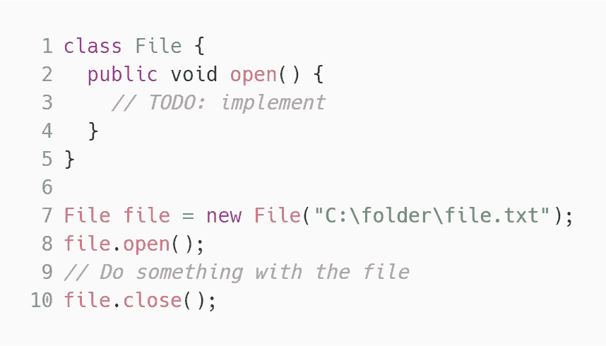
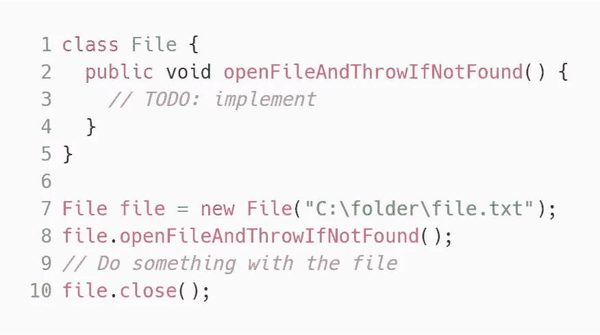

# 选择正确名称的完整指南

> 原文：<https://medium.com/javarevisited/a-complete-guide-for-choosing-the-right-names-1c2ee4e21f7e?source=collection_archive---------2----------------------->


在本文中，我们将讨论如何为类、方法和变量选择正确的名称。我们将看到一个不好的名字如何导致难以理解的代码，以及如何修复它。我们开始吧。

这篇文章是名为[“软件实践和编写干净代码”](https://rebrand.ly/spcc-medium-right-names)的干净代码深入课程的一部分，你可以去看看。它目前以 87%的折扣出售。

[](https://rebrand.ly/spcc-medium-right-names)

# 通则

我们当然不想要这样的名字:

*   var 数= 5；
*   var a = 42
*   var abc = " John
*   等等

这些名字毫无意义，它们没有给我们带来任何价值。看看这段代码:

```
actvUsr(String text) {
   User usr = rpstry.find(text);
   usr.actv();
}
```

我们有一个名为 actvUsr 的方法，它将字符串文本作为参数。然后我们调用 *rpstry.find* ，通过*【文本】*找到一个用户。然后我们调用 *usr.actv()* 方法。

唷。真是一团糟。这些名字甚至很难发音。如果你第一次看到这段代码，我打赌你会很难理解。即使你不是第一次看到这个，这也很难。太可怕了。这个片段只有 2 行代码。想象它是 20。

如果我想了解这个方法是做什么的，我需要去看看*“r stry”*是什么。然后我需要在*中找到*方法，看看这个叫做 *"text"* 的参数是什么。然后我需要转到 *actv()* 方法，看看它做什么。有这么多的工作要做，所以我可以理解 2 行代码，这是疯狂的。好吧，你可能不会看到那种混乱，但我想表明我的观点。如果你的名字是蹩脚的，你的代码将很难阅读。

我们来重构一下。

*“actv”*的意思是*激活*，所以就这么叫吧。你不需要做那样的缩写，经常会有不可理解的。这种缩写风格来自于过去，那时我们的内存非常小(千字节大小)，所以每一位都很重要。但是现在不是那个时候了，内存便宜，开发者的时间贵。所以你需要尽可能地让开发者更容易理解你的代码。

接下来是另一个毫无意义的缩写*“usr”*。这甚至没有削减多少字，只是使它难以阅读。所以我们将其重命名为*用户*。

*文本*是用户的 id。

rpstry 是存储库。您可以将其重命名为存储库或回购，两者都很好，也很容易理解。

Find 方法被命名为 okay，但是我们仍然不知道我们在找什么。在这种情况下，是通过 id。因此，让我们将其重命名为 findById。

这是最后的结果:

```
activateUser(String id) {
   User user = repo.findById(id)
   user.activate();
}
```

这样好多了。

好吧，假设我是第一次看到这种方法。我将需要不到 5 秒的时间来理解它到底做了什么，而不去研究内部方法。当然，如果我想知道用户激活是如何工作的，我需要使用 activate 方法，但这很正常。我们把抽象代码放在顶部，如果我们想看到细节，我们就进入内部方法。

# —

你还需要注意上下文。请参见以下示例:

```
class UserService {
   public User getUserById(String id) {
      // TODO: implement
   }
}
```

我们有一节课。在中，我们有 getUserById 方法。让我们看看如何在外面调用这个方法:

```
UserService userService = new UserService();
userService.getUserById("USER_ID");
```

注意调用行: *userService.getUserById* 。有点多余，对吧？如果我们调用用户服务，我们知道上下文，我们知道我们将与用户一起工作。因此，调用 getById 方法完全没问题:

```
class UserService {
   public User getById(String id) {
      // getting the user
   }
}UserService userService = new UserService();
userService.getById("USER_ID");
```

那更好。虽然没那么多，但是减少了冗余，让代码更干净。

# 如何写出更好的类名

类名应该是名词。这方面的例子有:

*   自行车
*   人
*   调度程序
*   用户服务

…当然还有:

*   hasthistypepatterntriedtosneaknosomegenericorparameterizeddypatternmatchingstuffanywhere visitor(这个来自真实项目，可以谷歌一下)

你不想让类名那么长，但是如果你的类名很大也不用担心。历史上，为了节省内存，类名、变量名和方法名都很短。但是现在我们不需要那样做了。我们知道维护比更长的名字所占用的额外字节更有价值。也就是说，与其节省内存，不如使用更具描述性的名称。现在我们有足够的内存，我们的编译器也在优化名字，在编译的时候用更小的名字替换它们。所以不用担心这个。

避免干扰词，如:

*   处理器
*   数据
*   信息
*   实用工具
*   等等。

如果你使用它们，就意味着你不知道如何调用这个类。确保你输入的每一个字都有鲜明的价值、新的信息，并有助于描述课程。

## 范围规则

范围意味着——使用函数、变量或类的次数和范围。例如，如果我们有一个只使用一次的[私有方法](https://www.java67.com/2019/02/can-you-add-non-abstract-method-on-interface-in-java.html)——这是一个小范围。如果你有一个被使用 3 次的私有方法，那么这个范围就更大了。如果我们有一个在不同的类中使用了 10 次的公共方法，我们就有了一个大的作用域。诸如此类。你明白了。

规则如下:类名在作用域小的时候要长，作用域大的时候要短。

(没有完全理解的话重读上面。这可能有点让人不知所措)

原因是当我们有一个小的作用域时，我们可以写一个更具描述性的名字，因为它用得更少，你不必记住一个巨大的名字。范围大的时候。我们想保持它的干净，所以我们需要让名字更小更干净。

我不指望你在两分钟内想出一个完美的班级名字。想出正确的名字很难。如果你愿意的话，你可以随时更改它。当你使用一个代码时，即使它不是你的，并且你想到了一个更好的名字，不要犹豫去改变它。

# 如何写出更好的方法名

方法名应该是动词。方法名称的示例如下:

*   getName
*   费奇德
*   加速
*   破裂
*   вземиКолаПоМарка

一个小提示:名字应该只用英文。即使你正在为一个特定的非英语国家编写应用程序。目前，几乎每个人都懂英语，如果你正在编写一个应用程序，比如说，名字是意大利语，如果你想在其他国家外包，那是不可能的。

如果一个方法名返回一个布尔值—让它成为谓词。这是因为它很可能用在 if 语句中，应该读起来很好。例如:

```
class Account {
   public boolean isEmpty() { 
      // TODO: implement
   }
}
```

我们有一个包含了 *isEmpty* 方法的类*帐户*。当我们在 if 语句中使用这个方法时，它看起来像这样:

```
Account account = new Account();
if(accout.isEmpty()) {
   throw new Exception();
}
```

请注意阅读 if 语句是多么容易:

> 如果帐户为空，则抛出新的异常。


Grady Booch 有一句名言:“干净的代码简单而直接。[干净的代码](/javarevisited/clean-code-a-must-read-coding-book-for-programmers-9dc80494d27c)读起来像是写得很好的散文。干净的代码永远不会掩盖设计者的意图，而是充满了清晰的抽象和直截了当的控制线。”

在这种情况下，您可以看到这段代码读起来像是写得很好的散文。我知道这是一个简单的例子，但这是一个目标。

作用域规则在这里也适用:作用域小的时候名字应该长，作用域大的时候名字应该短。同样，当我们有一个小的作用域时，我们可以写一个更具描述性的名字，因为它很少被使用，你不必记住一个很大的名字。当范围很大时，我们希望保持干净，所以我们需要保持名字更小更干净。

例如，类文件(这来自标准的 [Java 库](/javarevisited/20-essential-java-libraries-and-apis-every-programmer-should-learn-5ccd41812fc7)):



文件有一个打开方法。想象一下，它被称为 openFileAndThrowIfNotFound，而不是 open:



想象一下在所有代码中调用这个类。太可怕了。因为 File 类中 open 函数的作用域大，所以名字小。调用 *File.open()* 要简单得多。

记住，如果你需要进入一个类或者一个方法来弄清楚它是做什么的——它没有被正确地命名。

# 如何写出更好的变量名

通常变量名持有对象，一些存在的东西。这就是为什么它们应该是名词。变量名的例子有:

*   用户
*   处理器
*   被执行
*   评论列表
*   等等。

布尔变量应该是谓词。例如:

*   可播放
*   应该删除
*   被锁定
*   等等。

当放入 if 语句时，它们应该读得很好。请参见以下示例:

```
if(isEmpty) {
   throw new Exception();
}
```

# —

你听说过“匈牙利符号”吗？这是 80 年代的命名惯例。这种表示法描述了不同变量类型的编码前缀。例如:

*   b 代表布尔型— bBusy
*   ch 代表 char-chini initial
*   c 用于项目计数— cApples
*   f 代表浮点型— fBusy
*   函数名的 fn—fn save
*   等等。

不要使用编码。求你了。现在我们不需要那个了。我们的 [IDEs](/javarevisited/7-best-courses-to-learn-intellij-idea-for-beginners-and-experienced-java-programmers-2e9aa9bb0c05) 完全能够向我们展示变量的类型。这是浪费时间，使代码更难阅读，而且毫无用处。

—

不要用注释代替好的命名。

例如:

```
public void example() {
   int m; // this is the month of the year
   // implementation
   // implementation
   // implementation
   // implementation
   // implementation 
   // implementation
   // implementation
   // implementation
   // implementation
  [DO SOMETHING WITH m]
}
```

看第二行。这是不对的。是的，如果你正在读这一行，你会因为注释而知道 *m* 是什么，但是如果你正在看它在第 12 行的用法——你不会知道它是什么。你应该搜索一下 *m* 的宣言，看看是什么。这是一个简单的例子，但是想象一下在一个方法中有 5 个这样的变量。这将使代码更加难以阅读。这就是为什么您应该使变量更具描述性:

```
public void example() {
   int month;   
   // implementation
   // implementation
   // implementation
   // implementation
   // implementation 
   // implementation
   // implementation
   // implementation
   // implementation
  [DO SOMETHING WITH month]
}
```

在本例中，我们删除了注释，并将其中的信息包含到变量名中。这样我们就不需要支持额外的注释，我们的代码是自文档化的。当然，评论有时是有用的，但这是另一个话题。

—

当然，我们在这里也有一个范围规则:

这里的规则与方法和类相反:变量名在范围较小时应该较短，在范围较大时应该较长并具有描述性。

这里的规则不同，因为变量的范围通常很小(在一个方法中)。如果范围很小，就不需要描述性的名称，因为很容易看出变量的意思。让我们看一个例子:

```
public FreelancePaidEmployer save() { 
   FreelancePaidEmployer freelancePaidEmployer = getEmployer();
   save(freelancePaidEmployer);
   return freelancePaidEmployer;
}
```

在这种情况下，*freelancepaidememployer*变量的范围非常小。我们不需要为变量取一个描述性的名字，因为很容易看出变量的意思和来源。让我们重构它:

```
public FreelancePaidEmployer save() {
   FreelancePaidEmployer e = getEmployer();  
   save(e); 
   return e;
}
```

那更好。如果你愿意的话，你可以把它们描述得更详细一点，但是我不认为有这个必要。

相反，如果我们有一个变量的大范围，这意味着我们将有一个更大的方法，我们需要使变量更具描述性。原因是我们不想一直上下滚动，这样我们就能回忆起变量的作用。

让我们看一个更抽象的例子:

```
public void method() {
   int m; // this is the month of the year
   [USING THE VARIABLE HERE]
   // business logic
   // business logic
   // business logic
   // business logic
   [USING THE VARIABLE HERE]
   // business logic
   // business logic
   // business logic
   [USING THE VARIABLE HERE]
   [USING THE VARIABLE HERE]
   // business logic
   // business logic 
   // business logic
   // business logic
   // business logic
   [USING THE VARIABLE HERE]
}
```

我们在顶部声明变量，然后我们有业务逻辑，并不时地使用变量。如果它的名字不是描述性的，我们将需要频繁地滚动到方法的顶部来查看这个变量到底是什么。这就是为什么当范围很大时，我们希望有一个更长、更具描述性的名称。让我们重命名该变量:

```
public void method() {
    int month;
    [USING THE VARIABLE HERE]
    // business logic
    // business logic
    // business logic
    // business logic
    [USING THE VARIABLE HERE]
    // business logic
    // business logic
    // business logic
    [USING THE VARIABLE HERE]
    [USING THE VARIABLE HERE]
    // business logic
    // business logic
    // business logic
    // business logic
    // business logic
    [USING THE VARIABLE HERE]
}
```

那更好。现在，当我们使用变量时，我们不需要去变量声明就能知道它到底是什么。

另一个技巧是尽可能接近变量的用途来声明变量。不要这样做:

```
public void method() {
   var variable = new Variable();
   // business logic
   // business logic
   // business logic
   // business logic
   // business logic
   [USING THE VARIABLE HERE]
}
```

在这里，我们将变量的范围变大，这是不必要的。由于范围更大，我们需要编写更长的描述性名称。而且做了也没什么意义。你可以在变量的用法上面声明变量。因此:

```
public void method() {
   // business logic
   // business logic
   // business logic
   // business logic
   var variable = new Variable();
   [USING THE VARIABLE HERE]
}
```

当你这样做的时候，你就缩小了范围，用一个更简单的名字来调用这个变量是非常好的。注意，在 [JavaScript](/javarevisited/my-favorite-free-tutorials-and-courses-to-learn-javascript-8f4d0a71faf2) 中，在顶部声明变量是惯例，但这是这个规则的一个例外，所以请记住这一点。

**在你离开之前——我们惊人的干净代码课程**

如果你喜欢这篇文章，你会喜欢我们的课程:

*   39 场讲座
*   1.5 小时的内容
*   做一个真实的项目来测试你的知识
*   27 个可下载资源
*   30 天退款保证

你可以在这里注册课程— [软件实践和编写干净的代码](https://rebrand.ly/spcc-medium-right-names)

[](https://rebrand.ly/spcc-medium-right-names)