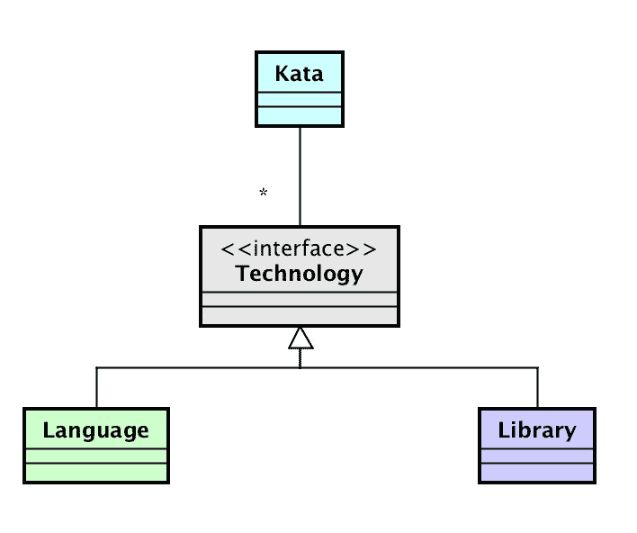

# 形中的形

> 原文：<https://medium.com/javarevisited/a-kata-of-katas-e4ebdacdab11?source=collection_archive---------4----------------------->

记录在代码表中的代码表目录

照片由[陶黎黄](https://unsplash.com/@h4x0r3?utm_source=medium&utm_medium=referral)在 [Unsplash](https://unsplash.com?utm_source=medium&utm_medium=referral)

# 什么是代码形？

> 一个动手编程练习，有助于通过实践磨练你的技能。

我们许多人通过实践学得最好。我们通过不断的实践建立信心和专业知识。我们也通过教学来学习。通过用各种语言实现算法来解决特定的问题，代码形可以帮助你建立熟练程度。代码表还可以帮助您练习利用库中提供的 API，比如 Eclipse 集合或 Java 流。与开发人员社区共享您开发的代码表将有助于您了解更多。

我遇到的第一套代码卡塔是由务实的程序员[迪夫·托马斯](https://twitter.com/pragdave)编写和分享的。以下是他的网站链接，有 21 个[代码 Katas](http://codekata.com/) 。这些代码表对于希望练习解决不同编程问题的开发人员来说是一个惊人的资源。

[Eclipse Collections](https://github.com/eclipse/eclipse-collections) Java 库也有一组[代码表](https://github.com/eclipse/eclipse-collections-kata)，旨在向开发人员介绍这个库。我是 Eclipse 集合的项目负责人之一，我继续寻找机会来创建新的 katass 或增强现有的 kata，以使库更便于学习。

除了 Eclipse Collections Katas 之外，我还编写了其他开源代码 kata 来帮助开发人员学习各种 JVM 语言和库。我还通过博客和推特展示了如何在非 JVM 编程语言中实现相同的代码表。我最近实现了 [Smalltalk](https://blog.devgenius.io/a-little-smalltalk-for-the-soul-b12051b709d1?source=friends_link&sk=a7f9ac82eccc5387232e806e50972e25) 中的[卡式](https://github.com/BNYMellon/CodeKatas/tree/master/deck-of-cards-kata)和 [Python](https://donraab.medium.com/my-pet-python-kata-d2959ca702a5?source=friends_link&sk=a27176bcf1fea8321ca40ff497ad130a) 中的[宠物式](https://github.com/eclipse/eclipse-collections-kata/tree/master/pet-kata)。

[Nikhil Nanivadekar](https://twitter.com/NikhilNanivade) 、莱奥·利马和我还用四种 JVM 语言(Java、Kotlin、Groovy、Scala)实现了扑克牌形，用于我们在 Oracle CodeOne 2018 和 Devnexus 2019 上的一次演讲，名为 [JVM。语言。比较](https://github.com/nikhilnanivadekar/JvmLanguageCompare)。

# 学习形和形来学习

2020 年，我投稿的一篇文章发表在[《每个 Java 程序员都应该知道的 97 件事》](https://www.oreilly.com/library/view/97-things-every/9781491952689/)这本书里。

学习形和形学习——每个 Java 程序员都应该知道的 97 件事

我写的文章可以在下面的链接中找到。

  

我继续使用本文中描述的方法来创建新的代码表。任何开发人员都可以使用这种方法来开发和共享他们自己的代码表。我遵循这种方法创造了我将在本博客其余部分描述的形中的形。

# 卡塔斯的卡塔斯

[“katas 的 Kata”](https://github.com/donraab/CodeKatas/tree/master/kata-of-katas)是我写的一个代码 Kata，用来记录这些年来我在各种语言和库中实现的代码 Kata。kata 基本上是本报告中自述文件[的 Java 代码实现，我将其描述为代码 kata 的“Katalogue”。](https://github.com/BNYMellon/CodeKatas/blob/master/README.md)

在 Astah 中创建的 Kata 类图

我首先想出了我想要实现来表示代码 katas 的域模型。我为`[Kata](https://github.com/BNYMellon/CodeKatas/blob/master/kata-of-katas-solutions/src/main/java/bnymellon/codekatas/kataofkatas/Kata.java)`、`[Language](https://github.com/BNYMellon/CodeKatas/blob/master/kata-of-katas-solutions/src/main/java/bnymellon/codekatas/kataofkatas/Language.java)`和`[Library](https://github.com/BNYMellon/CodeKatas/blob/master/kata-of-katas-solutions/src/main/java/bnymellon/codekatas/kataofkatas/Library.java)`创建了类。我将类实现为 Java 枚举，并让`Language`和`Library`实现一个名为`[Technology](https://github.com/BNYMellon/CodeKatas/blob/master/kata-of-katas-solutions/src/main/java/bnymellon/codekatas/kataofkatas/Technology.java)`的接口。我将`Kata`与`Technology`的`ImmutableSet`相关联。每个`Kata`都是在 Java Enum 中用一个变量 arg 数组`Technology`构造的。这为开发人员创造了在形中要解决的第一个挑战——如何从`Technology`的`ImmutableSet`中获得`Language`的`ImmutableSet`和`Kata`的`Library`。

# 从测试开始

我写了一些测试来回答上面给出的领域模型中的一些问题。我希望能够回答:

*   哪些技术在哪些招式中使用过？
*   某些语言和库之间有哪些共同的形？
*   卡塔斯中使用的顶级语言和顶级库是什么

我将使用 Eclipse Collections API 中的三种方法(`groupByEach`、`intersect`、`countByEach`)来回答上述问题，并使用另一种方法(`selectInstancesOf`)来确定 kata 的语言和库。

以下是带有解决方案的[测试](https://github.com/BNYMellon/CodeKatas/blob/master/kata-of-katas-solutions/src/test/java/bnymellon/codekatas/kataofkatas/KataOfKatasTest.java)。

# 删除解决方案并共享代码

我删除了我的解决方案，并在[代码 Katas Repo](https://github.com/BNYMellon/CodeKatas) 中为 Katas 的 [Kata 创建了一个模块，同时为解决方案](https://github.com/BNYMellon/CodeKatas/tree/master/kata-of-katas)创建了一个单独的[模块，这样开发者可以将他们的解决方案与我的进行比较。像 repo 中的其他 Kata 一样，Kata 的 Kata 在 Apache 2.0 许可下是开源的。现在，任何使用 Java 和 Eclipse 集合的开发人员都可以完成 Katas 中的 Kata，或者开发人员有兴趣学习和练习的任何其他编程语言或库。](https://github.com/BNYMellon/CodeKatas/tree/master/kata-of-katas-solutions)

# 社会法典卡塔斯

分享我在开源中构建的代码已经成为我职业生涯中的一个常规做法。还有一个可选步骤我没有在 97 件事的文章中提到。

*   通过社交媒体渠道将你的形融入社区

对于那些经常参与开源社区的人来说，提高知名度和影响力的关键是将你所做的工作社会化，这似乎是显而易见的。甚至在我将我的形的代码提交给 Git repo 之前，我就开始在 Twitter 上与我的追随者们分享我正在开发的形，同时我也在编写和重构解决方案。

让你的工作社会化

作为这条推文的结果， [José Paumard](https://twitter.com/JosePaumard) 分享了他在线程上使用 Java 流对形的解决方案。

使用 Java 流的形的形

其他开发人员可能会发现这个挑战非常有趣，以各种语言或使用其他库来分享他们的解决方案。

既然卡塔斯的卡塔斯在 GitHub 里承诺了回购，我决定写这篇博客与我在 Medium 上的追随者分享。这个博客发表后，我会在 Twitter 和 LinkedIn 上分享这个博客的链接。那么更多的开发者可以了解形的存在。

感谢你花时间阅读这篇博客。我希望你喜欢阅读形的形，并能抽出时间在你最喜欢的 Java IDE 中自己尝试形。

尽情享受吧！

*我是*[*Eclipse Collections*](https://github.com/eclipse/eclipse-collections)*OSS 项目在*[*Eclipse Foundation*](https://projects.eclipse.org/projects/technology.collections)*的项目负责人。* [*月食收藏*](https://github.com/eclipse/eclipse-collections) *是开投* [*投稿*](https://github.com/eclipse/eclipse-collections/blob/master/CONTRIBUTING.md) *。如果你喜欢这个库，你可以在 GitHub 上让我们知道。*

## 您可能喜欢的其他 Java 文章

</javarevisited/20-essential-java-libraries-and-apis-every-programmer-should-learn-5ccd41812fc7>  </javarevisited/9-things-java-programmers-should-learn-in-2018-3f0b2207dfc4> 