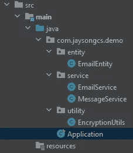
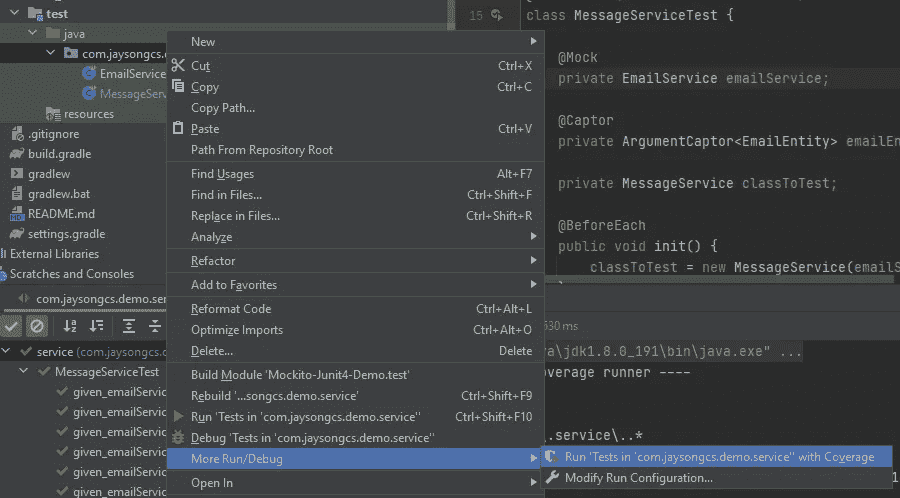
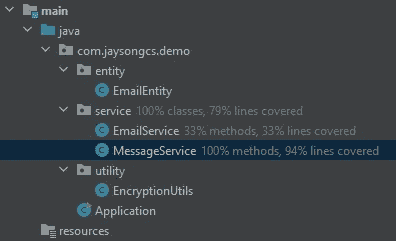

# Java 单元测试快速入门指南— Mockito 和 JUnit 5

> 原文：<https://medium.com/javarevisited/a-quick-start-guide-to-java-unit-testing-mockito-and-junit-5-eebb49d7bcd3?source=collection_archive---------2----------------------->

## 初级开发人员入门指南


我拍的照片(摄于汤姆森自然公园)

开发人员往往对单元测试又爱又恨。当我们看到《测试套件》中所有的绿勾✔️时，我们都喜欢多巴胺点击，但不是每个人都喜欢写它。

单元测试是软件工程的一个重要方面，因为它给你的开发过程带来了以下好处:

1.  增强对您代码库的**可靠性**的信心
2.  实施控制/依赖注入模式的**反转**
3.  推动开发人员编写**好代码**(坏代码通常难以测试和解释)
4.  保护您的**要求**并防止他人意外违反它们。

```
**Table of Contents**
 — Dependencies Setup
 — Sample Project
 — Test Naming Convention
 — Writing Unit Test
 — Mocking Service Object
 — Argument Captor for Mocked Object
 — Mocking Public Static Method
 — Testing Private Method (Reflection)
 — Review Test Coverage
```

# 相关性设置

首先，我们将使用 **mockito-core** ，它足以进行嘲讽或部分嘲讽。稍后，我们将会在一些例子中切换到使用 **mokito-inline** 。

请注意，对于这个示例项目，我们至少需要 **Java 8** 。

# 示例项目

假设我们正在构建一个简单的消息服务**,它可以通过电子邮件服务发送一些字符串消息:**

[](https://javarevisited.blogspot.com/2021/04/junit-interview-questions-with-answers.html)

本演示的项目结构

**MessageService** 类是提供两种发送电子邮件方法的主要服务。出于安全目的，消息服务可以选择加密或不加密发送电子邮件。提供加密的方法将根据消息的输入长度使用由 **EncryptionUtils** 提供的不同加密方法:

EmailService 是一个简单的服务，作为执行电子邮件功能的抽象。该实现完全不可用，仅用于简单的演示目的:

**EncryptionUtils** 提供静态方法对输入消息进行加密:

**EmailEntity** 是在将消息传递给 **EmailService** 实例之前包装消息的包装器类。在这个例子中，包装类的实现非常简单；在现实世界场景中，常见的是更复杂的类具有相似的用例:

# 测试命名约定

在编写测试用例时，有许多常见的命名约定；然而，我们不会在本文中讨论所有的约定。您可以在这里查看它们，看看哪一个最适合您的使用案例:

<https://dzone.com/articles/7-popular-unit-test-naming>  

就个人而言，我更喜欢使用 **given_when_then** 的格式，并尽可能全面地命名该方法，这样，如果测试被破坏，就可以更容易地理解什么被破坏了。

# 写作单元测试

下面是**消息服务测试**的基本设置。我们将利用本课程来展示以下观点:

*   嘲弄和争论捕手的想法
*   断言结果
*   验证方法调用

该类有一个带有注释的**扩展和一个指定的**Mockito extension . class**——这是为了在后台初始化 Mockito。课堂上还有 3 个注解—**

*   [**Mock**](https://javarevisited.blogspot.com/2022/08/difference-between-mock-and-mockbean-in.html) :表示该对象将用于存根结果或验证方法调用
*   **捕获器**:表示 **ArgumentCaptor** 对象用于捕获被模仿对象(在本例中是 emailService)使用的参数值
*   **BeforeEach** :表示每次测试开始前都会调用 init()方法。还有几个 **JUnit5 lifecycle** 注释供您参考——所有之前的**，每个**之后的**和所有**之后的

# **模拟服务对象**

**嘲讽基本上是为你创造一个受控的环境来*伪造你被嘲讽对象的反应*；您没有初始化或调用实际的对象。通过使用 [**模拟**注释](https://javarevisited.blogspot.com/2022/08/difference-between-mock-and-mockbean-in.html)，我们模拟了 **EmailService** 的行为。**

**给定方法名称，下面的测试应该很容易理解:**

*   ****假定**电子邮件服务处于活动状态**
*   **当我们调用 sendEmailMsg 方法时**
*   ****那么**方法调用的结果应该为真**
*   **我们还验证了在调用方法的同时，来自电子邮件服务的 send 方法也应该被调用一次**

**因此，如果我们没有模拟电子邮件服务， **isServiceActive()** 方法将返回 false:**

```
public boolean isServiceActive() {
    return false;
}
```

**通过使用 **Mockito.when** 和 **thenReturn** ，我们*劫持了被模仿的 emailService 的行为*。此外，我们可以看到被模仿的 emailService 在整个方法调用中是如何交互的，这允许我们在这种情况下为 **send()** method 验证方法调用。**

# **嘲笑对象的参数捕获器**

**我们如何验证通过 **sendEmailMsg()** 传递给 **emailService.send()** 的 emailEntity 正在发送预期的消息？**

**在这个测试中，我们没有期望 send 方法是任何 EmailEntity 类，而是将它与我们的参数 captor 对象交换。通过这样做，在验证了方法调用之后，我们可以调用 **getValue()** 方法来检索实际传递给该方法的 EmailEntity。因此，我们可以执行进一步的评估，以查看对象是否符合预期:**

**那么**sendEncryptedEmailMsg()**方法呢？让我们验证传递给 **emailService.send()** 的 emailEntity 确实在发送加密的消息:**

# **模仿公共静态方法**

**再回头看一下**sendEncryptedEmailMsg()**方法:**

```
public boolean sendEncryptedEmailMsg(String message) {
    if (emailService.isServiceActive()) {
        String encryptedMsg;
        if (message.length() < 15) {
            encryptedMsg = EncryptionUtils.*simpleEncrypt*(message);
        } else {
            encryptedMsg = EncryptionUtils.*notSoSimpleEncrypt*(message);
        }

        EmailEntity emailEntity = new EmailEntity();
        emailEntity.setMessage(encryptedMsg);
        emailService.send(emailEntity);
        return true;
    } else {
        return false;
    }
}
```

**根据消息长度，将使用不同的加密来处理消息。但是目前没有办法模仿静态方法，对吗？**

> **Mockito-inline 为我们模拟公共静态方法提供了实现。**

**现在让我们更进一步，使用 **mockito-inline** 依赖，它提供了 **MockedStatic** 类来模拟任何公共静态方法。这仅在版本 3.4.0 之后受支持。在下面的例子中，我们最终可以模仿 **EncryptionUtils** 类及其所有方法:**

# **测试私有方法(反射)**

**尽管不鼓励测试私有方法(如果你真的需要测试的话，你应该重构你的代码)，但是仍然有一些技术允许我们这样做。**

**为了测试私有方法，我们可以使用 **Java 反射 API** 。它允许对方法和对象进行运行时行为修改。为了展示这一点，现在让我们切换到 **EmailServiceTest** 类。以下是**消息服务测试**的基本设置:**

**以下测试利用反射 API 在运行时修改访问器，并允许我们调用之前的私有方法:**

> **注意反射在使用时会有开销，所以我们应该尽量不要在应用程序代码中使用它。**

**你可以在这里读到更多关于 Java 反射 API 的信息:**

**<https://www.baeldung.com/java-reflection>  

# 检查测试覆盖率

测试覆盖率为您的代码库提供了一个可测量的但非详尽的度量标准:



运行覆盖测试(Intellij)


所有的测试案例都通过了✔️



测试覆盖率结果

这些指标可以并入**持续集成(CI)** 中，在集成过程之前或期间标记问题。

# 嘲讽私用方法…？

如果您已经到了需要模仿私有方法的地步，这可能意味着您应该考虑重构代码。记住始终参考[坚实的原则](https://www.baeldung.com/solid-principles)。如果出于某种原因，你不被允许修改访问器或者重构代码，但是仍然想要模仿私有方法等等，那么看看 [PowerMock](https://www.baeldung.com/intro-to-powermock) (非常不鼓励)。** 

**如果你需要一些参考，我已经把所有的例子上传到我的知识库中:**

**<https://github.com/JaysonGCS/Mockito-JUnit5-Simple-Examples>  

如果您对从 Java 对象生成 TypeScript 感兴趣，请查看我的下一篇文章:

</javarevisited/generate-typescript-interfaces-from-java-classes-d53f8c590500>  

或者您可能希望通过使用 Lombok 用更少的 Java 做更多的事情:

</javarevisited/do-more-with-less-java-lombok-and-experimental-features-8d71d0bcb27c>  

如果你喜欢这样的故事，请考虑成为一名 [*中级会员*](https://jsongcs.medium.com/membership) *。每月 5 美元，你可以无限制地访问媒体内容。如果你通过* [*链接*](https://jsongcs.medium.com/membership) *报名，我会得到一点佣金。***