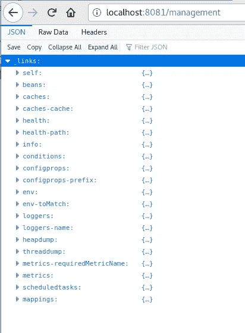

# 向弹簧靴应用程序添加致动器

> 原文：<https://medium.com/javarevisited/add-actuator-to-a-spring-boot-application-2e521e2e85e6?source=collection_archive---------3----------------------->

**Actuator 是**一个 spring boot 模块，允许在生产环境中监控和管理应用程序的使用，而无需对它们进行任何编码和配置。

Spring Boot 执行器有三个主要特点:

*   **端点**
    执行器端点允许我们监控应用程序并与之交互。 [Spring Boot](/javarevisited/10-free-spring-boot-tutorials-and-courses-for-java-developers-53dfe084587e) 提供了许多内置端点。我们也可以创建自己的端点。例如， **/health** 端点提供应用程序的基本健康信息。
*   **度量**
    它通过集成千分尺提供尺寸度量。Micrometer 是一个工具库，支持 Spring 应用度量的交付。它为计时器、计量器、计数器、分布汇总和具有维度数据模型的长任务计时器提供了供应商中立的接口。
*   **审计**
    [Spring Boot](/javarevisited/top-10-courses-to-learn-spring-boot-in-2020-best-of-lot-6ffce88a1b6e?source=---------39------------------) 提供了一个灵活的审计框架，将事件发布到 AuditEventRepository。如果 spring-security 正在执行，它会自动发布身份验证事件。

## 启用 Spring Boot 执行器

1.  将依赖项添加到 pom.xml 文件中

```
<dependency>
    <groupId>org.springframework.boot</groupId>
    <artifactId>spring-boot-starter-actuator</artifactId>
</dependency>
```

2.向 application.properties 文件添加配置

```
##Different port for management APIs
management.server.port=8081##Different basepath for management APIs
management.endpoints.web.base-path=/management##Include all the endpoint APIs
management.endpoints.web.exposure.include=*##To expose only selected endpoints
#management.endpoints.jmx.exposure.include=health,info,env,beans,logfiles,loggers,prometheus,threaddump##Roles used to determine whether or not a user is authorized to be shown details.
#management.endpoint.health.roles="ROLE_ADMIN"
```

就是这样。您可以在基本 URL/管理中看到您的端点

[](https://www.java67.com/2017/11/top-5-free-core-spring-mvc-courses-learn-online.html)

基本路径/管理

本文不涉及度量和审计的详细用法。

资源:

[https://www.javatpoint.com/spring-boot-actuator](https://www.javatpoint.com/spring-boot-actuator)
[https://howtodoinjava . com/spring-boot/actuator-endpoints-example/](https://howtodoinjava.com/spring-boot/actuator-endpoints-example/)