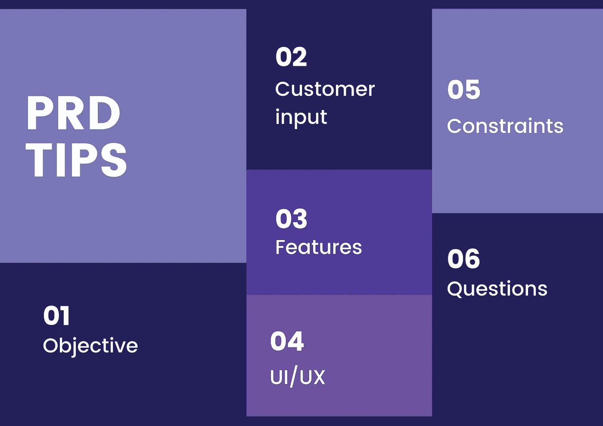

# [敏捷开发]如何确定产品需求文档(PRD)

> 原文：<https://medium.com/javarevisited/agile-development-how-to-nail-a-product-requirements-document-prd-fcdf95983b7d?source=collection_archive---------2----------------------->

## 有效的 PRD 确定了新产品的目标、目标用户以及向开发和测试团队发布的新产品中必须包含哪些功能。它还帮助业务团队在团队之间有效地协作，以营销产品和取悦客户。

## 让我们从几个重要的概念开始，当你写一个高质量的产品需求文档时，你需要记住这些概念:

✅少即是多。正如网景通信公司前首席执行官吉姆·巴克斯代尔曾经说过的，“最重要的是让主要的事情成为主要的事情。”专注至关重要。

✅保持更新——写一个 PRD 是一个协作的过程。为了确保每个人都在同一页上，每个利益相关者都需要不断地做出贡献。因此，PRD 从来都不是完整的，它应该随着项目的更新而发展。

✅一个建设性的珠三角，不仅可以降低团队之间的沟通成本，还可以作为以后的借鉴。

✅除了澄清产品本身，对于特性优先级，让涉众充分理解通过 PRD 发布特性的优点和限制。功能优先化始于共同的愿景和目的。

用这 6 个步骤做一个好的 PRD🖕

一个好的 PRD 应该定义**为什么这个特性是重要的，** **什么问题可以被解决，产品将如何做，它是为谁做的，以及最终用户何时将使用它来使他们受益**。PRD 的必备关键组件如下:

# 1.目标

第一步是定义该产品将帮助用户解决哪些痛点或挑战，以及它与高级**目的**——业务影响的关系。这就像是对珠三角目标的概述，以协调所有利益相关者的努力来实现该目标。

# 2.客户输入

在这一部分，您可以使用您的客户反馈或**用户故事**来描述为什么需要该功能的**背景**，并将该功能与理想的目标用户联系起来。

此外，使用**现状和目标**模型来描述客户的期望。AS-IS 流程模型表示系统或软件的当前状态，而 TO-BE 模型显示调整后的系统。

# 3.特征

在这一部分，你应该**将目的分解成**核心交互的特征和流程。每个功能都应该支持你产品的总体目的。

# 4.UI/UX

一旦您或您的团队有了设计和开发计划，请附上原型和流程图。这不是为了告诉利益相关者该做什么，而是为了分享你的任何好主意。

# 5.限制

在这一部分中，您将解决所有可能出现的约束，例如**时间、预算和资源约束**。描述所有可预见的障碍，以便团队可以克服并创建一个更现实的战术路线图。以下是一些有用的问题，可帮助您识别您正在处理的工作流程限制:

*   你理想的发射日期是什么时候？你想什么时候上市或开始 beta 测试？
*   有没有其他团队依赖你的释放？你还缺少什么资源？

# 6.问题

一旦你认为你理解了你想要解决的问题，你就该意识到并质疑你的假设了。此外，当团队了解产品需求时，他们经常会有问题。为未知者创建****【TBD】和占位符注释**的表格来跟踪这些项目。**

# **最后的想法**

**一个有效的产品需求文档提供了每个利益相关者需要的所有东西的集中资源，从用户问题到技术改进。将它作为[敏捷开发](https://www.java67.com/2020/10/best-agile-and-scrum-courses-for-programmers-developers.html)的指导性文件，让每个团队保持一致，减少例会。**

** [## 2021 年 7 个最佳敏捷和 Scrum 在线初学者培训课程

### 我最喜欢的在线培训课程，从 Udemy、Pluralsight、Coursera 和……

medium.com](/javarevisited/7-best-agile-and-scrum-online-training-courses-3b191e9b65eb)**