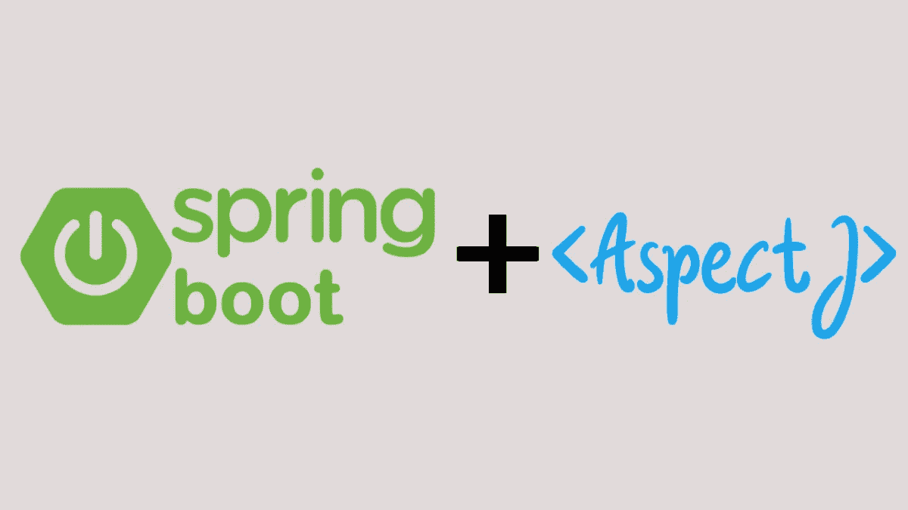

# 加载时应用“Java 方面”: Java Instrumentation API

> 原文：<https://medium.com/javarevisited/applying-java-aspects-at-load-time-java-instrumentation-api-232b39622b32?source=collection_archive---------3----------------------->

## 使用 Java 代理和 AspectJ Weaver 进行 Java 方面的加载时编织


图片来源:DZone

我打赌你在想，伙计！这个形象和标题不相称。有趣的是，这是真的，但只是对那些不能在应用程序加载时描述 Java 方面工作的人而言。幸运的是，这对我来说是个好兆头，因为这正是我要通过这篇文章来解读的。

所以让我们从另一张图片开始:

> **上图展示了使用一种工具定制编织多根棉纱的过程，该工具通过将纱线集合在一起简化了编织过程。**

那么这和我们的动机有什么相似之处呢:

> **在本文中，我将演示如何在一个 Java 应用程序中自定义编织多个类(在我们的例子中是**[](/javarevisited/13-topics-you-should-prepare-for-your-next-spring-boot-interview-5f2993a04ff5)****)，其中至少有一个类是** [**Java 方面**](https://docs.spring.io/spring-framework/docs/4.3.15.RELEASE/spring-framework-reference/html/aop.html#:~:text=Aspect%3A%20a%20modularization%20of%20a,concern%20in%20enterprise%20Java%20applications.) **(在我们的例子中是 AspectJ)，使用一个名为 Java Agent 的工具，通过将类集合在一起简化这个过程，允许操作编译后的 Java 类的字节码。****

**[](http://www.java67.com/2018/06/5-best-courses-to-learn-spring-boot-in.html)**

## **什么是 Java 方面？**

**当谈到面向方面编程(AOP)时，这真的是另一个世界。尽管从根本上正确理解 AOP 很重要，但这超出了本文的范围。但我会给出概念的症结所在。**

> ****AOP 是一种编程标准，旨在通过提供一种声明性架构，从 Java 应用程序中抽象出模板代码(重复使用的公共代码片段),开发人员可以通过该架构抽象模板代码，并在应用程序中需要的任何地方提供模板代码。****

**方面只不过是抽象的锅炉板代码，作为类(方面类)中的方法编写。直观地说，Java 方面是用 Java 编写的方面类。**

## **好吧！那么什么是 Java Instrumentation API 呢？**

**我知道有很多很棒的文章描述了这个 Java API。我最近看到了 Ruby Valappil 写的一个全面的例子，她展示了一个全功能的例子。**

**我在这里要做的是抓住这个概念的关键，并将其类比，以符合我们的动机。**

> **Java 插装是 JVM 改变已经编译好的 Java 类的字节码的能力。**

*****这个 API 暴露的是底层***[***JVM***](/javarevisited/7-best-courses-to-learn-jvm-garbage-collection-and-performance-tuning-for-experienced-java-331705180686)***的应用。*****

**所以现在我们知道我们需要将我们的 Java 方面应用到我们的 Java 应用程序中的一些地方，我们也知道 Java Instrumentation API 可以改变编译后的 Java 类的字节码。**

**好吧，我承认，现在什么都不说得通。**

## **将这些点连接起来**

**现在明显的问题是:**

> ****“我如何利用以上两个概念:在我的 Java 应用程序中抽象出锅炉板代码，并在加载时在任何需要的地方应用它？”****

**我们一个一个来。**

## **方面是如何应用于组件的？**

**在 Java 中，方面只能应用于方法。所以当我们说"*将方面应用到方法*时，我们的意思是**方面方法的逻辑**应该合并到**被调用方法的逻辑**中，因为它最初是被调用方法的抽象部分。**

**所以 JVM **通过在被调用方法之前或之后调用方面方法，用方面方法的逻辑**包装被调用方法的逻辑，无论何时调用。从而保持完整性完好无损。**

## **为什么我首先需要在“加载时”应用它？**

**是的，在加载时找出原因是非常重要的。就此而言，有人可能会想知道有多少种方法可以将 Java 方面应用到我的应用程序中。如果你有同样的问题，恭喜你！**

**基本上，将方面应用于 Java 应用程序有两种方式:**

1.  **运行时*:抽象的代码片段(方面)在运行时被应用程序组件调用。在运行时，AOP 通过创建类代理来工作，阅读更多关于它的内容[在这里](https://docs.spring.io/spring-framework/docs/3.0.0.M3/reference/html/ch08s08.html)。***
2.  ******加载时*** :这是指 Java 应用程序生命周期中所有编译好的*的阶段。Java 类加载器正在将类*文件加载到 JVM 中。这里，我们试图将方面应用到目标类文件的字节码中。***

> ***这两种方法听起来都不错，但是使人们能够选择一种而不是另一种的警告是这个方面必须应用到的应用程序组件的性质。***

***如果您理解 Java 是如何工作的，那么您可以感觉到，在运行时，如果必须应用方面的方法是不可访问的，那么方面就不能被应用。这意味着**在运行时，只有公共方法**可以应用方面，而私有方法不能。***

***另一方面，仅仅因为你想对一个方法应用一个方面，就把它公开，这违反了 Java 的核心原则，比如*抽象和封装*。自然，必须有一种方法将方面应用到私有方法上。请注意，私有方法不能从它们各自的类之外调用。***

***输入加载时间编织。***

******加载时织入(LTW)是指将方面的字节码织入另一个需要该方面的类的字节码中，而不干扰应用程序的实际 Java 源代码。******

## ***Java 工具在这方面有什么帮助？***

***现在已经很清楚了。我们知道，在加载时，我们需要修改应用方面的类的字节码。***

***Java Instrumentation API，就像任何其他 API 一样，是一组需要实现的接口。 **Java 代理是这个 API 的具体实现**。例如[弹簧工具](https://mvnrepository.com/artifact/org.springframework/spring-instrument/5.3.15)的[工具*工具*工具](https://www.javadoc.io/doc/org.springframework/spring-instrument/latest/index.html)。***

***这个 Java 代理类，由这个 API 的实现提供，帮助我们**截取一个类的字节码，并修改它**以将方面的字节码编入其中。***

*****行动吧！*****

***说起来容易做起来难，对吗？***

***所以我最近在为我以前的教程系列之一构建一个演示项目时了解到了这一点，这个系列是关于使用 Google OAuth 2.0 来抓取邮件服务器的:***

***[](/javarevisited/oauth-2-0-with-google-client-libraries-java-sdk-e5439accdf7a) [## 带有 Google 客户端库的 OAuth 2.0:Java SDK

### 免责声明:本实施指南旨在增强用户对概念的理解，而不是构建一个完整的…

medium.com](/javarevisited/oauth-2-0-with-google-client-libraries-java-sdk-e5439accdf7a) 

## 用例

在基于 web 的应用程序中，通常会有很多对第三方 API 的网络调用。我们的用例是**在出现间歇性网络问题**的情况下，自动重试对第三方 API 的任何 API 网络调用，严格来说是一次。

> *:每次 API 网络调用的重试机制。
> ***LTW 场景*** :所有的 API 网络调用都是通过应用中的私有方法进行的。*

## *步骤 1:创建所需的方面*

*我们将使用 [AspectJ](https://search.maven.org/artifact/org.aspectj/aspectjrt/1.9.7/jar) 库来创建一个方面类(关于 AspectJ 的细节不在本文讨论范围之内):*

*我们使用 AspectJ 库中的“ *@Aspect* ”注释，将一个 Java 类标记为一个方面。*

*通过在周围使用“*@”注释，我们指定了方面的[建议](https://www.eclipse.org/aspectj/doc/released/progguide/starting-aspectj.html#advice)。[切入点](https://www.eclipse.org/aspectj/doc/released/progguide/starting-aspectj.html#pointcuts)表达式作为参数传递给该注释。基本上，我们正在做的是**为 JVM 提供一种方法，以确定在我们的 Java 应用程序**中的确切位置应用这个特定方面。**

> *在这里阅读更多关于 AspectJ [的内容。](https://www.eclipse.org/aspectj/doc/released/progguide/index.html)*

*这个方面类抽象出了*重试*方法中的重试机制。*

## *步骤 2:创建一个编织器*

*一旦我们创建了方面，我们需要必要的**配置和工具**来将它编织到我们的应用程序中所选择的地方。*

*我们为此需要的工具是 [AspectJ weaver](https://search.maven.org/artifact/org.aspectj/aspectjweaver/1.9.7/jar) 。这个罐子**能够理解哪些类要被编织**。用作 AspectJ weaver jar 中的 weaver 的默认类是“*DefaultContextLoadTimeWeaver”。**

*我们向 weaver 提供该信息的方式是提供以下配置:*

> *务必将上述文件的名称保留为 *aop.xml* ，并将其放在项目文件夹*src/main/resources/META-INF/*下*

## *步骤 3:为您的应用程序启用加载时编织*

*在 [spring boot 应用](https://www.java67.com/2018/05/difference-between-springbootapplication-vs-EnableAutoConfiguration-annotations-Spring-Boot.html)中，我们只需要在主类上添加一个注释，如下所示:*

*请注意“ *@EnableLoadTimeWeaving* ”注释。这使得 spring boot 应用程序能够在 src/main/resource 项目文件夹下的 META-INF 文件夹中查找 *aop.xml* 。*

## *步骤 4:使用 Java 代理*

*正如已经讨论过的，Java 代理是完成编织部分的真正实体。我们需要**为我们的应用程序提供这个 Java 代理**(另一个 Java 类)，这样它**甚至在我们的应用程序的主方法被调用**之前就可用了。*

*我们通过用一个特定的 JVM 参数启动我们的应用程序来做到这一点:*

```
*java -javaagent:<path_to_java_agent> cp <path_to_our_application_jar> <main_class_name>*
```

*正如我们前面讨论的，这个代理类是 Java Instrument API 附带的。所以我们需要获得 API 的实现。在我们的例子中，我们将使用[弹簧乐器](https://search.maven.org/artifact/org.springframework/spring-instrument/5.3.19/jar)震击器。这个 spring-instrument jar 的路径将作为上面的“ *-javaagent:* ”参数的值。*

## *步骤 5:确保 aspectjweaver.jar 在类路径中*

*除了 spring-instrument jar，我们还需要提供 aspectjweaver.jar，如下所示:*

```
*java -javaagent:<path_to_java_agent> -javaagent:<path_to_aspectj-weaver_jar> cp <path_to_our_application_jar> <main_class_name>*
```

## *结论*

*这就是我们如何在加载时使用 Java Instrumentation API 将 Java 方面编织到我们的应用程序类中。*

*请注意， [Spring 框架](/javarevisited/top-10-free-courses-to-learn-spring-framework-for-java-developers-639db9348d25)的 **Spring-AOP** 模块，只有**能够进行基于代理的面向方面编程**。LTW 是一个成熟的 AspectJ 支持，不需要类的代理。*

*[](/javarevisited/21-spring-mvc-rest-interview-questions-answers-for-beginners-and-experienced-developers-21ad3d4c9b82) [## 10 大春季 MVC + REST 面试问题解答适合初学者和有经验的开发者

### 大家好。如果你正在准备 Java 和 Spring 面试或 Spring 认证，并经常寻找一些…

medium.com](/javarevisited/21-spring-mvc-rest-interview-questions-answers-for-beginners-and-experienced-developers-21ad3d4c9b82) [](/javarevisited/top-10-rest-interview-questions-for-java-and-spring-developers-1611e3b78029) [## Java 和 Spring 开发人员的 10 大 REST 面试问题

### 这些是 Java 和 Spring 开发者快速准备的最好的 REST 面试问题

medium.com](/javarevisited/top-10-rest-interview-questions-for-java-and-spring-developers-1611e3b78029)****