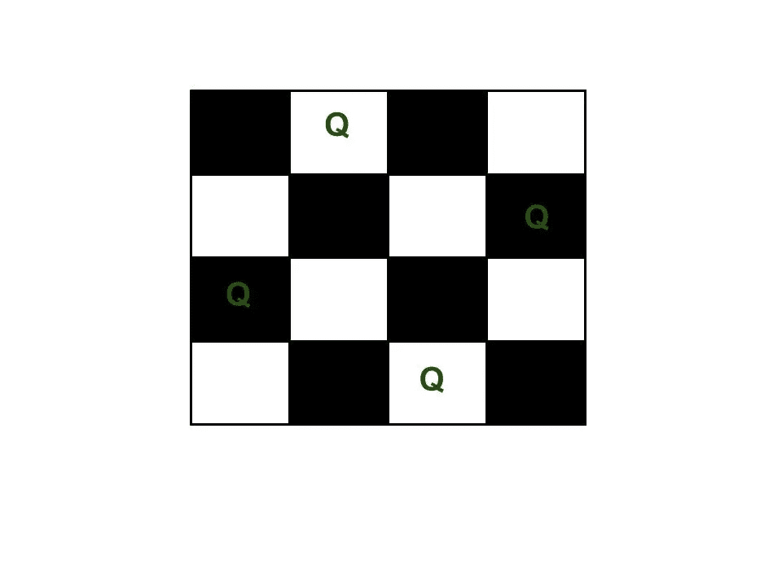

# 使用 Python 进行回溯练习

> 原文：<https://medium.com/javarevisited/backtracking-practice-for-starters-28e89ef00b71?source=collection_archive---------3----------------------->

# **回溯算法**

回溯是为了通过先前采取的步骤找到问题的解决方案。例如，在一个迷宫问题中，答案取决于你所采取的每一步。如果任何一个步骤不正确，我们就无法得到解决方案。在迷宫问题中，我们首先选择一条路径，然后继续沿着它前进。一旦我们发现我们选择的道路是错误的，我们就回去改变它。回溯也是如此。

在回溯中，我们先走一步，然后检查这一步是否正确。如果不对，那我们就回来改变舞步。通常，这是通过*递归*来完成的。因此，在回溯中，我们从问题的部分子解决方案开始(它可能会也可能不会引导我们找到解决方案)，然后检查我们是否可以进一步处理这个子解决方案。如果没有，那我们就回去改。

总之，回溯的一般步骤是:

1.  **从一个子解决方案开始**

**2。检查该子解决方案是否会导致解决方案**

**3。如果没有，则返回并更改子解决方案，然后再次继续**

# 回溯练习一:【geeks forgeeks】N 皇后问题

N 皇后就是在 N×N 的棋盘上放置 N 个国际象棋皇后，使得没有两个皇后互相攻击的问题。例如，下面是一个 4 皇后问题的解决方案。



预期的输出是一个二进制矩阵，其中放置皇后的块为 1:

[0，1，0，0]
【0，0，0，1】
【1，0，0，0】
【0，0，1，0】

# 回溯练习 2:最短路径

给定一个二进制矩形矩阵形式的迷宫，找出迷宫中从给定的源到给定的目的地的最短路径的长度。

该路径只能由值为 1 的单元构成，并且移动仅限于向上、向下、向左或向右的一个相邻单元。

示例:

```
[1, 1, 1, 1, 0, 1],
[1, 0, 0, 1, 1, 1],
[1, 1, 1, 0, 1, 0],
[1, 1, 0, 1, 1, 0],
[0, 1, 1, 1, 0, 0],
[1, 1, 0, 1, 1, 1]Find the shortest path from (0,0) to (3,3).Solution (visualized with 2's): 8
[**2**, 1, 1, 1, 0, 1],
[**2**, 0, 0, 1, 1, 1],
[**2**, 1, 1, 0, 1, 0],
[**2**, **2**, 0, **2**, 1, 0],
[0, **2**, **2**, **2**, 0, 0],
[1, 1, 0, 1, 1, 1]
```

# 回溯练习 3: [LeetCode 22]生成括号

给定 *n* 对括号，编写一个函数来生成所有格式良好的括号的组合。

例如，给定 *n* = 3，解集为:

```
[
  "((()))",
  "(()())",
  "(())()",
  "()(())",
  "()()()"
]
```

我们需要考虑三个约束条件:

1.  左括号和右括号的数量等于`n`时的基本情况。

2.左括号的数量应小于`n`。

3.右括号不能出现在左括号之前。

为了解决这个问题，我们将遵循以下步骤:

1.  创建一个存储结果的列表。
2.  用空字符串和开始和结束括号的数量调用我们的回溯函数。
3.  检查基本情况。如果左括号和右括号的数量等于`n`，那么我们将把字符串添加到列表中并返回。
4.  如果基本情况不满足，那么我们将检查左括号的数量是否小于`n`，如果是，那么我们将把`(`加到当前字符串，并增加左括号的计数。
5.  检查右括号的数量是否小于左括号的数量，然后我们将在当前字符串中添加`)`，并增加右括号的数量。

另外，我想通过这里的掌声和你交流。所以如果你喜欢这个故事，请奖励我 1-3👏(PS 按住点击👏不用动手指就能连续鼓掌。);如果你在关注我，也期待我访问你的故事，请给我 5 分👏让我去 know️ ❤ ️

实践中的其他编码问题。

[](/javarevisited/top-21-string-programming-interview-questions-for-beginners-and-experienced-developers-56037048de45) [## 面向初学者和有经验的开发人员的 21 个字符串编程面试问题

### 除了数组、二叉树和链表数据结构，字符串是编程工作中的另一个热门话题…

medium.com](/javarevisited/top-21-string-programming-interview-questions-for-beginners-and-experienced-developers-56037048de45)  [## 50 大数据结构和算法程序员面试问题

### 有很多计算机科学毕业生和程序员申请编程、编码和软件…

medium.com](/javarevisited/50-data-structure-and-algorithms-interview-questions-for-programmers-b4b1ac61f5b0)