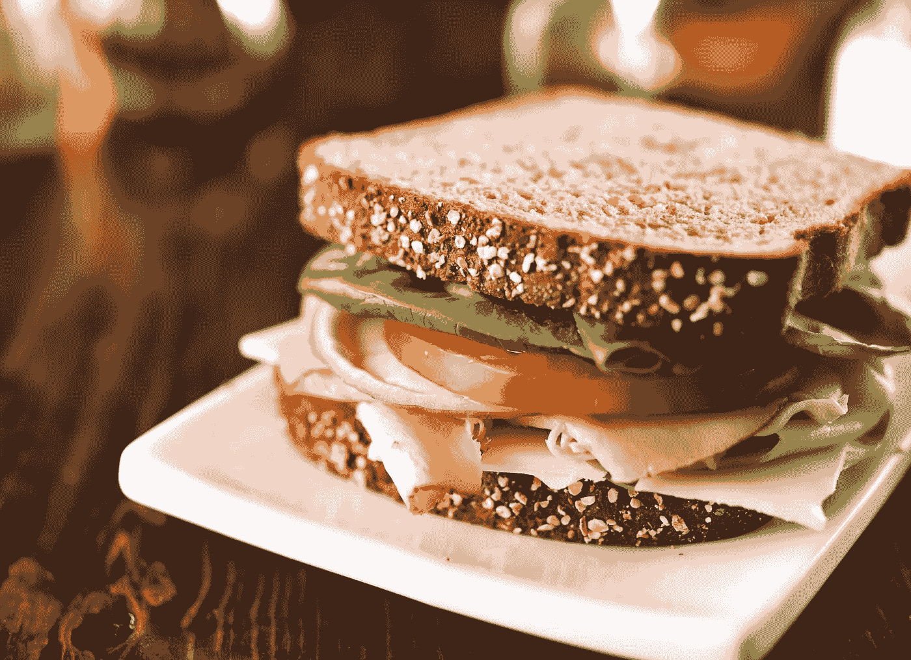

# 基本的 HTML 命令——你应该知道

> 原文：<https://medium.com/javarevisited/basic-html-commands-which-you-should-know-d71c085e7a45?source=collection_archive---------2----------------------->

在本文中，我们将讨论一些基本的**H**yper**T**ext**M**arkup**L**language(**HTML**)命令。

如果你对 web 开发感兴趣，最好的选择是从 HTML 开始。HTML 很好学。所以不要等了！

## 现代网页设计

**HTML** :结构
**CSS** :展现
**JavaScript** :行为
**PHP** 或类似:后端
**CMS** :内容管理

## 基本步骤:使用标签

**HTML** 使用**标签**向客户端(浏览器)传达如何显示文本和图像。标签包含在 **< >符号**中。在大多数情况下，你以**开始标签**开始，放入将受该标签影响的一个或多个单词，并在单词串的末尾放置一个**结束标签**。
例如，为一个文档创建一个标题，你可以这样做:
<title>HTML</title>
结束标签通常包含一个**"/**。
HTML 标签不区分大小写。

## HTML 标签

HTML 文档的结构仍然是三明治的概念。正如三明治总是有两片面包片一样，HTML 也有一个*打开和关闭*T42【HTML 标签。
**<html>
…
</html>**

## 头部标签

我们可以把它比作人脸被用来识别人，就像只有头部标签被用来识别页面内容一样。
<html>
**<头></头>**
< /html >

## 身体标签

body 标签跟在 head 标签后面。
把这个和人体对比一下，有助于快速理解。标题、段落、列表、引用、图片和链接只是 body 标签中可以包含的一些元素。
<html>
<head>
</head>
**<body>
</body>**
</html>

## 标题标签

**标题标签**允许您在浏览器窗口中指定文档标题。title 元素很重要，因为它描述了页面并被搜索引擎使用。
<html>
<head>
**<title>**首页**</title>**
</head>
<body>
这是一行文字。
</body>
</html>
记住，标题通常**不会出现在文档**本身，而是出现在窗口顶部的一个标题框或栏中。

## 

元素

如果我们想创建一个段落，那么我们可以使用这个

元素及其开始和结束标签。
< html >
<头>
<标题>第一页</标题>
</头>
<正文>
**< p >** 这是一段话。**
**
**
**这是另外一段。**
**
/body>
</html>

## 头球

在 HTML 中，我们有六级标题。分别是**<h1><H2><H3><H4><H5>和< h6 >。**
< h1 >这是一个 header 1 标签< /h1 >
在这里，如果我们使用< h1 >我们就可以得到加粗的大字号文本。对于< h6 >我们能够得到小尺寸的文本。仅在标题中使用标题**很重要。**

## 

* * *

标签

要创建水平线，使用

* * *

标签。
< html >
<头>
<标题>第一页</标题>
</头>
<正文>
< p >这是一段。

**
**

这是另一段。

</正文>
< /html >

## 评论

浏览器**不显示注释**，但是它们有助于记录 HTML 并添加描述、提醒和其他注释。
T43<！— 您的评论在此处 **→**
在开始标签中，我们有一个！符号，但在**结束标记中我们没有！** **符号**，我们在评论的时候需要考虑到这一点。

## 标签

该标签用于插入图像。此标签没有任何结束标签。
****
这里我们需要提到那个图像的位置，万一图像无法显示，通过使用 alt 属性在 word 中指定一个描述图像的替换文本。
****

## HTML 有序列表

这里是一个有三个项目的编号列表:
一个**有序列表**以 **< ol >标签**开始，每个**列表项目**由 **< li >标签定义。**
**<ol>
**<李>** 列表项 1
**<李>** 列表项 2
**<李>** 列表项 3
**</ol>**
一个**无序列表**开始于
下面是同一个列表使用一种无编号的列表格式:
**<ul>**
**<李>** 列表项 1**</李>**
**<列表项 2**</李>
**<李>** 列表项******

## 标签

如果我们想创建一个表格，那么我们使用 **<表格>** 进行创建。同样，表格被划分为带有 **< tr >标签**的表格行，表格行被划分为带有 **< td >标签的表格列(表格数据)。**
**<表>
<tr>
<TD></TD>
<TD></TD>
<TD>/TD>
</tr>** 

通过使用 HTML，我们可以从用户那里收集详细信息。而表单是由 **<表单>** 元素定义的。
**<正文>
<表格></表格>
</正文>**

## 标签

在 HTML 中，使用 **<和>标签**来定义链接。链接也是每个网页不可或缺的一部分。您可以添加指向文本或图像的链接，使用户能够点击这些链接，从而被定向到另一个文件或网页。
我们用 href 属性来定义链接的目的地址:
****

## 格式化元素

通过使用这些，我们可以指定文本样式。
<正文>

**<b>粗体文本</b>**

**<Strong>Strong 文本</Strong>**

p>**<I>斜体文本< /i 正文</del>**

**<ins>插入正文</ins>**

**sub>下标正文**</p< 它定义了重要的文本。

希望这有所帮助。分享你的想法吧！