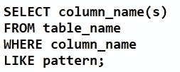
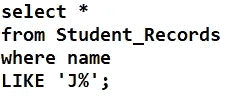

# 基本的 SQL 命令—您应该知道

> 原文：<https://medium.com/javarevisited/basic-sql-commands-which-you-should-know-9095dda8ed08?source=collection_archive---------2----------------------->

在本文中，我们将通过示例查询来讨论一些基本的**结构化查询语言**命令。

在此之前，我们需要了解什么是**数据库**？还有什么是 **MySQL** ？。
一个**数据库**是*一个数据集合，它以一种便于访问、有效管理和更新的方式组织*。数据库由存储相关信息的表组成。
例如，如果你要创建一个像脸书一样的网站，你会使用一个数据库，其中包含许多信息，如用户名、密码和评论。
一旦你理解了什么是数据库，那么理解 MySQL 对我们来说就很容易了。
**MySQL** *是一个开源的关系数据库管理系统*。
在这里， **My** 仍然是联合创始人 Michel Widenius 女儿的名字， **SQL** 代表结构化查询语言。

通过使用 MySQL，我们可以处理数据库，并可以做其他任务，如**创建表、向表中添加数据、更改数据和删除表**。如果你打算使用 MySQL，你必须清楚地理解下面的基本 SQL 指令。

## 1)显示

**显示**命令用于显示当前数据库中的**数据库**或**表格**。

## 2)使用

**使用**命令用于提及将要使用哪个数据库。

这里，假设我们将使用一个名为“大学”的数据库。

## 3)创建一个数据库

**创建数据库**命令用来创建一个新的 MYSQL 数据库。

这里，假设我们要创建一个名为“Student”的数据库。

## 4)创建一个表格

**创建表格**命令用来创建一个新的表格。当我们创建一个表时，定义它的列和数据类型。

在这里，假设我们要创建一个名为 Student_Records 的表，它包含四列:Registration_No、Name、Address、Dept_Name。

在创建表之前，最好检查该数据库是否已经有任何同名的表，如果它有任何同名的表，并且该表对我们来说不是必需的，那么我们可以使用 **DROP TABLE** 命令删除该表。

## **5)插入**

通过使用**插入**到命令，我们可以在创建的表格中插入数值。

让我们在“Student_Records”表中插入一些值。

## 6)更改表格

**ALTER TABLE** 命令用于添加、删除或修改现有表格中的列。

通过使用 alter table，可以更改现有表中的任何数据。

## 7)选择

**SELECT** 语句从 SQL 数据库的表中检索记录。我们可以使用逗号一次选择多个列。如果我们在 SELECT 命令后使用星号(*)，那么我们可以获得关于该表的所有信息。
让我们从“学生记录”表中检索所有数据。
命令-

输出-

## 8)哪里

**WHERE** 子句用于只提取那些满足指定标准的记录。

让我们试着一起使用 SELECT 和 WHERE 命令。在前一个示例中，我们获得了所有的详细信息，这次我们将限制我们只获得计算机科学专业学生的详细信息。
命令-

输出-

在前面的例子中，我们有 3 行，现在，我们只有一行。

## 9)更新

**UPDATE** 语句允许我们修改表中的数据。

让我们试着改变 S1002- Registration_No.
命令的地址-

对于该命令，您必须获得以下输出。

让我们检查一下:

之前是康提。

## 10)删除

**DELETE** 语句用于从表中删除数据。删除查询的工作方式很像更新查询。

DELETE 语句永久删除数据。

## 喜欢

在 WHERE 子句中指定搜索条件时， **LIKE** 关键字非常有用。

让我们尝试从 Student_Records 的表中获取以 J 开头的姓名。
命令-

输出-

通过类似的命令，我们可以得到过滤的数据。

## 11)订购依据

**ORDER BY** 与 SELECT 一起使用，对返回的数据进行排序。

## 12)自动增量

**AUTO_INCREMENT** 允许在表格中插入新记录时生成一个唯一的数字。
AUTO _ INCREMENT 的起始值为 1，并且每增加一条新记录就增加 1。

我希望这有助于了解 MySQL 的基本概念！