# 用 Spring Boot 和 MongoDB 构建 REST 服务(第 1 部分)

> 原文：<https://medium.com/javarevisited/building-a-rest-service-with-spring-boot-and-mongodb-part-1-2de01e4f434d?source=collection_archive---------1----------------------->

在使用之前版本的 Spring 多年后，我决定学习 Spring Boot。我意识到 Spring Boot 让很多事情变得很简单。此外，它降低了依赖性的复杂性。您需要做的就是运行您的应用程序。

约翰·麦肯在 [Unsplash](https://unsplash.com?utm_source=medium&utm_medium=referral) 上的照片

在本教程中，我将解释*“如何用 Spring Boot 和 MongoDB 开发一个 REST 服务”*。

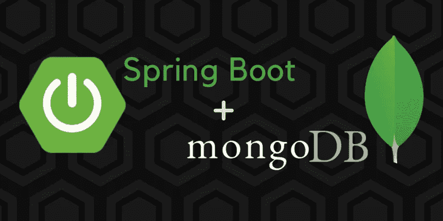

*   [这里使用了用于](/javarevisited/10-advanced-spring-boot-courses-for-experienced-java-developers-5e57606816bd?source=collection_home---4------0-----------------------)[开发 REST API](/javarevisited/why-spring-is-the-best-framework-for-developing-rest-apis-in-java-784590e484a4?source=collection_home---4------0-----------------------)的 Spring Boot 和 Spring 数据项目。
*   Maven 用于自动化构建过程。
*   使用典型的领域驱动开发方法，分离模型、存储库、服务和控制器类。

您可以从这个 [GitHub](https://github.com/ragcrix/StudentInformationSystem) 链接下载项目源代码。

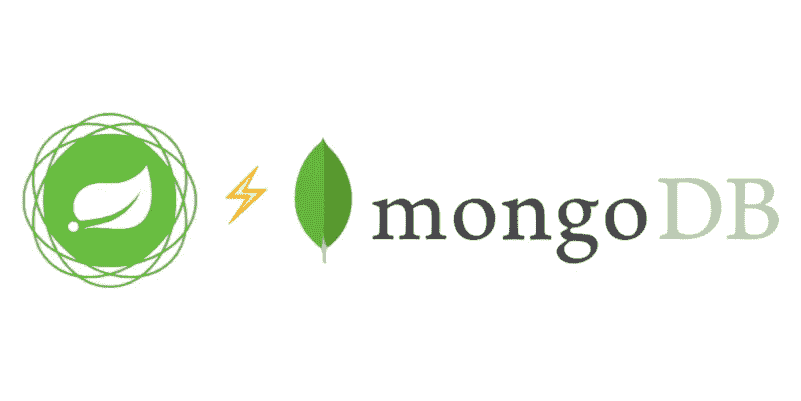

## 技术和工具

这里的教程使用 [IntelliJ IDEA](https://www.jetbrains.com/idea/) 、 [M](https://gradle.org/) aven、 [Postman](https://www.getpostman.com/apps) 进行编码、构建和 REST API 测试。我正在使用 PowerShell 运行 Windows 10 。

所有软件都是用 Java 写的，用的是 Spring 5.1 和 Spring Boot 2.1.4。 [MongoDB](https://www.mongodb.com/) 4.0.9 社区服务器用于持久化。

从这里开始，我假设你已经安装了 JDK 8.0、 [IntelliJ](/javarevisited/7-best-courses-to-learn-intellij-idea-for-beginners-and-experienced-java-programmers-2e9aa9bb0c05) 、 [M](https://gradle.org/) aven、 [MongoDB](/javarevisited/5-best-mongodb-courses-to-learn-nosql-for-beginners-in-2020-42df5af5496c) 和 [Postman](/javarevisited/7-best-courses-to-learn-postman-tool-for-web-service-and-api-testing-f225c138fa5a) 。

## 学生信息服务

这个 REST 服务提供学生信息，并允许您向系统中添加新学生或从系统中删除学生。

我在这里的目标是展示如何使用这些技术以简单的方式开发 REST 服务，而不会打乱业务逻辑。

*   POST 操作用于向系统添加学生。
*   GET 操作用于通过学号或电子邮件获取学生。学生也是根据绩点来带的。
*   MongoDB 数据库中的学生集合有关于每个学生的姓名、学号、电子邮件、课程列表和 GPA 的数据。
*   服务存储、接收和返回的所有内容都被格式化为 [JSON](https://javarevisited.blogspot.com/2017/02/how-to-consume-json-from-restful-web-services-Spring-RESTTemplate-Example.html) 。

# 第一步:春季初始

如果你想创建一个新的 Spring 应用程序，你可以使用[Spring initializer](https://start.spring.io/)。我输入了这个项目的值，如下图所示。

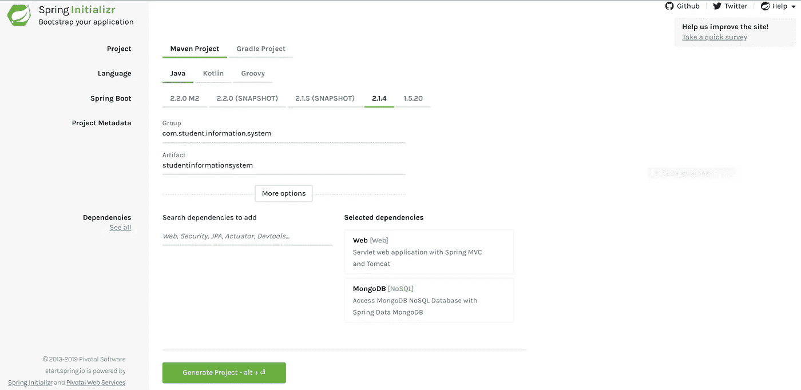

弹簧初始化设置

*   选择 *Maven 项目*、 *Java* 、 *Spring Boot 2.1.4。*
*   选择一个合适的组和工件。
*   两个依赖: **MongoDB** 和 **Web** 。

完成之后，您可以下载一个模板项目。用**【生成项目】**按钮压缩文件。

解压缩项目并将其导入 IntelliJ。这样做之后，你会看到类似下图的东西。

[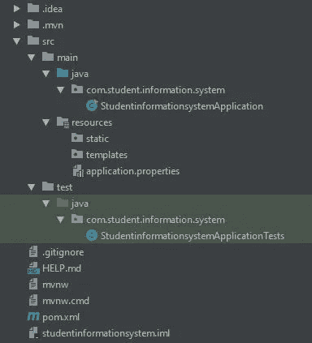](https://dev.to/javinpaul/5-best-courses-to-learn-intellij-idea-for-java-developers-5e6n)

IntelliJ 中的项目结构

# 步骤 2:模型和存储库

## 学生模型

一个学生有六个字段:id，姓名，学生编号，电子邮件，课程列表和 gpa。

`@Document`注释的用途与 JPA 中的`@Entity`注释相同。

更多关于 Spring Data MongoDB 的信息，可以使用[这个链接](https://docs.spring.io/spring-data/data-mongo/docs/)。您可以阅读您想要的版本的文档。对于本教程，Spring Data MongoDB 的版本是 2.1.6。

这样做之后，你可以像下面这样添加`StudentDTO`类。我们在控制器层使用它来与前端或任何不同的消费者进行通信。

## 学生资源库

使用 Spring Data 项目，当您创建一个扩展 MongoRepository 的接口时，您将拥有魔力。神奇之处如下图。不需要实现这个接口:)。

学生资源库接口有三种方法。前两种方法通过学号或电子邮件找到学生。最后一种方法根据学生的 GPA 对他们进行分类。

# 第三步:学生服务

现在，我们创建学生控制器将调用的学生服务。学生服务有六种方法。简单地说，这些方法根据一些标准列出学生，保存一个学生，更新一个学生和删除一个学生。

通常，控制器类直接与存储库类中的方法对话，这没有什么不对。但是，如果我们需要一些业务逻辑，我们不应该在[控制器](https://javarevisited.blogspot.com/2017/11/difference-between-component-service.html)中编写这个代码块。正因为如此，需要服务层。

# 第四步:休息控制器

最后，我们可以创建[休息控制器](https://javarevisited.blogspot.com/2017/08/difference-between-restcontroller-and-controller-annotations-spring-mvc-rest.html#ixzz6OYNB9oii)。这个控制器有四个`@GetMapping`，一个`@PostMapping`和一个`@DeleteMapping`。

# 步骤 5:数据库配置

要连接到 [MongoDB 数据库](https://javarevisited.blogspot.com/2019/01/top-5-mongodb-online-training-courses.html)，编辑*“application . properties”*文件中的设置，该文件是*“resources”*的一部分。以下配置就足够了，因为目前数据库中没有身份验证。

# 使用 Postman 运行服务和测试

要运行服务并在 [Postman](https://javarevisited.blogspot.com/2020/02/top-5-postman-tutorials-and-courses-for-web-developers.html) 中测试它，首先，我们需要运行 MongoDB。为此，需要两个命令。

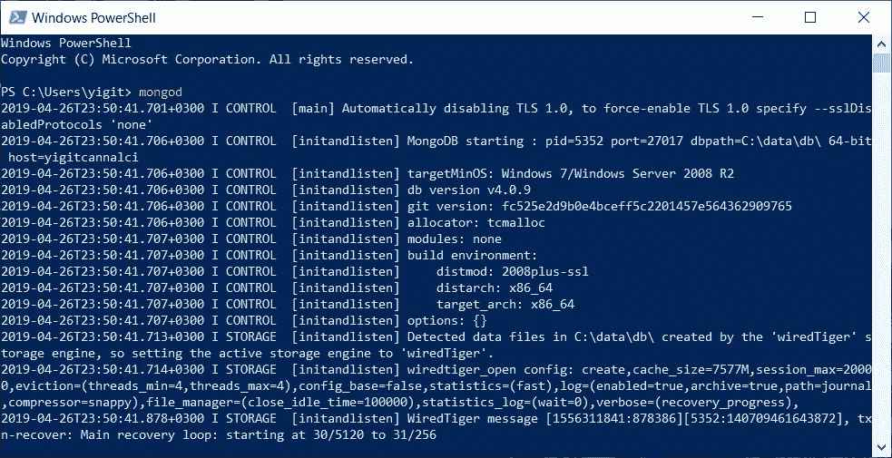

[**mongod**](https://docs.mongodb.com/manual/reference/program/mongod/) 命令

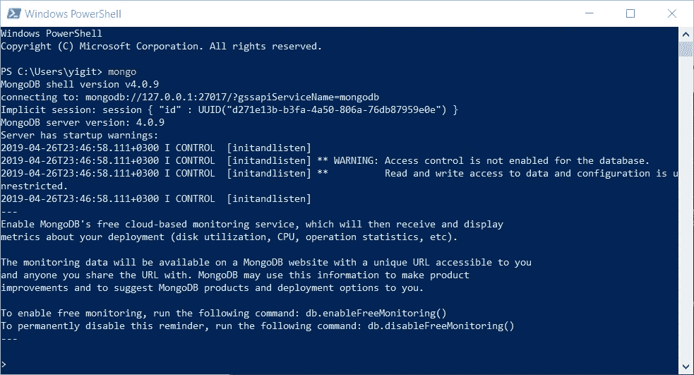

[**蒙哥**](https://docs.mongodb.com/manual/reference/mongo-shell/) 命令

这样做之后，我们可以运行项目来测试 REST 服务。

运行项目

运行项目后，您可以测试 REST 服务。为此，打开 Postman，输入 URL 并选择如下的 **GET** 方法。

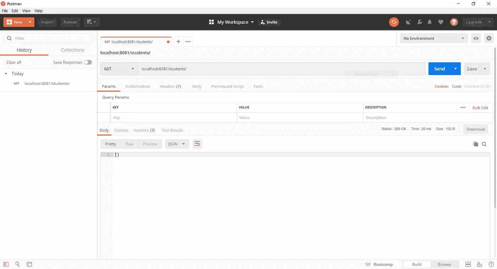

空学生列表

您可以使用 Postman 中的 **POST** 方法将学生添加到系统中。首先要输入***Content-Type:application/JSON***header 键值对。其次，在 body 选项卡中，您必须输入想要以 JSON 格式保存数据库的学生信息。

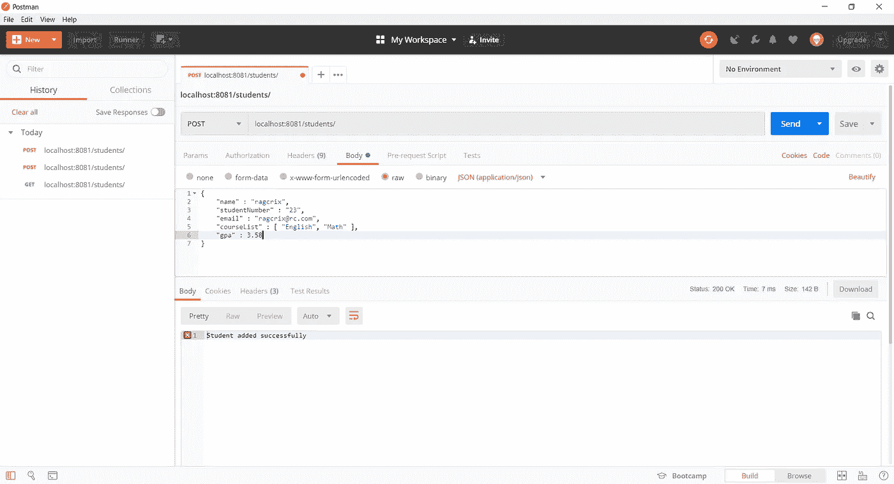

添加学生

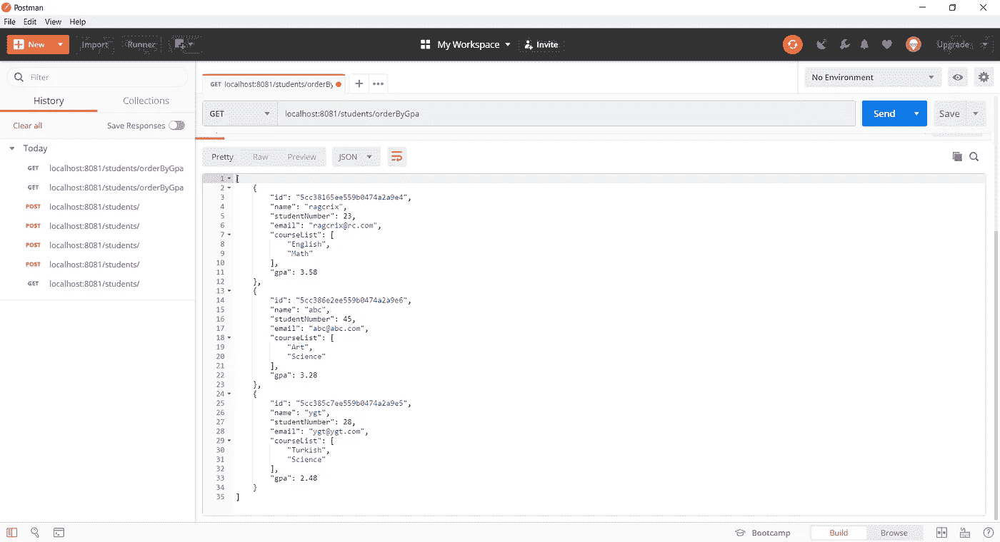

按 GPA 排列的学生名单

如果要删除一个学生，要在 Postman 中选择 **DELETE** 方法，在链接末尾添加一个要删除的学号。

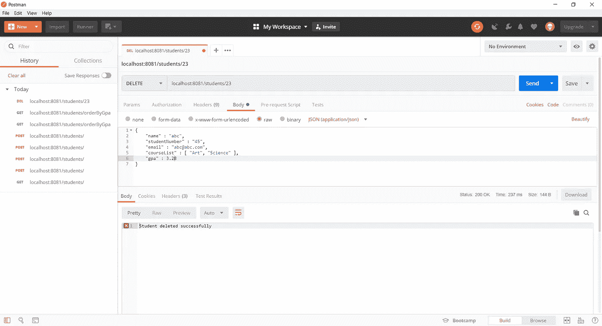

删除学生

完成上述步骤后，您应该会在数据库中看到如下两条记录。

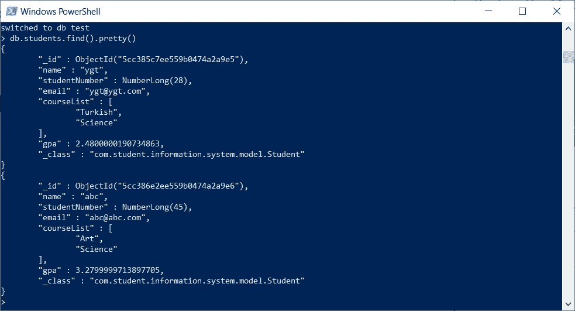

学生系列

**注:**本教程重点介绍 Spring 数据、MongoDB 和 REST API 的结合。项目中没有对对象字段的验证。

请点击下面的链接来学习如何使用 Spring Boot 编写单元测试。

[使用 Spring Boot 编写单元测试(第 2 部分)](/@yigitcannalci/writing-a-unit-test-using-spring-boot-part-2-b16847484cb9)。

# 感谢您的阅读！🙏你的想法对我很有价值。请随意分享。😄