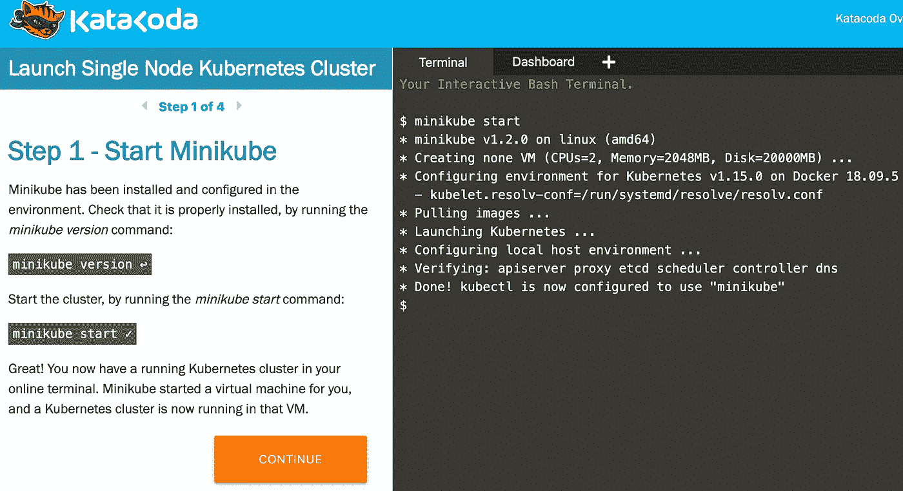

# 改变你学习新技术的方式

> 原文：<https://medium.com/javarevisited/change-the-way-you-learn-new-technologies-af222e2e05ad?source=collection_archive---------0----------------------->

我一直觉得在没有沙盒环境的情况下学习新技术很有挑战性。在这个开源成为主流的技术生态系统的现代时代，我们仍然需要花钱来学习这些开源项目。

资料来源:pexels.com

[Katacoda](https://www.katacoda.com) 是一个独特的地方，你可以探索新技术的学习场景，而不必在你的机器上安装任何运行时。一个基于浏览器的终端与一个临时虚拟机连接，该虚拟机充当一个沙箱环境，供我们尝试场景和学习工具/产品。

katacoda.com 场景的屏幕截图—启动单节点 Kubernetes 集群

[Kubernetes](https://www.kubernetes.io/docs) 文档向我介绍了 Katacoda，它提供了一种全新的方式，可以在浏览器中学习技术，而无需在本地机器上安装任何软件，无论是笔记本电脑还是台式机。我可以直接在浏览器中生成一个新的 minikube kubernetes 集群，而无需登录到该站点。这是一种非常酷的尝试新技术的方式，在沙盒设置中的实际场景中学习新技术，当我们关闭浏览器或转向新场景时，沙盒设置就会终止。

可以学习 Docker，Kubernetes，Envoy，Tensorflow 等。，不计成本。这让很多开发者大开眼界，他们现在可以轻松地尝试这些技术了。这样的概念简单明了，尽管很多在线培训网站，如 Cloudacademy，KodeCloud 仍然提供几乎类似的临时登录来尝试场景，Katacoda 擅长于允许用户免费使用大多数场景，并为开发人员提供了一个平台来创建任何人都可以尝试和学习的定制场景。

一定要利用 Katacoda 学习任何新技术，释放开源技术生态系统的真正潜力。

*附:这篇文章是基于我在我的 Youtube 频道*[*tech primers*](https://www.youtube.com/TechPrimers)制作的关于同一主题的 5 分钟 [*视频*](https://www.youtube.com/watch?v=JhwbrJkgu5o)