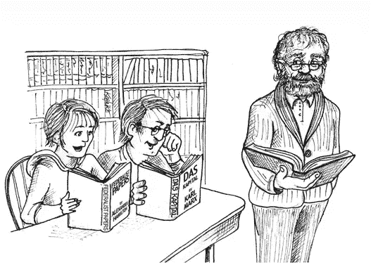

# 干净的代码-类

> 原文：<https://medium.com/javarevisited/clean-code-classes-dae3cb44eb90?source=collection_archive---------2----------------------->

现在我正在读第二遍，罗伯特·c·马丁又叫*鲍勃叔叔*的伟大著作 [**干净的代码**](/javarevisited/clean-code-a-must-read-coding-book-for-programmers-9dc80494d27c) ，我认为写下它试图传达给我们的最重要的想法是个好主意。今天，我将重点讨论第十章。

我们喜欢保持变量和效用函数的私密性，但并不热衷于此。有时我们需要保护一个变量或效用函数，以便它可以被测试访问。

对我们来说，测试规则。如果同一个包中的一个测试需要调用一个函数或者访问一个变量，我们会把它设为[保护](https://javarevisited.blogspot.com/2012/10/difference-between-private-protected-public-package-access-java.html#axzz6j8KhisSX)或者[包作用域](http://www.java67.com/2012/12/what-is-public-private-protected-package-default-private-access-modifier-java.html)。然而，我们将首先寻找一种保持隐私的方法。放松封装永远是最后的手段。

## **班级要小！**

在设计类时，较小是首要原则。和函数一样，我们最直接的问题总是“有多小？”

对于函数，我们通过计算物理线来测量大小。对于类，我们使用不同的度量。我们算*责任*。

一个类的名字应该描述它履行什么职责。事实上，命名可能是帮助确定班级规模的第一种方式。如果我们不能为一个类获得一个简洁的名字，那么它可能太大了。

类名越模糊，就越有可能有太多的责任。例如，包含像*服务*或*经理*或*超级*这样的含糊其词的类名通常暗示了责任的不幸聚合。

我们还应该能够用 25 个左右的单词写一篇简短的课堂描述，不要使用“如果”、“和”、“或”、“但是”这样的词。

# 单一责任原则

SRP 声明一个类或模块应该有且只有一个改变的理由。这个原则给了我们责任的定义和班级规模的指导方针。类应该有一个责任，一个改变的理由(试图识别责任通常有助于我们在代码中识别和创建更好的抽象)。

我们希望我们的系统由许多小类组成，而不是几个大类。每个小类都封装了一个单独的责任，有一个改变的理由，并与其他一些人合作来实现期望的系统行为。

## 内聚力

类应该有少量的实例变量。一个类的每个方法都应该操作一个或多个这样的变量。一般来说，一个方法操纵的变量越多，这个方法对它的类就越有凝聚力。一个类中的每一个变量都被每一个方法使用，这个类就是最大内聚的。

一般来说，创建这样的最大内聚类既不可取也不可能，另一方面，我们希望内聚性高。当内聚性很高时，意味着类的方法和变量是相互依赖的，作为一个逻辑整体挂在一起。

## 结论

需求会改变，因此代码也会改变。我们在 OO 101 中了解到，有包含实现细节的具体类，也有仅代表概念的抽象类。

当具体细节发生变化时，依赖于具体细节的客户端类将面临风险。我们可以引入接口和抽象类来帮助隔离这些细节的影响。

记住，对具体细节的依赖给测试我们的系统带来了挑战。如果一个系统解耦到可以用这种方式测试。，它也将更加灵活，并促进更多的重用。