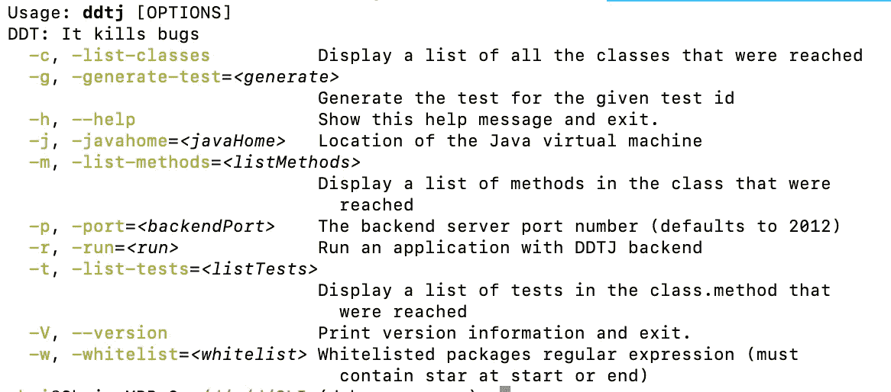

# 构建 DDJT 的代码覆盖率、Java 调试器 API 和完全集成—第 3 天

> 原文：<https://medium.com/javarevisited/code-coverage-java-debugger-api-and-full-integration-in-building-ddjt-day-3-320317b081f6?source=collection_archive---------1----------------------->


昨天[我们通过](https://dev.to/codenameone/scaffolding-spring-boot-freemarker-and-jdi-building-ddtj-day-2-7od)获得了第一次 PR，现在我正在进行第二次 PR。

我们几乎有一个[开源项目](https://github.com/ddtj/ddtj/)。嗯，从技术上讲，我们已经有了源代码和几行代码，但它仍然不完全是一个“项目”。不是指“它需要做一些有用的事情”。但是它可以编译、运行单元测试，甚至有 80%的代码覆盖率。最后一个很痛苦。我不喜欢用武断的标准来衡量代码的质量。80%的代码覆盖率就是一个很好的例子。
举个例子，这个代号。目前，源代码如下所示:

```
MonitoredSession monitoredSession = connectSession.create(System.getProperty("java.home"), "-Dhello=true", HelloWorld.class.getName(), "*");
```

但是最初它看起来像:

```
MonitoredSession monitoredSession = connectSession.create(null, null, HelloWorld.class.getName(),null); 
```

改变这一点显著增加了代码覆盖率，因为在以后的代码中，我对非空变量有特殊情况。为了良好的测试覆盖率，我还想测试空的情况，但这不会影响测试覆盖率。显然，你不会仅仅为了满足一个代码覆盖工具而写测试…但是如果我们依赖这样的度量作为代码质量和可靠性的基准。我们应该停下来。

这种方法的另一个问题是，要让最后 10-20%的代码覆盖率达到 80%的要求，需要做大量的工作。这太难了。如果你在一个有 100%代码覆盖率需求的项目上工作，我向你表示哀悼。我认为代码覆盖率的任意百分比是一个有问题的度量。我更喜欢语句覆盖率统计，但它们仍然存在类似的问题。

另一方面，我喜欢代码覆盖报告；我觉得这让我对项目的现状有了一些了解，并有助于理解所有的事情。从这个意义上说，声纳云非常棒。

敏锐的代码观察者会注意到我没有给公共代码添加任何覆盖。目前它几乎没有商业逻辑，事实上我在即将到来的公关中甚至删除了那段代码。

# 写作测试

我花了很多时间编写测试和模拟，这是为构建生成模拟单元测试的工具做好准备。由此，我感受到了基于代码覆盖报告生成测试的次要目标；比以往任何时候都有趣。我迫不及待地想研究一下代码，看看能否轻松地调出统计数据。

我在测试中发现非常痛苦的一件事是错误日志文件。对于我来说，我不知道为什么 Maven tests target 显示指向测试中的行的堆栈跟踪，而不是默认的完整堆栈跟踪。IntelliJ/IDEA 对此进行了改进，但仍不理想。尤其是在梳理 CI 日志时。

现在，我所有的测试都是单元测试，因为我还没有完全集成。但这很快就会改变。我仍然不确定我会选择什么形式进行集成测试，因为应用程序的初始版本没有 web 前端。我还没有测试命令行界面。

当我开始写这段代码时，我感到有些矛盾。正如我之前提到的，将 Java 调试 API 集成到 Spring Boot 后端对我来说是一个相当大的方向转变。但是很有道理，解决了很多问题。对我来说，争论的焦点是支持其他语言/平台。但是我希望在我们添加它们的时候，我能够集成各个平台的本地调试 API。这将使其他平台的调试过程类似于 Java 调试会话。我将尝试以模块化的方式编写代码，这样我们就可以注入对其他平台的支持。

我很确定 python，node 等的程序执行。将允许类似于 Java SE 上的 JDI 的功能。因此，如果代码足够模块化，我可以添加包来匹配每个支持的平台。至少，这是目前的计划。如果这不起作用，我们总是可以重构，或者只是为这些平台添加一个代理选项。我们的要求比较简单，不需要表达式求值等。只有当前堆栈帧数据和简单的单步执行结果。

当我想到使用调试器会话时，我想到了为每个方法设置断点。这显然是有问题的，因为我们可以设置的断点数量是有限的。相反，我使用方法入口回调来跟踪应用程序。在每个方法中，我使用 step over 来检查其中的元素。这还没有实现，主要是因为从单元测试中测试这一点相当困难。

这就是为什么我暂停了调试器会话的工作，并将堆栈移到 CLI。我想用实际的产品来调试这个功能。

# 通过 Web 服务集成 CLI

我创建了一个 CLI 项目并定义了依赖项，但直到现在我还没有真正编写任何 CLI 代码。计划是 CLI 将通过 REST 与后端代码通信。最初，我想到了使用 Swagger(开放 API ),它非常棒。如果您对它不熟悉，它实际上会为您需要的所有网络生成文档甚至应用程序代码。仅仅通过检查你的 API，相当甜蜜！

它生成了许多样板文件，有时冗长且不太直观。它还阻止了一些代码重用。如果我有一个大项目或者一个面向公众的 API，我可能会使用它。但是对于一些内部使用的东西来说，这似乎有点过了。所以最后我用了以前用过的 Gson，还有新的 [Java 11 HttpClient](https://github.com/ddtj/ddtj/pull/2/files#diff-806d340badbe3c5f02113a15b0a9d8b6c4242ce155f36c3a0cc595b106c2f0bfR86) API。这个 API 非常好，非常容易使用。

# 过度紧张

我真的很喜欢 [PicoCLI](https://picocli.info/) ，我想如果你[看看这个源文件](https://github.com/ddtj/ddtj/blob/cf316d9f4c0c361686dbee48f68c4e9b2c7f2636/CLI/src/main/java/dev/ddtj/cli/Main.java)，你就很容易明白为什么了。这使得编写命令行应用程序变得很简单。您可以获得华丽的 CLI APIs，包括高亮显示、完成、智能分组等等。它甚至有一个预处理器，这使得用 GraalVM 编译它变得很容易。

不幸的是，我遇到了一个用例，PicoCLI 可能有点太“聪明”。

我最初的设计是提供这样的命令:

```
java -jar ddtj.jar -run [-javahome:<path-to-java-home] [-whitelist:regex-whitelist classes] [-arg=<app argument>...] mainClass
```

请注意，`-arg`实际上允许我们将所有想要传递的参数传递给目标 JVM。例如，如果我们想将一个环境变量传递给 JVM，我们可以这样做:

```
-arg "-Denv=x"
```

问题是 PicoCLI 认为-D 是另一个参数，并试图解析它。我花了很多时间试图找到这样做的方法。我认为用 PicoCLI 是不可能的，但我可能漏掉了一些东西。问题是，我不想用 PicoCLI 参数复制所有的 JVM 参数，例如类路径参数等。不幸的是，这是我目前唯一的选择。

在我获得 MVP 之后，我将不得不重新考虑这种方法，但是现在我将 CLI 规范更改为:

```
java -jar ddtj.jar -run mainClass [-javahome:<path-to-java-home] [-whitelist:regex-whitelist classes] [-classpath...] [-jar...]
```

事实上，下面是 help 命令传递给 PicoCLI 为该代码生成的内容:



# 完全重蹈覆辙

当我实现公共项目时，我是根据猜测来做的。这是完全错误的。我不得不将每个源文件从我最初的实现转移到后端项目中。然后我必须为公共代码重新实现类。

原因在于网络界面。这让我意识到我坚持使用通用的数据模型，而不是需要移动到客户端的数据(后者要小得多)。

实现 web 界面很简单。我只是查看了文档中列出的命令，并为每个命令添加了一个 web 服务方法。然后为每一个添加了一个 DTO(数据传输对象)。dto 都在公共项目中，这是应该的。

最初，我认为我应该只编写 web 服务 rest 类中的所有逻辑，但是我最终将逻辑分离到一个通用服务类中。我想在未来添加一个 web UI，这样在一个[服务类](https://github.com/ddtj/ddtj/blob/cf316d9f4c0c361686dbee48f68c4e9b2c7f2636/Backend/src/main/java/dev/ddtj/backend/service/MainService.java)中拥有公共逻辑就有意义了。

# 处理状态

对于这种类型的应用程序来说，状态是一个艰难的选择。我不想要数据库，一切都在“内存”中。但是即使这样，我们使用会话管理吗？

如果我们有多个应用程序在后台运行会怎样？

所以目前我只是从 MVP 踢这个问题。如果您运行多个应用程序，它将会失败。我只是将数据存储在会话对象的一个本地字段中。这里我不需要静态变量，因为 spring 默认会话 beans 是单态的，并且不涉及集群。

在 MVP 之后，我们应该考虑运行多个应用程序。这可能需要更改 CLI 来确定我们目前正在开发的应用程序。我认为我们仍然将状态保存在一个字段中，但是我们应该有一种方法来刷新状态以减少 RAM 的使用。

# Snyk 集成

昨天我和 Snyk 有些问题。如果你对它不熟悉，它是一个无缝扫描你的代码漏洞并帮助你修复它们的工具。相当酷。集成非常容易，我对此非常满意。然后我试着给这个项目添加一个徽章…

显然，Snyk 徽章不适合单一回购。他们希望 pom 文件位于项目的顶层。所以我放弃了徽章。扫描成功了，所以徽章会失效对我来说很奇怪。

我会试着监控这个问题，看看是否有解决方案。我在他们的支持下讨论了这个问题，他们的回应还算合理，但似乎没有一个合适的答案。

这是一个耻辱，我喜欢这个想法的徽章，认证项目的安全状态。

# 明天

这是忙碌的一天，但最终感觉毫无收获，因为我把所有的时间都浪费在了 CLI 上，并试图让 Snyk 徽章工作起来。这是令人厌倦的事情。在做 MVP 的时候，总是寻找捷径，如果你不能让某些东西工作，就暂时停止。我们可以以后再回到这个话题。

明天我希望让当前的 PR 达到功能覆盖标准，并开始在命令行 API 中连线，这样我就可以在现实世界的条件下开始调试调试器过程。仍然有一些注释掉的代码片段和一些我需要改进的味道。