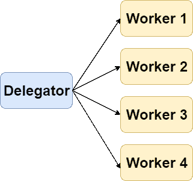
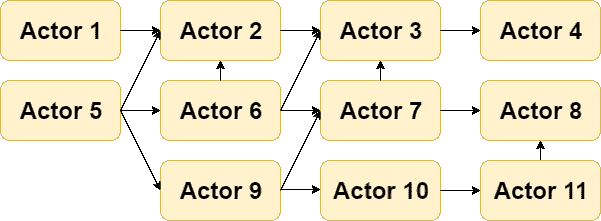

# 并发模型和分布式系统

> 原文：<https://medium.com/javarevisited/concurrency-model-and-distributed-systems-a4c03d7e2c93?source=collection_archive---------2----------------------->

**并发模型:**Java 中的并发模型被定义为负责执行系统中线程之间的通信的模型，该系统负责执行系统中运行的大型或执行大型进程以及适当的同步，以防止部分读取或写入系统中运行的程序中的最终值。

**分布式系统:**分布式计算系统(Distributed system in computing)是指为了提高系统的效率，在不同的分布式计算机之间连接或共享软件组件的系统。

**Java 中不同的并发模型:**

图 1.1:并行工人模型

**并行工作者模型:**并行工作者并发模型在 java 中被定义为这样一种模型，其中工作被分配给不同的工作者，同时彼此并行地工作，每个线程并行地执行不同的任务，这些任务可以是单个大任务的所有不同任务或子任务。这里，每个线程完成全部任务，它们可能运行在不同的 CPU 中。上面给出了描述并行工作者模型的图表，该模型的最大优点之一是，在该过程中，没有单个线程或工作者处于空闲状态，这很容易理解和实现，并且增加了系统的计算能力。系统中添加了更多的线程或工作者，图表如上所示。

图 2.2:装配线模型

**装配线模型:**这种模型之所以这样叫，是因为工作是在一条线上或一个接一个地执行的，每个工人都要完成一定量的工作，这种模型也被称为工人模型、并行工人模型、反应式系统，甚至是事件驱动系统。在这种方法中，工人的安排方式类似于工人在工厂中的安排方式。不是所有的工作都由一个工人完成，而是将工作分成小部分，由队列中的每个工人在一个方向上一行一行地执行。**装配线模型的工作被解释为当工作被指定完成时，而不是在 I/O 阶段期间，工人不等待 C.P.U .完成其任务，而是一完成任务就将下一个任务分配给队列中的下一个工人，并且该过程继续进行，直到工作完成。**在这里，每个工人都是独立的，与相邻的工人没有任何共享，因此流程是并发进行的，如上图所示。

**功能并行:**并行定义为在系统中并行执行多个任务，功能并行定义为在系统中使用多个 CPU 并行运行或执行的多个功能，这是 Java 8 编程语言中的新概念。传递到函数中的值被复制，以防止程序共享数据上的竞争条件，因此所有进程在系统内相互依赖地进行。并行运行的每个不同进程在计算机内的不同处理器中执行，功能并行仅在有多个处理器或 CPU 的系统中可用

**平行工人模型的优势:**平行工人模型的优势描述如下:-

*   很容易实现，也很容易理解。
*   如果工作量很大或更多，那么为了降低时间复杂度或减少执行时间，可以添加更多的工人来并行增加工作量。

**平行工人模式的缺点:**平行工人模式的缺点是:-

*   由于[多个线程](https://javarevisited.blogspot.com/2013/02/how-to-join-multiple-threads-in-java-example-tutorial.html)可以访问相同的存储数据，该机制应该以这样的顺序工作，以便多个字符串可以正确地读写存储空间中的数据，并且一个线程上所做的更改对其他线程是可见的，从而避免死锁、竞争条件和其他共享并发问题。
*   由于等待不同线程执行以完成进程的时间，等待执行的线程数量增加，并且可能发生只有有限数量的线程有机会被执行，由于这种情况，队列中即将被并行执行的线程的串行化增加，可以使用非阻塞并发算法来减少争用，但是它们难以实现。
*   在持久列表的情况下，原始内容的副本被保留，并且当线程试图修改列表中的数据时，修改成功发生，但是已经创建的数据副本保持不变，并且正在运行的所有其他线程可以从那里访问数据， 但是这种方法虽然看起来很完美，但是它也有一些缺点，即当在数据中有任何修改时，所有的改变都是在头节点中进行的，并且函数简单地返回对新创建的列表的引用，但是列表中的先前线程仍然保持对列表的先前第一个节点的引用，因此数据保持不变，并且不能看到新添加的元素。
*   这种方法的一个主要缺点是这种方法是不确定的，即不能保证系统中的进程会按顺序执行或者不会执行，假设如果进程 1 必须在进程 2 之后执行，那么进程 2 可能会在进程 1 之后执行，因此我们不能从系统中获得正确的输出。
*   因为该过程是并发执行的，所以从存储器中读取数据应该并行进行，但是每次重新读取数据会花费大量时间，效率很低。

**装配线模型的类型:**主要有两种装配模型

图 3.3:多重装配模型

**多装配模型:**这种模型属于并行工人模型，在这种模型中，要执行的任务被分成各种子任务，并分配给不同的工人，有时要执行的任务太大，以至于工作必须以并行的顺序在不同线程的许多工人中执行，如上图所示。

图 4.4:中间装配线

**中间装配线:**这种类型的模型主要描述不同线程的工人的工作交给同一个普通工人执行的装配线，如上图所示。

**装配线模式的优势:**装配线模式的优势如下:-

*   这些工人彼此完全独立，他们完全不关心工人之间共享数据可能引起的不同并发问题。
*   由于装配线模型，系统有可能成功地调度作业，使得当作业被写入日志时，作业被顺利且完美地执行，然后在系统故障期间，存储在日志中的作业从工作已经停止的地方被执行，并从相同的地方恢复。
*   因为线程不能修改工作者的工作，所以工作者可以是有状态的，并且可以使用存储器中的数据来进行计算和处理。

**与装配线模型相关的一些术语:**

有各种与装配线模型相关的术语，下面将对其中一些进行描述

图 5.5:装配线模型中的参与者

*   **参与者:**参与者负责与不同的组件或不同的其他参与者进行通信，以便处理一个或多个作业，如装配线并发模型的情况所示，该模型如上图所示。

图 6.6 装配线模型中的通道

*   **通道:**当不同的参与者与其他不同的参与者通信时，他们不能直接相互通信，有一种特殊的通信模式用于发布他们的消息，即通过通道，发送者通过通道发布他们的消息以与其他参与者通信，发送者不知道消息是通过这些通道发送的，他们只是知道他们必须通过哪个通道发送或发布他们的消息，通道如上图所示。

**不断学习，不断成长，不断探索！**

**万事如意！**

更多有趣和信息丰富的文章和提示请关注我的 [**Medium**](https://swapnilkant11.medium.com/) **和**[**Linkedin**](https://www.linkedin.com/in/swapnil-kant-279a3b148/)