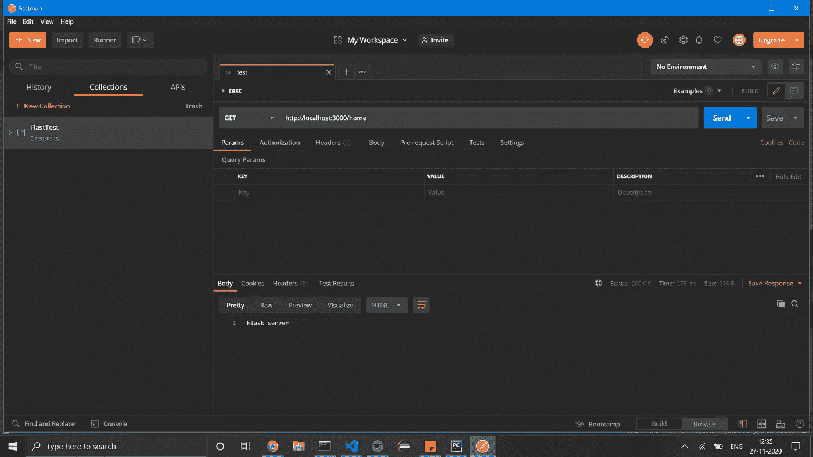

# 用 Node.js 连接 Flask。

> 原文：<https://medium.com/javarevisited/connecting-flask-with-node-js-7b9d823ca923?source=collection_archive---------1----------------------->

凯文·Ku 在 [Unsplash](https://unsplash.com?utm_source=medium&utm_medium=referral) 上的照片

## 关于如何在 Node.js 和 Flask 之间建立连接的简短教程。

# 简介:

有各种原因需要在 [Node.js](/javarevisited/top-10-online-courses-to-learn-node-js-in-depth-8ef0e31ca139) 和 [Flask](https://javarevisited.blogspot.com/2020/01/top-5-courses-to-learn-flask-for-web-development-with-python.html) 之间建立连接。最近，我这样做是为了将我用 Python 实现的机器学习模型与我的使用 Node.js 作为后端的网站相集成。程序很简单。我们别再废话了，开始吧。

# 步骤 1:构建 Flask 服务器

我们首先需要构建 Flask 服务器，它将监听 Node.js 发送的数据。

我们现在在本地机器的端口 5000 上运行我们的服务器。此外，我们还创建了一个简单的*路由*，当一个 *get* 请求从 Node.js 发送到 */flask* 端点时，它将返回一个 s *tring* 。

# 步骤 2:构建 Node.js 后端

在这一步，我们将使用 [Node.js](/javarevisited/7-free-courses-to-learn-node-js-in-2020-2f1dd6722b49) 和 [Express.js](https://expressjs.com/) 来布局我们的后端。Express.js 是一个流行的用于构建 API 的 web 框架。

我们将使用[请求](https://www.npmjs.com/package/request)库，该库可以使用 *npm 安装。请求库是最简单的用于 http 调用的库。*

正如我们在代码中看到的，当用户访问 */home* 端点时，一个 *get* 请求被发送到[*http://127 . 0 . 0 . 1:5000/flask*](http://127.0.0.1:5000/flask)*，这是我们针对 flask 服务器的端点。我们将收到字符串“Flask Server ”,作为从 Flask 返回的响应。*

# *结果:*

*是时候检查我们是否成功地从我们的 Flask 服务器获得响应了。我们可以使用 [Postman](/javarevisited/7-best-courses-to-learn-postman-tool-for-web-service-and-api-testing-f225c138fa5a) 来检查，这是一个用于设计和测试 API 的工具。*

**

*作者截图*

*我们可以看到，我们收到了字符串“Flask Server”。因此，我们成功地创建了连接。*

# *结论:*

*如上所述，有许多连接 Node.js 和 Flask 有用的用例。最常见的用途是当我们需要将[机器学习](/javarevisited/top-10-machine-learning-and-data-science-certifications-and-training-courses-for-beginners-and-a6308497b764)添加到我们的网站时，因为用 Python 实现机器学习(由于超级有用的库)并使用 Flask 将其连接到 Node.js 比在 Node.js 中一起实现更容易。*