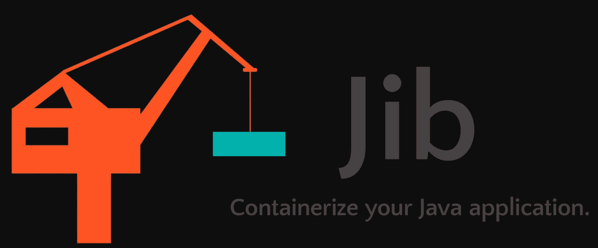
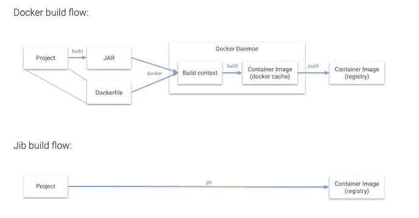
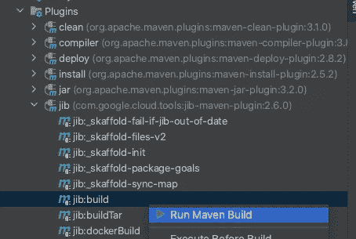

# 用 Jib 集装箱化 Spring Boot 应用

> 原文：<https://medium.com/javarevisited/containerizing-springboot-application-with-jib-716daa3e0850?source=collection_archive---------0----------------------->

在本文中，我们将了解如何在不安装任何 docker 客户端或不为我们的 Spring Boot 应用程序使用 Dockerfile 的情况下创建 docker 或 [OCI](https://opencontainers.org/) 投诉图像。我们将在 Jib 的帮助下完成所有这些工作。

## 什么是 Jib？

> [*Jib*](https://cloud.google.com/blog/products/gcp/introducing-jib-build-java-docker-images-better) *是来自谷歌的 Java 容器器，让 Java 开发者使用 Maven、Gradle 等构建工具构建容器*。



三角帆(图片[来源](https://github.com/GoogleContainerTools/jib)

但这还不是 Jib 真正有趣的地方在于，你不需要知道任何关于安装 [docker](/javarevisited/top-10-free-courses-to-learn-maven-jenkins-and-docker-for-java-developers-51fa7a1e66f6?source=collection_home---4------3-----------------------) 和维护 Dockerfile 等的知识。作为开发人员，你只关心工件(jar，war 等。)你将要生产，你不必处理任何 docker 的废话(构建/推送，等等。).

[](https://medium.com/javarevisited/top-10-free-courses-to-learn-jenkins-docker-and-kubernetes-for-devops-in-2020-best-of-lot-62a0541ffeb3)

Jib v/s Docker 构建流程(图片来源 Google Cloud)

哇，这个真厉害！！！但是怎么做呢？


## 如何转帆？

有了 Jib，您只需将 [Maven](/javarevisited/6-best-maven-courses-for-beginners-in-2020-23ea3cba89) 或 [Gradle](/javarevisited/5-best-gradle-courses-and-books-to-learn-in-2021-93f49ce8ff8e) 插件添加到 pom.xml .或 build.gradle 文件中，就可以立即将您的 Java 应用程序容器化。就这么简单。我们将首先报道 Maven，稍后在 Gradle 之后。那我们开始吧。

我们将使用 spring [initializr](https://start.spring.io/) 来生成一个可用的 spring-boot 项目。我们的 [SpringBoot 应用程序](/javarevisited/10-free-spring-boot-tutorials-and-courses-for-java-developers-53dfe084587e?source=collection_home---4------7-----------------------)的源代码在[这里](https://github.com/userac/spring-boot-jib.git)可以得到，它只是在图像通过 Jib 推送并且图像通过 docker 运行时打印一条 Hello 消息。

一旦我们准备好了 IDE 的设置，我们就可以继续下一步。

## **设置 Maven**

```
<plugin>
   <groupId>com.google.cloud.tools</groupId>
   <artifactId>jib-maven-plugin</artifactId>
   <version>2.6.0</version>
   <configuration>
      <from>
         <image>gcr.io/distroless/java:11</image>
      </from>
      <to>
         <image>registry.hub.docker.com/hiashish/spring-boot-jib-image</image>
      </to>
   </configuration>
</plugin>
```

对于 maven，您可以将上述内容粘贴到 pom.xml 插件部分，这样就可以了。但是我会在这里试着解释一下<from>和标签。</from>

> <from>配置基础映像以在基础上构建您的应用程序。</from>

通常你不需要提供<from>,因为默认情况下它使用 distroless java8 镜像。然而，我使用了 [java11](https://javarevisited.blogspot.com/2018/01/top-10-udemy-courses-for-java-and-web-developers.html#axzz6ggCCT42g) ，所以我在这里明确提到了这一点。此外，根据您的使用情况，您可能希望使用不同的基础映像。</from>

> 这是指将被推送到容器注册表的目标图像。

我使用了 docker 注册中心，但是您可以使用任何可用的云提供商(ECS、GCR、ACR)容器注册中心。

要使用插件的更多选项，您可以参考[文档](https://github.com/GoogleContainerTools/jib/tree/master/jib-maven-plugin)。

## **设置注册表凭证**

为了推送图像，我们需要将注册表凭证添加到 maven settings.xml 中。因为我们只是在做一个演示，所以以这种方式提供凭证是可以的，但要避免使用这种方法，因为它根本不安全。您可能想要保护凭证，如这里提到的。

```
<server>
    <id>registry.hub.docker.com</id>
    <username>username</username>
    <password>password</password>
</server>
```

## **建立形象**

要建立一个图像，我们可以用以下方法。

1.  集成驱动电子设备

例如，在 [IntelliJ](https://dev.to/javinpaul/5-best-courses-to-learn-intellij-idea-for-java-developers-5e6n) 中，你可以进入项目的 maven 视图，然后进入插件> jib，然后右键单击并运行 maven 构建。您可能希望为此创建一个 IntelliJ 运行配置，它可以运行 maven 目标，如清理、编译等。然后推你的形象。

[](https://medium.com/javarevisited/7-best-courses-to-learn-intellij-idea-for-beginners-and-experienced-java-programmers-2e9aa9bb0c05)

运行 IntelliJ

2.使用命令行

只需运行下面的命令来构建应用程序的映像。确保你已经安装了 [maven](https://javarevisited.blogspot.com/2019/03/top-5-course-to-learn-apache-maven-for.html#axzz6ccm5KWKs) 。

*mvn 编译转臂:构建*

它将编译、构建，然后将应用程序的映像推送到已配置的容器注册表中。

以下是输出。

> ashish @ MacBook-Air spring boot % mvn 编译 jib:build
> [INFO】扫描项目……
> [INFO]
> ………..
> 【信息】———Maven-compiler-plugin:3 . 8 . 1:compile(default-compile)@ spring-boot-jib—-
> 【信息】什么都不编译—所有类都是最新的
> 【信息】
> 【信息】———jib-Maven-plugin:2 . 6 . 0:build(default-CLI)@ spring-boot-jib—-
> 【警告】‘Maven-jar-plugin’中配置的‘main class’不是有效的 Java 类:${start-class} 【T8
> 【信息】执行任务:
> 【信息】
> 【信息】执行任务:
> 【信息】
> 【信息】执行任务:
> 【信息】[= = = = = = = =]25.0%完成
> 【信息】
> 【信息】执行任务:
> 【信息】[= = = = = =]25.0%完成
> 【信息】>推送 blob sha256:6508f436f3 >推送 blob sha 256:6508 f 436 f 385 b 3751366 f 90 b 6…
> 【信息】>推送 blob sha 256:c5e 22041 fc 97 b 838 b 93 a2 e18d…
> 【信息】>推送 blob sha 256:b 25902383 f9ee 26808 b 68 ca 62…
> 【信息】
> 【信息】。 >检查基础图层 sha256:31eb28996804…
> 【信息】
> 【信息】执行任务:
> 【信息】[========= ] 30.6%完成
> 【信息】>推送 blob sha 256:c5e 22041 fc 97 b 838 b 93 a2 e18d…
> 【信息】>检查基础图层 sha 256:31eb 288 容器入口点设置为[java，-cp，/app/resources:/app/classes:/app/libs/*，com . jib . example . spring . spring . spring boot application]
> 【INFO】
> 【INFO】构建并推送图像为 registry.hub.docker.com/hiashish/spring-boot-jib-image
> 【INFO】执行任务:【INFO】[= = = = = = = = = = = = = = = = = = = = = = = = 91.7%完成
> 【INFO】>启动层推送器

## **运行镜像**

我们已经成功地将映像(映像名:spring-boot-jib-image)推送到 docker [注册中心](https://hub.docker.com/r/hiashish/spring-boot-jib-image)。现在我们可以使用 docker 运行图像。


运行图像

如您所见，我们的应用程序运行在一个容器中。现在只需运行 [curl 命令](https://javarevisited.blogspot.com/2017/03/10-examples-of-curl-command-in-unix-and-Linux.html)，你就可以看到我们收到了来自 spring-boot 应用程序的 hello 消息。


你好消息

## 快速演示

## **结论**

在本文中，我们学习了如何在没有 docker 的情况下容器化 Java 应用程序。此外，使用 Jib，你也可以使用 [docker](/javarevisited/top-5-free-courses-to-learn-docker-for-beginners-best-of-lot-b2b1ad2b98ad?source=collection_home---4------2-----------------------) 构建图像，但这不是 X 因素。为 Java 应用程序使用 Jib 的其他好处包括超级容易集成、更快的构建、可再现的构建、由 Google 支持等。可以通过这个[链接](https://www.google.com/amp/s/cloudblog.withgoogle.com/products/gcp/introducing-jib-build-java-docker-images-better/amp/)详细了解 Jib 的好处。

## 支持我

如果你喜欢你刚刚读到的，你可以给我买杯咖啡。

[](https://www.buymeacoffee.com/meashish)

## **延伸阅读**

也可以看看我之前的一些文章。

[](/javarevisited/running-simple-springboot-app-on-minishift-84f51894bdf6) [## 在 Openshift(Minishift)上运行简单的 Spring Boot 应用程序

### 在本文中，我将尝试演示如何在 OpenShift (Minishift)上部署一个简单的 Spring Boot 应用程序。

medium.com](/javarevisited/running-simple-springboot-app-on-minishift-84f51894bdf6) [](/javarevisited/skaffolding-springboot-application-dbfbc463e558) [## Kubernetes via Skaffold 上 Spring Boot 应用的 CI/CD 工作流

### 使用 Skaffold 为部署到 Kubernetes 的 Spring Boot 应用程序创建 CI/CD 工作流。

medium.com](/javarevisited/skaffolding-springboot-application-dbfbc463e558)