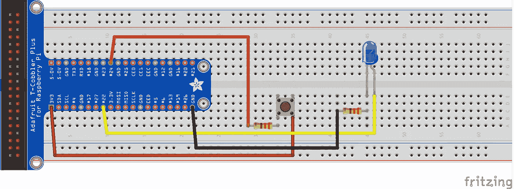

# 用 JBang 在 Raspberry Pi 上控制电子设备

> 原文：<https://medium.com/javarevisited/controlling-electronics-with-jbang-on-the-raspberry-pi-3c290c465abd?source=collection_archive---------1----------------------->

# JBang 是什么？

正如他们的[网站](https://www.jbang.dev/)所描述的:

*JBang 让学生、教育工作者和专业开发人员以前所未有的轻松创建、编辑和运行独立的纯源代码 Java 程序。*

*想在没有设置的情况下即时学习、探索或使用 Java？
你喜欢* [*Java*](/javarevisited/10-best-places-to-learn-java-online-for-free-ce5e713ab5b2) *但是使用*[*Python*](/javarevisited/10-best-python-3-courses-on-udemy-ddd4e3ec5dbf)*，*[*Groovy*](/javarevisited/6-best-resources-to-learn-groovy-and-grails-for-java-developers-18c04e88fa8a)*，*[*Kotlin*](/javarevisited/top-5-courses-to-learn-kotlin-in-2020-dfc3fa7706d8)*或者类似的语言进行脚本、实验和探索吗？
有没有想过能够在任何地方运行 Java，而不需要任何或非常简单的设置？
曾经试过 Java 11+支持运行。java 文件直接放在您的 shell 中，但是觉得有点太麻烦了？*

*JBang 让你做到这一切！*

# 录像

此视频向您展示了本页进一步描述的所有步骤。

# 准备一份覆盆子馅饼

对于本手册，您可以使用以下方法:

*   拿一个 SD 卡(最低 8Gb)
*   使用 Raspberry Pi Imager 工具将“Raspberry Pi OS (32 位)”写入此 SD 卡
*   将 SD 卡插入您的 Raspberry Pi 板
*   开机并等待操作系统启动(它可能会重新启动一次，以将 SD 卡上的分区调整到最大可用大小)
*   打开终端并确认 [Java](https://www.youtube.com/watch?v=g4rPdPxNb5w) 还不可用(除非您选择了“Raspberry Pi OS Full (32 位)”版本)

```
$ java -version 
bash: java: command not found
```

# 安装 JBang

正如在[jbang.dev/download](https://www.jbang.dev/download/)中所描述的，安装 JBang 就足够了，即使你还没有安装 Java，因为 JBang 也会处理这些。

```
$ curl -Ls https://sh.jbang.dev | bash -s - app setup 
$ java -version 
openjdk version "11.0.14" 2022-01-18 
OpenJDK Runtime Environment Temurin-11.0.14+9 (build 11.0.14+9) 
OpenJDK Server VM Temurin-11.0.14+9 (build 11.0.14+9, mixed mode)
```

# 最小 JBang 示例

一个最小的 JBang Java 文件看起来像下面的代码块，注意特殊的第一行，它欺骗系统将它作为脚本运行，同时仍然是有效的 Java 代码。

```
///usr/bin/env jbang "$0" "$@" ; exit $? 

class HelloWorld {
    public static void main(String[] args) {
        if(args.length==0) {
            System.out.println("Hello World!");
        } else {
            System.out.println("Hello " + args[0]);
        }
    }
}
```

通过将该文件另存为`HelloWorld.java`,可以从以下内容开始:

```
$ jbang HelloWorld.java 
Hello World!
```

# JBang Pi4J 示例

如果您的项目需要依赖项——Pi4J 项目就是这种情况——您可以[在 java 文件中用下面的 gradle-style locators 格式](https://www.jbang.dev/documentation/guide/latest/dependencies.html)定义它们，例如:`//DEPS com.pi4j:pi4j-core:2.1.1`。

以下示例基于[“最小示例应用”](https://pi4j.com/getting-started/minimal-example-application/)，并使用带有按钮和 LED 的相同接线。通过使用 JBang，我们可以用一个文件运行这个项目，而不需要一个完整的 [Maven](/javarevisited/6-best-maven-courses-for-beginners-in-2020-23ea3cba89) 或 [Gradle](/javarevisited/5-best-gradle-courses-and-books-to-learn-in-2021-93f49ce8ff8e) 项目，也不需要编译 Java 代码。

[](https://javarevisited.blogspot.com/2020/05/top-5-courses-and-books-to-learn-gradle.html#axzz6fk6WjYD0)

最小 Pi4J 示例应用程序的布线

用以下内容创建一个新文件`JBangPi4JExample.java`:

```
///usr/bin/env jbang "$0" "$@" ; exit $?
//DEPS org.slf4j:slf4j-api:1.7.35
//DEPS org.slf4j:slf4j-simple:1.7.35
//DEPS com.pi4j:pi4j-core:2.1.1
//DEPS com.pi4j:pi4j-plugin-raspberrypi:2.1.1
//DEPS com.pi4j:pi4j-plugin-pigpio:2.1.1

import com.pi4j.Pi4J;
import com.pi4j.io.gpio.digital.DigitalInput;
import com.pi4j.io.gpio.digital.DigitalOutput;
import com.pi4j.io.gpio.digital.DigitalState;
import com.pi4j.io.gpio.digital.PullResistance;
import com.pi4j.util.Console;

class JBangPi4JExample {

    private static final int PIN_BUTTON = 24; // PIN 18 = BCM 24
    private static final int PIN_LED = 22; // PIN 15 = BCM 22

    private static int pressCount = 0;

    public static void main(String[] args) throws Exception {

        final var console = new Console();

        var pi4j = Pi4J.newAutoContext();

        var ledConfig = DigitalOutput.newConfigBuilder(pi4j)
                .id("led")
                .name("LED Flasher")
                .address(PIN_LED)
                .shutdown(DigitalState.LOW)
                .initial(DigitalState.LOW)
                .provider("pigpio-digital-output");
        var led = pi4j.create(ledConfig);

        var buttonConfig = DigitalInput.newConfigBuilder(pi4j)
                .id("button")
                .name("Press button")
                .address(PIN_BUTTON)
                .pull(PullResistance.PULL_DOWN)
                .debounce(3000L)
                .provider("pigpio-digital-input");
        var button = pi4j.create(buttonConfig);
        button.addListener(e -> {
            if (e.state() == DigitalState.LOW) {
                pressCount++;
                console.println("Button was pressed for the " 
                    + pressCount + "th time");
            }
        });

        while (pressCount < 5) {
            if (led.equals(DigitalState.HIGH)) {
                console.println("LED low");
                led.low();
            } else {
                console.println("LED high");
                led.high();
            }
            Thread.sleep(500 / (pressCount + 1));
        }

        pi4j.shutdown();
    }
}
```

不需要任何进一步的配置、安装、依赖项下载或编译，我们现在应该能够运行以下代码:

```
$ jbang JBangPi4JExample.java

[jbang] Building jar...

[main] INFO com.pi4j.Pi4J - New auto context
[main] INFO com.pi4j.Pi4J - New context builder
[main] INFO com.pi4j.platform.impl.DefaultRuntimePlatforms - adding platform to managed platform map [id=raspberrypi; name=RaspberryPi Platform; priority=5; class=com.pi4j.plugin.raspberrypi.platform.RaspberryPiPlatform]
[main] WARN com.pi4j.library.pigpio.impl.PiGpioNativeImpl - PIGPIO ERROR: PI_INIT_FAILED; pigpio initialisation failed
```

啊，错误…？！但这是一个已知的！此时，pig Pio——与 Gpio 交互的底层原生库——需要被称为`sudo`。这是不理想的，我们正在研究如何可以返工。但是，通过一些额外的步骤，这可以很容易地解决！

首先，我们需要用`which jbang`为当前用户找出 JBang 安装在哪里。这个完整路径可以用来从那个位置启动 JBang，而不是 JBang 为`pi`用户自动创建的快捷方式`jbang`(在本例中)。由于 Java 是由 JBang 为`pi`用户安装的，所以它需要为`sudo`用户再次安装，但这也是由 JBang 自动处理的。

```
$ which jbang
/home/pi/.jbang/bin/jbang

$ sudo /home/pi/.jbang/bin/jbang JBangPi4JExample.java
Downloading JDK 11\. Be patient, this can take several minutes...

[main] INFO com.pi4j.Pi4J - New auto context
[main] INFO com.pi4j.Pi4J - New context builder
[main] INFO com.pi4j.platform.impl.DefaultRuntimePlatforms - adding platform to managed platform map [id=raspberrypi; name=RaspberryPi Platform; priority=5; class=com.pi4j.plugin.raspberrypi.platform.RaspberryPiPlatform]
[main] INFO com.pi4j.util.Console - LED high
[main] INFO com.pi4j.util.Console - LED low
[main] INFO com.pi4j.util.Console - LED low
[Thread-0] INFO com.pi4j.util.Console - Button was pressed for the 1th time
[main] INFO com.pi4j.util.Console - LED high
[main] INFO com.pi4j.util.Console - LED low
[main] INFO com.pi4j.util.Console - LED high
[Thread-2] INFO com.pi4j.util.Console - Button was pressed for the 2th time
[main] INFO com.pi4j.util.Console - LED low
[main] INFO com.pi4j.util.Console - LED high
...
[main] INFO com.pi4j.util.Console - LED high
[main] INFO com.pi4j.util.Console - LED low
[Thread-8] INFO com.pi4j.util.Console - Button was pressed for the 5th time
```

是的，我们有一个工作示例，有依赖关系，不需要编译任何东西！

这两个命令甚至可以结合使用，使事情变得更加简单，让您只需使用以下命令即可启动应用程序:

```
$ sudo `which jbang` JBangPi4JExample.java
```

# 结论

JBang 是运行(单个文件)Java 文件的好方法，可以帮助您在 Raspberry Pi 上快速开始使用 Pi4J，并且是试验电子学和 Java 的理想入门方法。

感谢 [Max Rydahl Andersen](https://twitter.com/maxandersen) 和众多贡献者创造了 JBang，并提出了 `[sudo](https://github.com/jbangdev/jbang/discussions/1229)` [如何与 JBang](https://github.com/jbangdev/jbang/discussions/1229) 结合的[解决方案。](https://github.com/jbangdev/jbang/discussions/1229)

*最初发表于*[*https://pi4j.com*](https://pi4j.com/documentation/building/jbang/)*。*