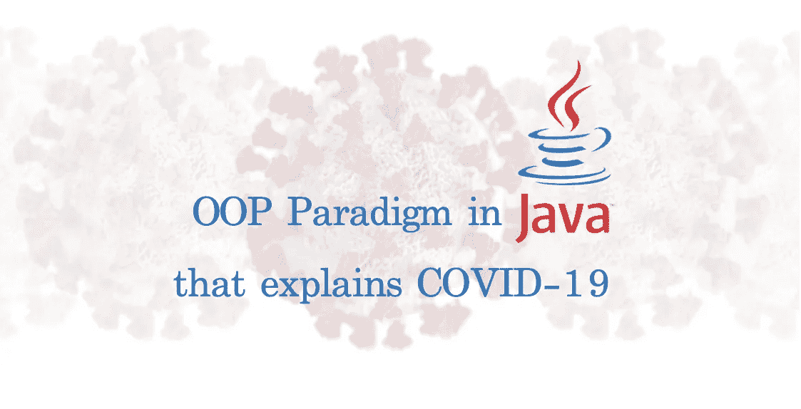
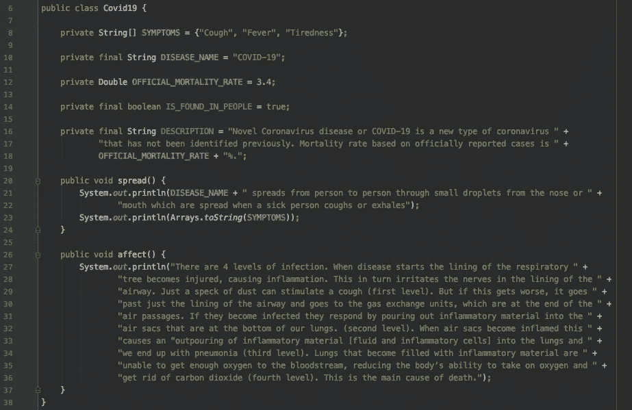
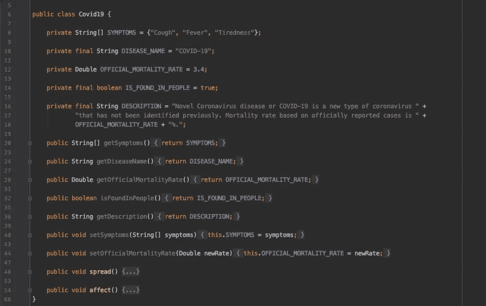
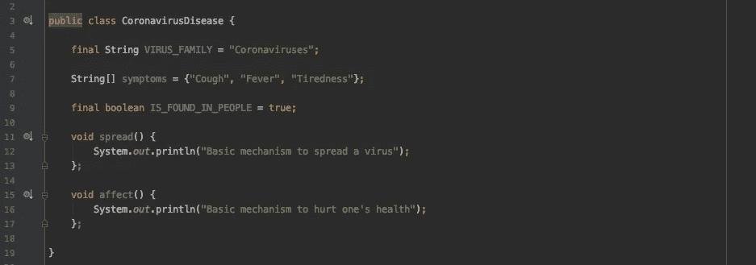
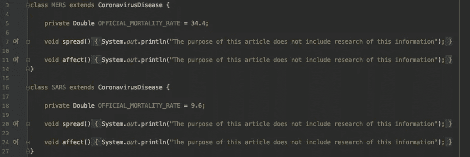
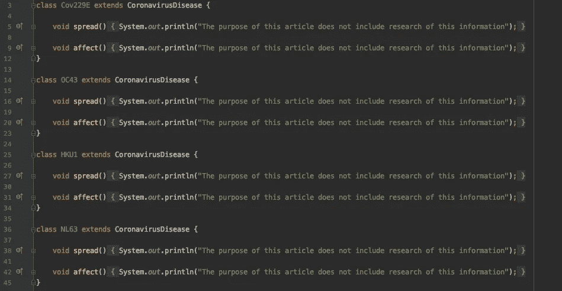
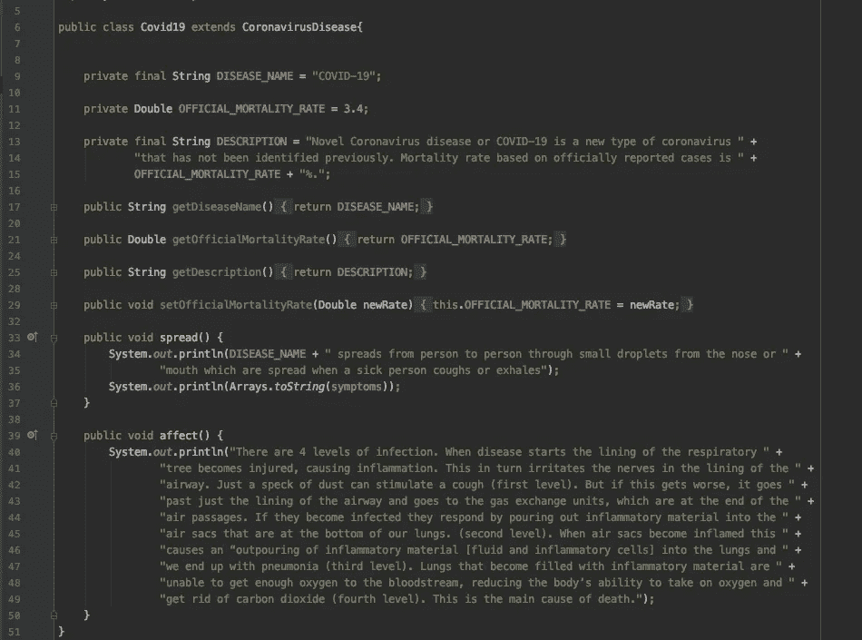
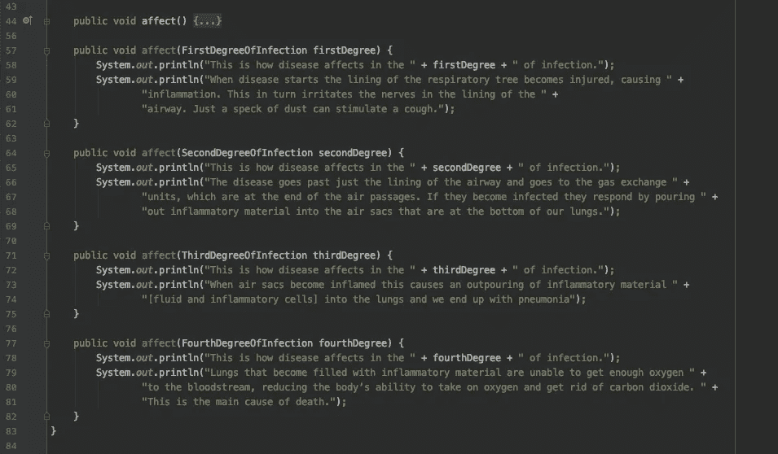

# 冠状病毒疾病与 Java 中的 OOP 范例

> 原文：<https://medium.com/javarevisited/coronavirus-disease-and-oop-paradigm-in-java-affae9bde0b4?source=collection_archive---------2----------------------->

**本文目的**

我在考虑用 Java 写我的第一篇关于 OOP 范例的文章，但是困扰我的是我将构建例子的主题。因此，随着 2020 年 3 月 11 日世界卫生组织(世卫组织)将冠状病毒爆发称为疫情，我认为利用这个机会来了解 OOP 范式和冠状病毒疾病将是一次有趣的经历。了解这两者是很重要的，因为第一个是在你的发展生涯中向前迈出的一步，第二个可以帮助拯救生命或至少阻止病毒的传播。所以这篇文章的主要目的是用关于冠状病毒的例子来解释 OOP。

*P.S .不注意***未使用** *例子中的警告*

**什么是 OOP？**

正如定义所述:“面向对象编程(OOP)是一种基于“对象”概念的编程范式，它可以包含字段形式的数据(通常称为*属性*或*特性*)和过程形式的代码(通常称为*方法*)。简而言之，这是一种思考对象中一切事物的途径或方法。你用*领域*描述他们的特点，用*方法*描述他们的能力。具体来说，让我们将冠状病毒疾病描述为具有其特征和能力的对象。

因此冠状病毒疾病可以用以下*特征*来描述(这些是为了保持例子简单而选择的基本特征):

*   名称:新冠肺炎，代表冠状病毒疾病-2019
*   症状:咳嗽、发烧、疲倦、流鼻涕等。
*   死亡率:世界卫生组织总干事 Tedros Adhanom Ghebreyesus 博士谈到了 3.4 %，但这是基于官方报告的病例。如果我们把所有没有去医院的轻微病例都计算在内，那么这一比例将是 1%或更低。
*   简短描述:新型冠状病毒疾病或新冠肺炎是一种新类型的冠状病毒，以前没有发现。

所以现在我们已经*描述了*这种疾病(这些特征也与*状态*有关)，但是目前的描述还不完整，因为我们还没有告诉*它能做什么。*像任何病毒一样这也可以

*   传播:这种疾病可以通过新冠肺炎患者咳嗽或呼气时从鼻子或嘴里流出的小飞沫在人与人之间传播。
*   影响:有 4 个级别的感染。当疾病开始时，呼吸树的内层受到损伤，导致炎症。这反过来刺激气道内层的神经。仅仅一粒灰尘就能刺激咳嗽(一级)。但是如果这种情况变得更糟，它只会经过气道的内层，进入位于气道末端的气体交换单元。如果它们被感染，它们的反应是将炎症物质倒入我们肺部底部的气囊中。(二级)。当气囊发炎时，这导致“炎性物质(液体和炎性细胞)涌入肺部，最终导致肺炎(三级)。充满炎症物质的肺部无法获得足够的氧气进入血液，降低了身体吸收氧气和排出二氧化碳的能力(第四级)。这是死亡的主要原因。

现在对新冠肺炎的简单描述已经完成。很简单，对吧？我们可以用编程的方式描述我们的对象*，就像我们口头描述*一样简单。**

****

**Covid19 简单类**

**在上图中你可以看到*代码*或*我们的*对象的编程描述*。这是一个简单的类，描述了对象的特性和能力。
特征是调用类字段或属性，能力是调用方法。***

*你可能想知道那些*私有或公共*关键字是什么意思？你可以在下一节找到答案:)*

***封装***

*正如他们所说，封装描述了将数据和处理数据的方法捆绑在一个单元中的想法。这个概念也经常被用来从外部隐藏一个对象的内部表示或状态。这就是所谓的信息隐藏。这个想法很简单:如果您有一个或多个从外部不可见的属性，并且您可以将它们与提供对它们的读或写访问的方法捆绑在一起，这意味着您可以隐藏特定的信息并控制对象的内部状态。*

*一种实现信息隐藏机制的方法是，使属性从外部不可访问，并为可以被其他类读取或修改的属性提供访问器方法，也称为 getter/setter。*

*在我们的例子中，让我们看看哪些属性可以被其他类修改。*

*   *症状:每个人都可以阅读这个信息，它可以更新，因为进一步的研究可以引入新的症状或否定其中的一些症状*
*   *疾病名称:每个人都可以阅读此信息，但不能更改*
*   *官方死亡率:每个人都可以阅读这个信息，它可以改变，因为每天都有新的确诊病例和新的死亡病例。这个数字可以增加也可以减少。*
*   *是在人身上发现的:每个人都可以阅读这些信息，但这是无法改变的。它不会神奇地变成假的:)*
*   *描述:每个人都可以阅读这个信息，让我们假设它现在不能被改变，因为我们使用了简单的描述。*

*现在让我们以编程方式应用这种访问限制。以下是我们将得到的结果:*

**

*包装*

*现在说说*私有和公有*关键词。这些被称为访问修饰符。Java 有 4 个。*

*   *Private:它是最受限制和最常用的访问修饰符。任何具有*私有*修饰符的属性或方法只能在同一个类中被访问。没有子类或子类或其他类不能访问它们(这是指在相同和不同包中的任何类)。最佳实践是对所有不应从外部调用的属性和内部方法使用此修饰符。*
*   *无修饰符或包私有:每当你没有为你的属性或方法提供任何修饰符时，它可以在同一个类和同一个包中的所有其他类中被访问。这就是它有时被称为包私有的原因。这在开始时可能会有点混乱，但是在你的实践中，你会遇到很多情况，你需要在你的包内实现一组逻辑，但是也有一个可以从你的包外访问的 API。这就是包私有修饰符派上用场的时候。*
*   *Protected:访问修饰符为 protected 的属性和方法可以在您的类中被同一包中的所有类访问，也可以被同一包或其他包中的所有子类访问。在某些情况下，您需要为超类的属性和一些方法设置一个例外，以便子类可以直接访问它们。这就是使用 protected 修饰符的地方。*
*   *Public:这是限制最少的访问修饰符。使用 public 修饰符的方法和属性可以在当前类中访问，也可以由所有其他类访问。这个修改器对你的属性来说几乎不是一个好主意，你应该在方法中使用它之前仔细考虑。*

***传承***

*继承是一种机制，使一个类能够获得另一个类的属性，这意味着 chid 类(继承的那个)可以*重用超类(被继承的那个)的*属性或方法。有 4 种主要的继承类型:*

*   *Singe:这是最简单的类型。这里一个类继承了第二个类的属性和方法。(A -> B)*
*   *多重:这是一个类可以继承一个或多个类的属性和方法的情况(A -> C && B -> C)*
*   *多级:当一个类可以继承已经从另一个类(A -> B -> C)继承的第二个类的属性和方法时，就是这种情况*
*   *分层的:当一个或多个类继承同一个类的属性和方法时(A -> B && A -> C && A -> D)就是这种情况*
*   *混合型:这是单一类型和多种类型的组合(A -> B && A -> C && B->D && C -> D)*

*在 Java 中，为了实现继承，我们对类使用*扩展*关键字，对接口使用*实现*。由于 Java 不支持多重继承，我们使用接口。*

> *例如:*
> 
> *A 类扩展了 B 类*
> 
> *A 类实现接口 b*

*现在让我们用新冠肺炎来理解继承。我们知道新冠肺炎是由冠状病毒大家族中的一种病毒引起的。这些病毒会导致轻度至中度的上呼吸道疾病，如普通感冒。它们有数百种，其中大多数在动物体内循环。有时它们可以跳到人类身上(这被称为溢出事件)，并可以引起疾病。迄今为止，已知 7 种冠状病毒会导致人类疾病:其中 4 种是轻微的(病毒 229E、OC43、NL63 和 HKU1)，另外 3 种可能会有更严重的后果(SARS(严重急性呼吸综合征:2002-2004)、MERS(中东呼吸综合征:2012-至今)和新冠肺炎(冠状病毒疾病 2019 : 2019 年 12 月-至今))。*

*你能看出这些疾病之间的关系吗？对！它们都是冠状病毒疾病，因此它们与冠状病毒有等级关系。从程序上讲，我们将有一个基类或超类，所有其他 7 个类(或疾病)将扩展这个类，它们将继承它的属性和方法。下图显示了我们的基类和派生类。*

**

*冠状病毒疾病基本类别*

**

*严重冠状病毒疾病:SARS 和 MERS*

**

*轻度冠状病毒疾病:229E、OC43、HKU1 和 NL63*

*前两张图片分别描述了严重和轻度冠状病毒疾病的类别。正如你所看到的，他们实现了两个对所有疾病通用的基本方法。现在让我们看看我们的 Covid19 类是如何变化的。*

**

*扩展冠状病毒疾病类别的 Covid19 类别*

*我们本可以使用接口而不是简单的类。我建议你试着自己做，因为这对你来说是一个很好的练习。*

*Java 中有一个重要的关键字会帮助你实现继承: *super。*它类似于*这个*关键字，但它使你能够访问超类或基类的字段和方法，而不是当前对象。例如，我们可以将我们的一个轻度疾病类改为使用 super 关键字来调用基类的 *spread()和 affect()* 方法。*

**

*超级关键字的简单用法*

*这只是使用*超级*关键字的一个简单例子。我建议你做一些研究，并尝试在任何可能的情况下使用这个关键字。*

***多态性***

*多态性是一种机制，它使我们能够以不同的方式完成相同的动作。换句话说，在面向对象的编程中，它是一个方法根据它所作用的对象做出不同行为的能力。有两种类型的多态性:*

*   *静态:这是通过*重载*方法在*同一个类*中出现的多态性类型。要重载一个方法，你需要有两个同名但不同签名的方法(记住:返回值不是方法签名的一部分)，这基本上意味着有不同的参数集。这种类型有时被称为编译时多态性，因为可利用的方法是在编译过程中决定的。*
*   *动态:这是当子类*覆盖在超类或基类中声明的*方法时发生的多态类型。要覆盖一个方法，你应该在子类中声明一个与超类同名的方法。在 Java 中，你可以使用@Override 注释来明确声明你的注释方法是 overrides 基类方法。但这不是强制性的。编译器无论如何都会发现的。这种类型也被称为运行时多态性，因为可利用的方法是在运行时决定的。*

*你是否注意到我们已经在例子中使用了多态性？正确！我们通过在儿童疾病分类中覆盖传播和影响方法来使用动态多态性。下面举一个 Covid19 类的静态多态性的例子。如你所知，疾病对人的影响是不同的。在我们的示例中，我们了解到有 4 种程度的感染。根据严重程度，我们可以用 4 种不同的方法将它们分开。下面是如何做到这一点:*

**

*用 affect 方法显示静态多态性*

***抽象***

*如定义所述:“抽象是用形式上与其含义相似的表示(*语义*)来定义数据和程序，同时隐藏实现细节的过程”。简而言之，想象一种情况，你有 n 个不同的对象。每个物体都可以用许多详细的特征来描述，但是在这些特征中有一些共同的特征。还记得遗传部分描述的 7 种冠状病毒疾病吗？让我们试着用*抽象*来表示它们。为了做到这一点，让我们考虑一下我们拥有的信息:我们知道*

*   *所有 7 种疾病都是由属于冠状病毒家族的病毒引起的*
*   *所有 7 种疾病都在人类中发现*
*   *所有 7 种疾病都有共同的感冒症状*
*   *其中 4 例有轻微影响*
*   *其中 3 人可能会有更严重的后果*
*   *所有 7 种疾病的死亡率不同*
*   *所有 7 种疾病都有不同的名称*

*这些都是疾病的特征。现在能力:*

*   *所有 7 种疾病都有以不同方式传播的能力*
*   *所有 7 种疾病都能以不同的方式影响人体*

*现在我们知道了 7 种冠状病毒疾病的所有共同信息，我们可以通过编程来抽象这个想法。*

*在 Java 中，抽象是使用抽象类和抽象方法实现的。为了声明抽象类，我们使用*抽象*关键字。这种类型的类与普通类的不同之处在于拥有抽象方法的能力。当一个方法没有主体并且在声明中有 *abstract* 关键字时，这个方法被称为抽象方法。这种类型的方法不能被 *final* 作为子类来实现它的体。让我们添加冠状病毒疾病类的抽象版本。*

**

*代表冠状病毒疾病的抽象类别*

*很简单，对吧？*

*增加这一课程使我们能够抽象出全球冠状病毒疾病的概念以及在人类中发现的具体例子。我们可以像扩展普通冠状病毒疾病类一样简单地扩展这个类。*

*感谢您的宝贵时间。*

*希望你们喜欢这篇文章，它的目的是提高对新冠肺炎的认识，帮助你们理解 OOP 原则。*

*您可以在下面的 GitHub 资源库中找到示例项目:[https://github.com/sedamov/COVID-19-and-OOP](https://github.com/sedamov/COVID-19-and-OOP)*

*# StayHome #拯救生命*

***学习 Java 编程的其他有用资源**
[2020 年 Java 开发人员路线图](https://javarevisited.blogspot.com/2019/10/the-java-developer-roadmap.html)
[2020 年 Java 程序员应该学会的 10 件事](https://javarevisited.blogspot.com/2017/12/10-things-java-programmers-should-learn.html#axzz5atl0BngO)
[每个 Java 开发人员都应该知道的 10 个工具](http://www.java67.com/2018/04/10-tools-java-developers-should-learn.html)
[学习 Java 编程语言的 10 个理由](http://javarevisited.blogspot.sg/2013/04/10-reasons-to-learn-java-programming.html)
[10 个框架 Java 和 Web 开发人员应该学会的 10 个技巧](http://javarevisited.blogspot.sg/2018/01/10-frameworks-java-and-web-developers-should-learn.html)
[成为](http://javarevisited.blogspot.sg/2018/05/10-tips-to-become-better-java-developer.html)*

*</javarevisited/my-favorite-books-to-learn-java-in-depth-must-read-9c4468aeec99>  </javarevisited/what-java-programmers-should-learn-in-2020-648050533c83> *