# 使用 Java/Kotlin 为 iOS、Android、桌面和 Web 构建跨平台的原生移动应用

> 原文：<https://medium.com/javarevisited/create-native-mobile-apps-using-java-kotlin-and-maven-f50e0bd03527?source=collection_archive---------1----------------------->

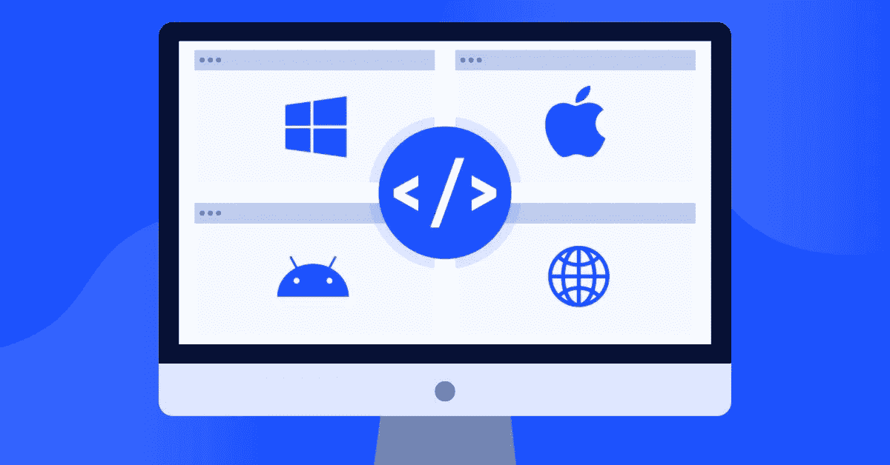

新的代号 One Maven build 使构建原生移动和桌面应用变得简单…它也是免费的，并且是开源的！

我们可以从打开 start.codenameone.com[开始](https://start.codenameone.com/)

在这里我们为我们的应用程序选择包名。这是非常重要的，因为一旦应用程序提交到商店，就不能更改！

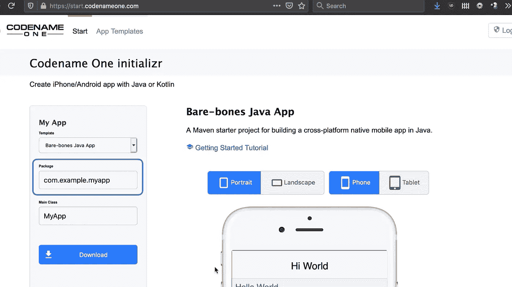

start.codenameone.com

我们输入应用程序的名称并下载包含 maven 项目的 zip 文件，请注意，如果您希望构建一个 Kotlin 应用程序，您需要选择 [Kotlin](/javarevisited/top-5-courses-to-learn-kotlin-in-2020-dfc3fa7706d8)

我们现在可以在任何 IDE 中打开应用程序，我使用了 [IntelliJ/IDEA](/javarevisited/7-best-courses-to-learn-intellij-idea-for-beginners-and-experienced-java-programmers-2e9aa9bb0c05?source=---------16------------------) ，但是你也可以使用 [Eclipse](/javarevisited/6-free-best-eclipse-ide-courses-for-java-programmers-1229ee9e5d87) 、NetBeans，甚至 [VSCode](https://javarevisited.blogspot.com/2021/05/favorite-courses-to-learn-visual-studio-code-f.html#axzz6uq12fuKh) 。项目中的大部分重要代码都在公共目录下。

[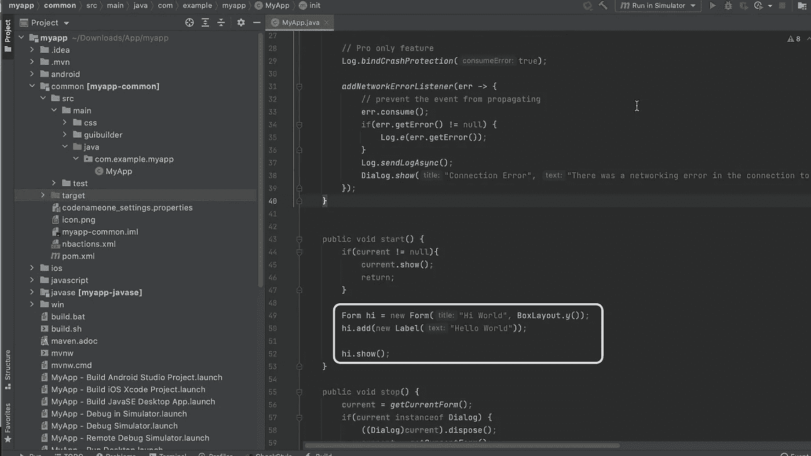](https://javarevisited.blogspot.com/2018/09/top-5-courses-to-learn-intellij-idea-java-and-android-development.html#axzz6A8Vy1sea)

该项目在 IntelliJ/IDEA 中打开。突出显示表单创建

现在它只有您选择的包下的主类，在我的例子中是 com.example.myapp。

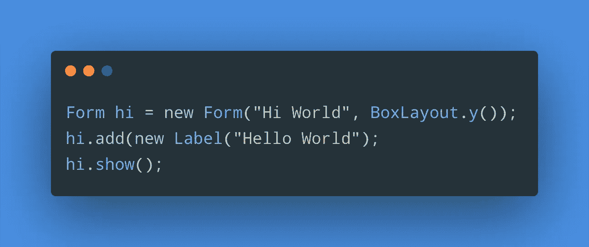

这段代码创建并显示了一个表单，它是 Codename One 应用程序的根组件。它还在“Hi World”标题下添加了“Hello World”标签。

maven 目标“在模拟器中运行”让我们运行模拟器并产生以下结果:

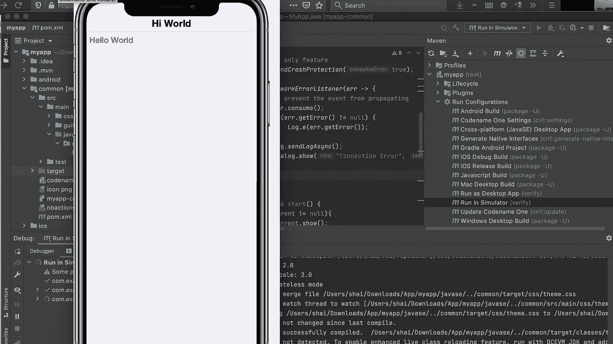

还有许多其他的 [maven](/javarevisited/6-best-maven-courses-for-beginners-in-2020-23ea3cba89) 目标，我们可以使用它们来完成您需要的几乎所有事情，我将介绍其中的一些，但是首先我想展示一下 Codename One 编程的简易性…

我们可以将上面的代码改为:

我们添加了一个名为“sayHi”的按钮，并为事件添加了一个监听器。

在事件回调中，我们显示一个对话框。这是非常直观的，正如你所期望的那样…

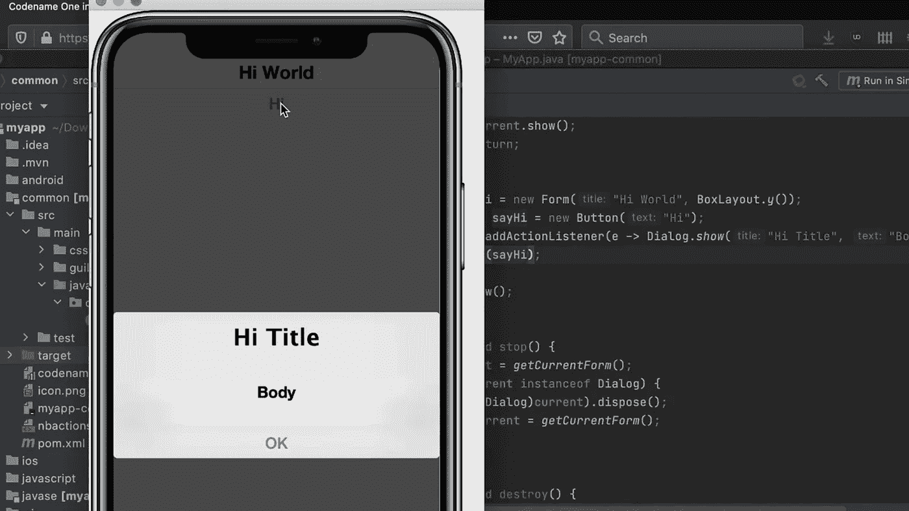

点按按钮后显示的对话框

我们可以放置一个断点，调试，甚至修改代码，并看到它动态更新(这需要一点工作，但实际上是可行的)。但是更酷的事情之一是易于造型。

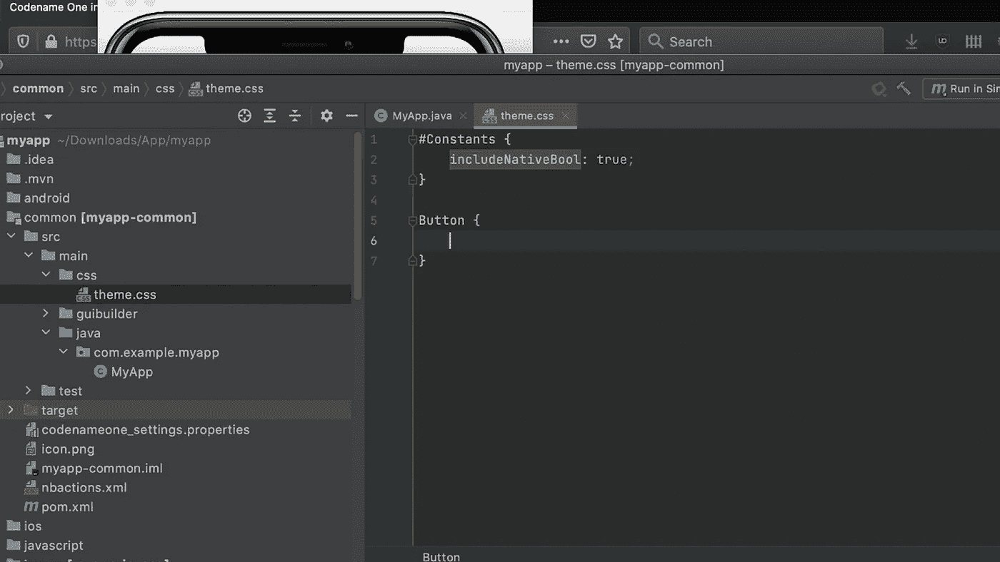

theme.css 支持动态设计整个 UI

在 css 中将按钮颜色设置为红色会产生即时变化，而无需重新编译、重新加载或任何操作:

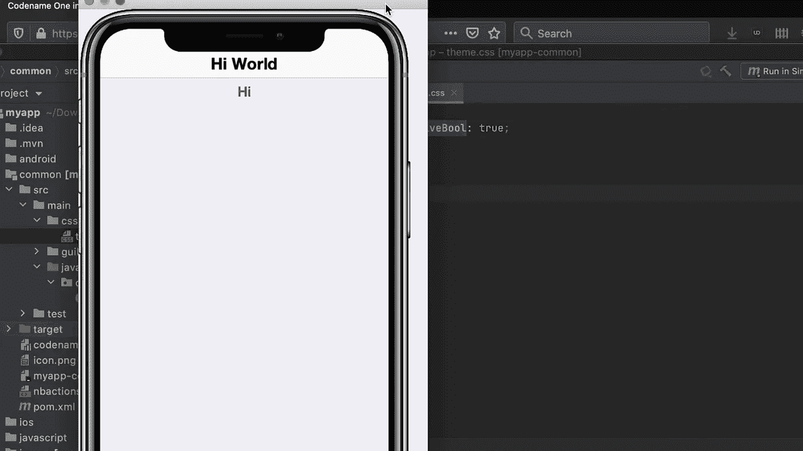

将颜色设置为红色的结果

要构建一个本地应用，我们可以选择适当的目标，如 [Android](/hackernoon/top-5-courses-to-learn-android-for-java-programmers-667e03d995b4) build、 [iOS](/javarevisited/my-favorite-free-courses-to-learn-ios-app-development-f172e7d3ba5d) 、Mac Windows 等。这将一个构建发送到 Codename One 服务器，这些服务器已经安装了所有的工具，让你[在没有 Mac 的情况下构建 iOS 应用](/javarevisited/7-free-flutter-online-courses-to-build-android-and-ios-apps-in-2021-54c0c92f16f9?source=extreme_sidebar----d3a191ac6ed-----0-1----------------------)。您也可以生成一个本地构建，我将在下面介绍。请注意，我稍微简化了一下，因为您还需要一个证书。总的来说，这是一个有点痛苦的话题。Codename One 通过向导等使这变得相对简单。但这是一个有点大的主题。

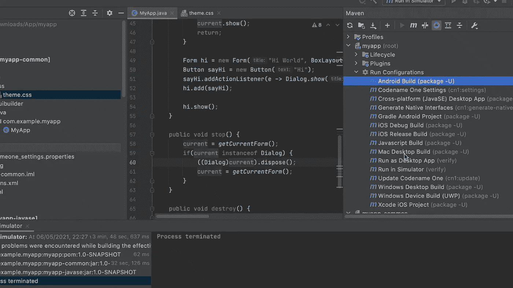

发送本机版本

你可以在三个地方跟踪结果，首先是构建云，你可以从那里下载结果文件，扫描二维码将其安装在设备上，复制或通过电子邮件发送链接。

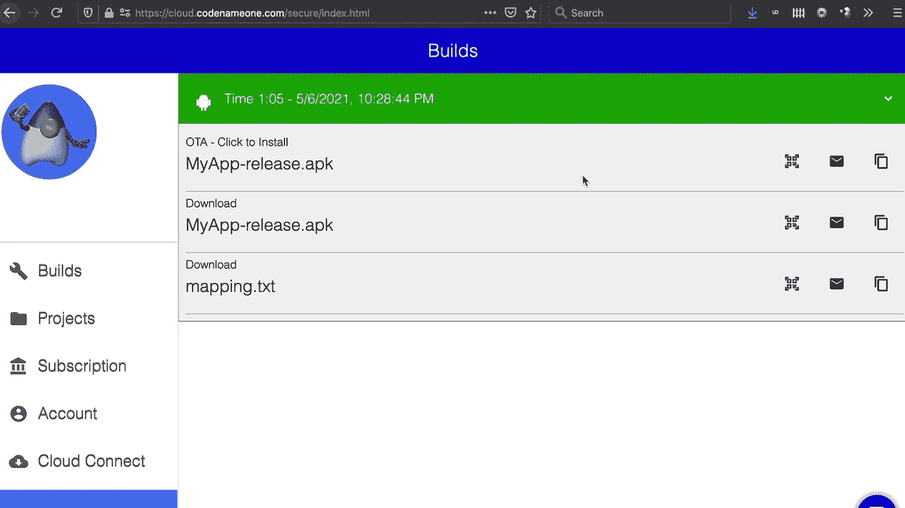

云构建结果:[https://cloud.codenameone.com/secure/index.html](https://cloud.codenameone.com/secure/index.html)

第二种方式是通过 Codename One 设置，您也可以通过 maven 启动:

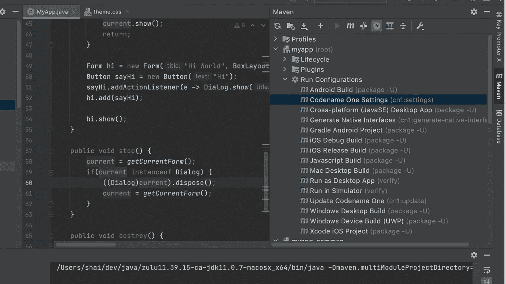

启动 Codename One 设置

这将启动一个桌面应用程序，它是控制 Codename One 的“一站式商店”。您可以定义项目设置、生成证书、监控构建等。

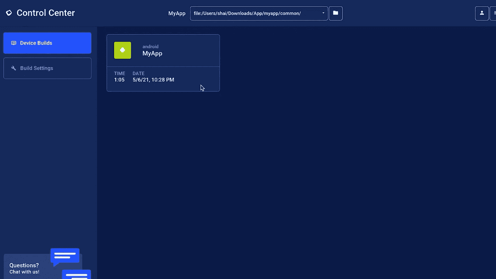

代号一设置(又名控制中心)的设备构建部分

还有一个[原生 Android 应用](https://play.google.com/store/apps/details?id=com.codename1.build.app)，你可以用它来跟踪构建并安装它们。对于 iOS，您可以打开[网址](https://cloud.codenameone.com/secure/index.html)，这将在设备上很好地工作。

最后，我们可以在没有构建云的情况下构建一个原生应用。我们可以运行 Xcode iOS 项目目标或 [Gradle](/javarevisited/5-best-gradle-courses-and-books-to-learn-in-2021-93f49ce8ff8e) Android 项目 maven 目标。

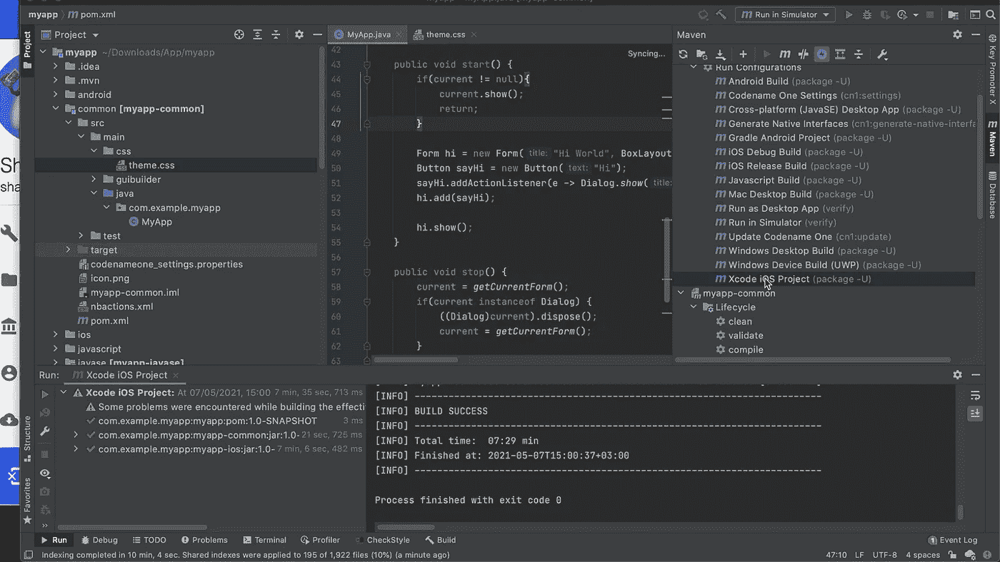

xcode ios 项目 maven 目标

运行 Xcode 项目后，苹果 Xcode 环境会与生成的原生 iOS 项目无缝启动，我们可以在原生 iOS 模拟器或设备上运行该项目！注意，这需要一台 Mac。Android Studio 的等价物在任何地方都可以工作…

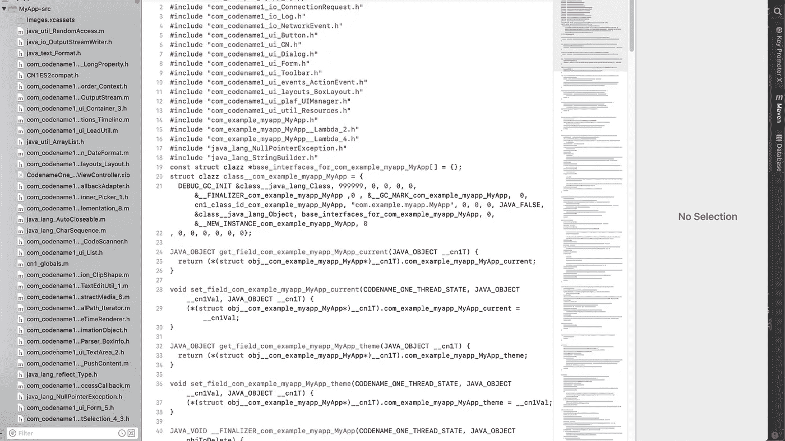

xcode 中的原生项目

如果您喜欢，以上所有内容也在本教程视频中:

# 最后一个音符

我写的所有东西都是开源的，在我们的 github 项目中我们讨论了很多。如果你认为我们做得很好，我们可以利用你的帮助来宣传和推广我们的工作。

如果您有任何问题，请跟随 stackoverflow 上的 [codenameone 标签，使用该标签询问任何问题。我努力回答我能回答的所有问题。](https://stackoverflow.com/tags/codenameone)