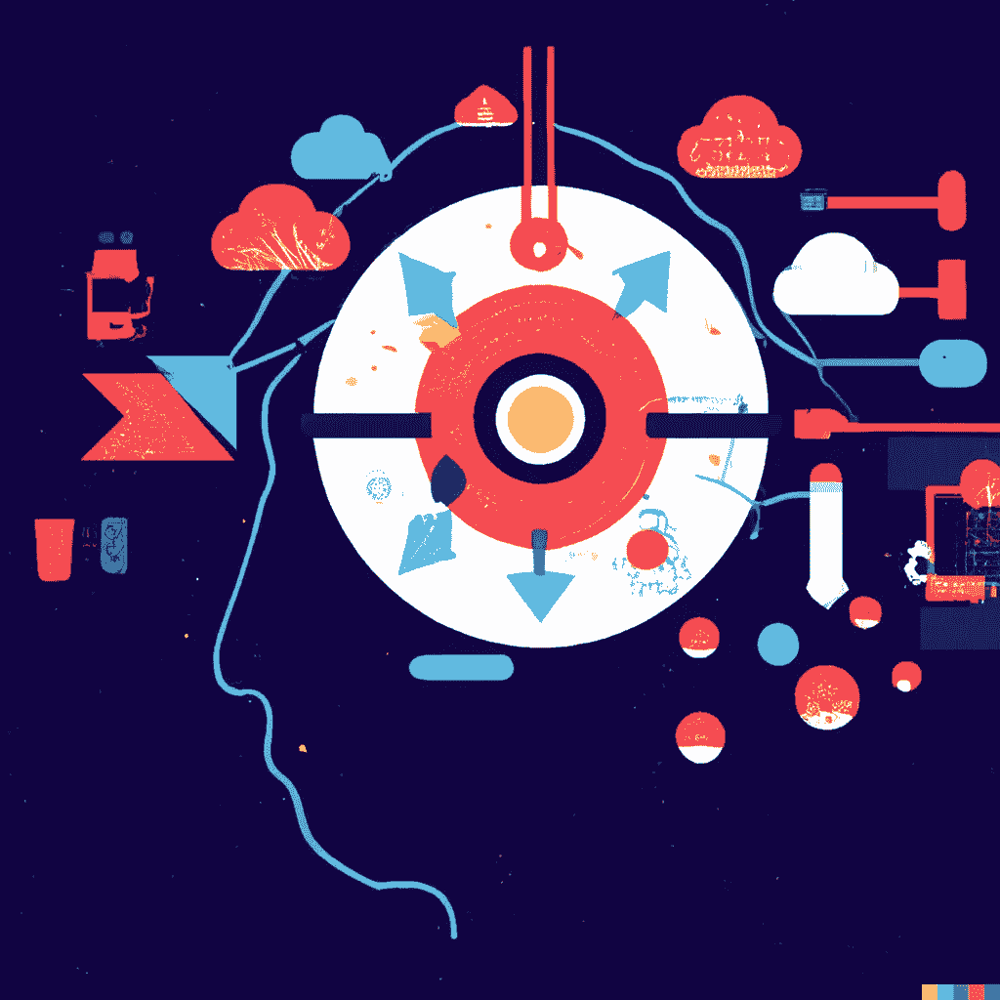

# 软件开发:通过结构化思维表达的创造力

> 原文：<https://medium.com/javarevisited/creativity-expressed-through-structured-thinking-4017ddde4e48?source=collection_archive---------1----------------------->

> 快速介绍

在分享我的个人经历之前，我想深入探讨一下编程对我的重要性，以及为什么它会给我带来如此的快乐。

在我看来，一个有效的工作过程应该包含创造力和进步感，因为这有助于使工作更有意义和满足感。如果没有这些元素，感觉就像是用时间换取金钱，而不是一次有价值和有回报的经历。

我经常听到非技术人员说，他们永远不会考虑转向编程，因为他们觉得编程很无聊。但是，我坚决不同意这种情绪。我发现编程是一个非常吸引人和有益的领域。

> 编程的好处

[编程](/javarevisited/20-binary-tree-algorithms-problems-from-coding-interviews-c5e5a384df30)的一个关键特点是，它既需要创造性思维，也需要逻辑思维。一方面，程序员需要能够创造性地思考，提出新的想法和方法来解决问题。另一方面，他们还需要能够使用结构化思维，以清晰、系统的方式规划和执行他们的解决方案。

编码的过程本身需要高度的专注和集中，这可以导致大脑活动和精神耐力的增加。简而言之，编程是一项具有挑战性和引人入胜的职业，可以让专业人士成长和学习。

> 这对我意味着什么

这正是我热爱编程的原因！通过编程，利用我解决问题的技能创造有意义和创新的解决方案，我从中获得了巨大的满足感。我喜欢工作的创造性和逻辑性之间的平衡，编码的精神收益是额外的奖励。

总之，编程给我带来了快乐，因为它是一个具有挑战性和吸引力的领域，允许我作为一名专业人士成长和学习。我希望激励其他人也从事编程，因为它有可能成为一个非常有益和令人满意的职业。