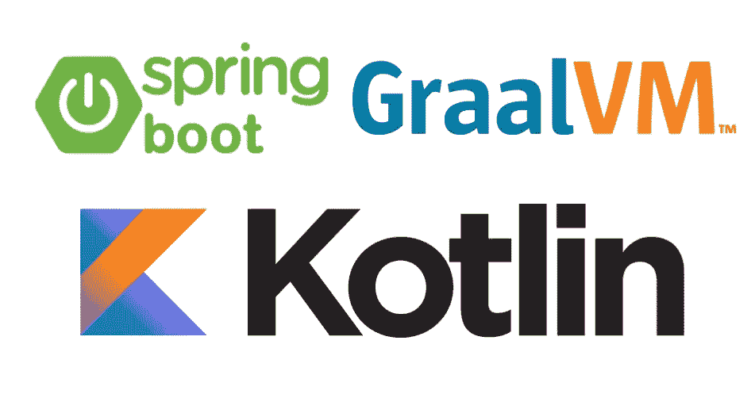

# Spring Boot 2.7 的当前状态与 Kotlin (GraalVM)原生

> 原文：<https://medium.com/javarevisited/current-state-of-spring-boot-native-with-kotlin-graalvm-699b1812cc65?source=collection_archive---------0----------------------->

本文介绍了使用 **Kotlin 1.7** 建立一个示例 **Spring Boot** **2.7** 项目，然后在 GraalVM***native-image***和 Spring AOT(提前)插件的帮助下，将其编译成本地平台可执行文件的经验。

# **为什么**

用于运行大多数服务器端 [Kotlin](/javarevisited/top-5-courses-to-learn-kotlin-in-2020-dfc3fa7706d8) 程序的 [JVM](/javarevisited/7-best-courses-to-learn-jvm-garbage-collection-and-performance-tuning-for-experienced-java-331705180686) (Java 虚拟机)以启动和预热时间缓慢而闻名，之后才能提供最佳性能。

尤其是在快速扩展的云环境中，这可能是一个主要的缺点。此外，服务器程序的部署规模可能会非常大。GraalVM 是由 Oracle 提供的，它的本机映像工具允许我们从任何 JVM 字节码中生成本机可执行文件(大小要小得多)。

这使得应用启动速度极快，无需任何预热。

当然，总有一个陷阱:与运行在 Hotspot JVM 上的服务器程序相比，峰值性能较低，因为没有使用 [JIT](https://javarevisited.blogspot.com/2011/12/jre-jvm-jdk-jit-in-java-programming.html) (实时)编译器，因此不可能进行运行时优化。

*(使用 GraalVM 企业版可以获得接近 JIT 的性能，这不是免费提供的)*

# **设置**

我们希望创建一个典型的服务器应用程序，它将数据保存在 H2 内存数据库中，并公开一个简单的 REST API 进行交互。

顾名思义，我们使用 [Spring Boot](/javarevisited/top-10-courses-to-learn-spring-boot-in-2020-best-of-lot-6ffce88a1b6e) (2.7)和[科特林](/javarevisited/7-free-courses-to-learn-kotlin-in-2020-327c3872c1e1) (1.7)利用[弹簧网通量](/javarevisited/7-best-webflux-and-reactive-spring-boot-courses-for-java-programmers-33b7c6fa8995)。对于数据库访问，我们将使用 R2DBC，它支持异步数据库操作。总的来说，我尽可能多地使用 Kotlin 特有的特性来测试它们的原生支持。

# **代码**

我就不解释设立[基地 Spring Boot 申请](https://javarevisited.blogspot.com/2022/08/how-to-test-spring-boot-application.html)的来龙去脉了。完整的示例项目可以在 [***GitHub***](https://github.com/jonas-tm/spring-boot-kotlin-reactive-example) 上找到。

 [## GitHub-Jonas-TM/spring-boot-kot Lin-reactive-example

### 在 GitHub 上创建一个帐户，为 Jonas-TM/spring-boot-kot Lin-reactive-example 开发做贡献。

github.com](https://github.com/jonas-tm/spring-boot-kotlin-reactive-example) 

Gradle 设置使用了 Spring Boot 插件和实验性的 Spring AOT 插件，该插件内部包含了 Spring Native 所需的所有东西。

下面显示了简化的服务器设置。它包括一个协程 CRUD 存储库和初始数据创建器。该服务在根路径上公开了一个简单的*GET*REST 端点。为此，我们使用 Spring WebFlux 协程路由器 DSL(特定领域语言)。

为了保持示例简短，News 数据类用于持久化 Spring 数据，并作为 REST API 的返回类型，利用 Kotlin 序列化( *@Serializable* )。

# **本土形象**

一旦我们设置好服务，我们就可以通过`./gradlew nativeRun`将它作为本地映像运行。为此，您必须设置以下内容:

*   **GraalVM** 已安装，环境变量`[JAVA_HOME](https://www.java67.com/2016/06/how-to-set-javahome-and-path-in-linux.html)`已设置(我推荐使用 [*sdkman*](https://sdkman.io/) )
*   ***原生-镜像*** [已安装](https://www.graalvm.org/22.2/reference-manual/native-image/#install-native-image)并可达

Spring AOT 插件将自动在构建管道中运行，以创建一个特殊的 Spring Boot JAR，在编译成本机映像时需要运行这个 JAR。它将尝试为您的程序创建所有需要的[可达性配置](https://www.graalvm.org/22.2/reference-manual/native-image/metadata/)，以便作为本机映像正常工作。

# 问题 1

当我们启动应用程序时，它会在启动过程中崩溃，并显示以下消息:

> 缺少 kot Lin . internal . JDK 8 . JDK 8 platform implementations .<init>()的本机反射配置。</init>

这是因为代码中定义了`DataCreator`。如果仔细观察，您会发现它正在启动一个协程，用一些样本数据填充 H2 数据库。如果我们放弃使用协程，应用程序会正常启动。

这是因为[科特林](https://javarevisited.blogspot.com/2018/02/5-courses-to-learn-kotlin-programming-java-android.html)协程在内部使用反射，这是 Spring AOT 不支持的。我们也不能通过一个 Spring AOT 配置注释来定义它，因为错误消息中命名的类是一个内部类。这是一个众所周知的问题，不是 Spring 独有的，而是所有 Kotlin 程序的问题。这里有一张公开的 bug 票*。*

*为了解决这个问题，我们必须手工定义一个`reflection-config.json`文件。下面的代码必须放在这里`/src/main/resources/META-INF/native-image/reflect-config.json`，由原生图像工具自动获取。*

*如果我们现在尝试将程序作为本机映像运行，它应该会正确启动。*

# *问题 2*

*当应用程序启动时，它似乎工作正常，但是，当我们调用端点时，我们得到以下错误:*

> *kotlin . reflect . JVM . internal . kotlinreflectioninternal 错误:无法计算函数的调用方:公共构造函数新闻(…*

*这表明新闻数据类没有被 Spring AOT 正确配置，也没有创建反射配置。*

*它没有被自动拾取的主要原因是我们使用 WebFlux 协同路由器 DSL 来定义 REST 端点。如果我们使用传统的方式(` @ [RestController](https://javarevisited.blogspot.com/2017/08/difference-between-restcontroller-and-controller-annotations-spring-mvc-rest.html) 和`[@ get mapping](https://javarevisited.blogspot.com/2021/10/difference-between-requestmapping-and..html)`)Spring AOT 就会找到它。*

*为了解决这个问题，我们可以利用 Spring Native 项目的特殊注释，它允许我们在代码中定义反射配置:*

*手动添加类型提示后，我们现在可以调用端点了。*

****边注*** *:如果我们在一个单独的服务类中定义 ServerResponse 创建，而不是直接在路由器下定义，DSL Spring 将无法正确注册返回类型并在本机映像中使用 Jackson 序列化而不是 KotlinX 序列化。唯一可能的解决方法是切换到端点的传统@RestController 定义。**

# ***启动时间***

*由于 GraalVM 本机映像最有趣的部分是启动时间，下面是我的 Mac M1 上的一些简单测试数据，来自 Spring Boot 日志:*

*   ****JAR****:*1.695 秒(JVM 运行为 2.042)*
*   ****本机镜像*** : 0.076 秒(JVM 运行 0.078)*

# ***结论***

*正如人们可能会发现的那样，Kotlin 与 Spring Native 和 GraalVM 原生映像的结合还没有准备好投入生产使用。然而，已经有可能创建一个简单的运行服务器，它可以按预期工作(在应用了一些修复之后)。*

*使用本文中展示的方法，需要 100%的测试覆盖率(利用本地测试)来确保一切按预期运行(确保没有反射配置丢失)。*

*我期待着 Spring Native 在未来改进对它的支持，特别是因为它将成为 **Spring Boot 3** 的一部分。Kotlin 团队也在不断努力让 Kotlin 生态系统准备好与原生映像一起使用。激动人心的时刻就在前面，我们只需要再等一会儿。*