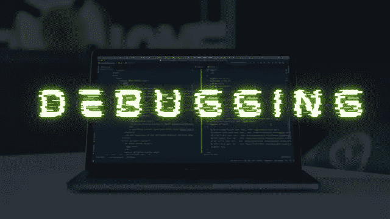

# 调试 101:识别和解决代码错误的初学者指南

> 原文：<https://medium.com/javarevisited/debugging-101-a-beginners-guide-to-identifying-and-resolving-code-errors-6ccefba1679b?source=collection_archive---------5----------------------->

欢迎来到调试 101 教室！对于任何程序员来说，调试都是一项基本技能，它包括识别和修复代码中的错误。无论你是刚开始编程还是已经从事编程有一段时间了，[调试](https://javarevisited.blogspot.com/2022/09/java-debugging-interview-questions.html)是开发过程中的一个重要部分。在这本初学者指南中，我们将探索一些识别和解决代码错误的基本策略。

调试时，重要的是从检查代码中的任何基本**语法错误开始。这可能包括**缺少括号、不正确的标点符号以及其他格式问题**。虽然这些错误可能看起来很小，但如果不加以解决，它们会导致严重的问题。为了确保你的代码没有错误，在进入更复杂的[调试方法](https://javarevisited.blogspot.com/2011/07/java-debugging-tutorial-example-tips.html)之前，一定要仔细检查它是否有语法错误。**

通过**使用 print 语句跟踪代码的执行对于调试**来说是一个有用的策略。通过查看错误发生的确切位置，您可以更好地了解可能导致问题的原因以及如何解决问题。

使用调试器也是有帮助的，调试器是一个工具，它允许你在特定的点暂停代码的执行，并在那个时刻检查你的程序的状态。当您处理复杂的代码并且需要了解每一步发生了什么时，这可能特别有帮助。

一个有效的调试技术是**将你的代码分成更小的部分，然后分别测试每一部分**。这可以帮助您查明导致问题的特定代码部分，从而更容易解决问题。

调试可能很难，但它是 [**编程**](/javarevisited/top-10-free-interactive-programming-courses-from-educative-for-beginners-to-learn-in-2021-713cbf96d4eb) 的一个**重要部分。使用上述策略可以帮助您快速有效地找到并修复代码中的错误。通过**练习**，你可以**成为更好的调试器**，节省时间和精力，同时创造更好的代码。**调试愉快！****

<https://kapilbaser44.medium.com/5-steps-to-learn-and-master-coding-8709425f1848>  

感谢您阅读这篇关于调试的文章。我们希望它对您有所帮助，并且您现在能够更好地识别和修复代码中的错误。如果您有任何进一步的问题或想了解更多关于编程的知识，**请关注** [Kapil Baser](https://medium.com/u/b813b18b3785?source=post_page-----6ccefba1679b--------------------------------) **获取更多提示和资源并给予支持**。感谢您的时间和快乐的编码！