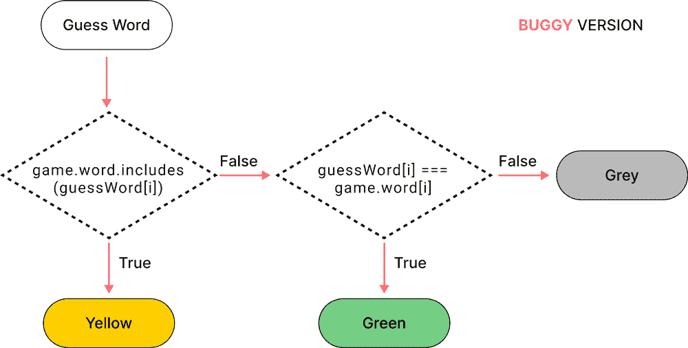

# 调试一个 Wordle Bug

> 原文：<https://medium.com/javarevisited/debugging-a-wordle-bug-3bfe120e720f?source=collection_archive---------2----------------------->


我坦白:我沉迷于 Wordle。尤其是现在它已经过时了，人们也不再发关于它的帖子了。我喜欢它很短，我可以解决一个单词，然后它就消失了。我不觉得沉迷和浪费时间在一个游戏上太糟糕。这个云调试器教程对我来说是一个巨大的挑战，因为它的目标是一个 Wordle 游戏。但是我想得太多了。

[作为我们最近发布的 Lightrun Playground 的一部分](https://playground.lightrun.com)，我们需要一个演示应用程序，让刚接触 Lightrun 的开发者在一个“安全的环境”中练习。

我们决定选择 Wordle 作为我们的演示应用程序，因为它让人一见如故，直观且没有太多的交互性。Flappy Bird 演示调试起来可能会很痛苦。在这一点上，我们的主要挑战是创建一个 bug，其中[调试过程](https://javarevisited.blogspot.com/2011/07/java-debugging-tutorial-example-tips.html)将足够有趣，但又足够微妙，因此不会立即变得明显。

创建这样一个 bug 具有惊人的挑战性。我们不希望一个过于复杂的应用程序跨越多个文件。这可能会使调试过程过于困难。另一方面，bug 需要足够微妙，即使我们直接盯着它看，我们也不会注意到它。

这是一个错误:

```
constguess = []
for (leti = 0; i < game.word.length; ++i) {
  if (game.word.includes(guessWord[i])) {
    guess.push({ letter:guessWord[i], check:CHECK_TYPES.LETTER_INCLUDED })
  } else if (guessWord[i] === game.word[i]) {
    guess.push({ letter:guessWord[i], check:CHECK_TYPES.LETTER_MATCHED })
  } else {
    guess.push({ letter:guessWord[i], check:CHECK_TYPES.LETTER_NOT_INCLUDED })
  }
}
```

你能发现问题吗？

为了理解它，我们需要首先理解我们选择的 bug 的症状。当我谈到 bug 时，人们的思维往往会崩溃。有时候确实是这样，但是根据我的经验，最常见的错误是逻辑错误，因为生产环境和我们的测试环境有一些微妙的不同。正因为如此，我们发现了一个逻辑错误，不幸的是，由于简单性的限制，我怀疑这样的错误是否能被生产出来。核心教训仍然适用。

本例中的错误是，在 Wordle 中，因为它们在单词中的位置正确，所以应该被涂成绿色的字母被涂成了黄色。这个逻辑是由我们上面看到的代码实现的。如您所见，我们有三种模式:

*   `CHECK_TYPES.LETTER_INCLUDED` -表示字母应该是黄色的
*   `CHECK_TYPES.LETTER_MATCHED` -表示字母应为绿色
*   `CHECK_TYPES.LETTER_NOT_INCLUDED` -表示字母缺失，应为灰色

你现在能发现问题吗？

不要向下滚动以避免剧透…

下面是工作代码:

```
constguess = []
for (leti = 0; i < game.word.length; ++i) {
  if (game.word.includes(guessWord[i])) {
    guess.push({ letter:guessWord[i], check:CHECK_TYPES.LETTER_MATCHED })
  } else if (guessWord[i] === game.word[i]) {
    guess.push({ letter:guessWord[i], check:CHECK_TYPES.LETTER_INCLUDED })
  } else {
    guess.push({ letter:guessWord[i], check:CHECK_TYPES.LETTER_NOT_INCLUDED })
  }
}
```

不同的是，我交换了两行代码。我们需要检查类型。在 CHECK_TYPES 之前测试的 LETTER_MATCHED。字母包含测试。测试必须按重要性排序，绿色(完全匹配)应在黄色(部分匹配)之前。

调试的过程相对简单。我们在下面一行放置了一个快照/断点，在那里我们看到服务器代码级别的值是不正确的。我认为更“自然”的调试方法是在 CHECK_TYPES 上放置一个 [*断点*](https://javarevisited.blogspot.com/2011/02/how-to-setup-remote-debugging-in.html) 。字母匹配的行，一旦我们意识到这从未被命中，我们就会明白哪里出错了。对于我们这个操场的特殊使用案例来说，这不是一个正确的方法。我们希望人们看到快照(不间断断点)被命中。但除此之外，这是一个很好的错误。

如果这还不清楚，我们在操场上有一个很酷的动画，直观地解释了这个错误:

[](https://javarevisited.blogspot.com/2011/02/how-to-setup-remote-debugging-in.html)

# 教学调试

调试是我们在大学里不学的科目之一。是的，有涵盖它的课程，但不多。大多数情况下，你应该自己去做(例如，使用一个[专用的现场调试工具](https://playground.lightrun.com))。这在很大程度上说明了为什么会这样。创建用于调试的练习很难，测试知识更难。

我们可以创建一个更复杂的演示来调试，但是在那里我们过渡到“理解和解释代码库”的世界。这不是目标。在过去的几年里，我查阅了很多与[调试](https://www.java67.com/2018/01/how-to-remote-debug-java-application-in-Eclipse.html)相关的资料，这似乎是我们所有人都在努力解决的一个普遍问题。这是一个遗憾，因为有如此多的工具、技术和方法，即使是有经验的开发人员也错过了。

从这个意义上说，我支持教授没有错误的调试。调试器是我们可以在出现任何错误之前探索和使用的工具，甚至可以作为一种学习工具。我认为我们需要在调试环境中感到“舒适”,并且应该在没有错误的时候利用它。它不应该是我们只在紧急情况下才使用的工具。如果我们定期使用调试器，当我们真正需要它的时候，用它来跟踪错误会容易得多。

这是我对诸如可观察性工具、日志等工具所持的哲学。我们不经常弯曲的肌肉会失去质量并变弱。综合问题对于一个简短的教程来说是可以的，但是我们不能每天都使用它们，并且很难将它们扩展到一个完整的研讨会或课程中。

# 最后

你觉得你学习调试的方式怎么样？是在学院，大学，训练营还是在职？

你觉得你很了解这个主题吗？

你教别人调试吗？如果有，你是如何使用什么技术的？你觉得什么最有效？

我很乐意在 Twitter[@ debugengent](https://twitter.com/debugagent)(我的 DM 是开放的)[、LinkedIn](https://www.linkedin.com/in/shai-almog-81a42/) 或评论或任何其他渠道听到你的消息。私人的还是公共的。

提醒一下，[我们的游乐场](https://playground.lightrun.com)已经开始营业了——请随意逛逛，测试一下你的调试技能，然后回来报告！