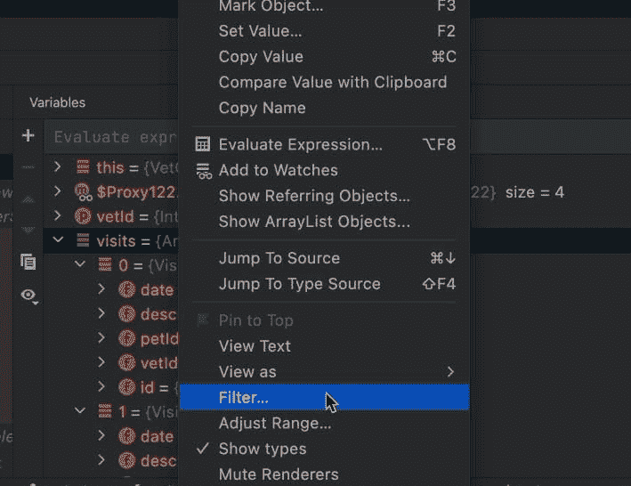
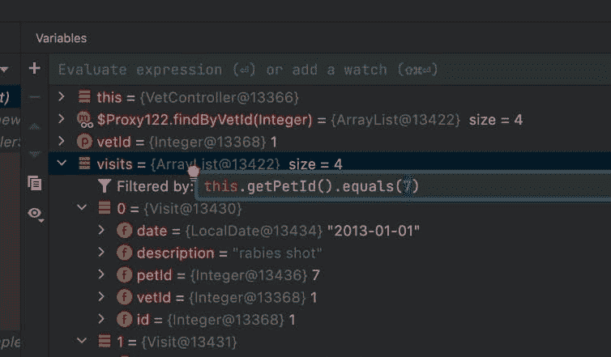
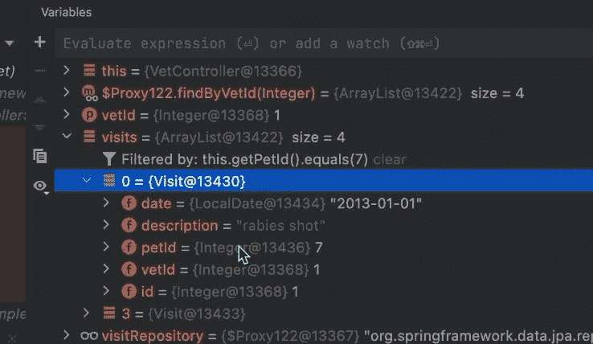
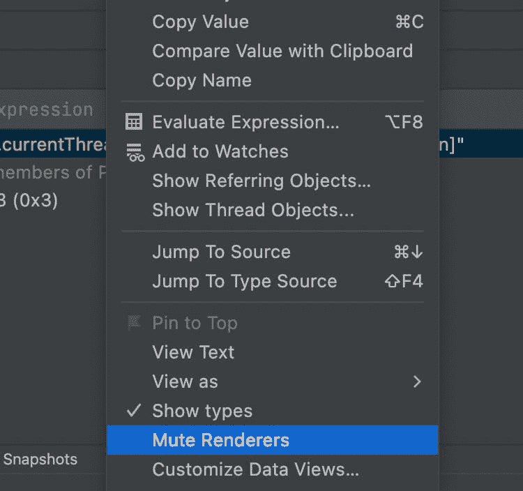
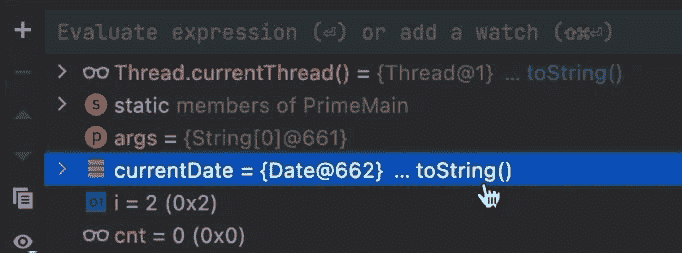
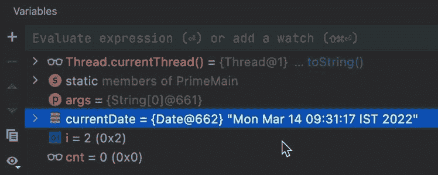
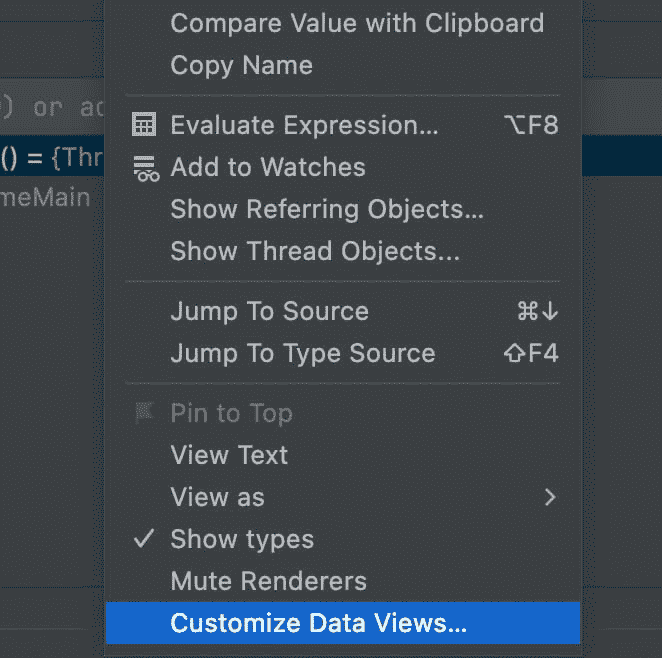
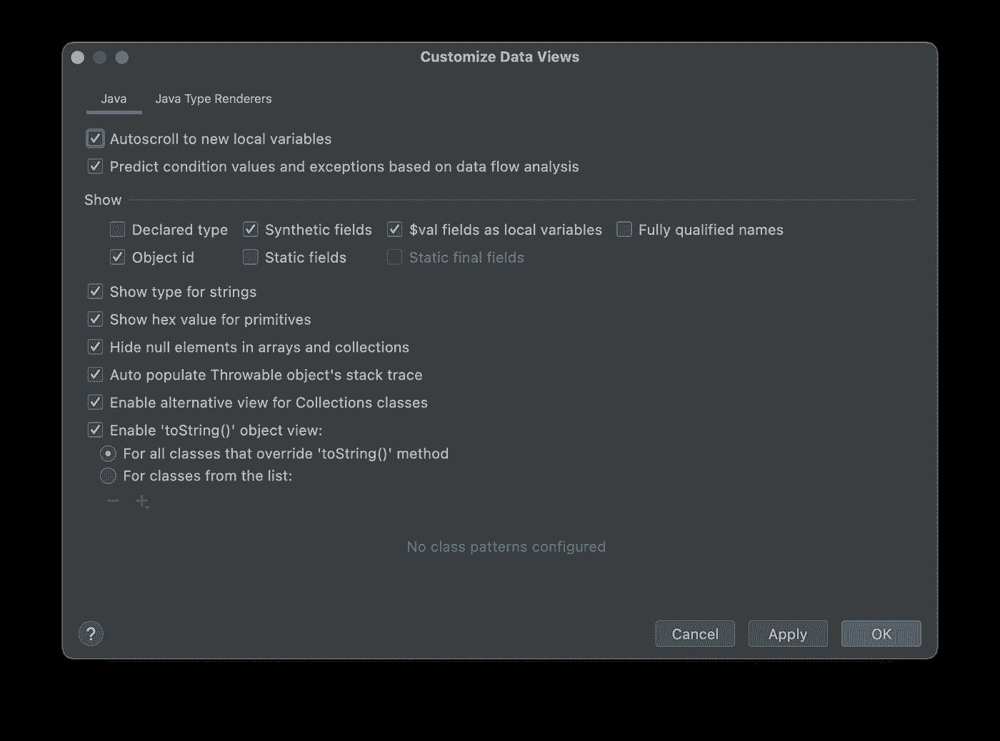
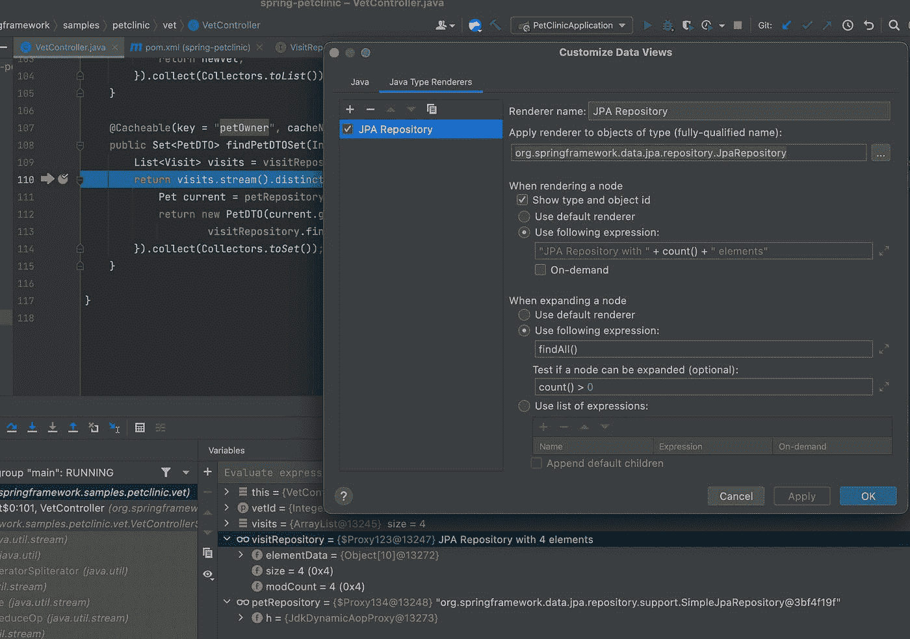

# 调试集合、流和观察渲染器

> 原文：<https://medium.com/javarevisited/debugging-collections-streams-and-watch-renderers-f463078de871?source=collection_archive---------2----------------------->


在最后两只小鸭子中，我结束了对断点的广泛讨论，将焦点切换到了观察区。在这本书里，我们有几个惊人的、鲜为人知的工具，让我们深入了解我们正在运行的应用程序。对于许多应用程序来说，一眼就能看出某些东西是否正常工作是至关重要的。

这对集合和数组非常重要。我们可以在一个集合中包含数千或数百万个元素。[调试](https://javarevisited.blogspot.com/2011/02/how-to-setup-remote-debugging-in.html)没有一些基本的工具这是非常困难的。

# 集合、数组和流

调试收藏([列表](https://www.java67.com/2013/01/difference-between-set-list-and-map-in-java.html)、[地图](https://javarevisited.blogspot.com/2015/08/difference-between-HashMap-vs-TreeMap-vs-LinkedHashMap-Java.html)等。)和[数组](https://www.java67.com/2022/03/10-examples-of-arraylist-in-java.html)是痛苦的。您需要在结果中挖掘，或者在 for 循环中放置条件断点。那都是痛苦的。有更好的解决方案…

# 过滤收藏

几周前我谈到了一种不同类型的过滤器，所以请不要混淆这两者。有许多过滤器类型。在这里，它们适用于集合和数组。

这是默认情况下实际上开启的一个小功能。然而，大多数开发人员甚至没有注意到这一点。当您展开对象数组时，您可能已经注意到 IDE 隐藏了空值。这是一个默认打开的过滤器，你也可以添加你自己的…

[](https://javarevisited.blogspot.com/2018/09/top-5-courses-to-learn-intellij-idea-java-and-android-development.html)

我们可以从在观察器中选择一个数组或集合并右键单击它开始。然后点击“过滤”选项。

[](https://javarevisited.blogspot.com/2011/07/java-debugging-tutorial-example-tips.html#axzz6bYzaddcE)

然后我们可以输入任何我们想要的条件，其中“this”代表当前元素。当我们按 enter 键时，过滤器将被应用，我们将只看到适用的元素。注意，在这种情况下，我使用方法调用及其结果作为过滤器的一部分。

[](https://www.java67.com/2016/09/java-8-streampeek-example.html)

这里我们看到了过滤器的作用。我们可以按旁边的“清除”按钮来清除它。我们也可以通过点击来编辑它。

# 流调试器

虽然我经常使用 [Java 8 stream API](/javarevisited/8-best-lambdas-stream-and-functional-programming-courses-for-java-developers-3d1836a97a1d) ，但在大多数情况下，我还是更喜欢旧的 for 循环。这样做的原因是调试。循环天生就更容易调试。这并不意味着我们不能调试流，但它往往更具挑战性，需要更多的摆动。

JetBrains 理解这个问题并引入了**流调试器，**最初是作为一个插件，现在是作为 IDE 中的一个内置工具。当当前断点在流上停止时，您可以看到启动流调试器的按钮。

[](https://javarevisited.blogspot.com/2018/08/top-5-java-8-courses-to-learn-online.html)

当您按下此按钮时，将启动流调试器。这是一个工具，观看视频可能会更好地解释它，但我会尝试…

[](https://javarevisited.blogspot.com/2020/04/top-5-courses-to-learn-java-collections-and-streams.html)

这个工具将每个流函数表示为一个阶段。您可以在各个阶段之间来回切换，查看一个阶段中的元素如何映射到下一个阶段中的对应元素。例如，[映射操作](https://www.java67.com/2015/01/java-8-map-function-examples.html)可以将元素的类型转换成新的类型。因此您会看到映射前的元素和指向 post 映射实例的箭头。

请注意，所有元素都是“活动”的，您可以像在手表中进行正常检查一样检查所有元素。

# 渲染器

我们通常会在观察区域查看元素，而不会过多考虑。这就是“对象”或数据…

但是我们看到的是渲染器解释数据的方式。Java 中呈现的默认行为是调用`[toString()](https://javarevisited.blogspot.com/2012/12/3-example-to-print-array-values-in-java.html)`方法。因此，虽然自定义这有所帮助，但一个好的渲染器还可以完成更多的工作…

事实上，下周的《小鸭》将会更深入地探讨这个主题。

# 禁用渲染器以加快调试速度

不就是讨厌无响应调试吗？

按下步骤然后永远等待某事发生是非常令人沮丧的。

调试器运行缓慢有许多原因。其中一些与我们正在调试的应用程序有关，但是相当多的与我们打开/关闭的特性有关。渲染器属于这一类。当我们有许多手表元素或者渲染它们的过程很慢时，它们会非常昂贵。

[](https://javarevisited.blogspot.com/2020/05/top-5-courses-to-learn-eclipse-ide-for-java-developers.html)

幸运的是，JetBrains 提供了一个简单的解决方法:静音渲染器。您可以通过右键单击监视区域来启用它。



一旦我们禁用了渲染器，它们就会显示为一个简短的渲染形式。只有按钮旁边的对象 ID。点击这个条目会自动延迟渲染。在这种情况下，呈现将只调用`[toString()](http://javarevisited.blogspot.sg/2012/09/override-tostring-method-java-tips-example-code.html#axzz54v9Z26qM)`方法，如此处所示。

[](https://javarevisited.blogspot.com/2010/10/improving-performance-of-application-in.html)

单击后，我们可以在渲染器中看到正确的值，并且可以只检查该值的结果。其他值可能仍然是“未呈现的”。

# 渲染器定制

对许多事情来说，它是伟大的，但是它可能不代表我们想要了解的关于一个物体的信息。尤其是第三方对象，在这种情况下，我们无法控制性能成为问题的`toString()`实现。`toString()`必须高效，因为我们可能会在生产中记录对象时使用它。我们不能用过多的数据。



“自定义数据视图…”菜单项启动渲染器自定义菜单。这是一个非常强大的功能，让我们可以控制默认渲染器中许多细微的功能。



该对话框中有许多选项，允许您自定义元素在手表中的呈现方式。我最喜欢的选项之一是显示整数的十六进制值，这对于我做的一些低级工作非常有用。

在这里，您可以取消选中隐藏数组和集合中的空元素选项，我们在上面的过滤器一节中讨论过。您还可以将`toString()`行为限制在特定的对象上。

# 类型渲染器

对于简单的情况，`toString()`确实很有效。但是在一些复杂的情况下，我们影响渲染逻辑的能力会产生很大的不同。恰当的例子是，pring 引导 JPA 存储库。这些接口将底层数据库抽象为一组 CRUD 操作。详细的 toString()方法会很昂贵。它可以触发 [SQL 查询](https://javarevisited.blogspot.com/2017/02/top-6-sql-query-interview-questions-and-answers.html)，这不是我们通常想要做的事情。

但是当我们调试时，这可能非常有价值。

[](https://javarevisited.blogspot.com/2021/10/what-is-spring-data-repository.html)

首先，我们需要为渲染器选择正确的类型。请注意，您可以使用基本类型来选择适当的对象。在这种情况下，JpaRepository 是基本接口。通过使用表达式:

```
"JPA Repository with " + count() + " elements"
```

我们在被渲染的对象上有效地调用了`count()`方法。这可能会导致对底层数据库的 SQL 调用，但在常规调试期间这可能已经足够了。

请注意，我们可以选中“按需”标志，使渲染的行为类似于静音渲染器，因此它将只在单击时渲染。

对于支持扩展的元素，我们可以使用额外的表达式来获取完整的数据集。在这里，我使用`findAll()`来列出 IntelliJ 将在扩展时显示的元素。我还使用`count() > 0`来表示列表是可扩展的。

如您所见，顶部的[存储库是一个 JPA 存储库](https://www.java67.com/2021/01/spring-data-jpa-interview-questions-answers-java.html)。下面的不是。顶部的存储库一目了然，我们可以立即检查数据库中的每个元素。这是非常强大的！

请注意，上面的视频还没有覆盖这里的最后一部分。我没时间了。下周的视频将涵盖这一点和一个额外的有趣的渲染器功能。

# 摘要

在腕表中显示正确的信息至关重要。我们瞬间就能感受到发生了什么！

调试可以在愚蠢的事情上失败:

*   信息太多
*   信息太少
*   我们需要挖掘深层层次结构来寻找的信息

我们可以用我上面讨论的技术解决这些问题。如果您的观察部分井然有序，那么您的调试会话将变得更加流畅。

在下一期文章中，我将教你如何让整个团队的调试会话更加流畅…