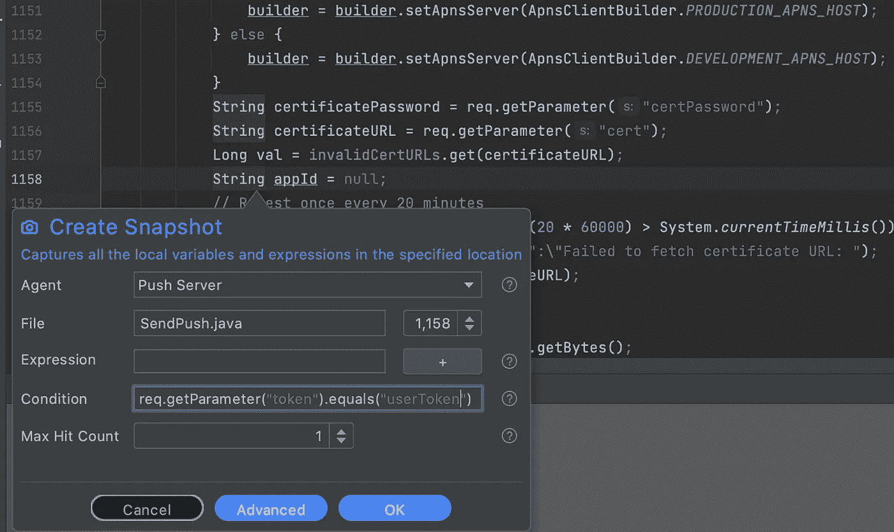
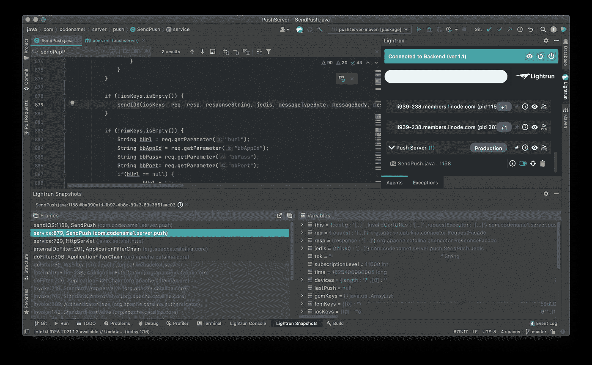
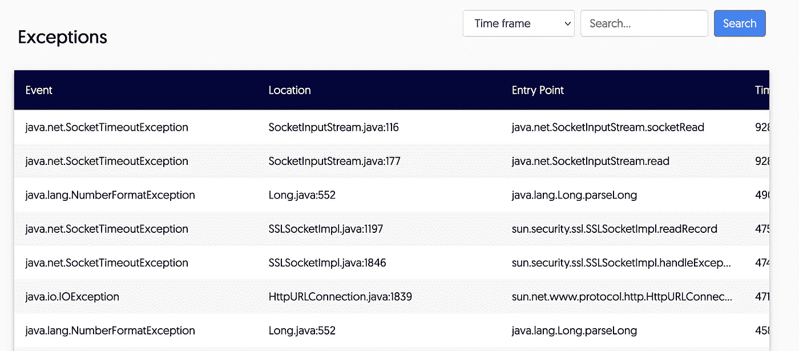
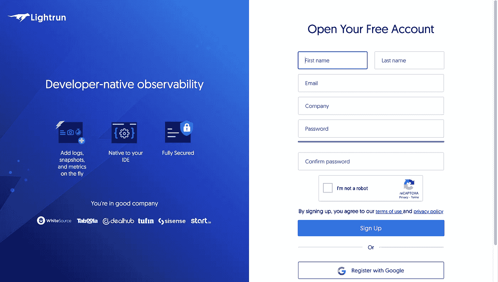
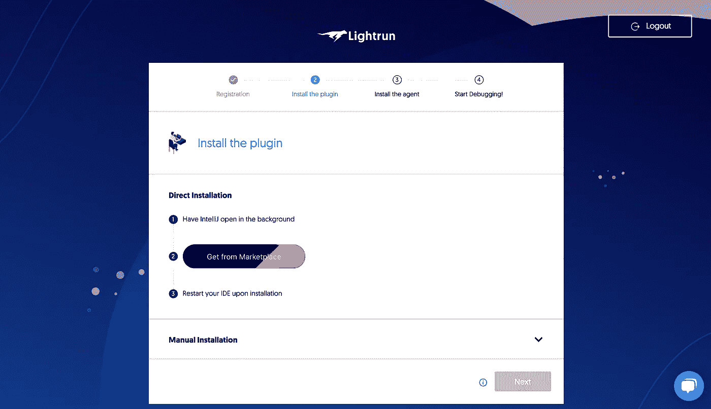
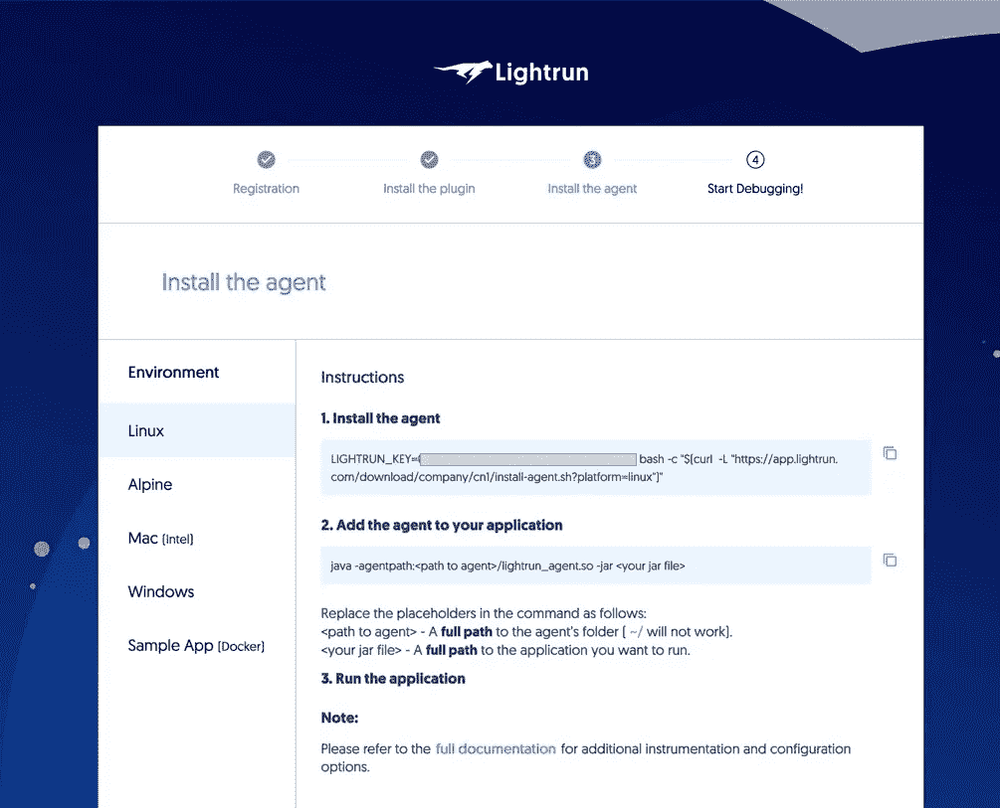

# 生产中的调试——如何快速运行而不损坏东西

> 原文：<https://medium.com/javarevisited/debugging-in-production-how-to-move-fast-without-breaking-things-46cc2eda36b6?source=collection_archive---------1----------------------->

马克·扎克伯格有一句著名的俏皮话，他说脸书遵循“快速行动，打破常规”的座右铭。我们可以编写世界上所有的单元测试，拥有最大的 QA 管道，但是仍然会有 bug 溜进产品中。这只是他选择庆祝的生活事实。

当处理一个极其复杂的系统时，正如我们在 [Codename One](https://www.codenameone.com) 中所做的，这可能是发布一个更新和什么都不做的区别。

如果你是视觉学习者，看看下面的视频:

使用 Lightrun 调试服务器

# 灾难来袭

当我们在生产中遇到问题时，这种方法的问题就变得很明显。通常情况下，一个通过测试、QA 和测试的 bug 不会太可怕……但是因为它只是一个产品级的 bug，所以你经常会面临两种选择:

*   恢复—这可能不是所有情况下的选项
*   找到/实施解决方案

请注意，我省略了“在本地复制它”。对于在“真实世界”条件下在单独的数据库上工作的生产 bug 来说，这通常不是一个选项。在我们的例子中，本地调试非常困难，因为有多个独立的服务器相互传递任务。

第二种选择通常是最好的，但它包含了巨大的风险:如果修复失败了怎么办？

由于生产部署通常是一个缓慢的过程，需要一个 QA 周期，这使得问题更加复杂。你做了一个修复，然后不得不等待几个小时，才发现你错了…这曾经是我们。

# 输入 Lightrun

几年前，我遇到了两位年轻的创始人，他们有一个解决这个问题的想法。本质上，它是一种新的调试器，与常规调试器有很大不同。

这样做的要点是，你的应用程序一直在生产调试模式下运行，开销几乎不明显。安全代理将应用程序连接到云，并让您以特殊的方式进行调试。

例如，不是[断点](https://javarevisited.blogspot.com/2011/07/java-debugging-tutorial-example-tips.html#axzz6bYzaddcE)，而是快照。它们不会“断裂”。它们为您提供给定时间的线程和变量状态的堆栈跟踪。您还可以注入日志语句、计算执行次数，甚至对方法或代码块进行简单的分析。

这个想法给我留下了深刻的印象，以至于我决定加入这个团队，现在身兼两职(分别在[代号一](https://www.codenameone.com/)和 [Lightrun](https://www.lightrun.com/) )。最酷的事情是，由于有了 [Lightrun](https://www.lightrun.com/) ，我在[代号一](https://www.codenameone.com/)的工作现在轻松多了。

# 生产中的错误…

我在[代号一](https://www.codenameone.com/)的工作 90%是灭火。订户写信给我们的支持部门，抱怨构建或推送服务器等的失败。这在过去很难调试。我们会花几个小时阅读巨大的日志和猜测

然后我们会部署额外的日志，要求用户发送一个新的构建，然后重读日志，找出到底哪里出错了。有些猜测总是存在的，但有了 Lightrun，整个过程几乎是即时的。

使用 Lightrun，我们只需设置一个条件快照，例如

调试推送中的故障

在上面的例子中，我可以在特定用户发送推送时抓取快照。这是一个[条件断点](https://javarevisited.blogspot.com/2011/02/how-to-setup-remote-debugging-in.html)，在本地调试时是一个有用的工具。这是生产调试时不可或缺的工具。我们只想看到与特定用户相关的信息，而不是所有用户…

当快照命中时，我们最终会得到一个类似这样的堆栈跟踪(我在图像中涂黑了私有信息)。

快照堆栈

请注意，快照看起来就像一个常规断点。它不见了线，你不能跨过去。但是您可以遍历堆栈并检查字段/变量等的值。当应用程序还在运行的时候…
非常有用！

您可以添加多个快照，甚至在遇到特定行时注入日志来打印信息，而不是跳过。包括“值为{obj.getValue()}”等简单表达式。

我立即想到的是“这不会很贵吗？”。

它不是。如果我们有一个非常复杂/昂贵的表达式，每秒打印太多或使用有问题的(例如递归)逻辑，Lightrun 足够智能地限制自己，因此表达式不会占用太多 CPU。它保护你不搬起石头砸自己的脚...

因此，没有明显的性能开销，您可以无忧无虑地工作。但是我离题了，让我们回到上面的推送服务器的例子。

# 意外错误

当我开始这篇文章时，我想重现一个用户问题的调试会话，但当我抓取会话的截图时，我注意到堆栈中有些奇怪的东西。“subscriptionLevel”的值是乱码。它太大了。

原来我们在发送推送消息时读取用户订阅级别时有一个 bug。这意味着在我们的推送服务器中根本没有应用配额和速率限制！

我敢肯定，由于这个 bug，我们损失了收入，订阅过期的用户仍然可以毫无问题地大量发送推送消息。啊！

这是 Lightrun 最酷的好处之一，它让你清楚地看到正在运行的系统，并验证你的期望。

# 预期的用户问题

我调试的真正问题与上面那行有关。用户停止接收 iOS 推送信息。我只是用他的令牌放了一个快照(即断点),然后检查发送到推送服务器的值。

然后，我可以看到推送证书的 URL，并可以立即验证它是否过期。这比本地调试更容易做到！

# 更深的管道

用户问题非常重要，但是没有人意识到的问题可能更重要…

异常监控

Lightrun 还提供了一种检测异常(被捕获或未被捕获)的方法。我们可以定期检查堆栈跟踪，看看是否有我们没有检测到的错误。这不是 Lightrun 独有的特性，但是它非常适合，因为您可以轻松地跟踪您在堆栈跟踪中看到的问题。

# 韵律学

Lightrun 还包括计数器、tictocs 和方法持续时间测量等指标。这对于生产中的微基准测试非常有用，但是在 Codename One 中我们不需要这么多。我们的后端相对简单，这些从来没有出现过。

# 安装 Lightrun

所以，肯定有不好的一面，对吗？

在 IDE 中安装插件并注册非常容易…但是代理设置仍然具有挑战性。我花了很多时间试图让它在我们所有的服务器上工作。不可否认，Codename One 架构相当复杂，充满了许多遗留和预部署选择。为一点工作做好准备。这可能是微不足道的，但你可能需要一些帮助，从网上聊天支持渠道(这是超级响应)…

app.lightrun.com 的注册页面

一旦你在[https://app.lightrun.com/](https://app.lightrun.com/)注册，你会得到一个向导来验证你是否正确地执行了这些步骤:

安装插件并登录

要通过第一步，你需要安装来自 https://plugins.jetbrains.com/plugin/16477-lightrun[市场的 IntelliJ 插件。然后，您需要重新启动 IDE，打开右侧的 Lightrun 工具窗口，并按登录按钮。](https://plugins.jetbrains.com/plugin/16477-lightrun)

登录后，向导中的“下一步”按钮将变为启用状态，您可以进入代理安装步骤。这是最难的部分…

代理安装说明，注意我删除了私人信息

代理通常安装在服务器上，而不是本地计算机上。所以当我到达这个页面时，选择了“Mac”。我必须显式地选择 Linux 页面，并复制在 Linux 机器上安装代理的脚本。

下一步是 SSH 到机器并运行脚本。它创建了一个“代理”目录，我们将在绑定代理时使用它。其要点是，我们需要将“-agentpath”参数添加到 [JVM](/javarevisited/7-best-courses-to-learn-jvm-garbage-collection-and-performance-tuning-for-experienced-java-331705180686) 中。如果您的部署在某个时候有“java”命令调用，这是非常简单的，但是如果您作为服务或在容器中运行，这可能就不那么简单了。

一旦你这样做，“下一步”选项将被启用，你将能够使用 Lightrun。

但是还有更复杂的情况，我会推荐在这里查看列表。

一个例子是我们用于推送的旧的 Tomcat 服务器。我不得不编辑 catalina.sh 并添加如下内容:

注意“— lightrun_extra_class_path”这个额外的选项(这是两个减号)，我们用它来显式地声明类路径。如果没有正确地自动检测，您可能需要它。

这让代理运行，但我的堆栈跟踪中没有变量…结果我不得不在打开完整调试选项(-g)的情况下重新编译代码。这在 [Maven](/javarevisited/6-best-maven-courses-for-beginners-in-2020-23ea3cba89) 中有点挑战。解决方案是添加这些属性:

您可以使用如下命令测试-g 是否缺失:

如果不打印任何东西，那么这个类就不包含调试信息。

同样，这是一个复杂的过程。我强烈建议在经历过程中寻求支持。

# TL；速度三角形定位法(dead reckoning)

我们不急于投入生产的原因是解决生产问题的过程冗长而缓慢。但这造成了一个过于复杂的多分支支持结构，最终使事情变得更糟。

如果我们可以在生产中快速调试并立即修复，我们的整体稳定性会增加，同时保持较低的开销。IMO 今天在没有调试工具的情况下部署服务器类似于在没有 IDE 的情况下编码。你可以这样做，但你错过了我们领域的现代进步。

多亏了 Lightrun，在 Codename One，我们的用户支持任务得到了更快、更有效的解决。