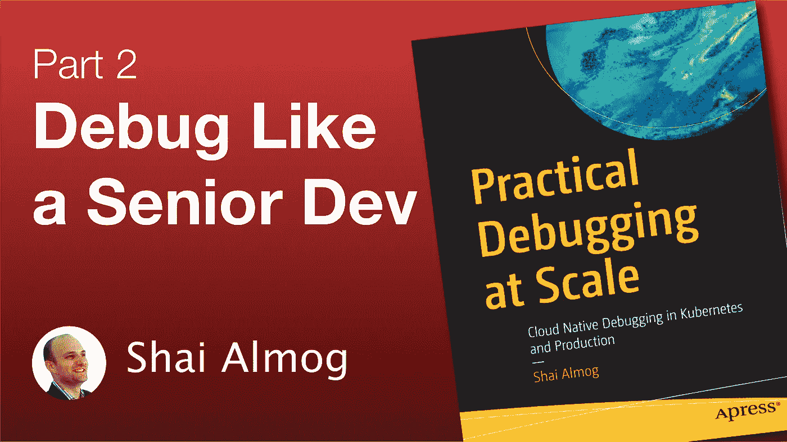

# 调试程序控制流

> 原文：<https://medium.com/javarevisited/debugging-program-control-flow-86c42c738e36?source=collection_archive---------10----------------------->

到目前为止，我已经发布了课程的前 3 个视频，明天将发布第四个。我计划每周在 YouTube 上发布两个视频，以最大限度地扩大影响，但为了避免过度饱和，这里我每周只写一节课。我拍摄了大约 4 个小时的视频内容，但仍未完成八个模块中的第二个模块。这门课程将会非常详细和密集。

我现在正在开发课程平台，进展不错，希望能尽快发布[这里](https://course.debugagent.com/)。当你读到这篇文章的时候，它可能已经在直播了！

对我来说，课程平台的用户体验令人满意很重要。所以我尽量避免 DRM。希望人们会尊重这一点以及我为此付出的努力。我正在用 GraalVM 在 [Spring Boot 3](https://javarevisited.blogspot.com/2018/05/top-5-courses-to-learn-spring-boot-in.html) 上构建课程平台，所以它将非常精简、快速和简单。我计划把这些视频放在 YouTube 上，作为未公开的视频，给人一种像样的观看体验。这意味着开发者可能会背叛我的信任，分享未公开的视频。我希望他们不会。

我在这里的理由是低开销和出色的性能。我也想在几年后让课程免费。通过使用 YouTube，我可以通过公开视频使课程免费。

以下视频讨论[调试](https://javarevisited.blogspot.com/2022/09/java-debugging-interview-questions.html)中的控制流程。这是从基础开始的，但是对于跳转到线、强制返回等来说会变得很深。这些工具可以极大地改变我们调试代码的方式。

别忘了看看我的[书](https://www.amazon.com/dp/1484290410/)，订阅 [YouTube 频道](https://www.youtube.com/@debugagent)未来视频！

# 副本

欢迎回到大规模调试的第二部分，在这里您可以学习调试的秘密技巧。

在本节中，我们将讨论[调试](https://www.java67.com/2018/01/how-to-remote-debug-java-application-in-Eclipse.html)的最基本方面。我们遇到了一个断点。现在怎么办？

嗯，这就是调试器让我们控制流程的地方，以研究在受控环境中一切是如何工作的。

那么今天的议程是什么？

我们将讨论单步执行并进入代码，我希望这个列表的大部分内容对你来说都是熟悉的。我们中断控制流的最后两项可能对您来说并不熟悉。我很肯定你们大多数人不熟悉议事日程上的最后一项。我哪里知道？敬请关注，一探究竟！

# 跨过去，进去，出来，用力

单步执行是控制流的最基本形式。我们让代码行中的代码执行，然后我们可以在变量窗格中检查结果。很简单也很容易。

在这种情况下，我只是按下这里的按钮几次，但我也可以只按下 F8 得到同样的效果…

接下来我们将讨论两个不同的操作，步入和相关的步出。单步执行进入我们调用的方法。请注意，如果没有进入的方法，则进入的行为将类似于单步执行。

我们有两个分步操作。常规步骤和力步骤通常以相同的方式进行。当我们想要进入 IntelliJ 通常会跳过的 API 时，我们需要 force 版本。我们可以敦促 F7 采取措施。我们可以按 Shift F7 来强制进入。

当我们看完一个方法而不关心其余的时候，我们就可以退出了。这将执行该方法的其余部分并返回。请注意，如果我们在返回之前有一个断点，它仍然会在断点处停止，就像我们在本例中看到的那样。我们可以按这个按钮退出，或者按 shift-F8 也可以。

# 继续并运行到光标处

Continue 继续执行项目，直到再次命中断点。这也叫简历。这是一个我们经常使用的简单功能。您可以按下特殊版本的播放按钮继续。快捷键也很有用，因为我们经常使用它，它是 F9。

运行到光标处让我们跳过不感兴趣的行，到达重要的代码。我们可以在那一行设置一个断点来获得相同的效果，但是这有时更方便，因为它消除了设置和取消设置断点的需要。我们可以按这个按钮运行到光标处，或者我们可以使用 ALT-F9 作为这个特性的快捷键。

# 强制返回并引发异常

这个特性在 IntelliJ/IDEA 中称为强制返回。

要查看强制返回选项，我们右键单击堆栈跟踪，可以看到一组选项。一个更有趣的选项是丢帧，我将很快展示它。注意 throw exception 选项，它与 force return 相同，但是它从方法中抛出一个异常。一旦我点击了这个选项。

我看到一个对话框，要求输入该方法的返回值。这让我可以更改从该方法返回的值，这在我想调试一个难以重现的 bug 时非常有用。想象一个案例，一个客户发生了故障，但是你无法重现。在这种情况下，我可以通过从该方法返回不同的值来模拟客户可能遇到的情况。

这里的值是一个布尔变量，所以很简单。但是您的代码可能会返回一个对象，使用这种技术，您可以用任意值替换该对象。一个很好的例子是 null，如果这个方法返回 null，它会重现我的用户正在经历的问题吗？

类似地，抛出异常让我们重现边缘情况，比如由于任意失败而抛出异常。

一旦我们按下 OK，我们返回不同的值。在这种情况下，我在方法的边缘，但我可以在方法的开始就这样做，并完全跳过方法的执行。这让我们可以模拟方法可能失败的情况，但是我们想要模拟它的行为。如果我们不能重现客户看到的行为，这是有意义的。我们可以用这样的工具来模拟。

# 下拉框架

Drop frame 几乎是革命性的，但它更像是一个“巧妙的技巧”。这里我错误地进入了一个方法。哎呀，我不想那样做。我想在介入之前改变一些东西…幸运的是有下降框架。我们看到我可以在右键菜单中找到它，您也可以单击此处触发它。

丢弃帧有效地丢弃堆栈帧。这是一个撤销操作。但事实并非如此。它不能撤销在我们进入的方法中发生的状态更改。所以如果你进入了这个方法，不在堆栈上的变量被改变了，它们将保持不变。

堆栈上的变量是方法声明或接受为参数的变量，这些变量将被重置。然而，如果这些变量中的一个指向一个对象，那么这个对象驻留在堆中，那里的改变不能通过展开堆栈来重置。

这仍然是一个非常有用的特性，类似于强制返回，只是它将返回到当前行而不是下一行。所以它不会返回值。

这比那更好！

# 跳转到行

跳转到行是 IntelliJ 的一个秘密特性。它可以工作，但是开发者并不知道。你需要安装跳转到行插件来使用它。由于它的安装数量相对较低，我认为人们只是不知道它的存在。因为这是一个必须要有的插件。它将改变你调试的方式！

通过跳转到行，我们可以将当前指令指针移动到方法中的不同位置。我们可以拖动左边的箭头，将执行带到一个新的位置。注意，这是双向的，我可以前后移动当前的执行。

这并不执行中间的代码，而是将当前指令移动到一个新的位置。太酷了，我还得再放一遍…

如果你看到一个 bug，只要把执行拖回来，重现就行了。您可以更改变量值并一遍又一遍地重现问题，直到您完全理解为止。

我们可以跳过失败的代码，等等。这太壮观了。我不需要重新编译代码。如果你曾经有过这样的情况，你不小心跨过了一条线。那不是我想要的。然后停止调试器，从头开始。这是给你的插件。每个人都是这样！

我们可以把死刑推迟，重新来过。简直太棒了！

# 最后

在下一段视频中，我们将简要讨论这款腕表。我们将在系列的第六个视频中对此进行更深入的探讨。敬请关注！

如果您有任何问题，请使用评论部分。谢谢大家！