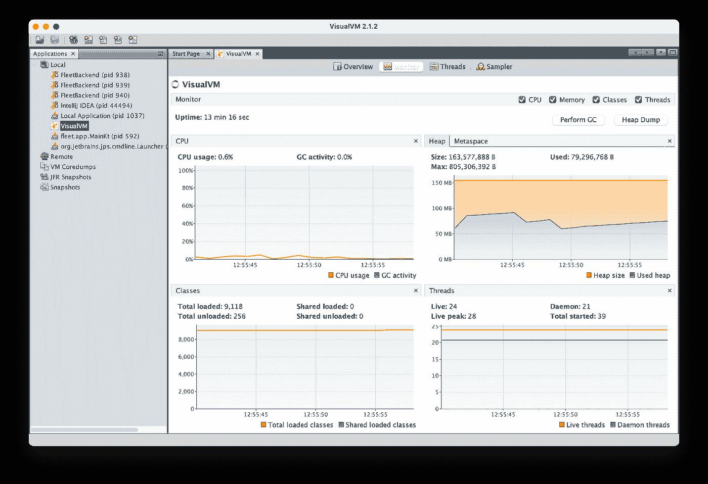
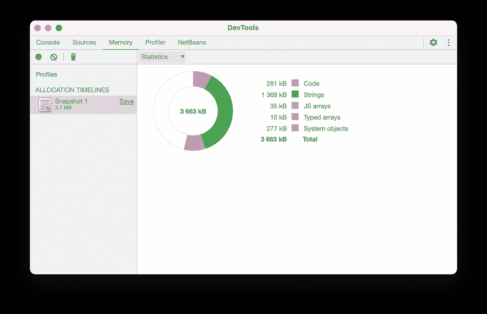
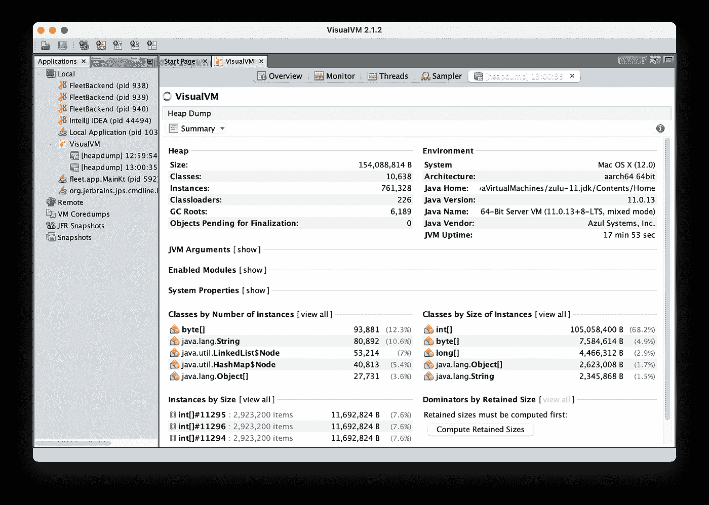
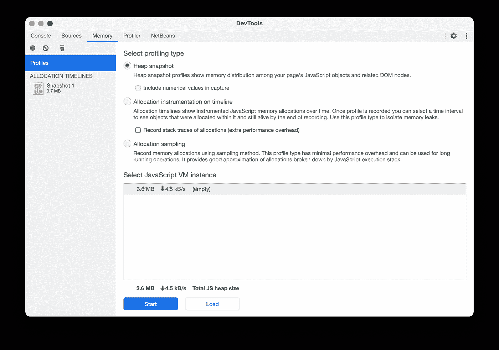
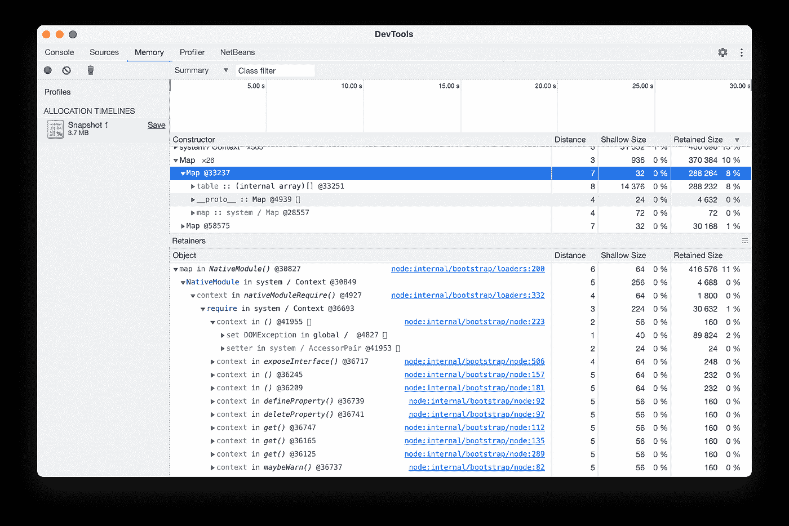

# 调试 RAM:检测/修复托管语言中的内存泄漏—堆深度探讨，第 2 部分

> 原文：<https://medium.com/javarevisited/debugging-ram-detect-fix-memory-leaks-in-managed-languages-heap-deep-dive-part-2-33a745e0415e?source=collection_archive---------4----------------------->


在[上一期](https://talktotheduck.dev/debugging-ram-java-garbage-collection-java-heap-deep-dive-part-1)中，我谈到了 Java 垃圾收集器。在这一部分，我将讨论最常见的内存问题:内存泄漏。我主要关注托管语言，特别是 Java，但是我会提到一些有趣的本地代码工具。内存泄漏会增加堆的大小，这在大多数情况下并不是最紧迫的问题。但是如果不管它，内存使用会成为一个问题，到那时，发现问题就很难了。与崩溃转储不同，在崩溃转储中，我们获取对特定行的引用，内存泄漏可以保持隐藏。

# 内存泄漏的后果是什么？

不幸的是，这通常意味着内存泄漏可以带入生产环境，甚至给最终用户带来问题。例如，最近关于[内存泄漏阻碍苹果最新 M1 电脑](https://www.macworld.com/article/549755/m1-macbook-app-memory-leaks-macos.html)的故事。虚拟内存实际上意味着操作系统可以在很长一段时间内存泄漏。不过，性能开销会很明显。

有了垃圾收集器，我们通常依靠自动内存管理来解决这样的内存问题。但现实生活中并非如此。通常，对于手动内存管理和引用计数的语言，这个问题更难解决。在这次讨论中，我将特别排除铁锈。我在这方面没有足够的经验来说出有价值的东西。这看起来很有趣，但是[有些复杂。](http://way-cooler.org/blog/2019/04/29/rewriting-way-cooler-in-c.html)

有一些功能强大的工具用于应用程序内存分析，但即使是这些工具也经常将数据显示为字节数组。这并没有给我们解决问题带来任何进展。在本文中，我将带您调试内存使用。我假设您在查看内存使用情况后已经知道存在泄漏。所以这里的重点是缩小范围。

# 堆 RAM 的类型

跟踪堆内存的一个问题是管理预期。您可能会认为内存分配会导致等量的内存增长，释放内存会恢复正常。情况并非总是如此。

大多数内存泄漏都发生在堆中，但也有极少数情况下，泄漏的来源可能是本机代码、PermGen 空间等。我们应该使用本地内存工具来调试本地问题。我们可以通过 JVM 标志调优其他类型的内存。您通常可以通过查看内存不足错误消息来检测内存泄漏的来源。以下是常见的类型:

*   PermGen 空间——这在较旧的 JVM 中很常见，尤其是在处理大量字节码操作的工具中。由于动态永久空间的存在，现在这种情况已经不常见了
*   Java 堆空间/请求的数组大小超过虚拟机限制/交换空间不足？等等——这可能意味着泄漏发生在您的代码或第三方库中。但是它是用 Java 代码编写的，这是个好消息！
*   如果堆栈指向本机方法，这可能与本机方法泄漏有关

注意这是不准确的，因为本机内存的泄漏会耗尽 Java 堆，反之亦然。我们需要两者都检查，但这会让我们知道从哪里开始…

# 你的工具箱

有许多用于跟踪/修复内存泄漏的分析工具。不可能对哪怕是一小部分可用的丰富内容进行适当的回顾。我甚至不会去研究现有的一小部分。相反，我将重点介绍两个工具:VisualVM 和 Chrome DevTools(重点介绍 Node)。

VisualVM 允许我们查看正在运行的应用程序，以获得内存使用情况的快照。Chrome DevTools 是一个更通用的调试器，包括面向 JavaScript 开发人员的厨房水槽。它可以连接到正在运行的节点应用程序并调试它们。我不会讨论:

*   Java 飞行记录器(JFR)和任务控制——这些工具实际上是 VisualVM 的替代工具。但是它们并不方便。是的，它们可以检测频繁的垃圾收集等。但是它们对于细粒度调试来说并不理想。飞行记录器也有问题的许可问题。如果你想用那个来代替，看看[的这篇文章](https://ashishtechmill.com/monitoring-spring-boot-applications-part-1)，作者[阿希什·乔杜里](https://twitter.com/iASHeeesh)。
*   Yourkit Profiler、Eclipse MAT、NetBeans Profiler、Parasoft Insure++等。—这些都是很好的工具，可以帮助我们更深入地挖掘，但它们需要的是产品评论，而不是技术文章
*   leak canary——还有其他移动工具，但我想再次强调一下通用后端
*   valgrind——这是一个有趣的本地工具，用于调试 Linux 中的内存泄漏
*   [CRT 库](https://docs.microsoft.com/en-us/visualstudio/debugger/finding-memory-leaks-using-the-crt-library?view=vs-2022) —微软为 visual studio 提供了一些很棒的原语
*   一些静态分析工具如 SonarCloud 或 FindBugs 可以检测泄漏。这不会检测到所有的泄漏，但它们可以指出一些有问题的情况

# VisualVM

你可以在这里获得 VisualVM [。安装完成后，您可以启动 VisualVM，并将其连接到我们正在运行的应用程序来查看这个过程。](https://visualvm.github.io/)



在上图中，VisualVM 正在自我监控，这是相当元的。您可以执行手动垃圾收集，这对于了解泄漏的大小非常重要。堆图为您提供了一段时间内存量和趋势的鸟瞰图。

# Chrome 开发工具

如果你使用 Chrome 做前端工作，你肯定会遇到集成到 Chrome 中的“除了厨房水槽之外的一切”调试工具。就个人而言，我更喜欢 Firefox 的同类产品。它们可以非常无缝地连接到 Node，在那里它们可以提供许多标准的调试功能，比如快照。



# 如何检测泄漏？

当你看到内存增长而没有看到它收缩回来时，泄漏是非常明显的。但是你怎么能确定泄露的来源呢？

对此有几种策略。在 Java 中，理论上你可以像这样做一个积极的泄漏测试:

```
void leakUnitTest() {
    performRiskyOperation();
    System.gc();
    Thread.sleep(1000);
    Runtime r = Runtime.getRuntime();
    long free = r.freeMemory();
    for(int iter = 0 ; iter < 100 ; iter++) {
        performRiskyOperation();
    }
    System.gc();
    Thread.sleep(1000);
    assertThat(Math.abs(r.freeMemory() - free) < validThreshold);
}
```

这里发生了很多事情，所以让我们逐个检查一下:

*   我在开始之前运行一次有风险的操作——这很重要。静态代码和变量初始化会占用 RAM，但不会泄漏
*   我显式运行 System.gc()。这不是所有语言都有的选项，通常也不推荐使用。但是它“有效”
*   即使是显式 GC 也可能有异步元素，所以休眠是正常的
*   我运行测试 100 次，以确保一个小的泄漏没有增加
*   我有一个有效值的阈值。垃圾收集员并不完美。我们需要接受一些元素可能需要一段时间来收集。Java API 有许多内置的静态上下文(例如原始对象中的池)，这些静态上下文会导致不可避免的少量内存增加。不过这个数字不应该太大

另一个重要的注意事项是在运行这个测试时使用一个简单的垃圾收集器(一个很好的实践)。我推荐阅读我关于这个主题的前一篇文章。

问题是门槛。它有效地消除了测试的许多好处，但不幸的是没有办法绕过它。

让我们来看看一种不太“自动化”的方法来检测泄漏。理想情况下，这是平台在未来更容易解决的问题。

我们可以在重现问题时使用 VisualVM 检测泄漏。按下垃圾收集器按钮，注意内存使用情况。这会将您带到一个点，在这个点上，图形会根据您采取的特定操作而缓慢增长。一旦你有了它，你就可以把它缩小到一个方法和一个测试用例。

# RAM 是否周期性增加？

如果你什么都没做，而 RAM 却被吃掉了呢？

从来都不是这样。后台正在发生一些事情，这个后台进程导致了问题。那其实是一件极好的事情。这意味着您可以隔离这个后台进程并只调试它。

# 比较快照以查找对象类型

我们的武器库中最重要的工具是堆转储。在 VisualVM 中，您可以通过按下右上角的按钮来获取转储。看起来是这样的:



在底部，您可以看到按实例数量、实例大小排序的类。这有助于缩小内存泄漏。去倒两杯。然后比较某个特定类占用的 RAM，判断这个类是否可以是泄漏的那个。

使用 Chrome DevTools，您可以使用主用户界面抓取快照:



然后，您可以使用查看、排序和过滤快照中的结果对象:



这与 VisualVM 或几乎任何监控工具中的过程非常相似。您可以缩小引用范围，甚至可以看到与代码中特定分配相匹配的堆栈。

您还可以利用 verbose GC(NodeJS 中的 trace GC)来查看所收集对象的详细信息。我经常觉得这有点像用消防水管喝水。用这样的输出调试一个简单的应用程序都非常困难。但是如果你正在寻找一些非常具体的东西，它可能是有用的。

# 常见的内存泄漏类型

托管平台中的泄漏实际上是对不再需要的元素的引用。有许多这样的例子，但它们都归结为丢弃所述参考文献。最常见的问题是缓存。创建一个没有泄漏的高效缓存解决方案几乎是不可能的。

此外，静态上下文总是有风险的，因此您需要防范这种风险，并尽量将其最小化。请注意，singleton 仍然是一个静态上下文…

# 用线串

Java 字符串是被拘留的，这实际上意味着它们可以进入全局应用范围。如果解析大量数据，尽量避免使用字符串来降低内存使用量，而是使用 streams/NIO。

字符串在 NodeJS 中也会占用大量空间。实习也发生在那里，但是由于字符串和字符串对象非常不同，这个问题并不明显。

# 隐藏语义

一个很好的例子是这样的 Swing 代码:

```
new JTable(myModel);
```

开发人员经常丢弃`JTable`对象，保留模型。但是因为 MVC 在一些 UI 框架中的工作方式(比如 Swing， [Codename One](https://www.codenameone.com/) 等)。)视图将自己注册为模型的监听器。这意味着如果你保留了一个对模型的引用，那么`JTable`就不能被删除。

由于像这样的框架依赖于层次结构，这意味着包含`JTable`的窗口中的所有元素也不能被移除。

解决这个问题的方法很简单:使用调试器！

不仅仅是调试代码。而是检查第三方对象。您需要熟悉作为这些库的一部分存储的对象。

# 上下文泄漏

我提到静态是一个明显的泄漏源，但是也有其他地方触发类似的功能。Java 有效地服务于这个目的。将对象存储在诸如会话范围之类的地方会导致它的保留期远远超过它的有用性。

例如，这段伪代码可能看起来无害:

```
session.store(myUserData);
```

但是如果`myUserData`包含对全局数据或其他用户的引用，那么我们可能会在每个新会话中泄露这些用户。

更糟糕的是，这是一个安全漏洞。黑客可以开始打开会话，直到我们的服务器崩溃。无论存储在静态、线程或任何全局上下文中的是什么，都必须是平面对象或可验证的小对象。对于可伸缩性、安全性等来说，这是一个很好的实践。

# 资源泄漏

在为本文做研究时，几乎每个帖子都提到了泄漏文件资源等问题。这是另外一个问题。文件资源泄露在 20 年前对一些操作系统来说是一个问题。当前的 GC 和清理使得这些泄漏几乎无关紧要。

然而，数据库连接应该被回收到池中，泄漏它们确实是一个问题。问题是，这些泄漏不像这里提到的其他泄漏。您将遇到不同的错误，例如由于连接资源耗尽而导致的数据库连接问题。尽管有很多内存。所以我认为这篇文章不适合讨论这些。

# 如何才能防止泄密？

最理想的情况是永远不碰到问题。显然，让单元测试检查 RAM(上面有合理的规定)是有帮助的。但正如我上面提到的，他们是片状的。

总是在限制虚拟机 RAM 的同时运行单元测试，以验证没有明显的泄漏。单元测试期间的堆外崩溃是泄漏的重要标志。

在构建复杂的 API 时编写防御性代码。IntelliJ/IDEA 有一些非常复杂的代码，用于将 IDE 元素绑定到插件。这是漏洞和窃听器的主要位置。所以 JetBrains 聪明的开发人员在他们的代码中添加了日志来检测卸载时的这种泄漏。从他们的书里拿一页，预测未来的问题…如果你有一个允许开发者注册的 API，考虑一个检测漏洞的方法。在应用程序被销毁之前，打印出剩余对象的列表。有可能是漏洞！

几乎每个人都这么说，但是尽可能合理地让代码成为无状态的。这对缩放也有好处。显然，你不应该害怕会话状态。但是您应该非常熟悉会话中的每个对象。

最后，在你的应用上运行一个内存监视器。检查对象，它们有意义吗？

试着解释你在 RAM 中看到的对象的逻辑。例如，如果你的应用程序有很多`byte[]`对象，但没有使用图像或原始数据，可能会有漏洞。

# TL；速度三角形定位法(dead reckoning)

跨平台的内存分析器几乎是相同的。我们可以查看内存增长的图表，并获取当前内存状态的快照。然后，我们可以比较这些快照来缩小泄漏的大致位置。

我们不应该等待内存泄漏作为生产问题出现。我们可以首先使用一些简单的策略来避免它们:

*   创建内存泄漏单元测试——尽管这些测试并不可靠
*   在有限的 RAM 虚拟机中运行测试
*   编写在退出时记录剩余绑定对象的 API
*   尽可能编写无状态代码，并熟悉代码中确切的有状态方面。检查调试器中的有状态对象，确保它们不引用全局状态
*   定期检查应用程序的 RAM 使用情况，并尝试理解你面前的对象

谢谢你读到这里。更多信息请关注我的推特。