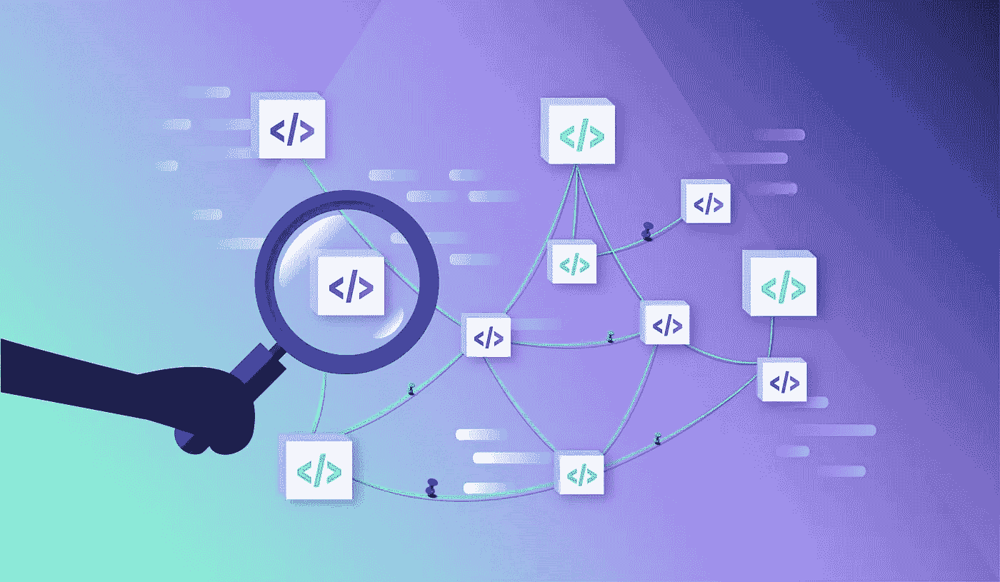
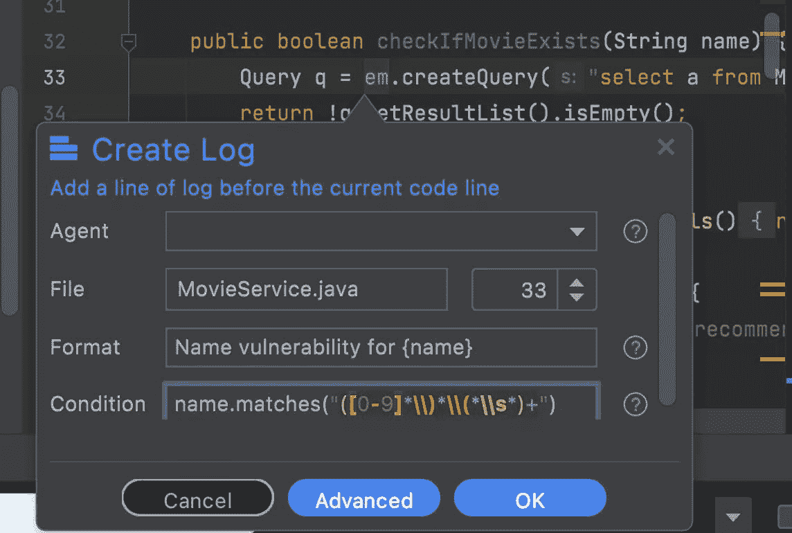
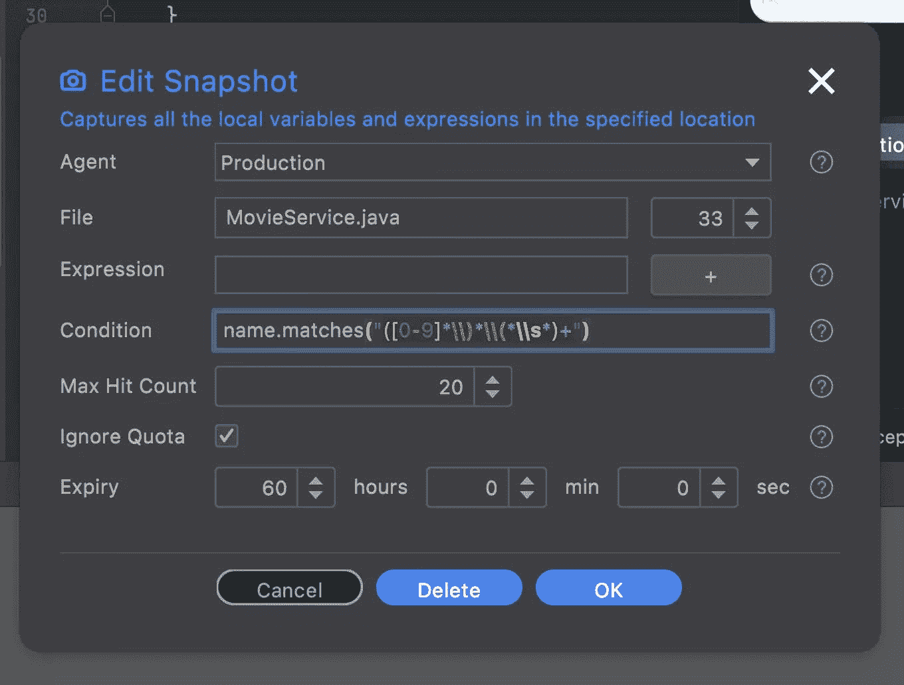

# 使用 Lightrun 检测、调查和验证安全事件和零日问题的修复

> 原文：<https://medium.com/javarevisited/detecting-investigating-and-verifying-fixes-for-security-incidents-and-zero-day-issues-using-629f82360edc?source=collection_archive---------0----------------------->

重要提示:你可以在你的服务器上免费使用[Lightrun](https://lightrun.com/free)。

我不是安全专家。我愿意把自己看作一个有安全意识的开发人员，但是这是一个有深度和广度的庞大主题。我所理解的是 [Lightrun 和调试](https://lightrun.com/debugging/remote-debugging/)。在这种情况下，我可以展示一些创造性的方法，您可以将它用作一种安全工具。一个“合适的”安全专家可以把这个提升到一个新的水平。

# 什么是 Lightrun？

Lightrun 是一个面向开发者的可观察性工具。就像您的[生产环境](https://lightrun.com/debugging/debugging-microservices-in-production-an-overview/)中的调试器，没有安全风险。Lightrun 是一个足够灵活的工具，可以适应多种模式，就像诞生它的调试器一样。

使用 Lightrun，您可以注入日志而无需更改代码。添加快照(不停止代码执行的断点)并使用度量来获得代码级别的可见洞察。

# 安全工具使用案例

我将 Lightrun 作为安全工具有几个原因。这里我就重点说说

*   验证是否存在安全漏洞
*   检查是否有人主动利用了安全漏洞
*   验证我们是否正确部署了修补程序

为了保护您的应用程序，还需要做更多的工作。Lightrun 是一个通用工具，它不能替代现有的安全工具，如 Snyk 等。它是补充性的，填补了代码级别的空白。

最后，我将讨论 Lightrun 如何保护自己。我们不能有易受攻击的安全工具…如果 Lightrun 本身不安全，我们就不能将其视为安全工具…

高层理论说够了。让我们展示代码！

# 验证安全漏洞

安全工具就像[可观察性工具](https://lightrun.com/java/full-cycle-observability-with-the-elastic-stack-and-lightrun/)。它们提供潜在风险的高级警报。但他们很少在代码层面交流。因此，开发人员可能很难完成可操作的安全任务和验证。如果安全问题在本地重现，那太好了。您通常可以使用调试器来填补空白。

但是有些安全问题很难在生产环境之外重现。

Lightrun 不会凭空发现漏洞，为此你需要一个专用的安全工具。但是，如果您有所怀疑，Lightrun 可以帮助调查并证明漏洞。

例如，让我们看看这个明显的错误:

这是一个明显的 SQL 注入 bug。但它可被利用吗？

我们需要歇斯底里，还是可以慢慢适应代码？

顺便说一句，注意我使用的是 Java，因为这是我最喜欢的平台。这同样适用于所有 Lightrun 支持的平台/语言。所以这里的一切很容易适用于 [NodeJS](https://lightrun.com/dev-tools/nodejs-security-observability-lightrun-snyk/) 、[JavaScript](/javarevisited/my-favorite-free-tutorials-and-courses-to-learn-javascript-8f4d0a71faf2)/[TypeScript](/javarevisited/7-best-courses-to-learn-typescript-in-depth-58439e1ce729)、 [Python](https://lightrun.com/debugging/lightrun-python/) 、 [Kotlin](https://lightrun.com/java/kotlin-vs-java-10-years-in/) 、 [Scala](/javarevisited/7-best-scala-frameworks-for-concurrency-web-development-and-big-data-to-learn-fbd52dbe0a9a) 等。

这对于在 Lightrun 中测试来说微不足道。我们可以只添加一个日志或快照，当一个无效的请求发生时，它就会被触发。然后，我们可以尝试通过 curl 命令发送无效值，看看我们的日志是否被触发。

请注意，我们使用正则表达式来验证名称值。如果我们收到日志，这意味着有问题的值是可利用的。这也意味着安全漏洞的风险很高。

# 是主动剥削的吗？

所以我们发现了一个类似上面的安全漏洞。我们应该恐慌吗？系统里已经有黑客了吗？

我们该怎么办？

嗯，我们可以做一些与上面类似的事情，添加一个具有类似条件的快照，并进行一些“调整”:

这张图包含了很多，我们来试着解一下。

# 为什么是快照而不是日志？

日志对于查看是否发生了什么非常有用。它们速度快，而且处理量大。但是，如果有人主动闯入我们的系统，我们希望获得所有可用的信息。甚至可能是我们从未想过的事情。我们想知道攻击的媒介，这意味着知道调用栈等等。快照是一种理想的安全工具。

## 锁定标签

请注意，“代理”入口指向“生产”。我们可以基于标记将快照应用于一组机器。因此，在这种情况下，我们可以一举锁定所有潜在易受攻击的机器。

## 最大命中次数

与日志不同，快照填满了 UI 和存储空间。因此，在快照到期之前，我们有一个默认的快照限制。这通常默认为 1。在这里，我把它提高到 20，但如果我们愿意，我们可能会更高。

请注意，如果我们看到这种情况发生，并且正在发生攻击，我们可能希望切换到日志，因为它们没有命中计数。

## 忽略配额

此选项可能对您不可用，因为它需要特殊权限。如果你遇到这种情况，请向你的经理申请许可。

这是一个有风险的特性，这也是它受到保护的原因。但是对于一个可利用的黑客来说，这可能是一个值得冒的风险。

配额限制了每个 Lightrun 操作的条件或表达式所占用的 CPU 数量。这里的风险是，漏洞可能会发生，并且由于 CPU 的使用，一些信息会被“丢弃”。这意味着快照不会在任何时候暂停，我们也不会“错过”潜在的漏洞。

尽管这可能会影响服务器性能，但也不是没有风险。

## 满期

Lightrun 操作默认为一小时到期。我们希望让您的服务器保持快速和灵活，因此我们会终止不需要的操作。在这种情况下，我们希望在修复完成之前有所行动。所以我将到期值设置为 60 小时。

有了这些，我们将获得任何攻击的可操作信息。

## 验证修复

验证修复非常相似。我们可以在有问题的代码区域放置一个日志或快照，并查看该代码是否带有有问题的值。

您还可以添加额外的日志记录，以验证尝试的攻击到达了预期到达的区域，并按照您的预期进行了处理。

# Lightrun 安全

易受攻击的安全工具违背了它的目的。所以理解 Lightrun 中的安全措施是这篇文章的重要部分。以下是 Lightrun 中使其如此安全的高级功能。

## 体系结构

Lightrun 做出了几项架构决策，显著减少了攻击媒介。

代理仅连接到 Lightrun 服务器以获取操作。而不是相反。这意味着它们对最终用户甚至组织来说是完全隐藏的。

如果 Lightrun 服务器出现故障，代理什么也不做。这意味着，即使会导致 Lightrun 瘫痪的 DDoS 攻击也不会影响您的服务器。你将无法使用 Lightrun，但服务器会正常工作。

## 证书锁定和 OIDC

Lightrun 服务器的代理和客户端使用证书锁定来防止精心策划的中间人攻击。

Lightrun 使用 [OpenID Connect (OIDC)](https://openid.net/connect/) 对其工具进行安全的验证授权。

Lightrun 服务器根据分配的角色限制用户权限。最重要的是，每个操作都被写入管理日志。这就意味着，一个“坏演员”不可能不留下足迹就虐。

## 沙箱

代理内的所有操作都是沙盒化的，并且访问权限有限。所有动作都是“只读”的，不能像我们在上面的文章中看到的那样占用太多 CPU。

这些规则也有例外，但是需要更高的权限才能规避。

## 黑名单

组织中的恶意开发人员可以使用快照或日志从正在运行的应用程序中获取信息。例如，可以在授权逻辑中放置快照，以便在编码之前窃取用户数据。

阻止列表可以定义在 Lightrun 代理中被阻止的文件。这些文件不允许开发人员在其中放置动作。

## PII 还原

个人身份信息(如信用卡号)可能会被有意或无意地记录下来。PII 缩减让我们可以定义有风险的模式，这些模式将被隐式地从日志中删除。因此，您不需要清除此类日志，也不会面临潜在的监管责任。

# TL；速度三角形定位法(dead reckoning)

我们并没有把 Lightrun 设计成一个安全工具。它不应该取代现有的安全工具。但是它是你已经拥有的工具的完美助手。这发挥了他们的优势，推动了对漏洞/黑客的快速响应。

Lightrun 的低级深层代码可观察性让我们能够更快地响应潜在威胁，并更快地缓解漏洞。

我不是安全专家。我确信，如果你是，你可以为 Lightrun 想出更多惊人的安全相关用例。这是非常令人兴奋的，我等不及要听到他们！