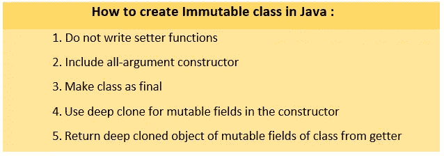
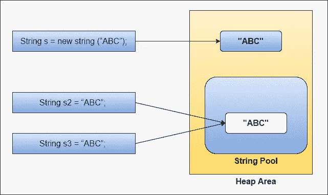

# 你知道 Java 中的不可变类吗？为什么字符串是不可变的？

> 原文：<https://medium.com/javarevisited/do-you-know-immutable-class-in-java-why-string-is-immutable-dc18b0cec4b9?source=collection_archive---------2----------------------->

## 字符串-面试-问题

## 关于不变性的一切——什么、如何以及何时。


阿玛多·洛雷罗在 [Unsplash](https://unsplash.com/s/photos/alphabet?utm_source=unsplash&utm_medium=referral&utm_content=creditCopyText) 上的照片

嘿，这篇文章是关于 Java 中的可变性和不变性的。我将解释不可变类，它们的优点，如何创建它们，最后解释为什么 string 类是不可变的。

# 什么是 Java 中的不可变类？

不可变类意味着一旦类的对象被创建，它的字段*就不能被修改或改变。* 在 Java 中，所有的包装类像 *Boolean、Short、Integer、Long、Float、Double、Byte、Char 和* ***String*** 类都是不可变类。

# 不可变类的优点是什么？

以下是不可变类或对象的优点:

1.  无法更改或修改对象**字段(状态)。**
2.  它可以传递给任何方法，而不用担心该方法是否更改或修改了任何对象字段。
3.  对象的**散列码**很容易被**缓存**。
4.  这些物体是地图的**键**的好选择。
5.  这些对象有利于多线程环境，因为对象的状态不会改变。
6.  不可变对象的状态不会改变，所以同一个对象可以在多个地方使用，从而节省内存。

# 如何在 Java 中创建不可变类？

按照下面的步骤，一个简单的 java **POJO** 类可以很容易地转换成一个不可变的类:



**不可变类的创建步骤**

我写过两个 POJO 类**员工**和**公司**。公司是员工类的一个属性。通过使用上面提到的 5 个步骤，我们将使 Employee 成为一个不可变的类。Company 类在本文各处都保持不变。

## 公司类别:

**公司类将在下面分**使用

## 1.不要为类编写 Setters:

通过删除或不写对象字段的设置器，程序员别无选择，只能使用**设置器**方法改变对象字段值。

## 员工类别:

**没有设置器的雇员类**

您可能已经注意到，我已经跳过了 **Employee** 类的对象字段的 setter 方法。这样就没有人能使用 **setter** 方法改变对象字段值。

## 2.包括所有参数构造函数:

通过在类中包含一个 all 参数构造函数，我们只允许在对象创建时初始化对象字段。

## 员工类别:

**带所有参数的雇员类构造函数**

## 3.将课程设为最终课程:

通过使我们的 **Employee** 类成为 final，这个类不能被任何其他类扩展，因此我们的 final 类的对象不能被任何其他类修改，因为没有其他类能够扩展它。

## 员工类别:

**作为最终类别的员工**

## 4.对构造函数中的可变字段使用深度克隆:

通过对在创建对象时传递给 all 参数构造函数的可变字段使用深度克隆，我们可以确保没有对对象克隆字段的任何引用，这样就没有人可以修改这个对象。

## 员工类别:

**构造函数中可变字段的深度克隆**

如果我们直接使用传递给构造函数的`**company**`引用来给`**Employee**`类的`**company**`字段赋值，那么使用这个引用，我们可以改变传递给构造函数的引用的`**companyName**`或`**companySize**`字段，因为`**Company**`类是一个可变类。

因此，使用`**new**` 操作符创建`**company**`引用的深度克隆，然后将其分配给`**Employee**`类的`**company**` 字段。

## 5.从 Getter 方法返回类的可变字段的深层克隆对象:

通过从 getter 方法返回 Employee 类的可变字段的深度克隆对象，将没有对该类的实际可变字段的引用，因此没有人可以更改或修改 Employee 类的对象的可变字段。

## 员工类别:

**getter 方法中类的可变字段的深度克隆对象**

## 最后，我们将 Employee 作为一个不可变的类，它的对象状态不会改变。

Employee 作为一个不可变的类。

输出:

```
Employee Object is : Employee{name=’Ram’, empId=1000, company=Company{companyName=’Medium’, companySize=50}}
```

> 注意:可以选择将 Employee 类的所有字段声明为 final，这样就不能在其他地方修改它。

# 为什么字符串是不可变的？

以下是字符串不变性的主要原因:

## 1.字符串常量池的使用:

字符串池是指存储在堆内存区域中的字符串的集合。当多个字符串变量包含相同的字符串文字时，它们可以引用字符串池中的相同字符串对象。这个概念允许 Java 虚拟机有效地节省内存。下图说明了字符串池的概念。

[](https://www.java67.com/2018/06/top-35-java-string-interview-questions.html)

Java 中的字符串池

## 2.安全性:

在 Java 中，字符串通常用于存储敏感信息，如用户名和密码。如果字符串是可变的，那么这些字符串就有被恶意的个人修改的风险。因此，将敏感信息存储为可变字符串是不安全的。

## 3.线程安全:

因为字符串对象是不可变的，所以从多个线程访问它们不会导致更改，这使得它们在多线程环境中使用更安全。此外，同一个字符串对象可以在多个线程之间共享。

## 4.可缓存 HashCode:

字符串是任何 java 应用程序中使用最广泛的对象。分别用于`**HashMap**` **、**、`**HashTable**`、**、**、`**HashSet**`等。。还要注意，String 类的被覆盖的`**hashCode()**`方法被频繁地调用以进行分桶。

由于字符串是不可变的，因此它们不会改变，因此当第一次调用被缓存的字符串对象的 hashcode 时，随后，对于频繁的`hashCode()`方法调用，返回相同的值。

如果我们将可变对象与类似于`**HashMap**`、`**HashSet**`或`**HashTable**`的集合一起使用，可能会有不同的 hashcodesss，一个是对象内容未被修改时的 hashcode，另一个是对象内容被修改时的 hashcode。因此，在`**Map**` 数据结构的情况下，不应该使用可变对象作为键，如果在 Map 中使用它们，那么我们可能会丢失与 Map 中的键相关联的值。

## 5.改进的性能:

通常，性能和内存使用密切相关。通过使用字符串池，具有相同内容的多个字符串变量只占用池中的一个实例，如前一点所述。JVM 堆中内存使用的减少导致了应用程序性能的提高。

***感谢您阅读本文。我希望我已经涵盖了不可变类和字符串的所有方面。***

# 您可以关注[维克拉姆·古普塔](https://medium.com/u/2c3b611409dc?source=post_page-----dc18b0cec4b9--------------------------------)了解类似内容。

***你可能喜欢看下面的面试问题:***

</@basecs101/what-does-string-pool-mean-in-java-996f0554e1dc>  <https://levelup.gitconnected.com/string-stringbuilder-and-stringbuffer-a-complete-guide-5ddd083a2ad5>  <https://levelup.gitconnected.com/working-of-tostring-and-comparing-concat-and-append-f688a5f8433c> 